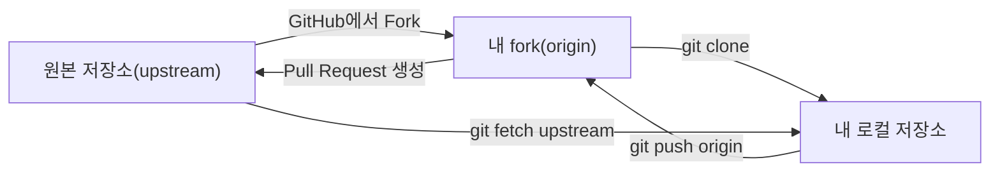

00장에서 짚었듯 Git 자체는 브랜치 전략이나 코드 리뷰 절차를 강제하지 않는다. Fork와 Pull Request는 Git 위에 GitHub 같은 호스팅 서비스가 얹은 협업 기능이며, 오늘날 오픈소스 기여의 사실상 표준 절차가 됐다. 이 장은 4부를 마무리하며 이 워크플로가 17~20장에서 다룬 명령들을 어떻게 조합하는지 정리한다.

## 개요

<strong>Fork</strong>는 다른 사람의 저장소를 자신의 계정 아래 통째로 복제하는 GitHub의 기능이다. `git clone`(18장)이 원격 저장소를 로컬 컴퓨터로 복제하는 것이라면, fork는 원격 저장소 자체를 원격에서 원격으로(GitHub 서버 안에서) 복제하는 것에 가깝다. 원본 저장소에 직접 커밋 권한이 없는 사람도, 자신의 fork에는 얼마든지 자유롭게 push할 수 있다.

<strong>Pull Request(PR)</strong>는 "내 fork(또는 브랜치)의 변경 사항을 원본 저장소에 병합해 달라"는 요청이다. PR을 열면 두 브랜치의 diff가 자동으로 표시되고, 다른 사람이 코드 리뷰(댓글, 승인/변경 요청)를 남길 수 있으며, CI가 자동으로 테스트를 돌리는 경우가 많다. 리뷰가 끝나면 프로젝트 관리자가 13-16장에서 다룬 방식(merge/squash/rebase) 중 하나로 병합한다.

## 기본 개념

전체 흐름을 17장의 fork 워크플로 미리보기와 연결하면 다음과 같다.



이 그림에서 로컬 저장소는 `origin`(내 fork)에는 자유롭게 push할 권한이 있지만, `upstream`(원본)에는 직접 push할 권한이 없다. 원본의 최신 변경을 반영하고 싶을 때는 `upstream`에서 fetch(19장)해 내 브랜치에 병합·리베이스하고, 내 작업을 원본에 제안하고 싶을 때는 `origin`에 push한 뒤 GitHub 웹 UI에서 Pull Request를 연다.

## 종류/세부

### 전형적인 기여 절차

```bash
# 1. GitHub에서 원본 저장소를 Fork(웹 UI에서 수행)
git clone https://github.com/my-account/project.git
cd project
git remote add upstream https://github.com/original-owner/project.git

# 2. 기능 브랜치 생성
git switch -c feature/add-dark-mode

# 3. 작업 후 커밋, 내 fork에 push
git add .
git commit -m "다크 모드 토글 추가"
git push -u origin feature/add-dark-mode

# 4. GitHub 웹 UI에서 upstream 저장소를 대상으로 Pull Request 생성
```

리뷰 과정에서 수정 요청을 받으면, 같은 브랜치에 추가 커밋을 만들고 다시 push하는 것으로 PR 내용이 자동 갱신된다. 별도로 PR을 새로 열 필요가 없다.

### GitHub Flow — 단순한 브랜치 전략

GitHub이 자체적으로 제안하는 브랜치 전략인 GitHub Flow는 규칙이 단순하다: `main` 브랜치는 항상 배포 가능한 상태를 유지하고, 모든 작업은 `main`에서 갈라져 나온 짧은 수명의 기능 브랜치에서 이뤄지며, 작업이 끝나면 Pull Request를 거쳐 `main`으로 병합한 뒤 즉시 배포한다. 이 전략은 릴리스 브랜치를 따로 두는 Git Flow 같은 더 복잡한 전략과 대비되며, 지속적 배포(CI/CD)를 하는 웹 서비스 팀에서 특히 많이 쓰인다.

| 특징 | GitHub Flow | Git Flow(참고 비교) |
|---|---|---|
| 브랜치 종류 | main + 기능 브랜치만 | main, develop, feature, release, hotfix 등 다수 |
| 배포 주기 | 병합 즉시(지속적 배포) | 정해진 릴리스 주기 |
| 적합한 상황 | 웹 서비스, 지속적 배포 환경 | 여러 버전을 동시에 유지보수해야 하는 소프트웨어(라이브러리, 데스크톱 앱 등) |

이 컬렉션은 GitHub Flow를 기준으로 4부를 구성했지만, 어느 전략을 택할지는 프로젝트의 배포 방식과 유지보수해야 할 버전 수에 달려 있다.

## 주의사항·함정

**fork한 저장소가 원본보다 뒤처진 채 방치되기 쉽다**: `upstream`에서 정기적으로 fetch하지 않으면, 내 fork의 `main`은 원본의 최신 상태와 점점 벌어진다. 오래 방치된 fork에서 새 기능 브랜치를 만들면 최신 코드베이스와 맞지 않아 불필요한 충돌이 생길 수 있으므로, 기능 브랜치를 새로 만들기 전 `upstream`에서 최신 상태를 먼저 반영하는 습관이 필요하다.

**PR 브랜치에 직접 커밋하지 않고 새 커밋만 계속 쌓는 경우**: 리뷰 피드백을 반영할 때마다 "fix review comment" 같은 커밋을 계속 추가하면 히스토리가 지저분해진다. 병합 직전에 `rebase -i`(27장)로 관련 커밋을 정리하거나, 프로젝트가 Squash and merge(16장) 정책을 쓴다면 이 문제 자체가 병합 시점에 자동으로 해소된다.

**원본 저장소의 기여 가이드(CONTRIBUTING.md)를 확인하지 않고 PR부터 여는 경우**: 많은 오픈소스 프로젝트는 커밋 메시지 형식, 테스트 작성 여부, 브랜치 이름 규칙 등 자체 기여 가이드를 두고 있다. 이를 확인하지 않고 작업하면 리뷰 단계에서 형식적인 이유로 반려되거나 추가 수정을 요청받을 수 있다.

## Reference

- [GitHub Flow - GitHub Docs](https://docs.github.com/en/get-started/using-github/github-flow)
- [Distributed Git - Contributing to a Project](https://git-scm.com/book/en/v2/Distributed-Git-Contributing-to-a-Project)
