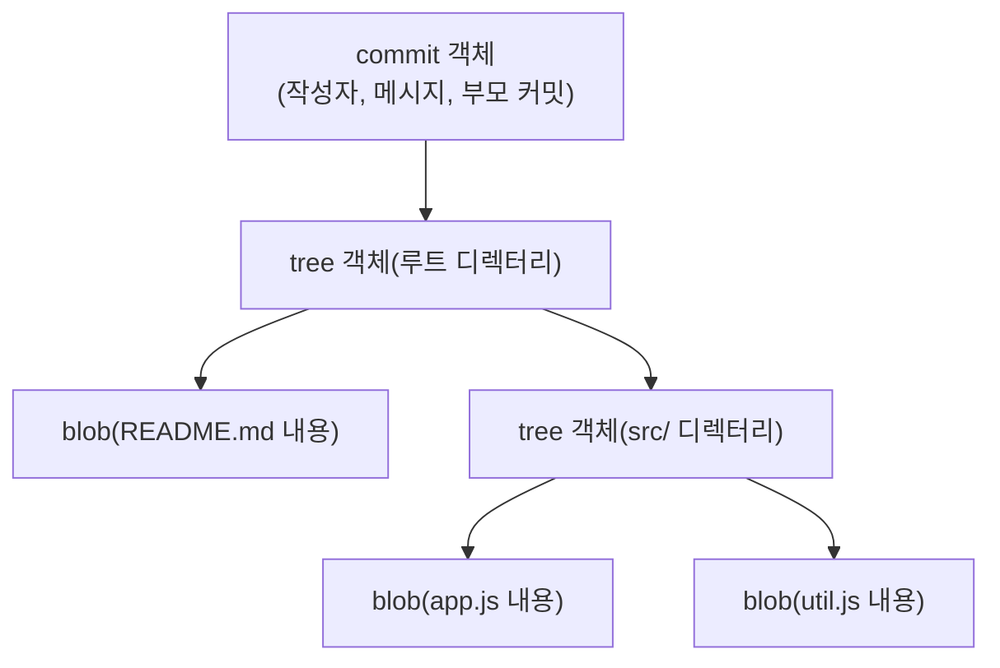

01장에서 Git이 델타가 아니라 스냅샷을 저장한다고 설명했고, 03장에서는 `.git/objects` 디렉터리가 그 스냅샷들을 담는다고 언급했다. 7부의 첫 챕터인 이 장은 그 안을 직접 열어, 지금까지 다룬 명령들이 실제로 어떤 데이터 구조를 조작해온 것인지 확인한다.

## 개요

Git이 저장하는 객체는 정확히 세 가지 유형이며, 각각 다른 것을 표현한다.

| 객체 유형 | 표현하는 것 |
|---|---|
| blob | 파일 하나의 내용(파일 이름·경로 정보는 포함하지 않음) |
| tree | 디렉터리 하나의 구조(파일 이름과 그 파일이 가리키는 blob, 하위 디렉터리가 가리키는 다른 tree) |
| commit | 특정 시점의 tree(전체 스냅샷)를 가리키는 포인터 + 부모 커밋 + 작성자·메시지(08장) |

모든 객체는 내용을 SHA-1 알고리즘으로 해시한 40자 16진수 문자열로 식별되며, 이 값이 곧 그 객체의 "주소"다. `git add`(05장)를 실행하면 파일 내용이 blob으로 저장되고, `git commit`(08장)을 실행하면 스테이징 영역의 상태를 나타내는 tree와, 그 tree를 가리키는 commit 객체가 함께 만들어진다.

## 기본 개념

이 세 객체가 어떻게 서로를 가리키는지는 문단보다 그림으로 봐야 관계가 명확하다 — commit이 tree를 가리키고, tree가 다시 다른 tree나 blob을 가리키는 계층 구조이기 때문이다.



`git commit`(08장)이 새 커밋을 만들 때마다 이 그림 전체가 매번 통째로 새로 만들어지는 것은 아니다 — 만약 한 커밋에서 `README.md`만 수정했다면, 새 commit은 새 rootTree를 가리키지만 그 rootTree 안의 `srcTree`(내용이 바뀌지 않았으므로)는 <strong>이전 커밋과 완전히 동일한 tree 객체를 그대로 재사용</strong>한다. 01장에서 언급했던 "바뀌지 않은 파일은 참조로 재사용해 중복 저장을 피한다"는 설명이 바로 이 구조에서 나온다.

## 종류/세부

### `git cat-file`로 객체 내용 직접 확인하기

Git은 이 저수준 객체를 직접 조회하는 명령을 제공한다.

```bash
git cat-file -t a1b2c3d    # 객체 유형 확인(blob/tree/commit)
git cat-file -p a1b2c3d    # 객체 내용을 사람이 읽을 수 있게 출력(pretty-print)
```

commit 객체를 `-p`로 열어보면 08장에서 설명한 구성 요소(tree 해시, parent 해시, author, committer, 메시지)가 그대로 텍스트로 보인다.

```
tree 4b825dc642cb6eb9a060e54bf8d69288fbee4904
parent 9f8e7d6...
author Jerry Kim <user@example.com> 1735689600 +0900
committer Jerry Kim <user@example.com> 1735689600 +0900

커밋 메시지
```

tree 객체를 `-p`로 열어보면 그 디렉터리 안의 각 항목이 파일 모드, 객체 유형, 해시, 이름 순으로 나열된 목록이 나온다.

```
100644 blob 8b13789...    README.md
040000 tree 3f2a1c9...    src
```

### 브랜치·태그는 객체가 아니라 참조다

11장·22장에서 다룬 브랜치와 태그는 이 세 객체 유형에 포함되지 않는다 — 이들은 `.git/refs/` 아래의 일반 파일로, 특정 commit 객체의 해시 하나만 담고 있는 <strong>참조(reference)</strong>일 뿐이다. 이 구분은 35장에서 refs와 HEAD를 다룰 때 더 자세히 살펴본다. (참고로 주석 달린 태그는 예외적으로 태그 자체를 위한 네 번째 객체 유형(tag 객체)을 추가로 만든다는 점을 22장에서 이미 언급했다.)

### 압축과 저장 위치

방금 만든 객체는 `.git/objects/` 아래 해시의 앞 2자를 디렉터리 이름으로, 나머지 38자를 파일 이름으로 압축 저장된다(예: 해시가 `a1b2c3d...`라면 `.git/objects/a1/b2c3d...`). 이렇게 흩어져 저장된 개별(loose) 객체들은 나중에 36장에서 다룰 `git gc`가 packfile이라는 압축된 단일 파일로 묶어 저장 효율을 높인다.

## 주의사항·함정

**같은 내용의 파일은 저장소 어디에 있든 같은 blob을 공유한다**: blob은 파일 경로나 이름을 전혀 포함하지 않고 오직 내용만으로 해시가 결정되므로, 완전히 다른 두 디렉터리에 있는 내용이 똑같은 파일 두 개는 저장소 안에서 동일한 blob 객체 하나를 가리킨다. 이는 버그가 아니라 저장 공간을 아끼기 위한 의도된 설계다.

**SHA-1 해시 충돌 우려는 실무에서 사실상 무시해도 좋은 수준이다**: 이론적으로 서로 다른 두 내용이 같은 SHA-1 해시를 가질 가능성이 존재하지만, 그 확률은 실무에서 우연히 마주칠 가능성이 거의 없을 정도로 낮다. Git 프로젝트는 이후 버전에서 더 강력한 해시 알고리즘(SHA-256)으로의 전환 옵션도 도입했지만, 이는 이 컬렉션의 범위를 넘는 고급 주제다.

**objects 디렉터리를 직접 수정하려 하지 않는다**: 위에서 다룬 `cat-file`은 읽기 전용 조회 도구다. 이 디렉터리의 파일을 직접 편집하거나 삭제하면 저장소가 손상될 수 있으며, 객체를 다루는 모든 정상적인 조작은 `git add`, `git commit` 같은 상위 명령을 통해야 한다.

## Reference

- [Git Internals - Git Objects](https://git-scm.com/book/en/v2/Git-Internals-Git-Objects)
