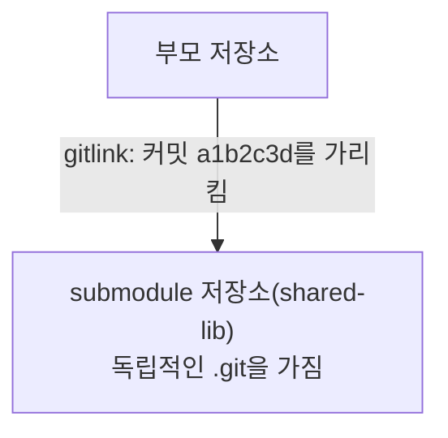

03장에서 "저장소 안에 또 `git init`을 하면 의도치 않은 중첩 저장소가 생긴다"고 경고하며, 의도적으로 저장소를 포함하려면 submodule을 쓰라고 미리 언급했다. 8부의 첫 챕터인 이 장은 그 정식 방법을 다룬다 — 한 프로젝트가 다른 독립적인 Git 저장소를 특정 버전으로 고정해 포함해야 할 때 쓰는 도구다.

## 개요

```bash
git submodule add https://github.com/user/shared-lib.git libs/shared-lib
git commit -m "shared-lib를 submodule로 추가"
```

이 명령은 `libs/shared-lib`라는 디렉터리에 `shared-lib` 저장소를 clone(18장)하면서, 동시에 부모 저장소에는 그 submodule이 <strong>정확히 어느 커밋</strong>을 가리키는지만 기록한다. 부모 저장소의 관점에서 submodule은 파일 내용 전체가 아니라, "이 경로에는 이 커밋을 가리키는 저장소가 있다"는 참조 하나(gitlink라 불리는 특수한 tree 항목, 34장에서 다룬 객체 모델의 확장)로만 존재한다.

## 기본 개념

Submodule을 이해하는 핵심은 <strong>부모 저장소와 submodule이 서로 완전히 독립된 저장소</strong>라는 것이다. 부모 저장소의 커밋 히스토리에는 submodule 안의 파일 변경 내용이 전혀 포함되지 않는다. 오직 "이 시점에 submodule이 가리키는 커밋 해시가 무엇인가"라는 한 줄 정보만 부모 저장소의 커밋에 기록된다.



이 구조 때문에 submodule 디렉터리 안에서 `git status`(06장)를 실행하면 부모 저장소와 무관한 별도의 상태가 보이고, submodule 안에서 커밋·push하는 것도 부모 저장소와 완전히 분리된 작업이다.

## 종류/세부

### Clone 시 submodule까지 함께 받아오기

18장에서 다룬 `git clone`은 기본적으로 submodule의 <strong>내용까지는</strong> 받아오지 않는다 — gitlink(어느 커밋을 가리키는지)만 받아오고, 실제 submodule 저장소는 비어 있는 채로 남는다.

```bash
git clone --recurse-submodules https://github.com/user/main-project.git
```

이미 일반 clone을 마친 뒤라면 별도로 초기화·업데이트할 수 있다.

```bash
git submodule init      # .gitmodules 설정을 로컬 config에 등록
git submodule update     # 등록된 submodule을 실제로 clone/체크아웃
# 또는 위 두 단계를 한 번에
git submodule update --init --recursive
```

`--recursive`는 submodule 안에 또 다른 submodule이 중첩된 경우까지 처리한다.

### Submodule 업데이트

부모 저장소가 가리키는 submodule 커밋을 최신으로 옮기고 싶다면, submodule 디렉터리 안으로 들어가 일반 저장소처럼 fetch·checkout한 뒤 부모 저장소에서 그 변경을 커밋해야 한다.

```bash
cd libs/shared-lib
git fetch
git switch main         # 또는 원하는 커밋으로 checkout(12장)
cd ../..
git add libs/shared-lib   # submodule이 가리키는 새 커밋을 부모 저장소에 반영
git commit -m "shared-lib를 최신 버전으로 갱신"
```

`git add libs/shared-lib`가 스테이징하는 것은 submodule 내부의 파일 변경이 아니라, "이 submodule이 이제 다른 커밋을 가리킨다"는 gitlink 갱신 사실 하나다.

### 대안: Monorepo와 패키지 관리자

Submodule은 독립된 여러 저장소를 조합해야 할 때 유효하지만, 팀 내부 코드를 공유하는 목적이라면 하나의 저장소에 모든 코드를 두는 monorepo 구조나, 언어별 패키지 관리자(npm, pip 등)로 배포된 패키지를 의존성으로 선언하는 방식이 더 간단할 수 있다. 어느 방식이 적합한지는 코드가 얼마나 자주 함께 변경되는지, 버전을 얼마나 독립적으로 관리해야 하는지에 달려 있다.

## 주의사항·함정

**submodule을 업데이트하는 것을 잊고 부모 저장소만 push하는 경우**: submodule 안에서 커밋만 하고 부모 저장소에서 `git add`(gitlink 갱신)를 하지 않으면, 다른 사람이 부모 저장소를 pull해도 submodule은 예전 커밋에 머물러 있다. 이 두 단계 커밋이 항상 함께 이뤄져야 한다는 것이 submodule 워크플로에서 가장 자주 실수하는 지점이다.

**submodule의 커밋이 어느 원격에도 push되지 않은 상태로 부모 저장소를 push하면 다른 사람이 받을 수 없다**: submodule 디렉터리에서 로컬로만 커밋하고 그 원격 저장소에 push하지 않았다면, 부모 저장소가 가리키는 그 커밋 해시를 다른 사람의 `submodule update`가 찾을 수 없어 실패한다.

**`--recurse-submodules` 없이 clone하면 빈 디렉터리만 남는다**: 이 옵션을 잊고 clone한 뒤 submodule 디렉터리가 비어 있는 것을 보고 당황하는 경우가 흔하다. 이미 clone한 저장소라면 위에서 설명한 `git submodule update --init --recursive`로 뒤늦게 채울 수 있다.

## Reference

- [Git Tools - Submodules](https://git-scm.com/book/en/v2/Git-Tools-Submodules)
- [git-submodule Documentation](https://git-scm.com/docs/git-submodule)
