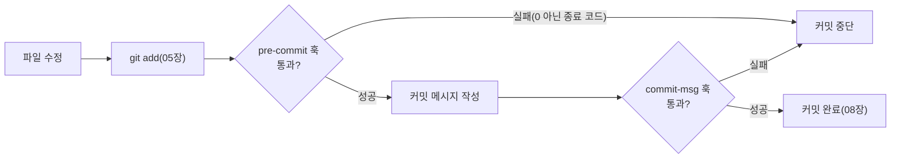

08장에서 커밋 메시지 규칙을, 06장에서 상태 점검을 다뤘지만, 이런 규칙을 사람이 매번 기억해서 지키는 데는 한계가 있다. Git hooks는 커밋이나 push 같은 특정 시점에 자동으로 스크립트를 실행해, 규칙을 사람의 기억이 아니라 자동화로 강제하는 메커니즘이다.

## 개요

03장에서 살펴본 `.git` 디렉터리 안에는 `hooks/`라는 하위 디렉터리가 있으며, `git init`(03장) 직후에는 여기에 `.sample` 확장자가 붙은 예시 스크립트들이 이미 채워져 있다.

```bash
ls .git/hooks/
```

```
pre-commit.sample
commit-msg.sample
pre-push.sample
...
```

`.sample` 확장자를 떼고 실행 권한을 부여하면 그 훅이 활성화된다.

```bash
mv .git/hooks/pre-commit.sample .git/hooks/pre-commit
chmod +x .git/hooks/pre-commit
```

## 기본 개념

훅은 이름이 가리키는 특정 이벤트(커밋 직전, 커밋 메시지 작성 직후, push 직전 등) 시점에 Git이 자동으로 실행하는 실행 파일이다. 스크립트가 0이 아닌 종료 코드를 반환하면, 대부분의 훅(예: `pre-commit`)은 그 작업 자체를 중단시킨다 — 즉 훅은 단순한 알림이 아니라 실제로 작업을 막을 수 있는 게이트 역할을 한다.



## 종류/세부

### 자주 쓰는 클라이언트 측 훅

| 훅 이름 | 실행 시점 | 대표 용도 |
|---|---|---|
| `pre-commit` | 커밋 메시지 편집기가 열리기 전 | 린터·포맷터 실행, 디버그 코드(`console.log` 등) 검출 |
| `commit-msg` | 커밋 메시지 작성 직후 | 08장에서 다룬 메시지 형식(제목 50자 이내 등) 강제 |
| `pre-push` | push 직전 | 테스트 스위트 실행, 특정 브랜치로의 직접 push 차단 |
| `post-checkout` | 브랜치 전환·체크아웃 직후(12장) | 의존성 설치 자동화(패키지 버전이 브랜치마다 다를 때) |

`pre-commit` 훅으로 코드 스타일을 강제하는 예시 스크립트는 다음과 같은 형태다.

```bash
#!/bin/sh
# .git/hooks/pre-commit
npm run lint
if [ $? -ne 0 ]; then
  echo "린트 오류를 먼저 수정하세요."
  exit 1
fi
```

### 훅이 저장소와 함께 공유되지 않는 이유

`.git/hooks/` 디렉터리는 03장에서 다룬 `.gitignore`(10장)와 무관하게, <strong>애초에 Git이 추적하는 대상이 아니다</strong>. `.git` 디렉터리 자체가 저장소의 메타데이터이지 버전 관리 대상 콘텐츠가 아니기 때문이다. 따라서 어떤 컴퓨터에서 훅을 설정해도, 그 저장소를 clone(18장)한 다른 사람에게는 자동으로 전달되지 않는다.

### 팀 전체에 훅을 공유하는 방법

이 한계를 극복하기 위해 실무에서 흔히 쓰는 방법은 훅 스크립트 자체를 저장소 안의 일반 추적 파일(예: `scripts/hooks/pre-commit`)로 두고, `core.hooksPath` 설정으로 Git이 그 디렉터리를 훅 위치로 사용하도록 지정하는 것이다.

```bash
git config core.hooksPath scripts/hooks
```

이렇게 하면 훅 스크립트 자체가 저장소에 커밋되어 clone하는 모든 사람이 같은 훅을 자동으로 쓰게 된다. Husky 같은 서드파티 도구가 Node.js 프로젝트에서 이 설정을 자동화해주는 것도 같은 원리다.

## 주의사항·함정

**훅이 설치되지 않은 컴퓨터에서는 규칙이 강제되지 않는다**: `core.hooksPath`로 훅을 공유해도, 새로 clone한 사람이 `npm install` 같은 초기 설정 단계를 건너뛰면 그 스크립트가 아직 실행 권한을 갖지 못했거나 필요한 도구(린터 등)가 설치되지 않았을 수 있다. 클라이언트 측 훅은 <strong>강제</strong>가 아니라 <strong>편의를 위한 조기 경고</strong>에 가깝다 — 정말로 규칙을 강제해야 한다면 GitHub Actions 같은 서버 측 CI(21장에서 언급한 CI/CD)와 함께 구성해야 한다.

**`--no-verify`로 훅을 우회할 수 있다는 사실을 팀원이 알아야 한다**: `git commit --no-verify`, `git push --no-verify`는 클라이언트 측 훅을 건너뛴다. 이는 훅이 오작동할 때 긴급히 우회하기 위한 정당한 기능이지만, 습관적으로 쓰면 훅을 설치한 의미가 사라진다.

**훅 스크립트에 실행 권한이 없으면 조용히 무시된다**: Unix 계열 환경에서 `chmod +x`를 잊으면 훅이 아예 실행되지 않으면서도 별다른 오류 없이 넘어가는 경우가 있다. 훅을 새로 추가했는데 동작하지 않는다면 실행 권한부터 확인한다.

## Reference

- [Customizing Git - Git Hooks](https://git-scm.com/book/en/v2/Customizing-Git-Git-Hooks)
