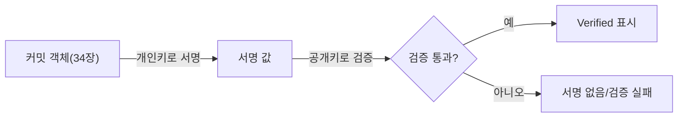

08장에서 커밋 객체가 작성자 이름과 이메일을 저장한다고 설명했지만, 그 정보는 02장의 `git config user.name`·`user.email` 설정값을 그대로 가져올 뿐, 실제로 그 사람이 그 커밋을 만들었다는 증명은 전혀 아니다. 누구나 다른 사람의 이름과 이메일로 커밋을 만들 수 있다. 커밋 서명은 이 신원을 암호학적으로 증명하는 방법이다.

## 개요

```bash
git commit -S -m "서명된 커밋"     # GPG 키로 서명(사전에 GPG 키 설정 필요)
git config --global commit.gpgsign true    # 이후 모든 커밋을 기본으로 서명
```

Git 2.34부터는 GPG 대신 이미 갖고 있는 SSH 키로도 서명할 수 있어, 별도의 GPG 키를 새로 만들 필요가 없다.

```bash
git config --global gpg.format ssh
git config --global user.signingkey ~/.ssh/id_ed25519.pub
git config --global commit.gpgsign true
```

## 기본 개념

08장에서 다룬 대로 커밋 객체는 author·committer 정보를 텍스트로 담고 있을 뿐이다. `git config`로 어떤 이름·이메일이든 설정할 수 있으므로, 이 정보만으로는 실제로 그 사람이 커밋을 만들었는지 검증할 방법이 없다. 서명은 커밋 객체 전체(내용·메시지·작성자 정보 포함)를 개인키로 암호학적으로 서명해, 그 서명이 특정 공개키의 소유자만 만들 수 있었다는 사실을 증명한다.



## 종류/세부

### GPG vs SSH 서명

| 구분 | GPG 서명 | SSH 서명 |
|---|---|---|
| 필요한 키 | 별도의 GPG 키 쌍 생성 필요 | 이미 있는 SSH 키 재사용 가능(20장에서 다룬 인증용 키와 같은 종류) |
| 초기 설정 난이도 | 상대적으로 복잡(GPG 도구 설치·키 생성·GitHub 등록) | 상대적으로 간단 |
| Git 버전 요구사항 | 오래된 버전부터 지원 | Git 2.34 이상 |
| GitHub 지원 | 지원 | 지원(비교적 최근 추가된 기능) |

새로 서명을 도입하는 팀이라면 이미 SSH 키를 쓰고 있을 가능성이 높으므로 SSH 서명이 진입 장벽이 낮다. 다만 조직의 정책이나 기존 도구 체계가 GPG를 요구한다면 그 관례를 따르는 것이 합리적이다.

### GitHub의 "Verified" 배지가 의미하는 것

GitHub은 서명이 검증된 커밋에 녹색 "Verified" 배지를 표시한다. 이 배지는 <strong>그 커밋을 만들 때 사용된 서명 키가 GitHub 계정에 등록된 공개키와 일치한다</strong>는 것만 증명하며, 다음 사실들은 증명하지 <strong>않는다</strong>는 점을 분명히 알아야 한다.

- 그 코드 내용이 안전하거나 검토를 통과했다는 것(서명은 무결성·신원 증명이지 코드 리뷰가 아니다)
- 서명 키가 도난·유출되지 않았다는 것(개인키가 유출되면 그 키로 만든 서명도 신뢰할 수 없다)
- 커밋 시각(`author date`)이 조작되지 않았다는 것(날짜 필드 자체는 서명 대상에 포함되지만, 시스템 시계 조작 등의 별개 문제는 서명이 막지 못한다)

### 조직 정책으로 서명 강제하기

GitHub 등에서는 저장소 설정으로 "서명된 커밋만 병합 허용" 같은 규칙(21장에서 언급한 branch protection의 일부)을 걸 수 있다. 이런 정책은 오픈소스 프로젝트나 보안이 중요한 조직에서, 기여자의 신원을 최소한이나마 검증하는 장치로 쓰인다.

## 주의사항·함정

**서명 없이 커밋해도 기능적으로는 아무 문제가 없다**: 서명은 이 컬렉션에서 다룬 대부분의 명령(add, commit, push 등)이 정상 동작하기 위한 필수 요소가 아니다. 조직의 보안 정책이 요구하지 않는 개인·소규모 프로젝트에서는 서명 없이도 얼마든지 작업할 수 있다.

**개인키를 분실하거나 유출하면 즉시 폐기·재발급해야 한다**: 서명 키가 유출되면 그 키로 만들어진 과거 서명의 신뢰성 자체가 흔들린다. GitHub 등에 등록한 공개키는 유출이 의심되는 즉시 삭제하고 새 키 쌍으로 교체해야 한다.

**서명 설정이 안 된 환경에서 `commit.gpgsign true`를 전역 설정해두면 커밋마다 오류가 난다**: 여러 컴퓨터를 오가며 작업하는 경우, 새 컴퓨터에 서명 키를 아직 등록하지 않았는데 전역 설정만 복사해왔다면 모든 커밋이 서명 실패로 막힐 수 있다. 새 환경에서는 키 설정이 끝난 뒤에 이 옵션을 켜는 순서가 안전하다.

## Reference

- [Signing Commits - GitHub Docs](https://docs.github.com/en/authentication/managing-commit-signature-verification/signing-commits)
