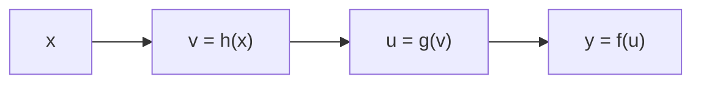

[02장](/post/jax/jit-and-xla-compilation/)에서는 `jax.jit`이 파이썬 함수를 트레이싱해 XLA가 이해하는 중간 표현으로 바꾸는 과정을 다뤘습니다. 이번 장에서 다루는 `jax.grad`는 같은 트레이싱 인프라 위에서 동작하는 또 하나의 변환입니다 — 함수를 실행해 값을 얻는 대신, 함수를 실행해 도함수를 얻습니다. 이 문장이 정확히 무슨 뜻인지, 그리고 그 계산이 수치미분이나 기호미분과 근본적으로 왜 다른지부터 짚고 시작합니다.

## 도함수를 얻는 세 가지 방법과 자동미분의 위치

함수 `f(x)`의 특정 점에서 도함수 값이 필요할 때 쓸 수 있는 방법은 크게 세 갈래로 나뉩니다.

<strong>수치미분(finite difference)</strong>은 정의를 그대로 흉내 냅니다. `(f(x+h) - f(x)) / h`를 아주 작은 `h`에 대해 계산해 근사값을 얻습니다. 구현이 가장 쉽지만 두 가지 구조적 문제를 안고 있습니다. 하나는 `h`를 얼마로 잡든 결과가 근사치라는 점이고 — 부동소수점 뺄셈에서 자릿수가 소거(catastrophic cancellation)되므로 `h`를 무작정 줄인다고 정확도가 계속 좋아지지 않습니다 — 다른 하나는 입력이 `n`차원이면 편미분마다 함수를 다시 평가해야 해 최소 `n`번의 추가 함수 호출이 필요하다는 점입니다. 신경망처럼 입력(가중치)이 수백만 차원이면 이 비용은 감당할 수 없습니다.

<strong>기호미분(symbolic differentiation)</strong>은 `d/dx(x^3) = 3x^2` 같은 미분 규칙을 수식 자체에 적용해 새로운 수식을 만들어냅니다. 결과가 근사치가 아니라 정확한 닫힌 형태(closed form)라는 장점이 있지만, 연쇄법칙을 수식 트리에 그대로 적용하다 보면 중간 결과를 공유하지 못해 수식이 기하급수적으로 불어나는 "식 폭발(expression swell)" 문제가 있습니다. 조건문(`if`)이나 반복문을 포함한 일반적인 프로그램을 하나의 수식으로 표현하기도 어렵습니다.

<strong>자동미분(automatic differentiation, AD)</strong>은 이 둘과 다른 전략을 씁니다. 함수를 하나의 수식으로 뭉쳐 미분하는 대신, 함수를 구성하는 기본 연산(덧셈, 곱셈, `sin`, `exp` 등) 각각의 정확한 도함수 규칙을 미리 알고 있다가, 프로그램이 실제로 실행되는 순서를 따라 그 규칙들을 연쇄법칙으로 조합합니다. 수치미분처럼 근사하지 않으면서도 — 부동소수점 반올림 오차를 빼면 수학적으로 정확한 값입니다 — 기호미분처럼 수식을 통째로 다루지 않으므로 식 폭발도 없습니다. `jax.grad`가 트레이싱한 계산 그래프(02장에서 다룬 자코비안 표현식과 같은 그래프)를 그대로 재활용해 미분 규칙을 적용할 수 있는 이유가 여기에 있습니다 — 자동미분과 `jit` 컴파일은 같은 트레이싱 위에서 동작하는 두 가지 다른 해석입니다.

## Forward-mode와 Reverse-mode: 연쇄법칙을 어느 방향으로 계산할 것인가

자동미분이 프로그램의 기본 연산마다 도함수 규칙을 조합한다는 것까지는 정해져 있지만, 연쇄법칙을 계산하는 **순서**는 정해져 있지 않습니다. 함수가 `y = f(g(h(x)))`처럼 여러 단계로 합성돼 있다고 하면, 연쇄법칙은 `dy/dx = (dy/du) * (du/dv) * (dv/dx)`(여기서 `v = h(x)`, `u = g(v)`)로 풀립니다. 이 곱셈을 입력 쪽에서 출력 쪽으로 계산할 수도 있고, 출력 쪽에서 입력 쪽으로 계산할 수도 있습니다 — 곱셈은 결합법칙이 성립하므로 어느 순서로 묶어도 수학적으로 같은 값이 나옵니다. 이 두 순서가 각각 forward-mode와 reverse-mode입니다.



**Forward-mode**는 이 그래프의 화살표 방향을 그대로 따라갑니다. 입력에 대한 아주 작은 섭동(perturbation) 하나 — 이를 <strong>탄젠트(tangent)</strong>라 부릅니다 — 를 `x`에서 시작해 `v`, `u`, `y`까지 실제 계산과 동시에 밀어 보냅니다. 이 과정을 `jax.jvp`(Jacobian-Vector Product)라 부르며, 한 번의 `jvp` 호출로 얻는 것은 야코비안 행렬 전체가 아니라 "이 방향으로 입력을 흔들면 출력이 얼마나 흔들리는가"라는 방향미분 하나입니다. 입력이 `n`차원인 함수의 야코비안 전체를 얻으려면 `n`개의 서로 다른 방향(표준 기저벡터)에 대해 `jvp`를 `n`번 호출해야 하므로, 비용은 입력 차원 `n`에 비례합니다.

**Reverse-mode**는 화살표를 거꾸로 거슬러 올라갑니다. 먼저 순전파로 `x -> v -> u -> y`를 한 번 계산해 중간값을 모두 저장해 두고, 출력 쪽의 섭동 — 이를 <strong>코탄젠트(cotangent)</strong>라 부릅니다 — 을 `y`에서 시작해 `u`, `v`, `x` 방향으로 연쇄법칙을 거슬러 적용합니다. 이 과정을 `jax.vjp`(Vector-Jacobian Product)라 부르며, 한 번의 `vjp` 호출로 "출력 쪽 이 방향의 코탄젠트가 입력 각 성분에 얼마나 기여하는가"를 얻습니다. 출력이 `m`차원인 함수의 야코비안 전체를 얻으려면 `m`개의 표준 기저벡터에 대해 `vjp`를 `m`번 호출해야 하므로, 비용은 출력 차원 `m`에 비례합니다.

두 방식 모두 반올림 오차를 제외하면 정확히 같은 도함수 값을 내놓습니다 — 정확도의 차이가 아니라 **비용 구조**의 차이입니다. 입력 차원 `n`과 출력 차원 `m`의 비율이 어느 쪽으로 기우느냐에 따라 유리한 쪽이 갈립니다. 신경망의 손실 함수처럼 입력(가중치 수백만 개)은 많고 출력(스칼라 손실값 1개)은 하나뿐인 `n >> m = 1` 상황에서는, `m`번만 거슬러 올라가면 되는 reverse-mode가 압도적으로 유리합니다 — `m = 1`이면 단 한 번의 `vjp` 호출로 모든 가중치에 대한 기울기를 동시에 얻습니다. 반대로 입력은 적고 출력이 많은 `n << m` 상황(예: 물리 시뮬레이션의 상태 벡터가 스칼라 파라미터 하나에 얼마나 민감한지 전체를 구하는 경우)에서는 forward-mode가 유리합니다. `jax.grad`가 스칼라 출력 함수만 받는다는 제약을 두는 것도, 딥러닝 손실 함수가 정확히 `m = 1`인 이 유리한 경우에 해당하기 때문입니다.

## jax.grad로 시작하기: 손으로 검산하기

이론을 확인하는 가장 확실한 방법은 손으로 계산할 수 있는 함수를 골라 `jax.grad`의 결과와 대조하는 것입니다. `f(x) = x^3 + 2x`는 미분이 `f'(x) = 3x^2 + 2`로 간단하고, `x = 2`를 대입하면 `f(2) = 8 + 4 = 12`, `f'(2) = 3(4) + 2 = 14`가 나옵니다. `jax.grad(f)`는 `f`를 받아 도함수를 계산하는 새 함수를 돌려주고, `jax.value_and_grad(f)`는 원본 값과 도함수 값을 한 번의 트레이싱으로 함께 돌려줘 둘 다 필요할 때 중복 계산을 피합니다.

```python
import jax
import jax.numpy as jnp

def f(x):
    return x**3 + 2 * x

grad_f = jax.grad(f)
print(grad_f(2.0))  # 14.0  (검산: 3*2**2 + 2 = 14)

value_and_grad_f = jax.value_and_grad(f)
value, grad = value_and_grad_f(2.0)
print(value, grad)  # 12.0 14.0  (검산: f(2)=12, f'(2)=14)
```

이 코드는 실제로 실행해 확인한 결과이며, 위 손 계산과 정확히 일치합니다(JAX 0.11.1, CPU 백엔드). `jax.grad`는 기본적으로 첫 번째 인자에 대한 기울기만 계산하므로, 여러 인자 중 특정 인자(또는 여러 인자)에 대해 미분하려면 `argnums`를 지정합니다(예: `jax.grad(loss, argnums=(0, 1))`). 고차 도함수는 `grad`를 겹쳐 쓰는 것만으로 얻어집니다 — `jax.grad(jax.grad(f))(2.0)`은 `f''(x) = 6x`이므로 `f''(2) = 12`를 돌려주며, 이 값 역시 실행으로 확인됩니다. 내부적으로 이는 `f`에 reverse-mode를 두 번 적용하는 것과 같고, 스칼라 함수의 2계 도함수(헤시안)가 필요할 때는 `jax.hessian(f)`가 `jax.jacfwd(jax.jacrev(f))`와 동일한 결과를 계산하는 축약형입니다 — 실행 결과 `jax.hessian(f)(2.0)`과 `jax.jacfwd(jax.jacrev(f))(2.0)` 모두 `12.0`으로 일치합니다. `grad`가 이렇게 자유롭게 겹쳐 쓰이는 것은 00장에서 다룬 "조합 가능한 함수 변환"이 실제로 작동하는 구체적인 사례입니다.

`jax.grad`가 실제로 무엇을 호출하는지는 저수준 함수인 `jax.jvp`와 `jax.vjp`를 직접 불러보면 드러납니다. `grad_f(2.0)`이 돌려준 `14.0`은 사실 `f`를 `vjp`로 감싼 뒤 코탄젠트 `1.0`을 흘려보낸 결과와 같습니다.

```python
# forward-mode: 입력 방향 1.0을 밀어 보내 출력이 얼마나 흔들리는지 확인
primal_out, tangent_out = jax.jvp(f, (2.0,), (1.0,))
print(primal_out, tangent_out)  # 12.0 14.0

# reverse-mode: 순전파 후, 출력 쪽 코탄젠트 1.0을 거슬러 올려 입력 기울기를 얻음
primal_out, vjp_fn = jax.vjp(f, 2.0)
print(primal_out)        # 12.0
print(vjp_fn(1.0))       # (14.0,)  -- grad_f(2.0)과 동일
```

두 호출 모두 `14.0`을 내놓지만 얻는 경로가 다릅니다. `jvp`는 순전파와 동시에 탄젠트를 밀어 보내 한 번에 끝나고, `vjp`는 순전파로 중간값을 저장해 둔 뒤 `vjp_fn`이라는 별도의 역방향 함수를 돌려줘 코탄젠트를 나중에 흘려보낼 수 있게 합니다. `jax.grad(f)(x)`는 정확히 이 `vjp_fn(1.0)`을 호출하는 것과 같습니다 — 스칼라 출력이므로 코탄젠트는 `1.0` 하나뿐이고, reverse-mode 한 번으로 끝납니다.

## 야코비안 전체 계산: jacfwd와 jacrev

`grad`는 스칼라 출력 함수에만 쓸 수 있습니다. 출력이 벡터인 함수의 야코비안 행렬 전체가 필요하면 `jax.jacfwd`(forward-mode 기반)와 `jax.jacrev`(reverse-mode 기반)를 씁니다. 검산을 위해 `g(x1, x2) = [x1^2 * x2, x1 + x2^3]`을 예로 듭니다. 편미분을 직접 계산하면 `dg1/dx1 = 2*x1*x2`, `dg1/dx2 = x1^2`, `dg2/dx1 = 1`, `dg2/dx2 = 3*x2^2`이고, `(x1, x2) = (1, 2)`를 대입하면 야코비안은 `[[4, 1], [1, 12]]`, 함수값은 `g(1, 2) = [1*2, 1+8] = [2, 9]`입니다.

```python
def g(x):
    x1, x2 = x[0], x[1]
    return jnp.array([x1**2 * x2, x1 + x2**3])

x0 = jnp.array([1.0, 2.0])
print(g(x0))              # [2. 9.]  (검산: g1=1*2=2, g2=1+8=9)
print(jax.jacfwd(g)(x0))  # [[ 4.  1.] [ 1. 12.]]
print(jax.jacrev(g)(x0))  # [[ 4.  1.] [ 1. 12.]]
```

두 함수 모두 같은 야코비안 `[[4, 1], [1, 12]]`을 내놓으며, 이는 위 손 계산과 일치합니다. 값은 같지만 계산 경로는 다릅니다. `jax.jacfwd`는 공식 문서가 명시하듯 야코비안을 forward-mode로 **열(column) 단위**로 채워 나갑니다 — 입력 차원 `n`개의 표준 기저 방향마다 `jvp`를 한 번씩 호출합니다. `jax.jacrev`는 reverse-mode로 **행(row) 단위**로 채웁니다 — 출력 차원 `m`개의 표준 기저 방향마다 `vjp`를 한 번씩 호출합니다. 이 예제는 `n = m = 2`라 차이가 드러나지 않지만, 앞서 설명한 비용 구조를 그대로 적용하면 입력이 출력보다 훨씬 많은 함수(`n >> m`)에는 `jacrev`가, 출력이 입력보다 훨씬 많은 함수(`n << m`)에는 `jacfwd`가 호출 횟수 면에서 유리합니다. `jax.grad(f)`는 `m = 1`인 특수한 경우이므로 항상 `jacrev`와 같은 reverse-mode 경로를 탑니다.

## 흔한 오개념

자동미분을 처음 접할 때 특히 자주 겪는 오해 두 가지를 짚고 넘어갑니다. 첫째, "자동미분은 수치미분을 자동화한 것"이라는 오해입니다. 이름이 비슷해 혼동하기 쉽지만 둘은 전혀 다른 계산입니다 — 수치미분은 `h`를 이용한 근사이고 반올림 오차 외에는 정확한 자동미분과 달리 구조적으로 근사 오차를 갖습니다. `jax.grad`가 반환하는 값은 (부동소수점 반올림을 빼면) `h -> 0` 극한의 정확한 해석적 도함수와 같습니다. 둘째, "forward-mode가 항상 reverse-mode보다 느리거나 구식"이라는 오해입니다. reverse-mode가 딥러닝에서 압도적으로 많이 쓰이는 이유는 손실 함수가 스칼라(`m = 1`)라는 딥러닝 특유의 구조 때문이지, forward-mode가 본질적으로 열등해서가 아닙니다. 입력 차원이 낮고 출력 차원이 높은 문제(작은 파라미터 몇 개로 큰 상태 벡터를 만드는 시뮬레이션 등)에서는 forward-mode가 호출 횟수 면에서 더 적게 듭니다. `jax.jacfwd`와 `jax.jacrev`가 별도 함수로 나뉘어 제공되는 것 자체가 "상황에 따라 다르다"는 신호입니다.

## 커스텀 미분 규칙: custom_jvp와 custom_vjp

지금까지의 예제는 JAX가 자동으로 유도한 미분 규칙을 그대로 썼습니다. 하지만 자동으로 유도된 규칙이 수치적으로 불안정한 경우가 있습니다. `log1pexp(x) = log(1 + exp(x))`가 대표적인 예입니다. 수학적으로 이 함수의 도함수는 `exp(x) / (1 + exp(x))`이지만, `x`가 크면(예: `x = 100`) `exp(x)`가 부동소수점 표현 범위를 넘어 `inf`가 되고, 자동으로 유도된 식은 `0 * inf` 형태의 부정형을 만나 `nan`을 냅니다.

```python
def log1pexp_naive(x):
    return jnp.log(1. + jnp.exp(x))

print(jax.grad(log1pexp_naive)(100.0))  # nan
```

실제로 실행하면 `nan`이 출력됩니다. 문제는 함수 자체가 아니라 자동으로 유도된 미분 **식**의 수치 안정성입니다. `exp(x) / (1 + exp(x))`는 대수적으로 `1 - 1 / (1 + exp(x))`와 정확히 같은 값이지만(분자·분모에 `1`을 더하고 빼는 항등식), 이 형태는 `x`가 커도 `1 / (1 + exp(x))`가 `0`으로 수렴할 뿐 `inf`를 만들지 않습니다. `jax.custom_jvp`는 이렇게 수학적으로는 같지만 수치적으로 더 안정적인 도함수 식을, 자동 유도 대신 직접 지정할 수 있게 해 줍니다.

```python
from jax import custom_jvp

@custom_jvp
def log1pexp(x):
    return jnp.log(1. + jnp.exp(x))

@log1pexp.defjvp
def log1pexp_jvp(primals, tangents):
    x, = primals
    x_dot, = tangents
    ans = log1pexp(x)
    ans_dot = (1 - 1 / (1 + jnp.exp(x))) * x_dot
    return ans, ans_dot

print(jax.grad(log1pexp)(100.0))  # 1.0
print(jax.grad(log1pexp)(2.0))    # 0.8807971  (검산: 1 - 1/(1+e^2) ≈ 0.880797)
```

실행 결과 `x = 100`에서는 `1.0`(수학적으로도 `x`가 커지면 도함수가 `1`에 수렴), `x = 2`에서는 `0.8807971`이 나오며, 후자는 `1 - 1/(1+e^2) ≈ 0.880797`이라는 손 계산과 일치합니다. `defjvp`에 넘긴 함수는 원본 값(primal)과 탄젠트 값(tangent)을 함께 반환해야 하며, JAX는 이 JVP 규칙으로부터 필요하면 VJP(reverse-mode) 규칙도 자동으로 유도합니다 — forward-mode 규칙 하나만 정의해도 양방향이 해결되는 셈입니다. 반대로 역방향 계산 자체를 직접 제어해야 하는 경우(예: 순전파에서 계산한 중간값 몇 개만 저장해 두고 역전파에서 재사용하는 메모리 최적화, 또는 `argmax`처럼 도함수가 정의되지 않는 연산에 직접 근사 기울기를 지정하는 경우)에는 `jax.custom_vjp`를 씁니다. `custom_vjp`는 순전파 함수(원본 값과 저장할 중간값을 반환)와 역전파 함수(저장된 중간값과 코탄젠트를 받아 입력 기울기를 반환)를 `defvjp`로 각각 지정하며, forward-mode 자동미분은 지원하지 않는 대신 reverse-mode 경로를 완전히 직접 제어할 수 있습니다.

## 판단 기준

`jax.grad`와 `jax.value_and_grad`는 스칼라 손실 함수의 기울기가 필요한 거의 모든 경우(신경망 학습, 최적화 루프)에 기본 선택지입니다. 값과 기울기를 둘 다 로깅해야 한다면 `grad` 두 번 대신 `value_and_grad` 한 번으로 중복 순전파를 피합니다. 출력이 벡터·행렬인 함수의 전체 야코비안이 필요하면 입력·출력 차원을 먼저 비교합니다 — 입력이 출력보다 훨씬 많으면(전형적인 손실 함수 포함) `jacrev`, 출력이 입력보다 훨씬 많으면(작은 파라미터가 큰 상태를 만드는 시뮬레이션) `jacfwd`를 씁니다. 두 함수 모두 결과값 자체는 같으므로 정확도를 이유로 고를 필요는 없고, 오직 호출 비용만 기준으로 삼으면 됩니다. `custom_jvp`·`custom_vjp`는 기본 도구가 아니라 예외 상황(`log1pexp`처럼 수치적으로 불안정한 식, 미분 불가능한 연산에 대한 근사 기울기 지정, 역전파 메모리 최적화)에서만 꺼내 쓰는 것이 좋습니다 — 자동으로 유도된 규칙이 이미 정확하고 안정적인 대다수 함수에 커스텀 규칙을 씌우면 검증해야 할 코드만 늘어납니다.

## 참고 및 출처

- [JAX 공식 문서: Automatic differentiation](https://docs.jax.dev/en/latest/automatic-differentiation.html) — `jax.grad`, `jax.value_and_grad`의 1차 출처
- [jax.jacfwd API 문서](https://docs.jax.dev/en/latest/_autosummary/jax.jacfwd.html) / [jax.jacrev API 문서](https://docs.jax.dev/en/latest/_autosummary/jax.jacrev.html)
- [Custom derivative rules for JAX-transformable Python functions](https://docs.jax.dev/en/latest/notebooks/Custom_derivative_rules_for_Python_code.html) — `log1pexp` 수치 안정성 예제의 출처이자 `custom_jvp`·`custom_vjp` 1차 출처

reverse-mode 자동미분의 핵심 아이디어는 1970년 세포 리나인마(Seppo Linnainmaa)의 석사학위 논문에서 처음 제시된 것으로 알려져 있고, 이를 신경망 학습에 적용한 역전파(backpropagation) 알고리즘은 1986년 Rumelhart, Hinton, Williams의 논문으로 널리 알려졌습니다. `jax.grad`가 호출하는 reverse-mode 경로는 이 오래된 아이디어를 파이썬 함수 트레이싱 위에서 범용적으로 구현한 것입니다.

다음 장에서는 이렇게 얻은 기울기 계산을 반복문 없이 배치 전체에 적용하는 [04장 vmap과 pmap: 벡터화와 병렬화](/post/jax/vmap-and-pmap/)를 다룹니다.
