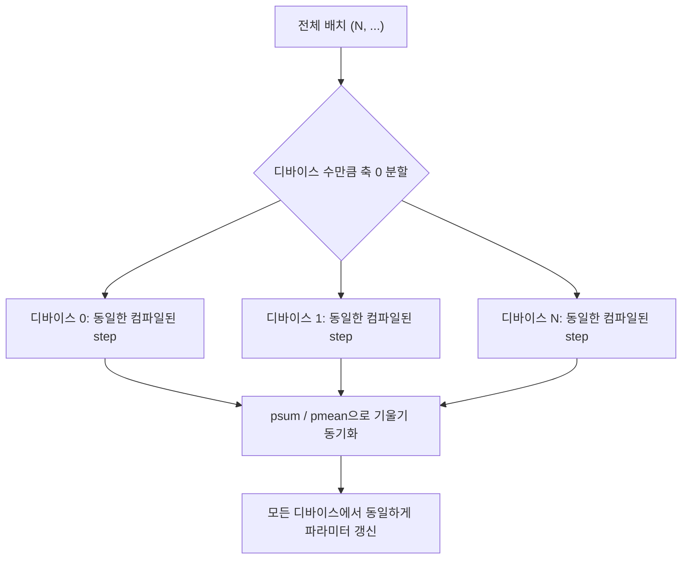

[03장](/post/jax/autodiff-with-grad/)에서는 `jax.grad`가 트레이싱 시점에 계산 그래프를 만들고 역방향으로 훑어 하나의 입력에 대한 기울기를 구하는 과정을 다뤘습니다. 그런데 실제 학습 루프는 샘플 하나가 아니라 배치(batch) 단위로 돌아갑니다. NumPy나 PyTorch에서는 배치 차원을 함수 내부에서 직접 다루거나(`x[i]`를 순회하는 for 반복문), 아니면 함수를 애초에 배치 입력을 받도록 다시 작성해야 했습니다. 이 장에서 다루는 `jax.vmap`은 세 번째 선택지를 제공합니다 — 단일 샘플을 받는 함수를 그대로 두고, 그 함수를 배치 축에 대해 자동으로 벡터화된 버전으로 바꿔주는 변환입니다. 이어서 여러 디바이스에 걸친 병렬화를 다루던 `jax.pmap`이 현재 JAX에서 실제로 어떤 위치에 있는지를 공식 문서 기준으로 확인하고, 05장에서 다시 등장할 **pytree(파이트리)** 개념도 소개합니다.

## vmap: 배칭 규칙에 의한 자동 벡터화

`jax.vmap`이 하는 일을 "컴파일러가 대신 써주는 for 반복문"이라고 이해하면 절반만 맞습니다. 실제 동작은 `jax.jit`과 마찬가지로 트레이싱에 기반합니다. `vmap(f)`를 호출하면 JAX는 `f`를 딱 한 번, 각 인자에 배치 축이 하나 더 붙은 추상값(abstract value)으로 트레이싱합니다. 이 과정에서 `f` 내부의 각 기본 연산(primitive) — 덧셈, `dot_general`, `sin` 같은 — 은 개별적으로 등록된 <strong>배칭 규칙(batching rule)</strong>을 통해 배치 버전으로 치환됩니다. 예를 들어 행렬-벡터 곱을 뜻하는 `dot_general`의 배칭 규칙은 입력에 배치 축이 붙으면 그 축을 유지한 채로 배치 행렬 곱(batched matmul)을 내보내도록 정의되어 있습니다. 그 결과로 나오는 것은 N번 반복 실행되는 파이썬 루프가 아니라, XLA가 한 번에 컴파일하는 단일 벡터화 프로그램입니다 — GPU·TPU가 원래 잘하는 SIMD(단일 명령 다중 데이터) 실행과 맞아떨어지는 형태입니다.

이 배칭 규칙이 정확히 어디에, 몇 번째 축에 적용될지는 사용자가 `in_axes`와 `out_axes`로 지정합니다. `in_axes`는 정수·`None`·중첩 컨테이너(pytree) 형태를 받는데, 정수 `i`는 "그 인자의 `i`번째 축이 배치 축"이라는 뜻이고 `None`은 "이 인자는 배치하지 않고 그대로 복제해서 쓴다"는 뜻입니다. 인자가 여러 개면 인자 개수만큼의 튜플로 지정하며, 인자 하나가 딕셔너리·튜플 같은 중첩 구조라면 그 구조를 그대로 반영한 `in_axes`를 줄 수도 있습니다. `out_axes`는 반대 방향으로, 배치 축을 출력의 몇 번째 축에 놓을지를 결정합니다. 기본값은 `in_axes=0, out_axes=0`이라 대부분의 경우 배치 축을 맨 앞에 두는 관례를 따르게 됩니다.

```python
import jax
import jax.numpy as jnp


def predict(params, x):
    w, b = params
    return jnp.dot(w, x) + b


w = jnp.array([[1.0, 2.0], [3.0, 4.0]])
b = jnp.array([0.5, -0.5])
xs = jnp.stack([
    jnp.array([1.0, 1.0]),
    jnp.array([2.0, 0.0]),
    jnp.array([0.0, 3.0]),
])  # shape (3, 2) -- 샘플 3개, 특성 2개

# params(w, b)는 배치하지 않고(None), xs는 axis 0을 배치 축으로 사용
batched_predict = jax.vmap(predict, in_axes=(None, 0))
print(batched_predict((w, b), xs))
# Array([[1.5, 6.5], [2.5, 6.5], [6.5, 12.5]], dtype=float32) -- shape (3, 2)
```

`predict`는 원래 벡터 하나(`x`)를 받아 벡터 하나를 반환하는 함수로 작성되었을 뿐, 배치 처리에 대해 아무것도 모릅니다. `in_axes=(None, 0)`은 "첫 번째 인자(`params`)는 모든 배치가 공유하고, 두 번째 인자(`x`)는 `xs`의 0번째 축을 순회한다"는 지정입니다. `predict` 내부 코드를 배치 인식형으로 고쳐 쓰지 않고도, `dot_general`의 배칭 규칙이 자동으로 배치 행렬 곱을 만들어냈습니다. 이 방식의 이점은 단순히 코드가 짧아지는 데 그치지 않습니다 — 원본 함수 `predict`는 여전히 단일 샘플 단위로 단위 테스트하기 쉬운 형태로 남아 있고, 배치 처리는 순전히 `vmap` 호출부의 책임으로 분리됩니다.

## grad와 vmap의 조합: 샘플별 기울기

00장에서 JAX가 존재하는 첫 번째 이유로 꼽은 것이 조합 가능한 함수 변환(composable transforms)이었습니다 — `jit`, `grad`, `vmap`, `pmap`을 서로 자유롭게 겹쳐 쓸 수 있다는 것입니다. 이 조합 가능성이 추상적인 설계 원칙에 머물지 않고 실제로 유용한 지점이 바로 **샘플별 기울기(per-example gradient)** 계산입니다. 일반적인 학습 루프에서 `grad(loss_fn)`은 배치 전체에 대한 평균 손실의 기울기 하나를 돌려줍니다. 그런데 차등 프라이버시(differential privacy)의 그래디언트 클리핑이나 각 샘플이 학습에 얼마나 기여했는지 분석하는 상황에서는, 배치 안의 샘플 하나하나가 만들어낸 기울기를 개별적으로 알아야 합니다. `jax.grad`만으로는 배치 축을 처리할 방법이 없고, `jax.vmap`만으로는애초에 기울기를 계산할 수 없습니다. 두 변환을 합성한 `jax.vmap(jax.grad(f))`가 이 요구를 정확히 채웁니다.

```python
import jax
import jax.numpy as jnp


def loss_fn(params, x, y):
    w, b = params
    pred = jnp.dot(w, x) + b
    return jnp.sum((pred - y) ** 2)


w = jnp.array([[1.0, 2.0], [3.0, 4.0]])
b = jnp.array([0.5, -0.5])
xs = jnp.stack([
    jnp.array([1.0, 1.0]),
    jnp.array([2.0, 0.0]),
    jnp.array([0.0, 3.0]),
])
ys = jnp.stack([
    jnp.array([1.0, 1.0]),
    jnp.array([0.0, 0.0]),
    jnp.array([1.0, 1.0]),
])

# grad(loss_fn)은 기본적으로 첫 번째 인자(params)에 대한 기울기를 돌려준다
# vmap이 그 결과를 x, y의 배치 축(axis 0)에 대해 쌓아준다
per_example_grad = jax.vmap(jax.grad(loss_fn), in_axes=(None, 0, 0))

dw, db = per_example_grad((w, b), xs, ys)
print(dw.shape, db.shape)  # (3, 2, 2) (3, 2) -- 샘플 3개 각각의 기울기
```

`jax.grad(loss_fn)`은 `params = (w, b)`와 같은 구조를 가진 `(dw, db)` 쌍을 반환합니다. 여기에 `vmap`을 씌우면 그 반환값 전체에 배치 축이 하나 더 붙어서, 원래 `(2, 2)`였던 `dw`가 `(3, 2, 2)`가 되고 `(2,)`였던 `db`가 `(3, 2)`가 됩니다. 이 값을 얻기 위해 파이썬 수준에서 반복문을 돌며 `jax.grad(loss_fn)(params, xs[i], ys[i])`를 세 번 호출할 필요가 없었다는 점이 중요합니다 — `vmap`이 `grad`가 만든 트레이스 전체를 배치 축에 대해 한 번에 벡터화했기 때문입니다. 이것이 00장에서 말한 "조합 가능한 변환"이 실무에서 갖는 구체적인 의미입니다. `jit(vmap(grad(f)))`처럼 세 변환을 더 겹치는 것도 가능하며, 실제 학습 코드에서는 이렇게 컴파일까지 씌운 형태로 씁니다.

## pmap과 다중 디바이스 SPMD: 현재 위치와 대안

`jax.pmap`은 원래 여러 디바이스(GPU·TPU)에 걸쳐 같은 프로그램을 복제해 실행하는 **SPMD(Single Program, Multiple Data)** 데이터 병렬화를 위해 설계되었습니다. 개념은 `vmap`과 비슷합니다 — 배치의 앞쪽 축을 디바이스 수만큼 나눠 각 디바이스에 하나씩 배정하고, 각 디바이스는 동일한 컴파일된 프로그램을 자신의 데이터 조각에 대해 실행합니다. 기울기처럼 디바이스 간에 합쳐야 하는 값은 `jax.lax.psum`이나 `jax.lax.pmean` 같은 집합통신(collective) 연산으로 동기화합니다.

이 장을 쓰면서 JAX 공식 문서(docs.jax.dev)를 확인한 결과, `pmap`의 현재 상태는 추측이 아니라 문서에 명시되어 있습니다. `jax.pmap`의 공식 API 문서(`_autosummary/jax.pmap.html`)는 함수 설명에서 다음과 같이 명확히 적고 있습니다.

> "Old way of doing parallel map. Use `jax.shard_map()` instead. ... `pmap()` is now implemented in terms of `jit()` and `shard_map()`." — JAX 공식 API 레퍼런스, `jax.pmap` (docs.jax.dev, 2026년 8월 확인)

이 문구는 두 가지 사실을 함께 말해줍니다. 첫째, `jax.pmap`은 API 자체가 삭제되지는 않았습니다 — 여전히 임포트하고 호출할 수 있습니다. 둘째, 내부 구현이 더 이상 독립적인 병렬 실행 경로가 아니라 `jax.jit`과 `jax.shard_map`을 감싼 래퍼로 바뀌었고, 문서는 이를 "옛날 방식(old way)"이라고 부르며 신규 코드에는 `shard_map`을 쓰라고 명시적으로 안내합니다. 마이그레이션 가이드(`migrate_pmap.html`)에 따르면 이 전환은 JAX 0.8.0(2025년 10월)에서 기본 구현이 `jit`+`shard_map` 기반으로 바뀌면서 시작되었고, 과거 구현으로 되돌리는 설정 플래그(`jax_pmap_shmap_merge`)는 JAX 0.9.0(2026년 1월)에서 폐기 예고되었으며, JAX 0.10.0(2026년 4월 16일) 릴리스에서 옛 C++ 구현 자체(`PmapFunction`, `PmapSharding` 등 내부 클래스)가 완전히 제거되었습니다. 즉 오늘 이 글을 쓰는 시점(2026년 8월) 기준으로 `pmap`은 폐기된 API는 아니지만, 독립적인 저수준 구현이 아니라 `jit(shard_map(...))`을 자동으로 조립해주는 얇은 호환 계층입니다. `shard_map` 설계 문서(JEP 14273)도 "`pmap` 사용자에게 `shmap`은 온전한 상위 호환(strict upgrade)이다 — 더 표현력이 크고, 성능이 좋고, 다른 JAX API와 더 잘 합성된다"고 서술합니다. GitHub 토론(#22645)에서도 JAX 메인테이너가 "`jit`과 `shard_map`은 서로 잘 합성되며, 이 둘이 JAX에서 병렬화를 하기 위해 권장되는 API"라고 답했습니다.

이 관계를 도식으로 정리하면 다음과 같습니다.



이 SPMD 패턴 자체는 `pmap`이든 `shard_map`이든 동일합니다. 차이는 표현 방식입니다. 과거 스타일의 `pmap` 코드는 다음과 같이 생겼습니다.

```python
import jax
import jax.numpy as jnp
from functools import partial


@partial(jax.pmap, axis_name="devices")
def parallel_step(params, grads):
    grads = jax.lax.pmean(grads, axis_name="devices")
    return params - 0.1 * grads
```

같은 데이터 병렬 갱신을, 공식 문서가 안내하는 현재 권장 경로인 `shard_map` 기반으로 옮기면 다음과 같습니다. `jax.local_device_count()`는 로컬에 CPU 하나만 있어도 최소 1을 반환하므로, 아래 코드는 다중 GPU·TPU가 없는 환경에서도 문법적으로 실행됩니다 — 다만 디바이스가 하나뿐이면 실제 병렬 분산 효과는 없고, 진짜 속도 이득은 여러 디바이스가 있을 때만 관찰할 수 있습니다. 이 환경에는 다중 GPU·TPU가 없어 실측 배수(예: "N배 빠르다")는 제시하지 않습니다.

```python
import jax
import jax.numpy as jnp

n = jax.local_device_count()
mesh = jax.make_mesh((n,), ("data",))
jax.set_mesh(mesh)

grads = jax.device_put(jnp.ones((n, 4)), jax.P("data"))
params = jax.device_put(jnp.zeros((n, 4)), jax.P("data"))


@jax.shard_map(out_specs=jax.P("data"))
def parallel_step(p, g):
    g_mean = jax.lax.pmean(g, axis_name="data")
    return p - 0.1 * g_mean


new_params = parallel_step(params, grads)
print(new_params.shape)  # (n, 4)
```

`jax.shard_map`은 함수 본문을 "디바이스 한 대의 시점"에서 작성하게 해줍니다 — `p`, `g`는 전체 배열이 아니라 그 디바이스가 맡은 조각(shard)이고, `jax.lax.pmean`은 `pmap`에서와 동일하게 디바이스 간 집합통신을 수행합니다. 공식 문서는 이보다 더 간단한 경로도 함께 제시합니다. 입력 배열을 `jax.device_put`으로 미리 샤딩해두면, 굳이 `shard_map`으로 집합통신을 직접 쓰지 않고도 평범한 `jax.jit` 함수가 그 샤딩을 그대로 따라가며 자동으로 병렬 실행되는 **컴파일러 기반 자동 병렬화** 경로입니다. `shard_map`은 `psum`·`pmean`처럼 통신 방식을 직접 제어해야 할 때, `jit` 자동 병렬화는 통신을 컴파일러에 맡기고 싶을 때 선택하는 관계입니다.

## pytree: 중첩 구조를 하나의 배열 뭉치처럼 다루기

지금까지의 예제에서 `params`는 `(w, b)` 튜플이었지만 `jax.grad`와 `jax.vmap`은 이를 아무 문제 없이 받아들이고, 결과도 같은 튜플 구조로 돌려줬습니다. 이것이 우연이 아니라 JAX 전역에서 일관되게 동작하는 이유는 <strong>pytree(파이트리)</strong>라는 개념 때문입니다. JAX 공식 문서는 pytree를 "리스트·튜플·딕셔너리처럼 컨테이너 역할을 하는 파이썬 객체들이 중첩되어 만들어진 구조 — 잎(leaf)이거나 또 다른 pytree인 것들의 컨테이너"로 정의합니다. 기본적으로 리스트, 튜플, 딕셔너리가 pytree 노드로 등록되어 있고, 그 안에 담긴 배열이나 스칼라는 더 이상 쪼갤 수 없는 잎(leaf)으로 취급됩니다.

`jax.jit`, `jax.grad`, `jax.vmap` 같은 변환은 인자나 반환값이 단일 배열이 아니라 pytree여도 그대로 동작합니다. 내부적으로는 트레이싱 전에 pytree를 잎 배열들의 평평한 리스트로 **펼치고(flatten)**, 변환이 끝나면 원래 구조 정보(treedef)를 이용해 같은 모양으로 다시 **접습니다(unflatten)**. 앞서 `per_example_grad`가 `(dw, db)`라는, 입력 `params`와 똑같이 생긴 튜플을 돌려준 것도 이 펼치기·접기 메커니즘이 자동으로 작동한 결과입니다.

```python
import jax
import jax.numpy as jnp

params = {
    "layer1": {"w": jnp.ones((2, 2)), "b": jnp.zeros((2,))},
    "layer2": {"w": jnp.ones((2, 1)), "b": jnp.zeros((1,))},
}

doubled = jax.tree.map(lambda x: x * 2, params)
leaves, treedef = jax.tree.flatten(params)
print(len(leaves))  # 4 -- layer1.w, layer1.b, layer2.w, layer2.b
```

`jax.tree.map`은 중첩된 딕셔너리 구조를 그대로 유지한 채, 그 안의 배열 하나하나에 함수를 적용합니다. 신경망 파라미터나 옵티마이저 상태는 실무에서 거의 항상 이런 중첩 딕셔너리·`NamedTuple` 형태를 띠기 때문에, pytree를 이해하지 못하면 "함수가 배열 하나만 받는다"는 잘못된 전제로 코드를 짜게 됩니다. 05장에서 다룰 PRNG 키 배열과 옵티마이저 상태(모멘텀·2차 모멘트 추정치 등)도 전부 pytree로 표현되며, `jax.tree.map`으로 일괄 갱신됩니다 — 지금 이 절에서 본 펼치기·접기 메커니즘이 그대로 재사용되는 지점입니다.

## 흔한 오개념

`vmap`을 파이썬 `for` 반복문을 컴파일 타임에 그대로 펼쳐주는 매크로로 이해하는 경우가 많은데, 이는 정확하지 않습니다. `vmap`은 함수를 딱 한 번만 트레이싱하고 각 기본 연산의 배칭 규칙을 적용해 단일 벡터화 프로그램을 만듭니다 — N개의 복사본을 순차 실행하는 것이 아니라 XLA가 한 번에 최적화할 수 있는 하나의 배치 연산으로 컴파일된다는 점에서 반복문 언롤링과는 다른 결과물입니다.

`pmap`이 "이제 못 쓴다" 또는 "삭제됐다"고 오해하기도 쉽지만, 위에서 확인했듯 이는 정확하지 않습니다. `jax.pmap`은 2026년 8월 현재도 임포트하고 호출할 수 있는 공개 API입니다. 다만 독립적인 저수준 구현이 아니라 `jit(shard_map(...))`을 감싸는 얇은 계층으로 바뀌었고, 공식 문서가 명시적으로 "옛날 방식"이라 부르며 신규 코드에는 `shard_map`을 권장한다는 점이 정확한 서술입니다.

`in_axes=None`을 주면 JAX가 알아서 크기가 다른 배열도 브로드캐스트해서 맞춰줄 것이라고 기대하는 경우도 있습니다. `None`은 "이 인자는 배치 축을 갖지 않으니 모든 배치 반복에서 그대로(변경 없이) 재사용한다"는 뜻일 뿐, 다른 인자와 형태가 안 맞을 때 자동으로 형태를 맞춰주는 브로드캐스팅 규칙이 아닙니다. 형태가 실제로 맞지 않으면 트레이싱 단계에서 형태 불일치 오류가 그대로 발생합니다.

## 언제 무엇을 쓸까

| 상황 | 권장 도구 | 이유 |
|---|---|---|
| 같은 함수를 배치 축을 따라 반복 적용 | `vmap` | for 반복문 없이 배칭 규칙으로 한 번에 컴파일 |
| 샘플별 기울기 계산 | `vmap(grad(f))` | `grad`의 pytree 출력에 배치 축을 자동으로 붙여줌 |
| 신규 코드에서 다중 디바이스 SPMD 병렬화 | `jit` + 샤딩(자동) 또는 `shard_map`(명시적 collective) | 공식 문서가 명시한 현재 권장 경로, `pmap`보다 표현력·합성성이 높음 |
| 기존 `pmap` 기반 코드 유지보수 | `pmap` 유지 가능 | 삭제되지 않았지만 내부는 `jit`+`shard_map`로 이미 재구현됨 — 신규 작성엔 비권장 |
| 디바이스 간 통신 방식을 직접 제어해야 하는 커스텀 collective | `shard_map` + `jax.lax.psum`/`pmean` | 디바이스 한 대 시점에서 명시적으로 통신을 작성 |

## 마무리

이 장에서는 `vmap`이 트레이싱과 배칭 규칙을 통해 함수를 자동으로 벡터화한다는 점, `in_axes`/`out_axes`로 배치 축의 위치를 지정한다는 점, `vmap(grad(f))`가 00장에서 말한 "조합 가능한 변환"을 샘플별 기울기라는 구체적인 문제에 적용한 사례라는 점을 다뤘습니다. `pmap`은 공식 API 문서가 "옛날 방식"이라 명시하고 `shard_map`을 권장 대안으로 안내하는 상태이며, 삭제되지는 않았지만 내부적으로 `jit`+`shard_map` 위에서 재구현되어 있다는 점도 확인했습니다. 마지막으로 소개한 pytree는 리스트·튜플·딕셔너리 같은 중첩 컨테이너를 JAX 변환이 하나의 배열 뭉치처럼 다루게 해주는 메커니즘입니다.

이 장을 읽은 후에는 `in_axes`와 `out_axes`만으로 배치되지 않는 인자를 지정할 수 있는지, `vmap(grad(f))`가 왜 파이썬 반복문보다 나은 선택인지, `pmap`과 `shard_map`의 관계를 정확한 근거(공식 문서 문구)로 설명할 수 있는지, pytree가 왜 필요한지를 스스로 점검해 볼 수 있습니다.

다음 장에서는 전역 난수 상태 없이 재현 가능한 무작위성을 어떻게 얻는지, 그리고 여기서 다룬 pytree가 옵티마이저 상태 관리에서 어떻게 재사용되는지를 [05장: PRNG와 상태 관리](/post/jax/prng-and-state-management/)에서 다룹니다.

## 참고 및 출처

- [Automatic vectorization — JAX documentation](https://docs.jax.dev/en/latest/automatic-vectorization.html) — `vmap`과 `in_axes`/`out_axes` 공식 가이드
- [jax.vmap — JAX documentation](https://docs.jax.dev/en/latest/_autosummary/jax.vmap.html) — `vmap` API 레퍼런스
- [jax.pmap — JAX documentation](https://docs.jax.dev/en/latest/_autosummary/jax.pmap.html) — `pmap`의 현재 상태("Old way ... use shard_map")를 명시한 공식 API 문서
- [Migrating to the new jax.pmap — JAX documentation](https://docs.jax.dev/en/latest/migrate_pmap.html) — `pmap` 내부 구현이 `jit`+`shard_map`로 바뀐 배경과 버전별 일정
- [Introduction to parallel programming — JAX documentation](https://docs.jax.dev/en/latest/parallel.html) — `jit` 자동 샤딩과 `shard_map` 예제
- [shmap (shard_map) for simple per-device code — JAX documentation](https://docs.jax.dev/en/latest/jep/14273-shard-map.html) — `shard_map` 설계 배경과 `pmap` 대비 이점
- [Pytrees — JAX documentation](https://docs.jax.dev/en/latest/pytrees.html) — pytree 정의와 `jax.tree` API
