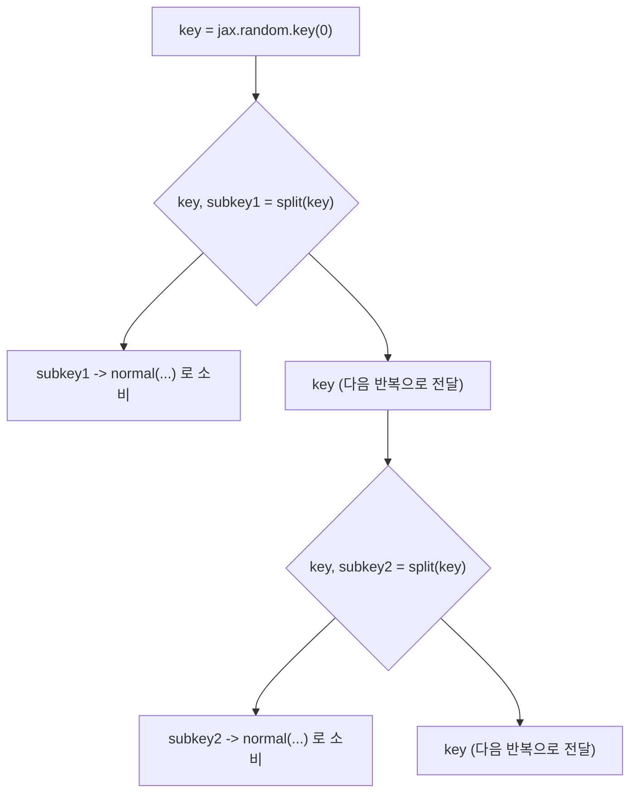

[04장](/post/jax/vmap-and-pmap/)에서는 `jax.vmap`이 함수를 딱 한 번 트레이싱한 뒤 배칭 규칙으로 벡터화하고, 파라미터·옵티마이저 상태 같은 중첩 구조를 **pytree**로 다루는 원칙을 확인했습니다. 그런데 그 예제들에서 한 가지 이상한 점을 그냥 넘어갔습니다 — `jax.random.normal`이나 `jax.random.uniform` 같은 함수는 `numpy.random.randn()`이나 `torch.randn()`처럼 인자 없이 호출되지 않고, 매번 `key`라는 값을 첫 번째 인자로 받습니다. 이 장에서는 왜 JAX가 무작위성조차 숨겨진 전역 상태가 아니라 명시적인 값으로 취급하는지, 그 값을 `jax.random.split`으로 어떻게 나눠 쓰는지, 그리고 이 "상태를 인자와 반환값으로 명시적으로 주고받는다"는 원칙이 04장의 pytree, 나아가 옵티마이저 상태(`opt_state`) 관리에까지 그대로 이어진다는 점을 다룹니다.

## 전역 난수 상태가 순수성·재현성과 부딪히는 이유

NumPy의 `np.random.randn()`이나 PyTorch의 `torch.randn()`을 호출하면, 그 뒤에는 프로세스 전체가 공유하는 숨겨진 생성기 상태(NumPy는 기본으로 메르센 트위스터, PyTorch는 자체 생성기)가 있습니다. 호출할 때마다 이 생성기는 내부 상태를 한 단계 전진시키고 그 결과로 새 난수를 뽑아냅니다. 이 모델은 코드가 파이썬 인터프리터가 정한 순서대로 한 줄씩 실행된다는 전제 위에서만 예측 가능합니다 — 몇 번째 호출인지가 곧 상태가 몇 번 전진했는지를 결정하기 때문입니다.

문제는 JAX가 바로 그 전제를 깨뜨리는 것을 목표로 설계됐다는 데 있습니다. 01장에서 다룬 순수 함수 요구사항과 02장에서 다룬 `jit`의 트레이스-후-컴파일 모델은, 컴파일러가 계산 그래프 안의 연산 순서를 재배치하거나 여러 연산을 하나로 융합할 자유를 갖는다는 전제 위에서 성립합니다. JAX 공식 문서는 이 충돌을 다음과 같이 설명합니다.

> "This is not a problem in NumPy, which always evaluates code in the order defined by the Python interpreter. In JAX, however, this is more problematic: for efficient execution, we want the JIT compiler to be free to reorder, elide, and fuse various operations in the function we define." — JAX 공식 문서, "Random numbers"(docs.jax.dev, 2026년 8월 확인)

숨겨진 전역 생성기가 있다면, 난수를 뽑는 연산 두 개를 컴파일러가 순서를 바꿔 실행하거나 하나로 합쳐버리는 순간 "몇 번째 호출인가"라는 전제 자체가 무너집니다. 04장에서 다룬 `vmap`·`pmap`은 이 문제를 한층 더 키웁니다. `vmap`으로 배치화된 함수 안에서 전역 상태에 의존하는 난수 호출이 있다면, 그 호출이 배치의 몇 번째 원소에서 일어난 것인지는 트레이싱 시점에 이미 사라진 정보입니다 — 배칭 규칙은 "N번 반복 호출"이 아니라 하나의 벡터화된 연산으로 대체하기 때문입니다. 여러 디바이스에 나눠 실행하는 `pmap`·`shard_map`에서는 문제가 더 근본적입니다. 디바이스마다 독립된 프로세스가 전역 상태를 각자 따로 들고 있다면, 디바이스 개수를 1개에서 8개로 바꾸는 것만으로 각 디바이스가 만들어내는 난수 시퀀스가 통째로 달라지고, 이는 실험을 재현할 때 하드웨어 구성까지 고정해야 한다는 뜻이 됩니다.

JAX의 해법은 생성기의 "현재 상태"를 프로세스가 몰래 들고 있는 대신, `key`라는 평범한 배열 값으로 명시화하는 것입니다. 이 값은 <strong>카운터 기반(counter-based)</strong> PRNG 방식을 따르는데, 순차적으로 상태를 갱신해나가는 메르센 트위스터류 생성기와 달리 (카운터, 키) 입력 쌍을 해시 함수에 통과시켜 그 자리에서 바로 난수를 계산합니다. 이 설계는 D. E. Shaw Research의 Salmon, Moraes, Dror, Shaw가 2011년 SC(Supercomputing) 학회에 발표한 논문 "Parallel Random Numbers: As Easy as 1, 2, 3"에서 병렬 환경을 위해 제안한 Threefry·Philox 계열 카운터 기반 생성기에 뿌리를 두고 있으며, JAX 공식 문서도 "JAX uses a modern Threefry counter-based PRNG that's splittable"라고 명시합니다. 카운터 기반 생성기는 상태를 순차적으로 전진시킬 필요가 없으므로, 서로 다른 카운터 값을 아무 순서로나(또는 동시에) 계산해도 항상 같은 결과가 나옵니다 — 컴파일러의 재배치·융합, 여러 디바이스로의 분산 모두와 자연스럽게 맞물리는 성질입니다.

## key와 PRNGKey: 타입 있는 키와 레거시 키

JAX 공식 문서는 현재 두 가지 키 생성 함수를 함께 언급하면서, 그 관계를 다음과 같이 정리합니다.

> "This section uses the new-style typed PRNG keys produced by jax.random.key(), rather than the old-style raw PRNG keys produced by jax.random.PRNGKey()." — JAX 공식 문서, "Random numbers"(docs.jax.dev, 2026년 8월 확인)

`jax.random.PRNGKey(seed)`의 API 레퍼런스는 이 함수가 만드는 값을 "old-style legacy PRNG keys, which are arrays of dtype uint32"라고 설명하고, "The resulting key does not carry a PRNG implementation"이라는 제약을 덧붙입니다. 즉 레거시 키는 평범한 `uint32` 배열일 뿐이라 어떤 PRNG 알고리즘(Threefry인지 다른 구현인지)을 쓰는지에 대한 정보를 스스로 갖고 있지 않고, 사용자가 `split`·`normal` 같은 함수를 호출할 때 전역 설정(`jax_default_prng_impl`)과 일치시켜 줘야 합니다. 반면 `jax.random.key(seed)`가 만드는 <strong>타입 있는 키(typed key)</strong>는 자신이 어떤 PRNG 구현으로 만들어졌는지를 dtype 자체에 담고 있어, 그 정보가 값을 따라다닙니다. 이 문서는 "When possible, jax.random.key() is recommended for use instead"라고 명시적으로 권장하므로, 이 장의 모든 코드는 `jax.random.key`를 사용합니다.

```python
import jax

key = jax.random.key(0)
print(key)
# Array((), dtype=key<fry>) overlaying:
# [0 0]
```

`print(key)`의 출력은 평범한 정수 배열이 아니라 `key<fry>`라는 확장 dtype으로 표시됩니다. `fry`는 Threefry 구현을 가리키는 태그이고, 그 아래 `[0 0]`은 내부적으로 Threefry가 실제로 쓰는 원시 `uint32` 두 개짜리 표현입니다. 이 값 자체를 직접 산술 연산에 쓰라고 설계된 것이 아니라, `split`·`normal`·`fold_in` 같은 `jax.random` 네임스페이스의 함수에만 넘기도록 되어 있습니다 — PyTorch의 `torch.Generator` 객체를 함수 인자로 넘기는 것과 비슷한 위치이지만, 넘겨받은 함수가 그 값을 제자리에서 바꾸지 않는다는 점이 결정적으로 다릅니다.

## 키 재사용 버그를 실제로 재현하기

키를 인자로 넘긴다는 사실만으로는 "내부 상태가 안 바뀐다"는 의미가 잘 와닿지 않습니다. 아래 코드는 흔히 저지르는 실수 — 같은 키를 여러 곳에 재사용하는 코드 — 를 그대로 실행한 것입니다.

```python
import jax


def sample_noise(k):
    return jax.random.normal(k, shape=(3,))


key = jax.random.key(0)
first = sample_noise(key)
second = sample_noise(key)  # key를 그대로 재사용했다.
print(first)
print(second)
# [ 1.6226422   2.0252647  -0.43359444]
# [ 1.6226422   2.0252647  -0.43359444]  <- first와 완전히 동일하다
```

`numpy.random.randn(3)`을 두 번 부르면 전역 생성기가 이미 한 번 전진했으므로 서로 다른 값이 나오리라 기대하기 쉽지만, 위 코드의 `first`와 `second`는 소수점 자리까지 완전히 동일합니다. 원인은 버그가 아니라 설계입니다. `jax.random.normal(key, ...)`는 `key`가 가리키는 값만으로 결과가 결정되는 순수 함수이고, 함수 호출은 인자로 받은 `key` 배열을 제자리에서 바꾸지 않습니다 — JAX 배열은 애초에 불변(01장)이므로 애초에 "제자리에서 바꾼다"는 개념 자체가 성립하지 않습니다. 즉 같은 `key`를 두 번 넘기면 정확히 같은 입력에 대해 정확히 같은 함수를 두 번 부른 것이므로, 같은 출력이 나오는 것이 순수 함수의 정의상 당연한 결과입니다. JAX 공식 문서는 이 함정을 다음과 같이 직접적으로 경고합니다.

> "The rule of thumb is: never reuse keys (unless you want identical outputs). Reusing the same state will cause sadness and monotony, depriving the end user of lifegiving chaos." — JAX 공식 문서, "Random numbers"(docs.jax.dev, 2026년 8월 확인)

올바른 해법은 `jax.random.split`으로 매번 새 키를 만들어 쓰는 것입니다. `split`은 하나의 키를 입력받아 서로 통계적으로 독립인 여러 개의 새 키를 결정론적으로 만들어내는 함수입니다 — 공식 문서의 표현을 빌리면 "a deterministic function that converts one key into several independent (in the pseudorandomness sense) keys"입니다. 관례적으로 `split(key)`가 반환하는 두 키 중 하나는 다음 호출을 위해 남겨두는 "새 키"로, 다른 하나는 지금 당장 소비할 "서브키"로 씁니다.

```python
import jax


def sample_noise(k):
    return jax.random.normal(k, shape=(3,))


key = jax.random.key(0)
key, subkey1 = jax.random.split(key)
first = sample_noise(subkey1)

key, subkey2 = jax.random.split(key)
second = sample_noise(subkey2)

print(first)
print(second)
# [-2.4424558  -2.0356805   0.20554423]
# [-1.2574776  -0.4016044  -1.1213601]

assert not (first == second).all()  # 서로 다른 서브키이므로 값도 다르다
```

`first`와 `second`는 이번에는 원소 단위로 서로 다릅니다. 여기서 "검증"은 새니타이저 같은 별도 도구가 아니라 이 성질 자체입니다 — 같은 시드(`0`)로 스크립트를 몇 번을 다시 실행해도 `first`·`second`는 항상 이 값 그대로 재현되고(비트 단위로 동일), 동시에 `split`으로 갈라진 두 서브키가 만든 값은 서로 다릅니다. 이 두 성질(재현 가능성 + 서로 다른 호출 간의 독립성)이 동시에 성립해야 "제대로 된" PRNG 사용법이고, 위 `assert`는 그중 후자를 코드로 못박아 둔 것입니다.

이렇게 "키를 쓰고, 다음 키를 위해 나누고, 이전 키는 버린다"를 반복하는 흐름을 그림으로 정리하면 다음과 같습니다.



이 도식에서 `subkey1`·`subkey2`처럼 실제 난수 생성에 쓰인 키는 다시 등장하지 않습니다. 한 번 소비한 키를 다른 곳에서 또 쓰는 순간, 앞서 확인한 재사용 버그가 재현됩니다.

## 여러 키를 한 번에: split(key, num=n)과 fold_in

매 반복마다 `split`을 한 번씩 부르는 이분법(binary) 패턴 대신, `split`은 `num` 인자로 한 번에 여러 개의 독립된 키를 만들 수도 있습니다. `jax.random.split(key, num=2)`가 기본값이고, `num`을 늘리면 그만큼 많은 키가 담긴 배열을 돌려줍니다.

```python
import jax

key = jax.random.key(42)
key, *subkeys = jax.random.split(key, num=4)

for i, sk in enumerate(subkeys):
    print(i, jax.random.normal(sk, shape=(2,)))
# 0 [0.60576403 0.7990441 ]
# 1 [0.4323065  0.5872638 ]
# 2 [-0.2818947 -1.367489  ]
```

`key, *subkeys = jax.random.split(key, num=4)`는 4개의 새 키 중 첫 번째를 다음 반복을 위한 `key`로, 나머지 3개를 `subkeys` 리스트로 언패킹하는 관용구입니다. 이 패턴은 04장의 `vmap`과 정확히 맞물립니다 — `subkeys`를 하나의 배열(`jax.random.split(key, num=batch_size)`)로 두고 `jax.vmap(sample_noise)(subkeys)`처럼 부르면, 배치의 각 원소가 서로 다른 독립 키로 샘플링되면서도 파이썬 `for` 반복문 없이 컴파일 가능한 형태를 유지합니다.

같은 키에서 인덱스 하나만 다르게 파생시키고 싶을 때, 매번 `split`을 부르는 대신 `jax.random.fold_in(key, data)`을 쓸 수도 있습니다. `fold_in`은 정수(예: 배치 인덱스, 에폭 번호)를 키에 접어 넣어 새 키를 만드는 함수로, `split`처럼 "이전 키를 계속 들고 다닐 필요"가 없는 대신 접어 넣는 정수가 겹치면 같은 키가 다시 나온다는 점에서 `split`과 용도가 다릅니다 — 데이터 병렬 학습에서 "디바이스 번호를 접어 넣어 디바이스별로 다른 키를 만드는" 상황에 흔히 쓰입니다.

## 명시적 상태 전달의 철학: PRNG 키에서 옵티마이저 상태로

여기까지 본 패턴 — 상태를 함수의 인자로 받고, 새 상태를 반환값으로 돌려주고, 호출자가 그 새 상태를 다음 호출에 넘긴다 — 은 JAX 전체를 관통하는 하나의 원칙입니다. 04장에서 pytree를 소개하며 "옵티마이저 상태도 pytree로 표현된다"고 예고했는데, PRNG 키와 옵티마이저 상태는 겉모습만 다를 뿐 정확히 같은 이유로 이런 형태를 취합니다. `nn.Module`의 `self.weight`나 PyTorch 옵티마이저의 `optimizer.step()`이 파라미터를 제자리에서 바꾸는 것과 달리, JAX·Optax의 옵티마이저는 현재 상태(`opt_state`)와 기울기를 받아 갱신값과 **새** 상태를 반환할 뿐 아무것도 직접 수정하지 않습니다.

```python
import jax
import jax.numpy as jnp
import optax


def loss_fn(params, x, y):
    w, b = params
    pred = jnp.dot(x, w) + b
    return jnp.mean((pred - y) ** 2)


key = jax.random.key(0)
key, wkey = jax.random.split(key)
params = (jax.random.normal(wkey, (2,)), jnp.array(0.0))

xs = jnp.array([[1.0, 2.0], [2.0, 0.0], [0.0, 3.0]])
ys = jnp.array([1.0, 0.0, 1.0])

optimizer = optax.adam(learning_rate=0.1)
opt_state = optimizer.init(params)  # opt_state도 params와 마찬가지로 명시적인 값이다


@jax.jit
def train_step(params, opt_state, xs, ys):
    grads = jax.grad(loss_fn)(params, xs, ys)
    updates, opt_state = optimizer.update(grads, opt_state, params)
    params = optax.apply_updates(params, updates)
    return params, opt_state


for step in range(3):
    params, opt_state = train_step(params, opt_state, xs, ys)
    print(step, loss_fn(params, xs, ys))
# 0 38.870766
# 1 34.413235
# 2 30.241627
```

`train_step`은 `params`와 `opt_state`를 인자로 받아 갱신된 `(params, opt_state)` 쌍을 반환할 뿐, 함수 바깥의 어떤 변수도 직접 건드리지 않습니다. 이는 앞서 본 `key, subkey = jax.random.split(key)` 패턴과 완전히 같은 모양입니다 — 호출자가 "현재 상태"를 넘기고 "다음 상태"를 돌려받아 다음 호출에 다시 넘기는 구조입니다. `jax.tree.structure(opt_state)`로 들여다보면 `optax.adam`이 만든 `opt_state`는 `ScaleByAdamState`라는 이름 있는 튜플(모멘텀 추정치 `mu`, 2차 모멘트 추정치 `nu`, 스텝 카운트로 구성)과 빈 상태 `EmptyState`의 튜플이고, `jax.tree.flatten`으로 펼치면 리프가 5개(카운트 1개, `mu`의 `w`·`b` 2개, `nu`의 `w`·`b` 2개)입니다 — 04장에서 예고한 대로 옵티마이저 상태 역시 리스트·튜플·딕셔너리가 중첩된 pytree일 뿐이라, `jax.jit`이 `opt_state`를 인자·반환값으로 그대로 통과시킬 수 있는 것입니다. PRNG 키를 `split`으로 다음 상태와 소비할 상태로 나누는 것과, 옵티마이저가 `opt_state`를 받아 갱신된 `opt_state`를 돌려주는 것은 "숨겨진 곳에 상태를 두지 않는다"는 같은 설계 원칙의 두 가지 적용 사례입니다.

## 흔한 오개념

"같은 시드로 한 번 `key`를 만들어두면, 그 뒤로는 아무 함수에나 넘겨도 알아서 다른 값이 나온다"는 오해가 흔합니다. 실제로는 정반대입니다 — `key` 값 자체는 절대 스스로 바뀌지 않고, 같은 `key`를 몇 번을 넘기든 같은 함수 호출은 항상 같은 결과를 냅니다. 다른 값을 얻으려면 호출자가 매번 `split`이나 `fold_in`으로 새 키를 만들어 넘겨야 합니다.

`split`을 여러 번 부르면 "난수 자원이 고갈된다"거나 "점점 품질이 나빠진다"고 걱정하는 경우도 있습니다. `split`은 유한한 자원 풀에서 무언가를 꺼내 쓰는 함수가 아니라, 입력 키를 해시하듯 결정론적으로 변환해 두 개(또는 `num`개)의 새 키를 계산하는 순수 함수입니다. 카운터 기반 설계이므로 몇 번을 나누든 각 서브키의 통계적 품질은 동일하게 유지됩니다 — 다만 나눠서 만든 서로 다른 키를 다시 재사용하면 위에서 재현한 것과 같은 버그가 그대로 재발합니다.

`jax.random.PRNGKey`와 `jax.random.key`가 완전히 같은 것을 이름만 바꿔 부르는 것이라 생각하고 섞어 쓰는 경우도 있습니다. `PRNGKey`가 만드는 값은 PRNG 구현 정보를 담지 않는 순수 `uint32` 배열이고, `key`가 만드는 값은 구현 정보가 dtype에 담긴 타입 있는 키입니다. 두 값은 내부 표현이 다르므로, 레거시 코드베이스와 상호운용할 때가 아니라면 새 코드는 공식 문서가 권장하는 `jax.random.key`로 통일하는 편이 안전합니다.

마지막으로, PyTorch의 `torch.manual_seed(0)`처럼 학습 스크립트 맨 앞에서 시드를 한 번만 고정하면 JAX에서도 전체 실행이 재현된다고 생각하기 쉽습니다. `jax.random.key(0)`으로 시작 키를 고정하는 것까지는 같지만, 그 뒤로 이어지는 모든 무작위 연산(데이터 셔플, 드롭아웃 마스크, 파라미터 초기화)에 서로 다른 서브키를 명시적으로 흘려보내는 코드를 직접 작성해야 합니다 — 시드 하나만 고정하고 나머지는 프레임워크가 알아서 처리해 줄 것이라 기대하면, 결국 같은 키를 여러 곳에 재사용하는 이 장의 버그로 되돌아가게 됩니다.

## 언제 무엇을 쓸까

| 상황 | 권장 방법 | 이유 |
|---|---|---|
| 새 코드에서 시작 키 생성 | `jax.random.key(seed)` | 공식 문서가 명시적으로 권장하는 타입 있는 키, PRNG 구현 정보가 값에 포함됨 |
| 레거시 코드와의 상호운용 | `jax.random.PRNGKey(seed)` | 과거 API와의 호환을 위해 유지되지만 신규 코드에는 비권장 |
| 순차적으로 여러 난수 연산을 수행 | `key, subkey = jax.random.split(key)`를 반복 | 매 호출마다 새 키·다음 키를 명시적으로 분리해 재사용을 원천 차단 |
| 배치 전체에 서로 다른 키가 필요(`vmap`과 결합) | `jax.random.split(key, num=batch_size)` | 한 번의 호출로 배치 크기만큼의 독립 키 배열을 만들어 `vmap`에 그대로 전달 |
| 인덱스(배치 번호·디바이스 번호 등)별로 결정론적으로 다른 키가 필요 | `jax.random.fold_in(key, idx)` | 이전 키를 계속 들고 다니지 않고 인덱스만으로 키를 파생 |
| 학습 루프에서 옵티마이저 상태 관리 | `opt_state`를 함수 인자·반환값으로 명시적 전달 | PRNG 키와 동일한 "숨겨진 상태 없음" 원칙, pytree로 `jit`·`grad`와 자연스럽게 결합 |

## 마무리

이 장에서는 JAX가 무작위성을 숨겨진 전역 상태가 아니라 `key`라는 명시적 값으로 다루는 이유가 `jit`의 연산 재배치·융합, 그리고 `vmap`·`pmap`의 병렬 실행과 정면으로 부딪히기 때문이라는 점을 확인했습니다. 같은 키를 재사용하면 완전히 동일한 값이 반복된다는 것을 실제 코드로 재현했고, `jax.random.split`으로 매번 새 서브키를 만들어 쓰는 패턴이 이 문제를 어떻게 해결하는지, `split(key, num=n)`과 `fold_in`이 각각 언제 더 적합한지를 다뤘습니다. 마지막으로 "상태를 인자로 받고 새 상태를 반환한다"는 이 원칙이 PRNG 키에만 국한되지 않고, 04장의 pytree와 Optax `opt_state` 관리에까지 동일하게 적용된다는 것을 실제 학습 루프 코드로 확인했습니다.

이 장을 읽은 후에는 같은 `key`를 두 번 넘겼을 때 왜 항상 같은 값이 나오는지, `split`이 왜 "난수를 소모"하는 것이 아니라 결정론적 변환인지, `PRNGKey`와 `key`의 차이를 언제 신경 써야 하는지, 그리고 `opt_state`를 왜 클래스 속성이 아니라 함수 인자·반환값으로 다뤄야 하는지를 스스로 설명할 수 있는지 점검해 볼 수 있습니다.

다음 장에서는 지금까지 다룬 `jit`·`grad`·`vmap`·pytree·PRNG 키·`opt_state` 관리를 한데 모아, Flax와 Optax로 실제 신경망을 학습시키는 전체 루프를 [06장: Flax·Optax로 신경망 실전](/post/jax/neural-networks-with-flax-optax/)에서 구성합니다.

## 참고 및 출처

- [Random numbers — JAX documentation](https://docs.jax.dev/en/latest/random-numbers.html) — 전역 PRNG 상태의 문제, `split`의 정의, "키 재사용 금지" 원칙을 다루는 공식 가이드
- [jax.random.key — JAX documentation](https://docs.jax.dev/en/latest/_autosummary/jax.random.key.html) — 현재 권장되는 타입 있는 키 API 레퍼런스
- [jax.random.PRNGKey — JAX documentation](https://docs.jax.dev/en/latest/_autosummary/jax.random.PRNGKey.html) — 레거시 raw 키 API와 `key()` 대비 제약 사항
- [jax.random.split — JAX documentation](https://docs.jax.dev/en/latest/_autosummary/jax.random.split.html) — `split`의 시그니처와 `num` 인자 동작
- [jax.random.fold_in — JAX documentation](https://docs.jax.dev/en/latest/_autosummary/jax.random.fold_in.html) — 인덱스 기반 키 파생 API
- [Parallel Random Numbers: As Easy as 1, 2, 3 (PDF)](https://www.thesalmons.org/john/random123/papers/random123sc11.pdf) — Salmon, Moraes, Dror, Shaw, *SC11*(2011) — JAX가 채택한 Threefry 계열 카운터 기반 PRNG의 원 논문
- [Optax: Getting Started](https://optax.readthedocs.io/en/latest/getting_started.html) — `optimizer.init`/`optimizer.update`/`optax.apply_updates`로 `opt_state`를 명시적으로 주고받는 표준 패턴
