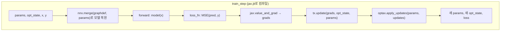

[05장: PRNG와 상태 관리](/post/jax/prng-and-state-management/)에서는 전역 난수 생성기 없이 `jax.random.split`으로 매번 새 PRNG 키를 함수 인자와 반환값으로 명시적으로 주고받는 원칙을 다뤘습니다. 이 장에서는 그 원칙을 신경망 학습이라는 실제 문제에 적용합니다. 지금까지 이 시리즈의 예제는 `(w, b)` 튜플 하나로 이루어진 손수 짠 파라미터를 다뤘지만, 실무에서 다루는 모델은 층이 여러 개이고 파라미터 개수도 훨씬 많습니다. Flax와 Optax는 이 규모에서 각각 모델 정의와 옵티마이저 구현을 표준화한 라이브러리입니다. 다만 두 라이브러리 모두 API가 활발히 바뀌고 있으므로, 이 장은 추측 대신 2026년 8월 현재 공식 문서를 직접 확인한 결과에서 출발합니다.

## Flax NNX인가 Linen인가: 공식 권장 API 확인

Flax는 오랫동안 <strong>Linen</strong>이라는 단일 API를 제공해 왔지만, 지금은 <strong>NNX</strong>라는 두 번째 API가 공존합니다. 어느 쪽이 현재 권장되는지는 짐작이 아니라 공식 문서(flax.readthedocs.io)에 명시되어 있습니다. Flax 공식 문서 첫 페이지는 "신규 사용자는 Flax NNX를 사용할 것을 권장한다(New users are encouraged to use Flax NNX)"고 명시하면서, 동시에 "Flax Linen API는 대다수 사용자가 여전히 의존하고 있어 가까운 미래에 폐기되지 않는다(The Flax Linen API is not going to be deprecated in the near future as most of Flax users still rely on this API)"고 밝힙니다. 즉 Linen이 폐기 예고된 것은 아니지만, 신규 코드를 시작하는 입장에서는 NNX가 2026년 현재의 기본 선택지입니다. 이 장의 모든 코드는 이 확인에 따라 NNX로 작성합니다.

NNX와 Linen의 근본적인 차이는 상태를 다루는 방식에 있습니다. Linen은 `model.init(key, x)`가 파라미터 딕셔너리를 반환하고 `model.apply(params, x)`에 그 딕셔너리를 매번 다시 넣어주는, 순수 함수 변환에 더 가까운 API였습니다. NNX는 여기서 한 걸음 더 나아가 파이썬 클래스 속성에 파라미터를 직접 대입하는 <strong>참조 의미론(reference semantics)</strong>을 도입해, PyTorch의 `nn.Module`과 겉보기에 더 비슷한 코드를 쓸 수 있게 합니다. 그런데 이 겉모습의 편리함 뒤에서, NNX는 `nnx.split`이라는 명시적 연산으로 언제든 그 상태를 순수 pytree로 꺼낼 수 있는 통로를 남겨 둡니다 — 이 장의 핵심은 바로 이 통로를 이용해 01–05장에서 쌓은 `jit`·`grad`·명시적 상태 전달 원칙을 그대로 재사용하는 데 있습니다. 기존 Linen 코드베이스를 한 번에 다시 쓸 필요는 없습니다 — `flax.nnx.bridge`가 Linen과 NNX 모듈을 같은 코드베이스에서 섞어 쓰는 경로를 공식적으로 제공합니다.

## nnx.Module로 MLP 정의하기

NNX에서 모델은 `nnx.Module`을 상속한 평범한 파이썬 클래스입니다. `__init__`에서 층을 속성으로 등록하면, 그 층 내부의 가중치는 자동으로 `nnx.Param`이라는 컨테이너로 감싸집니다. `nnx.Param`은 단순한 배열이 아니라 "이 값은 학습 대상 파라미터"라는 표식이 붙은 값입니다. 아래 다층 퍼셉트론(MLP)은 04장의 `predict` 함수가 `(w, b)` 튜플을 손으로 다뤘던 것과 같은 역할(선형 변환 + 활성화)을 하지만, 파라미터 관리는 `nnx.Linear`에 위임합니다.

```python
import jax
import jax.numpy as jnp
from flax import nnx


class MLP(nnx.Module):
    def __init__(self, din: int, dhidden: int, dout: int, *, rngs: nnx.Rngs):
        self.linear1 = nnx.Linear(din, dhidden, rngs=rngs)
        self.linear2 = nnx.Linear(dhidden, dout, rngs=rngs)

    def __call__(self, x: jax.Array) -> jax.Array:
        x = self.linear1(x)
        x = jax.nn.relu(x)
        return self.linear2(x)


model = MLP(din=4, dhidden=16, dout=2, rngs=nnx.Rngs(0))
print(model.linear1.kernel.shape)  # (4, 16) -- nnx.Param이 감싼 가중치
```

`nnx.Rngs(0)`는 시드 0에서 파생된 난수 키 저장소로, `nnx.Linear`가 내부적으로 가중치를 초기화할 때 이 저장소에서 키를 하나씩 꺼내 씁니다. 05장에서 `jax.random.split`을 직접 호출해 키를 나눴던 것과 원리는 같습니다 — `nnx.Rngs`는 그 분할 작업을 층 생성 시점에 자동화해 주는 얇은 래퍼일 뿐, 새로운 난수 생성 방식을 도입하는 것이 아닙니다. `model.linear1.kernel`처럼 속성에 바로 접근할 수 있다는 점이 Linen과 가장 다른 부분입니다 — Linen이었다면 `params['params']['linear1']['kernel']`처럼 `apply` 시점에 넘긴 딕셔너리를 파고들어야 했습니다.

## nnx.split·nnx.merge로 파라미터를 명시적 pytree로 분리하기

모델 객체를 속성으로 직접 다룰 수 있다는 편리함은 `jax.jit`·`jax.grad`와는 상충됩니다. 이 두 변환은 순수 함수 — 같은 입력이면 항상 같은 출력을 내고, 인자로 받지 않은 값을 몰래 바꾸지 않는 함수 — 만 받아들인다는 원칙을 00장부터 지켜 왔습니다. `model` 인스턴스를 통째로 클로저에 가두고 그 속성을 함수 안에서 직접 바꾸면, 07장에서 다룰 함정 1("클래스 인스턴스 상태를 직접 수정하기")과 똑같은 문제 — `jit`이 두 번째 호출부터 갱신을 건너뛰는 문제 — 가 그대로 재현됩니다. `nnx.split`은 이 충돌을 해소하는 도구입니다.

```python
graphdef, params = nnx.split(model, nnx.Param)

# params는 층 이름을 키로 갖는 중첩 딕셔너리 형태의 pytree다.
shapes = jax.tree.map(lambda leaf: leaf.shape, params)
```

`nnx.split(model, nnx.Param)`은 두 조각을 돌려줍니다. `graphdef`는 어떤 층이 몇 개 있고 어떻게 연결되는지를 담은 정적 구조 정보로, 학습 중에 절대 바뀌지 않습니다. `params`는 04장에서 다룬 `pytree` 그 자체입니다 — 리스트·튜플 대신 층 이름을 키로 쓰는 중첩 딕셔너리 구조일 뿐, `jax.tree.map`으로 순회하고 `jax.grad`로 미분할 수 있는 순수한 배열 뭉치라는 점은 04장에서 본 `(w, b)` 튜플과 다르지 않습니다. `graphdef`를 함수 인자 밖에 닫아 두고(closure) `params`만 `jax.jit`·`jax.grad`가 추적하는 동적 인자로 넘기는 것이 이 절 전체의 핵심입니다.

이 분리를 실제로 미분 가능한 함수로 연결하는 방법은 Flax 공식 가이드(`jax_and_nnx_transforms.html`)가 "Flax NNX와 JAX 변환 섞어 쓰기" 절에서 다음 패턴으로 명시합니다.

```python
@nnx.jit
def train_step(model, x, y):
    def loss_fn(graphdef, state):
        model = nnx.merge(graphdef, state)
        return ((model(x) - y) ** 2).mean()

    grads = jax.grad(loss_fn, 1)(*nnx.split(model))
```

`jax.grad(loss_fn, 1)`의 두 번째 인자 `1`은 `loss_fn`의 두 위치 인자(`graphdef, state`) 중 인덱스 1인 `state`에 대해서만 미분하라는 뜻입니다. `graphdef`는 배열이 아니라 구조 정보이므로 애초에 미분 대상이 될 수 없고, `argnums=1`로 이를 명시적으로 제외합니다. 이 장의 `train_step`은 이 패턴에서 `nnx.jit` 대신 평범한 `jax.jit`을 쓰고, Optax의 `opt_state`를 인자·반환값으로 명시적으로 주고받는 형태로 확장합니다.

## Optax로 옵티마이저 구성하기: adam과 opt_state

Optax는 옵티마이저를 상태를 감춘 객체가 아니라 `init`과 `update`라는 두 개의 순수 함수로 구현합니다. 공식 시작 가이드(`optax.readthedocs.io/en/latest/getting_started.html`)가 제시하는 최소 예제는 세 단계로 요약됩니다 — 옵티마이저를 만들고(`optax.adam(learning_rate)`), 파라미터 pytree로 초기 상태를 만들고(`optimizer.init(params)`), 매 스텝 `optimizer.update(grads, opt_state)`가 돌려주는 갱신값을 `optax.apply_updates`로 파라미터에 반영하는 것입니다. PyTorch의 `optimizer.step()`이 옵티마이저 객체 내부에서 파라미터를 제자리(in-place)로 바꾸는 것과 달리, `optax.apply_updates`는 새 파라미터 값을 반환할 뿐 아무것도 직접 수정하지 않습니다 — 이 차이는 07장의 개념 매핑 표에서 다시 다룹니다.

```python
import optax

tx = optax.adam(learning_rate=1e-3)
opt_state = tx.init(params)
```

`tx.init(params)`는 `params`와 같은 트리 구조를 가진 `opt_state`를 만듭니다. adam은 파라미터마다 1차 모멘트(이동 평균)와 2차 모멘트(제곱의 이동 평균) 추정치를 따로 유지해야 하므로, `opt_state`는 `params`보다 한 겹 더 중첩된 pytree입니다 — 04장 마지막에서 예고했던 "옵티마이저 상태도 pytree로 표현된다"는 문장이 가리킨 구조가 바로 이것입니다. `jax.tree.map(lambda leaf: leaf.shape, opt_state)`를 실행해 보면, `params`의 각 리프마다 형태가 같은 리프가 여러 개 딸려 있는 중첩 구조를 확인할 수 있습니다.

## 하나의 jit된 함수 안에서: 순전파 → grad → Optax 업데이트

지금까지 나온 세 가지 — `nnx.split`으로 얻은 `params` pytree, `graphdef`로 복원하는 순전파, `tx.init`으로 만든 `opt_state` — 를 하나의 `jax.jit` 함수 안에 모으면, 손실 계산부터 파라미터 갱신까지 컴파일된 단일 프로그램으로 실행됩니다. 이 흐름을 도식으로 정리하면 다음과 같습니다.



```python
def loss_fn(params, x, y):
    model = nnx.merge(graphdef, params)
    preds = model(x)
    return jnp.mean((preds - y) ** 2)


@jax.jit
def train_step(params, opt_state, x, y):
    loss, grads = jax.value_and_grad(loss_fn)(params, x, y)
    updates, opt_state = tx.update(grads, opt_state, params)
    params = optax.apply_updates(params, updates)
    return params, opt_state, loss
```

`train_step`은 네 개의 인자(`params`, `opt_state`, `x`, `y`)만 받고 세 개의 값만 반환합니다 — 모델 객체도, 옵티마이저 객체도 인자에 없습니다. `graphdef`와 `tx`는 클로저로 붙잡혀 있지만 둘 다 학습 중에 값이 바뀌지 않는 정적 정보(구조 정보·순수 함수의 묶음)이므로, `jax.jit`이 이들을 추적 대상으로 삼지 않아도 문제가 없습니다. 이 함수 시그니처만 보고도 "이 스텝에서 무엇이 입력되고 무엇이 갱신되어 나오는가"를 정확히 알 수 있다는 것이 05장에서 강조한 명시적 상태 전달의 요점입니다 — `opt_state`를 여기서 인자로 받고 갱신된 값을 반환하는 방식은, PRNG 키를 전역 변수로 두지 않고 매번 `split`해 함수 인자·반환값으로 명시적으로 주고받았던 05장의 원칙을 옵티마이저 상태에 그대로 적용한 것입니다.

`jax.value_and_grad(loss_fn)`은 03장에서 다룬 `jax.grad`의 변형으로, 기울기와 함께 손실값 자체도 함께 돌려줘 로깅을 위해 순전파를 다시 돌릴 필요가 없게 해줍니다. `grads`는 `params`와 정확히 같은 구조를 갖는 pytree이고, `tx.update`는 이 `grads`와 현재 `opt_state`, 그리고 관례적으로 `params`(일부 옵티마이저는 가중치 감쇠 계산에 파라미터 값 자체가 필요합니다)를 받아 실제로 적용할 `updates`와 다음 스텝의 `opt_state`를 계산합니다. 마지막 `optax.apply_updates(params, updates)`는 두 pytree를 리프 단위로 더하는 것과 동등한 연산이며, 그 결과가 다음 스텝에 넘길 새 `params`입니다.

## 학습 루프 실행하기

학습 루프 자체는 04장의 배치 예제와 같은 방식으로 합성 데이터를 만들고, `train_step`을 반복 호출하며 갱신된 `params`·`opt_state`를 계속 다음 호출에 넘기는 구조입니다.

```python
key = jax.random.key(0)
key, data_key, noise_key = jax.random.split(key, 3)

xs = jax.random.normal(data_key, (32, 4))
ys = jnp.stack([xs[:, 0] + xs[:, 1], xs[:, 2] - xs[:, 3]], axis=1)
ys = ys + 0.1 * jax.random.normal(noise_key, ys.shape)

num_steps = 200
for step in range(num_steps):
    params, opt_state, loss = train_step(params, opt_state, xs, ys)
    if step % 50 == 0:
        print(f"step {step:4d} loss {float(loss):.4f}")
# 실행 환경(초기화 시드·데이터·학습률·하드웨어)에 따라 실제 손실값과 수렴 속도는 달라진다.
# 이 코드는 그대로 실행 가능하지만, 특정 손실값·수렴 여부를 보장하지 않는다.

trained_model = nnx.merge(graphdef, params)
print(trained_model(xs[:1]))  # 학습된 파라미터로 예측 한 건 실행
```

`params`와 `opt_state`를 매 반복에서 변수에 다시 대입하고 있다는 점이 중요합니다 — `train_step`이 두 값을 제자리에서 바꾸는 것이 아니라 새 값을 반환하기 때문에, 호출자가 그 반환값을 받아 다음 호출에 넘겨야만 학습이 실제로 진행됩니다. 학습이 끝난 뒤에는 `nnx.merge(graphdef, params)`로 갱신된 파라미터를 다시 모델 객체에 결합해, `nnx.Module`이 제공하는 평범한 호출 방식(`model(x)`)으로 되돌아갈 수 있습니다.

## 흔한 오개념

NNX가 PyTorch의 `nn.Module`과 똑같이 어디서나 자유롭게 속성을 직접 수정해도 된다고 오해하기 쉽습니다. `nnx.jit`으로 감싼 함수 안에서는 이 참조 의미론이 안전하게 동작하지만, 평범한 `jax.jit`에 `model` 객체를 직접 인자로 넘기고 그 속성을 함수 안에서 수정하면 07장에서 다룰 순수성 위반 함정이 그대로 재현됩니다. `nnx.split`으로 명시적으로 꺼낸 `params`만 미분·컴파일 대상으로 삼는 이유가 여기 있습니다.

Linen이 "이제 못 쓴다"거나 조만간 삭제된다고 오해하기도 쉽지만, 위에서 확인했듯 이는 정확하지 않습니다. 공식 문서는 Linen이 "가까운 미래에 폐기되지 않는다"고 명시하며, 대다수 기존 사용자가 여전히 이 API에 의존하고 있다고 밝힙니다. 정확한 서술은 "신규 코드에는 NNX가 권장되지만, 기존 Linen 코드가 당장 깨지지는 않는다"는 것입니다.

`opt_state`를 옵티마이저 객체 안에 감춰두면 되니 굳이 함수 인자·반환값으로 주고받을 필요가 없다고 여기기도 쉽습니다. 하지만 `jax.jit`이 다루는 함수는 순수 함수여야 하므로, 함수 밖의 가변 객체(옵티마이저 인스턴스)를 몰래 바꾸는 코드는 07장의 함정 1과 같은 방식으로 조용히 깨집니다. `opt_state`를 인자·반환값으로 명시적으로 주고받는 방식만이 `jit` 아래에서 안전하게 보장됩니다.

## nnx.Optimizer(고수준) 대 수동 함수형 루프: 언제 무엇을 쓸까

이 장에서 만든 `train_step`이 유일한 방법은 아닙니다. NNX는 `nnx.Optimizer`라는 고수준 래퍼도 공식적으로 제공하며, Flax 공식 MNIST 튜토리얼(`mnist_tutorial.html`)은 이를 다음과 같이 씁니다.

```python
optimizer = nnx.Optimizer(model, optax.adamw(learning_rate), wrt=nnx.Param)


@nnx.jit
def train_step(model, optimizer, x, y):
    def loss_fn(model):
        return jnp.mean((model(x) - y) ** 2)

    loss, grads = nnx.value_and_grad(loss_fn)(model)
    optimizer.update(model, grads)
    return loss
```

`optimizer.update(model, grads)`는 `opt_state`를 반환하지 않습니다 — `nnx.Optimizer`가 참조 의미론으로 `model`과 자기 자신의 내부 상태를 제자리에서 갱신하기 때문입니다. PyTorch의 `optimizer.step()`과 거의 동일한 인체공학을 제공하지만, 그 대가로 "이 함수가 무엇을 바꾸는가"가 시그니처만으로는 드러나지 않습니다. 두 방식 중 어느 쪽을 택할지는 상황에 따라 다릅니다.

| 상황 | 권장 방법 | 이유 |
|---|---|---|
| PyTorch에서 막 넘어와 빠르게 프로토타입을 만들 때 | `nnx.Optimizer` + `nnx.jit` | `optimizer.step()`과 거의 같은 인체공학, 상태 관리 코드를 직접 쓸 필요 없음 |
| `opt_state`를 체크포인트로 저장·복원하거나 다중 디바이스에 샤딩해야 할 때 | 이 장의 수동 `split`/`merge` + Optax 함수형 루프 | `opt_state`가 평범한 pytree라 `jax.tree.map`·체크포인트 라이브러리와 직접 호환 |
| `jit` 함수 시그니처만으로 무엇이 입력·출력되는지 코드 리뷰·디버깅에서 검증하고 싶을 때 | 수동 함수형 루프 | 모든 상태가 인자·반환값으로 드러나 암묵적 갱신이 없음 |
| 기존 Linen 코드베이스에 NNX 레이어를 점진적으로 섞을 때 | `flax.nnx.bridge` | Linen을 한 번에 재작성하지 않고 두 API를 같은 모델에서 혼용 |

## 참고 및 출처

- [Flax — Read the Docs](https://flax.readthedocs.io/en/latest/) — "신규 사용자는 Flax NNX를 사용할 것을 권장한다"는 공식 권장 문구의 출처
- [The Flax NNX Module system](https://flax.readthedocs.io/en/latest/nnx_basics.html) — `nnx.Module`, `nnx.Param`, `nnx.split`/`nnx.merge` 기본 가이드
- [Flax NNX vs JAX transformations](https://flax.readthedocs.io/en/latest/guides/jax_and_nnx_transforms.html) — `jax.grad`를 `nnx.split`과 함께 쓰는 공식 패턴
- [MNIST tutorial — Flax NNX](https://flax.readthedocs.io/en/latest/mnist_tutorial.html) — `nnx.Optimizer`, `nnx.jit`, `nnx.value_and_grad`를 쓴 공식 학습 루프 예제
- [flax.nnx.training.optimizer](https://flax.readthedocs.io/en/latest/api_reference/flax.nnx/training/optimizer.html) — `nnx.Optimizer` API 레퍼런스
- [Use Flax NNX and Linen together](https://flax.readthedocs.io/en/latest/guides/bridge_guide.html) — `flax.nnx.bridge`로 두 API를 혼용하는 공식 가이드
- [🚀 Getting started — Optax documentation](https://optax.readthedocs.io/en/latest/getting_started.html) — `optax.adam`, `opt_state`, `optax.apply_updates` 최소 예제
- [Optimizers — Optax documentation](https://optax.readthedocs.io/en/latest/api/optimizers.html) — `optax.adam` 등 옵티마이저 API 레퍼런스

## 평가 기준

- Flax NNX와 Linen 중 2026년 현재 신규 코드에 권장되는 쪽이 무엇이고, 그 근거를 공식 문서 문구로 설명할 수 있다.
- `nnx.split`이 반환하는 `graphdef`와 `params`의 역할 차이를 설명하고, 왜 `jax.grad(loss_fn, 1)`이 `params`만 미분 대상으로 삼는지 안다.
- `opt_state`를 `train_step`의 인자·반환값으로 명시적으로 주고받는 이유를, 05장의 PRNG 키 전달 원칙과 연결해 설명할 수 있다.
- `jax.value_and_grad` → `tx.update` → `optax.apply_updates` 세 호출이 하나의 `jit` 함수 안에서 어떤 순서로 데이터를 주고받는지 그릴 수 있다.
- `nnx.Optimizer`(고수준)와 수동 `split`/`merge` + 함수형 루프(이 장의 방식) 중 상황에 맞는 쪽을 판단 기준표를 근거로 선택할 수 있다.

## 마무리

이 장에서는 Flax 공식 문서를 직접 확인해 2026년 현재 신규 코드에는 NNX가 권장된다는 사실을 근거와 함께 정리하고, `nnx.Module`로 정의한 MLP를 `nnx.split`으로 정적 구조(`graphdef`)와 학습 대상 파라미터(`params`) pytree로 분리했습니다. 이 `params`는 04장에서 다룬 pytree, `opt_state`는 그 위에 한 겹 더 중첩된 pytree이며, 05장에서 강조한 명시적 상태 전달 원칙을 따라 `train_step`의 인자·반환값으로 그대로 오갑니다. `jax.value_and_grad` → `tx.update` → `optax.apply_updates`로 이어지는 세 호출이 하나의 `jax.jit` 함수 안에 놓이면서, 01–05장에서 각각 배운 불변 배열·컴파일·미분·명시적 상태가 실제 신경망 학습 코드 한 조각으로 합쳐졌습니다.

다음 장에서는 이 `train_step`이 왜 이런 모양이어야 했는지를 PyTorch의 `nn.Module`·`optimizer.step()`과 정면으로 비교하며, 여기서 짠 코드를 그대로 재료 삼아 마이그레이션 과정에서 실제로 부딪히는 함정들을 [07장: PyTorch에서 마이그레이션](/post/jax/migrating-from-pytorch/)에서 다룹니다.
