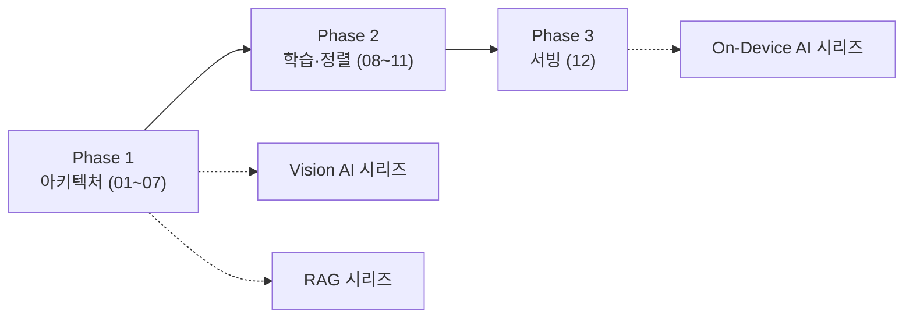

<strong>LLM(Large Language Model, 대규모 언어모델)</strong>을 API 너머의 구조로 이해하려는 사람과, "프롬프트를 넣으면 답이 나오는 블랙박스"로만 대하는 사람의 차이는 딱 한 지점에서 갈립니다. 모델이 왜 특정 답을 내놓는지, 왜 어떤 질문에는 그럴듯하지만 틀린 답(환각)을 내놓는지, 왜 파인튜닝 방식에 따라 결과가 달라지는지를 **구조 수준에서 설명할 수 있는가**입니다. 이 시리즈는 그 지점을 메우기 위해, Transformer의 수식과 실습 코드를 직접 손으로 따라가면서 GPT류 모델의 내부를 처음부터 끝까지 조립합니다.

## 왜 지금 Transformer부터 다시 짚어야 하는가

2012년 AlexNet이 ImageNet 대회에서 GPU 기반 딥러닝으로 압도적인 성능을 보이면서 "레이어를 깊게 쌓을수록 성능이 좋아진다"는 발견이 이후 10년의 연구 방향을 결정했습니다. 문제는 레이어를 깊게 쌓을수록 학습이 불안정해진다는 것이었고, ResNet의 skip connection(잔차 연결)이 이 한계를 단순한 아이디어로 돌파했습니다. 언어모델 쪽에서는 RNN(Recurrent Neural Network)이 문장을 순서대로 읽어 문맥 벡터 하나로 압축하는 방식을 썼지만, 문장이 길어질수록 앞쪽 정보가 희석되는 장기 의존성 문제와 순차 계산이라 병렬화할 수 없다는 속도 문제를 동시에 안고 있었습니다.

2017년 Google의 연구진이 발표한 <strong>"Attention Is All You Need"</strong>는 이 순차 구조 자체를 끊어버리는 제안이었습니다.

> Ashish Vaswani, Noam Shazeer, Niki Parmar 외 5인, "Attention Is All You Need", *arXiv:1706.03762* (2017)

이 논문이 제시한 **Transformer** 아키텍처는 RNN 없이 Attention 메커니즘만으로 문장 전체를 한 번에 병렬 처리합니다. 순차 계산이 사라지자 대규모 데이터를 대규모 GPU 클러스터로 동시에 학습시키는 것이 가능해졌고, 이 병렬성이 이후 GPT-3(2020)에서 관찰된 "모델 크기만 키웠을 뿐인데 별도로 가르치지 않은 추론 능력이 나타나는" 현상— 이른바 창발(emergence) — 의 물리적 전제 조건이 되었습니다. 즉 지금 우리가 쓰는 LLM 생태계 전체가 이 한 편의 논문이 제안한 구조 위에 서 있습니다. 이 구조를 모르고 LLM을 파인튜닝하거나 서빙 파라미터를 조정하는 것은, 엔진 내부를 모르고 자동차를 튜닝하는 것과 크게 다르지 않습니다.

## 이 시리즈가 다루는 범위

이 시리즈는 **Transformer/GPT의 언어 모델링 구조**에만 집중합니다. 구체적으로는 토큰 임베딩과 위치 인코딩 같은 입력 표현, Self-Attention과 Multi-head Attention의 계산 과정, GPT 블록을 구성하는 정규화·FFN·Residual Connection, 사전학습(Pretraining)과 지도 파인튜닝(Fine-tuning), LoRA/QLoRA 같은 효율적 파인튜닝 기법, RLHF와 DPO를 통한 선호 학습, Chain-of-Thought 기반 추론 모델, 그리고 KV Cache·GQA 같은 서빙 효율화 기법까지를 다룹니다.

같은 Transformer 구조를 이미지에 적용하는 **Vision Transformer**, 모델을 가볍게 만드는 **Pruning·Quantization·Knowledge Distillation**, 외부 지식을 검색해 답변에 활용하는 <strong>RAG(Retrieval-Augmented Generation)</strong>는 이 시리즈의 범위 밖입니다. 이 세 주제는 각각 별도 시리즈(Vision AI 파운데이션, On-Device AI 경량화, RAG와 정보검색)에서 다루며, 그 시리즈들은 이 시리즈에서 정리하는 Transformer/GPT 구조를 전제로 합니다. 즉 이 시리즈는 나머지 세 시리즈의 공통 기반입니다.

## 흔한 오개념 — "Transformer는 RNN의 발전형이다"

Transformer를 처음 접하면 "RNN을 개선한 모델"이라고 오해하기 쉽습니다. 실제로는 정반대에 가깝습니다. RNN 계열(및 RNN에 Attention을 결합한 RNN-Attention 모델)은 이전 시점의 계산이 끝나야 다음 시점을 계산할 수 있는 **순차 구조**를 그대로 유지한 채 성능만 개선하려 한 시도였습니다. Transformer는 이 순차 구조 자체를 버리고, 문장의 모든 토큰을 동시에 입력받아 행렬 연산으로 한 번에 처리합니다. "Attention Is All You Need"라는 논문 제목이 가리키는 것도 "RNN을 Attention으로 보강했다"가 아니라 "RNN 없이 Attention만으로 충분하다"는 주장입니다. 이 차이를 놓치면, 왜 Transformer가 대규모 병렬 학습에 유리한지, 왜 GPU 클러스터 규모가 커질수록 Transformer 계열만 계속 성장했는지를 설명할 수 없습니다.

## 커리큘럼

아래 표는 13개 챕터를 세 Phase로 묶은 것입니다. Phase 1은 "모델 한 대를 조립하는 데 필요한 부품"을, Phase 2는 "조립된 모델을 원하는 방향으로 조정하는 방법"을, Phase 3은 "조정된 모델을 실제로 쓸 수 있게 만드는 방법"을 다룹니다. 이 순서를 따르는 이유는 각 Phase가 앞 Phase의 산출물을 입력으로 삼기 때문입니다 — 파인튜닝(Phase 2)은 사전학습된 모델 구조(Phase 1)를 전제하고, 서빙 효율화(Phase 3)는 학습이 끝난 모델의 추론 과정을 전제합니다.

| Phase | 챕터 | 제목 | 핵심 질문 |
|---|---|---|---|
| 1. 아키텍처 | 01 | AI 수학 기초 | 내적·Softmax·KL Divergence는 왜 필요한가 |
| 1. 아키텍처 | 02 | 신경망은 어떻게 학습하는가 | 역전파와 경사하강법은 무엇을 계산하는가 |
| 1. 아키텍처 | 03 | RNN에서 Transformer까지 | 왜 순차 구조를 버려야 했는가 |
| 1. 아키텍처 | 04 | 토크나이징과 임베딩 | 텍스트를 어떻게 벡터로 바꾸는가 |
| 1. 아키텍처 | 05 | Self-Attention 완전분해 | Q/K/V를 왜 분리하는가 |
| 1. 아키텍처 | 06 | GPT 아키텍처 해부 | Attention 블록을 감싸는 나머지 구조는 무엇인가 |
| 1. 아키텍처 | 07 | 지식은 어디에 저장되는가 | FFN과 벡터 공간은 지식을 어떻게 담는가 |
| 2. 학습·정렬 | 08 | 파인튜닝 실전 | Classification Fine-tuning과 LoRA는 무엇이 다른가 |
| 2. 학습·정렬 | 09 | 지시 미세튜닝 | 베이스 모델은 왜 지시를 따르지 못하는가 |
| 2. 학습·정렬 | 10 | RLHF와 DPO | 사람의 선호를 어떻게 손실함수로 바꾸는가 |
| 2. 학습·정렬 | 11 | 추론 모델의 시대 | Chain-of-Thought는 왜 성능을 높이는가 |
| 3. 서빙 | 12 | LLM 서빙 효율화 | KV Cache는 무엇을 캐싱하는가 |

각 챕터를 건너뛰고 응용 주제로 바로 넘어가면, 예를 들어 08장의 LoRA를 이해하지 못한 채 QLoRA 설정값만 복사하거나, 05장의 Q/K/V 분리 이유를 모른 채 Attention 시각화 결과를 오독하는 식의 한계에 부딪힙니다. 이미 Transformer 내부 구조에 익숙하다면 01–03을 건너뛰고 04(토크나이징·임베딩)부터 시작해도 무리가 없습니다.

## 학습 결과

이 시리즈를 완주하면 GPT류 모델의 순전파 과정을 텐서 차원 단위로 추적할 수 있게 되고, 왜 특정 파인튜닝 기법(LoRA·QLoRA·RLHF·DPO)을 선택해야 하는지를 데이터 규모와 목적에 따라 판단할 수 있게 됩니다. 이는 Hugging Face 같은 생태계에서 공개된 모델을 그대로 가져다 쓰는 수준을 넘어, 모델 설정값(Temperature·Top-K·컨텍스트 길이)이 왜 그렇게 동작하는지 설명하고, 파인튜닝 실험이 예상과 다르게 흘러갈 때 어느 단계(데이터 포맷·마스킹·손실함수)를 의심해야 하는지 좁혀나가는 실무 역량으로 이어집니다.

## 실습 환경

이 시리즈의 코드 예제는 Sebastian Raschka의 책 『Build a Large Language Model (From Scratch)』(Manning, 2024)의 구성을 참고합니다.

> Sebastian Raschka, *Build a Large Language Model (From Scratch)*, Manning Publications (2024). 공식 코드 저장소: https://github.com/rasbt/LLMs-from-scratch

이 책은 GPT-2 규모(124M 파라미터)의 모델을 PyTorch로 처음부터 구현하면서 토크나이저·데이터로더 작성(2장)부터 Attention 구현(3장), GPT 아키텍처 조립(4장), 사전학습(5장), 분류 파인튜닝(6장), 지시 미세튜닝(7장)까지를 다룹니다. 이 시리즈의 04–09장은 이 책의 장 구성과 대략 대응하므로, 코드를 직접 실행하며 따라가고 싶다면 함께 참고할 수 있습니다.

다음 장에서는 Attention 계산의 기반이 되는 벡터 내적과 Softmax, 그리고 신경망 학습의 언어인 KL Divergence를 최소한의 수학으로 정리합니다.
