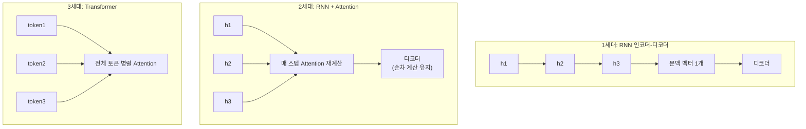

기계 번역기가 "그가 그녀를 좋아한다"와 "그녀가 그를 좋아한다"를 구분하지 못하던 시절이 있었습니다. 규칙 기반 번역기는 문장을 형태소 단위로 쪼개 품사를 판별하고 변화표를 적용하는 파이프라인이었는데, 언어의 예외와 문맥 의존성을 규칙으로 완벽히 정의하는 것이 사실상 불가능했습니다. 이 장은 그 한계를 극복하기 위해 등장한 세 세대의 구조 — RNN, RNN+Attention, Transformer — 가 각각 무엇을 해결하고 무엇을 남겼는지를 순서대로 따라갑니다.

## 1세대 — RNN 인코더-디코더

**RNN(Recurrent Neural Network)** 기반 번역 모델은 인코더와 디코더 두 부분으로 구성됩니다. 인코더는 입력 문장을 한 단어씩 순서대로 읽으며 자기 자신에게 되먹임(recurrent)되는 **히든 스테이트(hidden state)**를 갱신하고, 마지막 시점의 히든 스테이트가 문장 전체의 의미를 압축한 **문맥 벡터(context vector)**가 되어 디코더에 전달됩니다. 디코더는 이 문맥 벡터 하나만을 근거로 출력 문장을 한 단어씩 생성합니다.

이 구조의 근본적인 약점은 **문맥 벡터 하나에 문장 전체의 정보를 압축해야 한다**는 것입니다. 문장이 길어질수록 인코더 초반에 읽은 단어의 정보는 점점 희석되고, 디코더는 상대적으로 최근 정보(문장 후반부)에 편향된 문맥 벡터를 받게 됩니다. 이를 **장기 의존성 문제(long-term dependency problem)**라고 부릅니다.

## 2세대 — RNN Attention

장기 의존성 문제를 해결하기 위해 2014년 Bahdanau, Cho, Bengio가 제안한 방식은, 디코더가 문맥 벡터 하나만 참고하는 대신 **인코더의 모든 시점의 히든 스테이트를 매 출력마다 다시 참고**하도록 만드는 것이었습니다.

> Dzmitry Bahdanau, Kyunghyun Cho, Yoshua Bengio, "Neural Machine Translation by Jointly Learning to Align and Translate", *arXiv:1409.0473* (2014, ICLR 2015)

디코더가 다음 단어를 생성할 때마다 "인코더의 어느 시점을 더 주목(attend)할지"를 계산해 가중합을 만드는 이 방식이 **RNN Attention**입니다. 압축 손실 문제는 완화됐지만, 인코더와 디코더 모두 여전히 이전 시점의 계산이 끝나야 다음 시점을 계산할 수 있는 **순차 구조**를 유지하고 있었습니다. 이는 학습을 병렬화할 수 없다는 뜻이고, 데이터와 모델을 키우는 데 근본적인 속도 제약이 됩니다.

## 3세대 — Transformer, 순차 구조를 끊다

2017년 발표된 Transformer는 RNN Attention의 "무엇을 주목할지 계산한다"는 아이디어는 유지하되, 순차 구조 자체를 제거했습니다. 문장의 모든 토큰을 동시에 입력받아 행렬 연산 한 번으로 서로에 대한 Attention을 계산하기 때문에, 이전 시점의 계산을 기다릴 필요가 없습니다. 05장에서 그 계산을 상세히 다루지만, 이 장에서는 구조적 차이만 짚어둡니다.

Attention과 Feed Forward, 이 두 가지가 Transformer 블록의 핵심이고 나머지(정규화 등)는 전처리·후처리 역할입니다. 여기서 두 종류의 Attention을 구분해야 합니다. **Self-Attention**은 한 문장이 자기 자신과 내적하여 문맥을 파악하는 것으로 인코더·디코더 내부에서 쓰이고, **Cross-Attention**은 인코더의 출력과 디코더의 입력이 서로 내적하는 것으로 번역처럼 두 문장을 대응시킬 때 쓰입니다.

## BERT, GPT, T5 — Transformer를 반쪽만 쓰거나 통째로 쓰거나

원조 Transformer는 인코더와 디코더를 모두 갖춘 구조였지만, 이후 등장한 모델들은 목적에 따라 이 중 일부만 사용합니다.

| 구조 | 대표 모델 | 학습 방식 | 강점 |
|---|---|---|---|
| 인코더만 사용 | BERT | Masked Language Model — 문장 양쪽 문맥을 모두 보고 가려진(mask) 단어를 예측 | 문맥 파악에 강해 분류·검색에 유리 |
| 디코더만 사용 | GPT | Causal Language Model — 앞쪽 문맥만 보고 다음 단어를 예측 | 문장을 순서대로 생성하는 데 유리 |
| 인코더+디코더 | T5 | 입력을 다른 형태의 출력으로 변환(번역·요약) | 입출력 형태가 다른 변환 작업에 유리 |

현재 대부분의 LLM은 **디코더만 사용하는 구조**입니다. 원조 Transformer의 디코더에서 인코더 출력을 참조하는 Cross-Attention 부분을 제거하면 바로 GPT 구조가 됩니다: 임베딩층 → (Self-Attention + Feed Forward)로 구성된 트랜스포머 블록을 N번 반복 → 이 블록을 몇 개 두느냐가 모델 크기를 결정합니다. 04장부터는 이 GPT 구조를 입력부터 출력까지 실제로 조립합니다.

## 흔한 오개념 — "Attention은 Transformer가 처음 도입한 개념이다"

앞서 살펴본 것처럼 Attention 자체는 2014년 RNN Attention에서 이미 존재했습니다. Transformer 논문의 제목이 "Attention Is All You Need"인 이유도, "Attention이라는 새로운 개념을 만들었다"가 아니라 "RNN이라는 순차 구조 없이 Attention만으로 충분하다"는 주장이기 때문입니다. Transformer가 실제로 새로 제안한 것은 순환 구조를 완전히 제거하고 Attention을 병렬 행렬 연산으로 재구성한 것, 그리고 이를 가능하게 한 위치 인코딩(다음 장에서 다룸)입니다. Attention의 발명자가 아니라 "RNN을 대체할 수 있음을 증명한 논문"으로 이해하는 것이 정확합니다.

다음 장에서는 문장을 Transformer에 입력하기 전 거치는 토크나이징과 임베딩, 그리고 순차 구조가 없어지면서 별도로 필요해진 위치 인코딩을 다룹니다.
