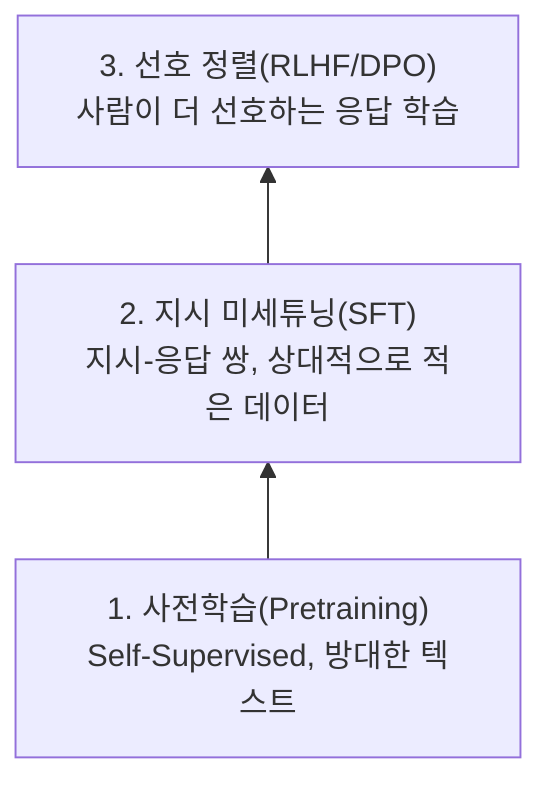

00장에서 짚었듯, 사전학습만 마친 **베이스 모델**은 "다음에 올 가능성이 높은 텍스트"를 이어 쓸 뿐, 질문에 답하도록 설계되어 있지 않습니다. `프랑스의 수도는?`이라는 입력에 베이스 모델은 정답을 말하는 대신 비슷한 질문을 더 나열하는 식으로 이어 쓸 수도 있습니다. **지시 미세튜닝(Instruction Fine-tuning)**은 "질문-답변" 또는 "지시-수행" 형태의 데이터로 추가 학습시켜, 모델이 대화 상대처럼 반응하도록 만드는 과정입니다.

## 프롬프트 포맷 — 입력과 타깃을 만드는 규칙

지시 미세튜닝 데이터는 보통 지시문(instruction)과 응답(response)이 짝을 이룬 형태입니다. 이를 모델이 학습할 수 있는 하나의 연속된 텍스트로 만들려면, 지시문과 응답을 구분하는 고정된 템플릿(prompt format)이 필요합니다.

```python
def format_prompt(instruction: str, response: str) -> str:
    return (
        f"### Instruction:\n{instruction}\n\n"
        f"### Response:\n{response}"
    )

example = format_prompt(
    instruction="다음 문장을 한 문장으로 요약하라: ...",
    response="요약된 문장입니다.",
)
```

이 템플릿을 학습·추론 양쪽에서 항상 동일하게 사용해야 합니다. 학습 때 쓴 형식과 실제 서비스에서 사용자에게 받는 입력의 형식이 다르면, 모델이 학습 시점에 익힌 패턴을 인식하지 못해 성능이 크게 떨어집니다.

## 패딩과 마스킹 — 손실 계산에서 정답이 아닌 부분 제외하기

배치 안의 문장들은 길이가 제각각이므로, 가장 긴 문장에 맞춰 짧은 문장 뒤에 의미 없는 **패딩(padding)** 토큰을 채워 길이를 맞춥니다. 문제는 이 패딩 토큰과, `### Instruction:` 같은 템플릿 부분, 그리고 지시문 자체까지도 모델이 "생성"해야 할 대상이 아니라는 점입니다 — 모델이 실제로 학습해야 하는 것은 오직 응답(response) 부분입니다.

이를 위해 손실 계산에서 제외하고 싶은 위치의 타깃 토큰을 `-100`으로 바꿔치기합니다. PyTorch의 `CrossEntropyLoss`는 기본적으로 타깃값이 `-100`인 위치를 손실 계산에서 자동으로 무시하도록 설계되어 있습니다.

```python
import torch
import torch.nn as nn

IGNORE_INDEX = -100

def build_labels(input_ids: torch.Tensor, instruction_len: int, pad_id: int) -> torch.Tensor:
    labels = input_ids.clone()
    labels[:instruction_len] = IGNORE_INDEX          # 지시문·템플릿 부분은 학습 대상에서 제외
    labels[input_ids == pad_id] = IGNORE_INDEX        # 패딩 부분도 제외
    return labels

loss_fn = nn.CrossEntropyLoss(ignore_index=IGNORE_INDEX)
```

`build_labels`가 만든 `labels`에서 `-100`으로 표시된 위치는 `loss_fn` 계산 시 완전히 건너뜁니다. 이 마스킹을 빼먹으면 모델이 응답을 생성하는 능력이 아니라 지시문 자체를 앵무새처럼 따라 외우는 능력을 학습하게 되는, 흔하지만 발견하기 까다로운 버그로 이어집니다.

## 3단계 파인튜닝 피라미드

실무에서 LLM을 서비스에 맞게 조정하는 과정은 보통 다음 세 단계를 순서대로 쌓아 올립니다.



각 단계는 이전 단계의 산출물을 입력으로 삼습니다. 사전학습은 언어의 구조와 방대한 상식을 익히고, 지시 미세튜닝(Supervised Fine-Tuning, SFT)은 그 상식을 "지시를 따르는 형태"로 꺼내 쓰는 법을 익히며, 마지막 선호 정렬 단계는 SFT로도 남아있는 "더 도움이 되는 답과 덜 도움이 되는 답"의 미묘한 차이를 사람의 피드백으로 조정합니다. 이 마지막 단계는 다음 장에서 RLHF와 DPO로 자세히 다룹니다.

## 흔한 오개념 — "지시 미세튜닝은 새로운 지식을 가르치는 단계다"

지시 미세튜닝 데이터셋에 특정 사실이 포함되어 있으면 그 사실을 학습할 수는 있지만, 이 단계의 주된 목적은 새로운 지식 주입이 아니라 **이미 사전학습으로 습득한 지식을 지시를 따르는 형태로 꺼내 쓰는 법을 가르치는 것**입니다. 지시 미세튜닝에 쓰이는 데이터는 사전학습 데이터에 비해 양이 훨씬 적기 때문에(보통 수만~수십만 개 샘플 대 수천억 토큰), 이 단계만으로 모델에게 방대한 새 지식을 안정적으로 주입하기는 어렵습니다. 특정 도메인의 새 사실을 모델에 반영하고 싶다면, 지시 미세튜닝보다는 사전학습 데이터 자체에 반영하거나, 이후 시리즈에서 다룰 RAG처럼 외부 지식을 검색해 함께 제공하는 접근이 더 안정적입니다.

다음 장에서는 지시 미세튜닝만으로는 채우기 어려운 "더 나은 답과 덜 나은 답"의 차이를, 사람의 선호 데이터로 직접 학습시키는 RLHF와 DPO를 다룹니다.
