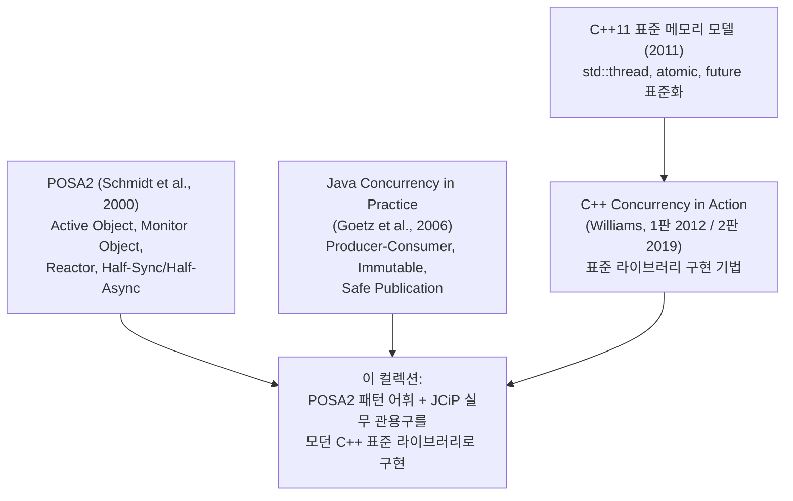

멀티스레드 코드가 무너지는 순간은 대부분 `mutex`를 몰라서가 아니라, **어디에 어떤 구조로 동기화를 배치할지**를 설계하지 않아서 온다. 락을 잡는 문법은 한 줄이면 배우지만, "이 클래스의 공개 메서드끼리 서로를 호출하면 자기 데드락이 난다", "큐에 빠르게 넣는 쪽과 느리게 빼는 쪽의 속도 차이를 누가 흡수하는가" 같은 질문은 문법이 아니라 **구조의 문제**다. 그리고 이런 구조 문제에는 이미 수십 년에 걸쳐 검증된 표준 해법, 즉 **동시성 디자인 패턴(Concurrency Design Pattern)**이 존재한다.

이 컬렉션은 그 패턴들을 **C++ 표준 라이브러리**(`std::thread`, `std::mutex`, `std::condition_variable`, `std::atomic`, `std::future`)만으로 하나씩 구현하며 배우는 시리즈다. 외부 프레임워크 없이 표준 도구로 패턴의 뼈대를 직접 만들어 보면, 이후 어떤 라이브러리(Boost.Asio, TBB, folly)를 만나도 그 내부 설계가 읽히게 된다. 데이터 레이스 하나가 재현조차 어려운 간헐적 크래시로 나타나고, 데드락 하나가 새벽 장애 호출로 돌아오는 도메인에서, 패턴은 "우아한 코드"가 아니라 **사고를 구조적으로 차단하는 안전 장치**다.

---

## 이 컬렉션이 책임지는 범위

이 시리즈가 다루는 것은 **스레드 간 협력 구조의 설계**다. 구체적으로는 공유 상태를 보호하는 락 관용구(RAII 기반 Scoped Locking), 조건이 충족될 때까지 안전하게 기다리는 구조(Monitor Object, Guarded Suspension), 스레드 사이로 데이터를 흘려보내는 구조(Producer-Consumer), 작업 실행을 관리하는 구조(Thread Pool, Future/Promise, Active Object), 그리고 이벤트 기반 서버의 골격(Reactor, Proactor, Half-Sync/Half-Async)까지를 포괄한다.

모든 챕터는 다음 세 가지를 공통으로 담는다. 첫째, 패턴이 해결하는 **문제 상황**을 깨진 코드(데이터 레이스, 데드락, lost wakeup)로 먼저 보여 준다. 둘째, C++ 표준 라이브러리만으로 **컴파일 가능한 구현**을 제시한다. 셋째, 그 패턴을 **언제 쓰고 언제 피해야 하는지** 판단 기준을 정리한다. 패턴은 무조건 적용하는 규칙이 아니라 트레이드오프가 있는 선택지이기 때문이다.

## 패턴 부재가 만드는 사고: 5분 예제

"구조의 문제"라는 말이 추상적으로 들린다면, 이 시리즈 전체의 출발점이 되는 가장 작은 사고를 직접 재현해 보자. 아래 코드는 스레드 4개가 전역 카운터를 10만 번씩 증가시키는, 누구나 한 번쯤 작성해 봤을 코드다. `++counter`는 한 줄이지만 기계 수준에서는 읽기-수정-쓰기 세 단계이고, 두 스레드가 이 단계를 겹쳐 실행하는 순간 **데이터 레이스(data race)**가 발생한다. C++ 표준은 데이터 레이스를 **미정의 동작(undefined behavior)**으로 규정하므로, "값이 조금 틀리는" 정도가 아니라 프로그램 전체의 동작을 보증할 수 없게 된다.

```cpp
#include <iostream>
#include <thread>
#include <vector>

int counter = 0;  // 공유 상태, 아무 보호 없음

int main() {
    std::vector<std::thread> workers;
    for (int i = 0; i < 4; ++i) {
        workers.emplace_back([] {
            for (int j = 0; j < 100000; ++j) {
                ++counter;  // 데이터 레이스: 읽기-수정-쓰기가 겹친다
            }
        });
    }
    for (auto& t : workers) t.join();
    std::cout << counter << '\n';  // 400000이 아닌 값이 흔히 나온다
    return 0;
}
```

이 코드를 `g++ -std=c++20 -pthread -fsanitize=thread -g`로 빌드해 실행하면 ThreadSanitizer가 즉시 `WARNING: ThreadSanitizer: data race`를 보고한다(출력되는 합계는 실행마다 다르며, 환경에 따라 우연히 400000이 나와도 레이스는 그대로 존재한다). 수정 자체는 간단해서, 공유 상태 접근을 `std::mutex`와 RAII 가드로 감싸면 된다.

```cpp
#include <iostream>
#include <mutex>
#include <thread>
#include <vector>

int counter = 0;
std::mutex counterMutex;

int main() {
    std::vector<std::thread> workers;
    for (int i = 0; i < 4; ++i) {
        workers.emplace_back([] {
            for (int j = 0; j < 100000; ++j) {
                std::lock_guard<std::mutex> guard(counterMutex);  // Scoped Locking
                ++counter;
            }
        });
    }
    for (auto& t : workers) t.join();
    std::cout << counter << '\n';  // 항상 400000
    return 0;
}
```

여기서 중요한 것은 `lock_guard` 한 줄이 아니라 그 뒤의 질문들이다. 락의 범위는 누가 정하는가? 이 카운터가 메서드 20개짜리 클래스의 멤버라면 모든 메서드에 가드를 넣어야 하는가, 그러다 공개 메서드가 다른 공개 메서드를 호출하면(같은 mutex를 두 번 잡으면) 어떻게 되는가? 값을 기다렸다가 읽어야 한다면? 이 질문들이 각각 Scoped Locking과 Thread-Safe Interface(02장), Monitor Object와 Guarded Suspension(03장)으로 이어진다. 패턴은 이 "한 줄 다음의 질문들"에 대한 검증된 답이다.

## 다루지 않는 것 (경계)

이 컬렉션은 패턴의 **구조와 정확성**에 집중하고, 다음 주제는 의도적으로 경계 밖에 둔다.

- **성능 정량 분석**: mutex vs spinlock 비용 측정, false sharing, lock-free 자료구조의 벤치마크는 [Low-latency 동시성·멀티스레드 트랙](/post/concurrency-optimization/getting-started-concurrency-multithreading-performance-tuning/)이 담당한다. 이 시리즈에서 구조를 익히고, 그 트랙에서 비용을 측정하면 두 관점이 맞물린다.
- **GoF 패턴 전반**: Singleton·Observer·Command 등 GoF 23패턴의 일반론은 [디자인 패턴 마스터 시리즈의 동시성·분산 챕터](/post/design-patterns/19-concurrency-distributed-patterns/)를 포함한 해당 컬렉션이 다룬다. 여기서는 GoF 패턴이 멀티스레드 환경에서 어떻게 변형되는지(예: Singleton의 DCLP 문제)만 교차점으로 다룬다.
- **OS 커널·스케줄러 내부**, **C++20 코루틴 기반 비동기 모델**, **std::execution(senders/receivers, C++26)**: 첫째는 운영체제 영역이고, 나머지 둘은 마지막 챕터에서 전망만 제시한다. 코루틴은 그 자체로 별도 시리즈가 필요한 주제이고, std::execution은 2026년 3월 Croydon 총회에서 C++26 표준 채택이 확정됐지만 이 글을 쓰는 시점까지 GCC·Clang·MSVC 표준 라이브러리 어디에도 구현되지 않아 "컴파일 가능한 구현 + ThreadSanitizer 검증"이라는 이 시리즈의 원칙과 아직 맞지 않는다. 컴파일러 지원이 성숙하면 별도 챕터나 후속 시리즈의 후보다.

## 패턴 계보: POSA2에서 모던 C++까지

동시성 패턴은 한 권의 책에서 나온 것이 아니라 세 갈래 계보가 합쳐진 결과다. 출발점은 Douglas Schmidt 등이 정리한 **POSA2**로, Active Object·Monitor Object·Reactor·Half-Sync/Half-Async 같은 이 시리즈의 골격 패턴 대부분이 여기서 명명되었다. 한편 Java 진영에서는 Brian Goetz의 **JCiP**가 Producer-Consumer·불변 객체·안전한 공개(safe publication) 같은 실무 관용구를 체계화했고, C++ 진영에서는 C++11 표준 메모리 모델 도입 이후 Anthony Williams의 **C++ Concurrency in Action**이 표준 라이브러리 기반 구현 기법을 정립했다. 이 시리즈는 POSA2의 패턴 어휘를 뼈대로 삼고, JCiP의 실무 감각과 Williams의 C++ 구현 기법을 살로 붙인다.

> "Patterns help capture and reuse the static and dynamic structure and collaboration of key participants in software designs." — Douglas C. Schmidt et al., 『Pattern-Oriented Software Architecture, Volume 2: Patterns for Concurrent and Networked Objects』(2000)



이 계보는 2026년 현재도 닫히지 않았다. C++26 표준(2026년 3월 Croydon 총회에서 확정)은 Meta의 folly 라이브러리에서 실전 검증된 **Hazard Pointer(P2530)**와 **RCU(P2545)**를 표준 라이브러리에 편입시켰고, 이는 11장이 다루는 "공유 회피" 전략의 최신 표준 도구로 직접 이어진다. 같은 C++26에 채택된 **std::execution**(senders/receivers, P2300)은 Nathaniel J. Smith가 제안한 구조적 동시성(structured concurrency) 개념의 C++판 구현이지만, 앞서 밝힌 대로 컴파일러 구현이 아직 없어 이 시리즈의 범위 밖에 둔다(다루지 않는 것 참고).

## 커리큘럼

커리큘럼은 네 단계로 올라간다. **기초(01)**에서 메모리 모델과 데이터 레이스라는 공통 어휘를 만들고, **락 관용구와 대기 구조(02~05)**에서 단일 객체를 안전하게 만드는 패턴을 익힌다. 그 위에서 **데이터 흐름과 실행 관리(04, 06~08)**로 스레드 사이의 협력을 설계하고, 마지막으로 **아키텍처 패턴(09~10)**과 **공유 회피 전략(11)**으로 시스템 수준의 그림을 완성한다. 각 단계는 앞 단계의 어휘를 전제하므로 순서대로 읽는 것을 기본으로 한다.

| 챕터 | 주제 | 핵심 패턴 | 난이도 | 주 근거 문헌 |
|------|------|----------|--------|-------------|
| 01 | 동시성 기초와 C++ 메모리 모델 | data race, happens-before, `std::atomic` 기초 | 기초 | Williams 1~5장 |
| 02 | 락 관용구 | Scoped Locking(RAII), Strategized Locking, Thread-Safe Interface | 기초 | POSA2 |
| 03 | 대기와 조정 | Monitor Object, Guarded Suspension, Balking | 중급 | POSA2, JCiP |
| 04 | 데이터 흐름 | Producer-Consumer, Bounded Buffer, backpressure | 중급 | JCiP |
| 05 | 읽기 최적화와 지연 초기화 | Read-Write Lock(`shared_mutex`), DCLP의 함정, `call_once` | 중급 | Meyers & Alexandrescu 2004 |
| 06 | 실행 관리 I | Thread Pool, Work Stealing | 중급 | Williams 9장 |
| 07 | 실행 관리 II | Future/Promise, `std::async`, `packaged_task` | 중급 | Williams 4장 |
| 08 | 비동기 객체 | Active Object | 심화 | POSA2 |
| 09 | 이벤트 아키텍처 I | Reactor, Proactor, 이벤트 디멀티플렉싱 | 심화 | POSA2 |
| 10 | 이벤트 아키텍처 II | Half-Sync/Half-Async, Leader/Followers | 심화 | POSA2 |
| 11 | 공유 회피 | Immutable, Copy-on-Write, Thread-Specific Storage(`thread_local`), Hazard Pointer·RCU(C++26 표준화) 개관 | 심화 | JCiP, POSA2, P2530/P2545 |

이 순서를 두는 이유는 패턴 간 **개념 의존성** 때문이다. 01의 메모리 모델 없이 05의 DCLP를 읽으면 "왜 이중 검사가 깨지는가"를 끝내 납득할 수 없고, 03의 condition_variable 대기 구조 없이 04의 Blocking Queue를 보면 spurious wakeup 처리가 주술처럼 보인다. 08의 Active Object는 04의 큐와 07의 future를 조립한 종합 패턴이며, 09~10의 서버 아키텍처는 그 모든 부품 위에 선다. 거꾸로 말해 급한 독자가 06(Thread Pool)부터 펼치는 것 자체는 막지 않지만, 구현 중 막히는 지점은 거의 확실히 01~03의 어휘 부족에서 온다.

## 추천 선행·병행 컬렉션

C++ 문법과 RAII 개념은 전제한다. 패턴의 **구조**를 익힌 뒤 같은 주제를 **비용** 관점으로 다시 보면 이해가 입체화되므로, 다음 두 컬렉션과의 병행을 권장한다.

- **병행**: [Low-latency 동시성·멀티스레드 비용 통제 트랙](/post/concurrency-optimization/getting-started-concurrency-multithreading-performance-tuning/) — 이 시리즈가 "어떤 구조로 만들까"를 답하면, 그 트랙은 "그 구조의 비용은 얼마인가"를 답한다.
- **선행 또는 병행**: [디자인 패턴 마스터 시리즈](/post/design-patterns/19-concurrency-distributed-patterns/) — GoF 패턴의 일반 어휘(특히 Command, Proxy, Observer)가 있으면 Active Object·Reactor를 "아는 패턴의 동시성 변형"으로 읽을 수 있다.

## 학습 방법과 코드 실행 환경

모든 예제는 **C++17 이상**(일부 챕터는 `std::jthread`·`std::barrier` 때문에 C++20)을 기준으로 하며, 외부 의존성 없이 표준 라이브러리만 사용한다. Linux/macOS에서는 다음 한 줄로 컴파일된다.

```bash
g++ -std=c++20 -pthread -Wall -Wextra -O2 example.cpp -o example
```

동시성 코드는 "잘 돌아가는 것처럼 보임"과 "정확함"의 거리가 유난히 멀다. 그래서 이 시리즈의 모든 예제는 **ThreadSanitizer**(`-fsanitize=thread -g`)를 켜고 한 번 더 실행하는 것을 표준 절차로 삼는다. 챕터의 "깨진 코드" 예제는 TSAN이 실제로 데이터 레이스를 보고하는 것을 확인하고, "고친 코드"는 보고가 사라지는 것을 확인하는 식으로, 패턴의 효과를 도구로 검증하며 읽기를 권한다. Windows(MSVC) 독자는 `/std:c++20 /W4`와 Visual Studio의 Concurrency Visualizer를 대응 도구로 쓸 수 있다.

## 이 컬렉션을 마친 후 달성할 목표

완주하면 멀티스레드 코드를 "락을 어디에 넣지?"가 아니라 "이 문제는 어떤 패턴의 변형이지?"라는 어휘로 사고할 수 있게 된다. 신규 설계에서는 공유 상태 보호·대기·데이터 흐름·실행 관리 중 어느 층의 문제인지 분류한 뒤 해당 패턴을 꺼내 쓸 수 있고, 레거시 코드 리뷰에서는 자기 데드락 가능성이 있는 Thread-Safe Interface 위반이나 깨진 DCLP 같은 패턴 위반을 짚어낼 수 있다. 또한 Boost.Asio의 Proactor, Java Executor의 Thread Pool처럼 주요 프레임워크의 내부 구조를 패턴 이름으로 역추적할 수 있게 된다.

- **분류**: 동시성 문제를 보호(02, 05)·대기(03)·흐름(04)·실행(06~08)·아키텍처(09~10)·회피(11) 층위로 구분할 수 있다.
- **구현**: 각 패턴을 C++ 표준 라이브러리만으로 컴파일 가능하게 구현하고 TSAN으로 검증할 수 있다.
- **선택**: 패턴별 적용/회피 기준을 근거로 설계 리뷰에서 대안을 제시할 수 있다.
- **연결**: 패턴 구조와 성능 비용([동시성 최적화 트랙](/post/concurrency-optimization/getting-started-concurrency-multithreading-performance-tuning/))을 연결해 판단할 수 있다.

## 평가 기준

이 컬렉션 전체의 학습 성과는 아래 질문으로 점검한다. 각 챕터 말미의 평가 기준은 이 목록을 챕터 범위로 구체화한 것이다.

- [ ] 데이터 레이스·데드락·lost wakeup이 각각 어떤 패턴의 부재에서 오는지 예를 들어 설명할 수 있는가?
- [ ] Scoped Locking과 Thread-Safe Interface가 막아 주는 사고를 코드로 재현하고 고칠 수 있는가?
- [ ] Producer-Consumer에서 bounded와 unbounded 큐의 트레이드오프(backpressure vs 메모리)를 설명할 수 있는가?
- [ ] Active Object를 "언제 쓰고 언제 과한지"(메서드 호출 빈도, 응답 지연 허용치 기준) 판단할 수 있는가?
- [ ] Reactor와 Proactor의 차이를 이벤트 통지 시점(준비 완료 vs 작업 완료) 기준으로 구분할 수 있는가?
- [ ] 공유 자체를 없애는 전략(Immutable, thread_local)이 락 기반 패턴보다 나은 상황을 제시할 수 있는가?

## 다음 장에서는

01장 **「동시성 기초와 C++ 메모리 모델」**에서 시리즈 전체의 공통 어휘를 만든다. 데이터 레이스의 표준상 정의(undefined behavior), happens-before 관계, `std::atomic`과 `memory_order`의 최소 실무 해석을 다루고, 이후 모든 챕터에서 "이 코드는 왜 안전한가"를 같은 언어로 설명할 수 있게 한다.

