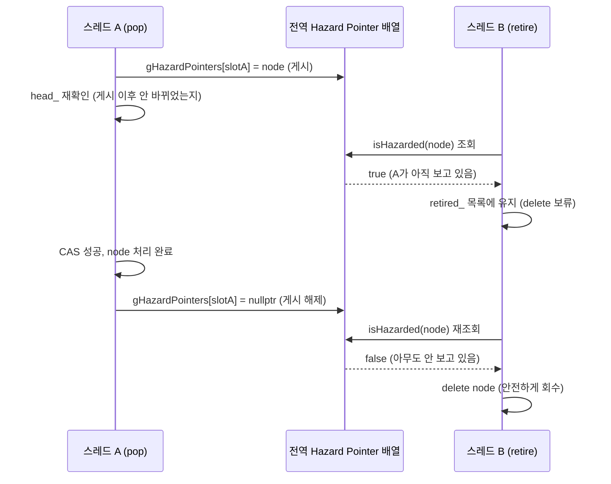
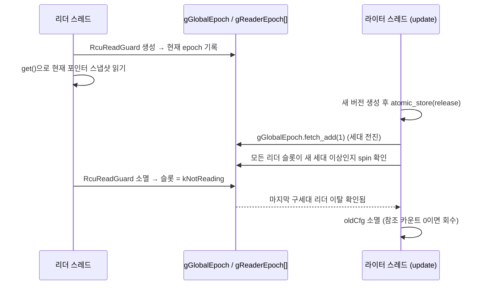

11장은 SPSC(단일 생산자·단일 소비자) Lock-Free 큐를 구현하면서 "메모리 회수 문제(ABA, hazard pointer)는 이 장의 범위 밖"이라고 명시적으로 미뤄 두었다. 생산자와 소비자가 각각 하나뿐인 SPSC 구조에서는 애초에 이 문제가 발생하지 않기 때문이다. 하지만 여러 스레드가 동시에 같은 자료구조에서 노드를 꺼내고 지우는 일반적인(MPMC) 상황에서는 사정이 다르다 — 한 스레드가 아직 들여다보고 있는 노드를 다른 스레드가 지워 버릴 수 있다. 이 장은 그 문제를 정면으로 다루고, C++26 표준(2026년 3월 Croydon 총회에서 최종 확정)에 포함된 두 해법 — **Hazard Pointer**(P2530)와 **RCU**(P2545) — 를 직접 구현한다.

## 이 장을 읽기 전에

**완전한 초보자?** 이 장은 [11장 「공유 회피」](/post/multithreading-patterns/cpp-avoiding-shared-state-immutable-cow-thread-local/)의 SPSC Lock-Free 큐와 Copy-on-Write, 그리고 01장의 메모리 모델(happens-before, `memory_order`)을 알고 있다고 가정합니다. "SPSC에서는 왜 회수 문제가 없었는가"를 알아야 "MPMC에서는 왜 필요한가"를 이해할 수 있기 때문입니다.

**이 장의 깊이**: 이 장은 **심화(advanced)** 수준입니다. Treiber 스택(가장 단순한 형태의 lock-free 스택)에 Hazard Pointer 기반 안전한 회수를 직접 구현하고, epoch 기반 RCU의 최소 형태로 Copy-on-Write를 재구현하는 것이 목표입니다.

**다루지 않는 것**: 이 장의 구현은 **교육용**입니다. 실제 C++26 표준 라이브러리는 `std::hazard_pointer`나 RCU 관련 API를 제공할 예정이지만(P2530, P2545), 이 글을 쓰는 시점까지 GCC·Clang·MSVC 표준 라이브러리 어디에도 구현되어 있지 않습니다. 그래서 이 장은 표준 API를 그대로 쓰는 대신, `std::atomic`만으로 그 API가 해결하려는 문제와 알고리즘을 직접 재현합니다 — 실제 프로덕션에서는 folly의 `folly::hazptr`, `folly::rcu`나 향후 표준 라이브러리 구현을 쓸 것을 권장합니다. 범용 MPMC 큐, 스레드당 hazard pointer 슬롯을 여러 개 두는 최적화, epoch 기반이 아닌 다른 RCU 구현(예: 신호 기반 QSBR)은 범위 밖입니다.

## 당신의 수준에 맞는 경로

| 수준 | 읽을 부분 | 핵심 목표 |
|------|---------|---------|
| **중급자** | "왜 회수가 어려운가" ~ "Hazard Pointer: 게시판 방식" | use-after-free가 왜 생기는지, 어떻게 막는지 이해 |
| **고급자** | 전체, 특히 "RCU: 세대 교체 방식" | 참조 카운팅과 grace period 기반 회수의 차이 이해 |
| **설계자** | "Hazard Pointer vs RCU: 선택 기준" | 실제 시스템에서 어느 쪽을 쓸지 판단 |

---

## 왜 회수가 어려운가

Lock-Free 자료구조에서 노드를 안전하게 지우는 일이 어려운 이유는 **"누가 이 노드를 아직 보고 있는지"를 락 없이는 알 방법이 없기 때문**이다. 뮤텍스 기반 코드에서는 임계 구역에 들어간 스레드만 데이터에 접근할 수 있으므로, 그 스레드가 나가기 전까지는 아무도 그 데이터를 지울 수 없다는 것이 락 자체로 보장된다. 하지만 lock-free 코드에는 그런 "출입문"이 없다 — 스레드 A가 포인터를 읽어 막 `->next`를 따라가려는 순간, 스레드 B가 같은 노드를 이미 꺼내서 `delete`해 버릴 수 있다. A가 그 다음 줄에서 해제된 메모리를 읽으면 **use-after-free**다.

더 교묘한 변형이 **ABA 문제**다. 뒤에 나올 Treiber 스택의 `pop()`을 예로 들면: 스레드 A가 `head_`를 읽어 노드 `X`를 얻고(`compare_exchange_weak(node, next, ...)`를 호출하기 직전), 여기서 스레드가 잠깐 멈춘다. 그 사이 스레드 B가 `X`를 정상적으로 pop하고, 이어서 다음 노드 `Y`도 pop한 뒤, 마침 새로 `push`한 노드가 (해제됐다가 재사용된) `X`와 **같은 메모리 주소**에 할당된다. 이제 `head_`는 다시 `X`라는 값을 가리키지만, 이것은 스레드 A가 처음 봤던 그 논리적 노드가 아니라 완전히 다른 새 노드다. 스레드 A가 재개되어 `compare_exchange_weak(node, next, ...)`를 실행하면 — `head_`가 여전히 `X`(주소 기준)이므로 CAS는 **성공**한다. 하지만 A가 들고 있던 `next`는 B가 이미 pop해 버린 옛 `Y`를 가리키므로, `head_`가 이미 사라진 노드를 가리키게 되어 스택이 조용히 망가진다. "값이 A였다가 B로 바뀐 뒤 다시 A로 돌아왔다"는 이름 그대로, CAS는 포인터 값만 비교하므로 그 사이에 무슨 일이 있었는지 전혀 알 수 없다.

Hazard Pointer와 RCU는 이 두 문제(use-after-free, ABA)에 대해 서로 다른 답을 낸다 — 전자는 "각 스레드가 지금 무엇을 보고 있는지 게시판에 적어 둔다"는 전략으로 회수 자체를 늦춰 두 문제를 모두 막고, 후자는 "다음 세대(epoch)로 넘어가기 전까지는 이전 세대의 메모리를 치우지 않는다"는 전략으로 같은 효과를 낸다. 아래 `HazardPointerStack::pop()`이 CAS 직전에 `HazardGuard`를 세우고 `head_`를 재확인하는 것도, 결국 "이 포인터가 가리키는 메모리가 그 사이 재사용되지 않았는가"를 보장하려는 것이다.

## Hazard Pointer: 게시판 방식

**Hazard Pointer**는 스레드가 공유 포인터를 역참조하기 전에 "나는 지금 이 포인터를 보고 있다"고 전역 게시판(hazard pointer 배열)에 적어 두는 방식이다. 다른 스레드가 어떤 노드를 지우려 할 때는 먼저 이 게시판을 훑어, 아무도 그 포인터를 게시해 두지 않았을 때만 실제로 `delete`한다. 아직 누군가 보고 있다면 그 노드를 "회수 대기 목록"에 넣어 두고 나중에 다시 확인한다.

```cpp
// hazard_pointer_stack.cpp
// 빌드: g++ -std=c++20 -pthread -Wall -Wextra -O2 -g -fsanitize=address hazard_pointer_stack.cpp -o hp_stack
#include <algorithm>
#include <atomic>
#include <iostream>
#include <mutex>
#include <optional>
#include <thread>
#include <vector>

constexpr int kMaxThreads = 8;
std::atomic<void*> gHazardPointers[kMaxThreads] = {};
thread_local int tlHazardSlot = -1;
std::atomic<int> gNextSlot{0};

// 스레드마다 게시판 슬롯을 하나씩 배정한다 (교육용 단순화: 슬롯 반납은 생략).
int myHazardSlot() {
    if (tlHazardSlot == -1) {
        tlHazardSlot = gNextSlot.fetch_add(1, std::memory_order_relaxed);
    }
    return tlHazardSlot;
}

bool isHazarded(void* ptr) {
    for (auto& slot : gHazardPointers) {
        if (slot.load(std::memory_order_acquire) == ptr) return true;
    }
    return false;
}

// RAII: 생성되는 동안 "이 포인터를 지금 보고 있다"고 게시판에 적고, 소멸 시 지운다.
struct HazardGuard {
    int slot = myHazardSlot();
    explicit HazardGuard(void* ptr) {
        gHazardPointers[slot].store(ptr, std::memory_order_release);
    }
    ~HazardGuard() { gHazardPointers[slot].store(nullptr, std::memory_order_release); }
};

struct Node {
    int value;
    Node* next;
};

class HazardPointerStack {
public:
    void push(int value) {
        Node* node = new Node{value, head_.load(std::memory_order_relaxed)};
        while (!head_.compare_exchange_weak(
            node->next, node, std::memory_order_release, std::memory_order_relaxed)) {
            // 실패하면 node->next가 head_의 최신값으로 자동 갱신된다
        }
    }

    std::optional<int> pop() {
        Node* node = head_.load(std::memory_order_acquire);
        while (node != nullptr) {
            HazardGuard guard(node);  // "이 노드를 지금 보고 있다"고 게시
            // 게시 이후 head_가 그 사이 바뀌지 않았는지 재확인한다 — 바뀌었다면
            // 방금 게시한 node가 이미 지워졌을 수 있으므로 처음부터 다시 읽는다.
            if (head_.load(std::memory_order_acquire) != node) {
                node = head_.load(std::memory_order_acquire);
                continue;
            }
            Node* next = node->next;
            if (head_.compare_exchange_weak(
                    node, next, std::memory_order_acq_rel, std::memory_order_relaxed)) {
                int value = node->value;
                retire(node);  // 즉시 delete하지 않는다
                return value;
            }
        }
        return std::nullopt;
    }

private:
    void retire(Node* node) {
        std::lock_guard<std::mutex> lock(retireMutex_);
        retired_.push_back(node);
        if (retired_.size() < 4) return;  // 교육용: 아주 작은 임계값에서만 회수 시도
        auto it = std::remove_if(retired_.begin(), retired_.end(), [](Node* p) {
            if (isHazarded(p)) return false;  // 아직 누군가 이 포인터를 보고 있다
            delete p;
            return true;
        });
        retired_.erase(it, retired_.end());
    }

    std::atomic<Node*> head_{nullptr};
    std::mutex retireMutex_;
    std::vector<Node*> retired_;
};

int main() {
    HazardPointerStack stack;
    constexpr int kThreads = 4;
    constexpr int kOpsPerThread = 20000;

    std::vector<std::thread> workers;
    for (int t = 0; t < kThreads; ++t) {
        workers.emplace_back([&stack, t] {
            for (int i = 0; i < kOpsPerThread; ++i) {
                stack.push(t * kOpsPerThread + i);
                stack.pop();  // 다른 스레드가 방금 push한 노드를 꺼낼 수도 있다 — 값 자체보다
                              // 동시 push/pop이 안전한지(ASAN 리포트가 없는지)가 이 데모의 목적이다
            }
        });
    }
    for (auto& w : workers) w.join();

    while (stack.pop()) {
        // 남은 노드를 모두 비운다.
    }
    std::cout << "OK: " << kThreads << "개 스레드가 동시에 push/pop을 마쳤다\n";
    return 0;
}
```

`pop()`에서 `HazardGuard`를 세운 직후 `head_`를 다시 읽어 확인하는 줄이 이 구현의 핵심이다. 게시판에 적는 것과 노드를 실제로 들여다보는 것 사이에는 항상 아주 짧은 틈이 있고, 그 틈에 다른 스레드가 이미 같은 노드를 꺼내 회수해 버렸을 수 있기 때문이다 — 게시 후 재확인은 "게시한 시점에 이 노드가 여전히 유효했는가"를 보장하는 안전장치다. `retire()`는 노드를 회수 대기 목록에 넣고, 목록이 일정 크기를 넘으면 게시판을 훑어 아무도 보고 있지 않은 노드만 골라 지운다. 두 스레드가 게시-확인-회수를 어떻게 주고받는지 시간 순서로 그리면 다음과 같다.



### 왜 use-after-free가 발생하는가: 원인과 수정

`HazardGuard`와 `retire()` 없이, `pop()`이 노드를 꺼내자마자 바로 지우면 어떻게 될까.

```cpp
// 깨진 버전: 게시판 없이 pop이 끝나자마자 바로 delete한다
std::optional<int> pop() {
    Node* node = head_.load(std::memory_order_acquire);
    while (node != nullptr) {
        Node* next = node->next;  // 다른 스레드가 이미 이 node를 delete했을 수도 있다
        if (head_.compare_exchange_weak(node, next, std::memory_order_acq_rel,
                                         std::memory_order_relaxed)) {
            int value = node->value;
            delete node;  // 다른 스레드가 아직 node->next를 읽는 중일 수도 있다
            return value;
        }
    }
    return std::nullopt;
}
```

스레드 A가 `Node* node = head_.load(...)`로 어떤 노드를 읽고 `node->next`에 접근하려는 바로 그 순간, 스레드 B가 같은 노드를 이미 pop해서 `delete`했다면 A는 이미 해제된 메모리를 읽는다. `compare_exchange_weak`가 그 사이 `head_`가 바뀌었으면 실패하고 재시도하도록 되어 있지만, **`node->next`를 읽는 시점은 이미 CAS보다 먼저**이므로 CAS 실패 여부와 무관하게 use-after-free가 먼저 일어난다. 이것이 11장에서 "일반적인 MPMC lock-free 자료구조는 책으로 배우기 어렵다"고 한 말의 구체적인 실체다.

### 안전성 검증

이 버그는 메모리 안전성 위반(해제된 메모리 접근)이므로 ThreadSanitizer보다 **AddressSanitizer**(`-fsanitize=address`)가 더 직접적으로 잡아낸다. 여러 스레드가 동시에 `push`/`pop`을 반복하도록 스트레스 테스트를 돌리면, 깨진 버전은 재현 빈도가 스레드 수·반복 횟수·시스템 부하에 따라 다르지만 결국 `heap-use-after-free`를 보고해야 한다. `HazardGuard`를 적용한 고친 버전은 같은 테스트에서 그런 리포트가 없어야 한다. 다만 이 역시 "여러 번 통과했다"가 "증명됐다"는 뜻은 아니다 — 11장에서 강조한 대로, 타이밍에 의존하는 버그는 특정 스레드 수·CPU·부하에서만 드러날 수 있다.

## RCU: 세대 교체 방식

**RCU(Read-Copy-Update)**는 다른 전략을 쓴다. 읽는 쪽은 게시판에 아무것도 적지 않고 그냥 포인터를 읽어 따라간다 — Hazard Pointer처럼 매번 전역 배열에 값을 저장하는 원자적 쓰기가 없다(순수 RCU 구현에서는 원자적 읽기-수정-쓰기(RMW)조차 필요 없다. 다만 아래 예제는 `shared_ptr`을 그대로 재사용해 grace period 계산만 보여 주므로, `atomic_load_explicit`가 내부적으로 하는 참조 카운트 증가만큼의 RMW 비용은 남아 있다). 대신 쓰는 쪽이 새 버전을 만들어 포인터를 교체한 뒤, "이 교체 이전에 시작된 모든 읽기가 끝날 때까지"(이 구간을 **grace period**라 부른다) 기다린 다음에야 이전 버전을 해제한다. 11장의 Copy-on-Write는 `shared_ptr`의 참조 카운팅으로 이 문제를 풀었다 — 리더가 스냅샷을 들고 있는 한 참조 카운트가 0이 되지 않으므로 안전하다. RCU는 참조 카운팅조차 생략한다. 참조 카운트를 증감하는 원자적 RMW는 읽기가 몰릴수록 같은 캐시 라인을 여러 코어가 다투게 만드는데, RCU는 그 비용을 아예 읽기 경로에서 없애고 드물게 일어나는 쓰기 경로로 미룬다.

grace period를 구현하는 가장 단순한 방법은 전역 세대 번호(epoch)와, 각 스레드가 "마지막으로 관찰한 세대"를 기록하는 것이다.

```cpp
// rcu_config.cpp
// 빌드: g++ -std=c++20 -pthread -Wall -Wextra -O2 -g rcu_config.cpp -o rcu_demo
#include <atomic>
#include <cstdint>
#include <iostream>
#include <limits>
#include <map>
#include <memory>
#include <string>
#include <thread>
#include <vector>

constexpr int kMaxThreads = 8;
constexpr uint64_t kNotReading = std::numeric_limits<uint64_t>::max();

std::atomic<uint64_t> gGlobalEpoch{0};
std::atomic<uint64_t> gReaderEpoch[kMaxThreads];
thread_local int tlRcuSlot = -1;
std::atomic<int> gNextRcuSlot{0};

// 정적 초기화: 프로그램 시작 시 모든 슬롯을 "읽는 중 아님"으로 채운다.
// gReaderEpoch는 전역 배열이라 기본값은 0인데, 아직 아무 스레드도 배정받지
// 않은 슬롯이 0으로 남으면 rcuSynchronize()가 그 슬롯을 영원히 기다리게 된다
// (0은 kNotReading도, target 이상도 아니기 때문이다) — 이 초기화가 없으면
// update()를 한 번만 호출해도 무한 루프에 빠진다.
struct RcuSlotInit {
    RcuSlotInit() {
        for (auto& slot : gReaderEpoch) slot.store(kNotReading, std::memory_order_relaxed);
    }
} gRcuSlotInit;

int myRcuSlot() {
    if (tlRcuSlot == -1) {
        tlRcuSlot = gNextRcuSlot.fetch_add(1, std::memory_order_relaxed);
    }
    return tlRcuSlot;
}

// RAII: 이 구간에 들어와 있는 동안 "나는 현재 세대를 읽는 중"이라고 알린다.
struct RcuReadGuard {
    int slot = myRcuSlot();
    RcuReadGuard() {
        gReaderEpoch[slot].store(gGlobalEpoch.load(std::memory_order_acquire),
                                  std::memory_order_release);
    }
    ~RcuReadGuard() { gReaderEpoch[slot].store(kNotReading, std::memory_order_release); }
};

// 새 세대로 넘어가고, 이전 세대를 읽고 있던 모든 리더가 빠져나갈 때까지 기다린다.
void rcuSynchronize() {
    uint64_t target = gGlobalEpoch.fetch_add(1, std::memory_order_acq_rel) + 1;
    for (auto& readerEpoch : gReaderEpoch) {
        while (true) {
            uint64_t seen = readerEpoch.load(std::memory_order_acquire);
            if (seen == kNotReading || seen >= target) break;
            std::this_thread::yield();  // 그 리더가 새 세대를 볼 때까지 잠시 양보
        }
    }
}

struct Config {
    std::map<std::string, std::string> values;
};

class RcuConfigStore {
public:
    explicit RcuConfigStore(std::shared_ptr<const Config> initial)
        : current_(std::move(initial)) {}

    // 리더: 게시판에 아무것도 적지 않고 그냥 포인터를 읽는다(shared_ptr 참조 카운트
    // 증가만큼의 비용은 남아 있다 — 순수 RCU라면 이마저 없다).
    std::shared_ptr<const Config> get() const {
        RcuReadGuard guard;
        return std::atomic_load_explicit(&current_, std::memory_order_acquire);
    }

    // 라이터: 새 버전을 교체한 뒤, 이전 버전을 읽던 리더가 모두 빠져나갈 때까지 기다린다.
    // 주의: 이 update()는 "라이터가 하나뿐"이라는 가정에 기대고 있다. compare_exchange가
    // 아니라 단순 store이므로, 두 스레드가 동시에 update()를 호출하면 둘 다 같은 oldCfg를
    // 읽고 각자 새 버전을 만들어 나중에 store하는 쪽이 앞선 갱신을 통째로 덮어쓴다 —
    // 11장 CoW의 compare_exchange_weak 재시도 루프와 달리 여기엔 라이터 간 동기화가 없다.
    // 라이터가 여러 개라면 별도의 writer 락으로 update() 호출 자체를 직렬화해야 한다.
    void update(const std::string& key, const std::string& value) {
        auto oldCfg = std::atomic_load_explicit(&current_, std::memory_order_acquire);
        auto newCfg = std::make_shared<Config>(*oldCfg);
        newCfg->values[key] = value;
        std::atomic_store_explicit(&current_, newCfg, std::memory_order_release);
        rcuSynchronize();
        // 이 시점 이후에는 oldCfg를 아무도 읽고 있지 않다고 보장된다.
        // oldCfg는 함수가 끝나며 소멸하고, 마지막 참조라면 여기서 해제된다.
    }

private:
    mutable std::shared_ptr<const Config> current_;
};

int main() {
    auto initial = std::make_shared<Config>();
    initial->values["timeout"] = "30s";
    RcuConfigStore store(initial);

    constexpr int kReaders = 4;
    std::vector<std::thread> readers;
    for (int i = 0; i < kReaders; ++i) {
        readers.emplace_back([&store, i] {
            for (int j = 0; j < 1000; ++j) {
                auto cfg = store.get();  // RcuReadGuard로 보호된 스냅샷
                std::cout << "reader " << i << ": timeout="
                          << cfg->values.at("timeout") << '\n';
            }
        });
    }

    // 라이터는 하나뿐이다 — update() 자체는 writer-writer 동기화가 없기 때문이다.
    std::thread writer([&store] { store.update("timeout", "60s"); });

    for (auto& r : readers) r.join();
    writer.join();

    auto finalCfg = store.get();
    std::cout << "OK: " << kReaders << "개 리더가 use-after-free 없이 종료, "
              << "최종 timeout=" << finalCfg->values.at("timeout") << '\n';
    return 0;
}
```

`update()`가 새 포인터를 `release` 순서로 저장한 뒤 `rcuSynchronize()`가 전역 세대를 올리는 순서가 중요하다. 어떤 리더가 `rcuSynchronize()`의 새 세대 값을 관찰했다면, 같은 원자 변수의 release-acquire 관계 덕분에 그 리더는 반드시 방금 교체된 새 포인터도 함께 보게 된다 — 새 세대를 봤는데 여전히 옛 포인터를 읽는 일은 일어나지 않는다. 반대로 아직 옛 세대에 머물러 있는 리더가 있다면, `rcuSynchronize()`는 그 리더의 슬롯이 `kNotReading`이 되거나 새 세대 이상이 될 때까지 기다린다. 이 대기가 끝난 뒤에야 `oldCfg`가 회수돼도 안전하다는 것이 보장된다. grace period가 실제로 무엇을 기다리는지 시간 순서로 그리면 다음과 같다.



### 안전성 검증

`rcuSynchronize()` 호출을 생략하고 `update()`가 곧바로 다음 코드로 넘어가도록 바꾸면, 그 사이에 실행 중이던 `get()` 호출이 아직 `oldCfg`(정확히는 `atomic_load_explicit`로 얻은 스냅샷 자체)를 들고 있는 동안 다른 스레드가 그 값을 마지막 참조로 착각해 자원을 정리하는 코드를 실행할 경우 데이터 레이스로 이어질 수 있다. 이 구현에서는 `shared_ptr`의 참조 카운팅이 이미 실제 메모리 해제 시점 자체는 안전하게 지연시켜 주므로, `rcuSynchronize` 생략의 실질적 위험은 "회수를 그레이스 피리어드 없이 조기에 트리거하는 로직"(예: 참조 카운팅 없이 원시 포인터를 직접 `delete`하는 RCU 변형)에서 더 뚜렷해진다. 이 장의 `shared_ptr` 기반 구현은 grace period 계산 로직 자체를 안전하게 연습하는 데 목적이 있다.

## Hazard Pointer vs RCU: 선택 기준

두 기법 모두 "락 없이 안전하게 회수한다"는 목표는 같지만, 비용을 지불하는 위치가 다르다. Hazard Pointer는 **읽기마다 원자적 저장 하나**(게시판에 적는 비용)를 치르는 대신 회수가 비교적 빠르게 일어날 수 있고, 자료구조 종류에 크게 구애받지 않는다(Treiber 스택, 큐, 트리 어디에나 같은 방식으로 적용 가능). RCU는 **읽기 경로에 원자적 연산이 전혀 없는 대신**, 쓰기가 반드시 grace period(모든 기존 리더가 빠져나가길 기다림)를 거쳐야 하므로 회수가 늦어질 수 있고, 리더 수가 많고 읽기 구간이 길수록 그 지연이 커진다.

| 기준 | Hazard Pointer | RCU |
|------|---------------|-----|
| 읽기 비용 | 원자적 저장 1회 | 없음 (또는 카운터 갱신 1회) |
| 회수 지연 | 짧음 (게시판 확인 즉시) | 김 (grace period 대기) |
| 적용 자료구조 | 범용 (스택, 큐, 트리 등) | 읽기가 압도적으로 많은 구조에 적합 |
| 대표 사례 | lock-free 스택/큐의 노드 회수 | 설정 객체, 라우팅 테이블, 커널 자료구조 |

실무 판단 기준은 단순하다. **쓰기가 아주 드물고 읽기가 압도적으로 많다면**(11장의 CoW ConfigStore 같은 경우) RCU가 읽기 경로 비용을 거의 0으로 만들어 준다. **쓰기와 읽기가 비슷한 빈도로 섞여 있거나 자료구조가 스택/큐처럼 자주 변형된다면** Hazard Pointer가 더 예측 가능한 회수 지연을 준다. 두 기법 모두 손으로 정확하게 구현하기는 까다로우므로, 실제 프로덕션에서는 이 장의 코드를 그대로 쓰지 말고 folly의 `folly::hazptr`나 검증된 RCU 구현, 또는 미래의 표준 라이브러리 구현을 쓰는 것이 안전하다.

## 흔한 오개념

가장 흔한 오해는 **"lock-free는 락이 없으니 무조건 더 빠르다"**는 것이다. 실제로는 Hazard Pointer의 게시판 확인이나 RCU의 grace period 대기 자체가 새로운 형태의 동기화 비용이며, 경쟁이 심하지 않은 상황에서는 잘 만든 `mutex`가 더 빠를 수도 있다(11장의 "성능 이득이 실제로 필요한 경우는 드물다"는 결론이 여기서도 그대로 적용된다). 두 번째 오해는 **"RCU는 읽기 잠금이 없으니 아무 자료구조에나 넣으면 이득"**이라는 것이다. RCU는 "포인터 하나를 원자적으로 교체하고 이전 버전은 grace period 이후 버리는" 구조에 최적화돼 있다 — 여러 필드를 부분적으로 갱신해야 하는 자료구조에는 이 장의 CoW 패턴처럼 "통째로 새 버전을 만드는" 재구성이 필요하다.

## 학습 성과 평가 기준

- [ ] Lock-Free 자료구조에서 메모리 회수가 왜 뮤텍스 기반 코드보다 어려운지 설명할 수 있는가?
- [ ] Hazard Pointer를 직접 구현하고, "게시 후 재확인"이 왜 필요한지 설명할 수 있는가?
- [ ] use-after-free 버그를 재현하고, AddressSanitizer로 그 차이를 검증할 수 있는가?
- [ ] RCU의 grace period 개념을 epoch 기반으로 구현하고, 참조 카운팅과 무엇이 다른지 설명할 수 있는가?
- [ ] 주어진 상황(쓰기 빈도, 읽기 구간 길이, 자료구조 종류)에서 Hazard Pointer와 RCU 중 무엇을 선택할지 판단할 수 있는가?

## 시리즈 완수 평가 기준

이 컬렉션 전체를 완주하면 [00장 「시리즈 소개」](/post/multithreading-patterns/getting-started-multithreading-design-patterns/)에서 제시한 목표 — "락을 어디에 넣지?"가 아니라 "이 문제는 어떤 패턴의 변형이지?"라는 어휘로 사고하는 것 — 를 다음 구체적 역량으로 점검할 수 있어야 한다.

- [ ] 멀티스레드 문제를 "메모리 모델" 언어로 진단할 수 있다. (01)
- [ ] 데이터 레이스를 Scoped Locking, Monitor Object, Guarded Suspension으로 해결할 수 있다. (02~03)
- [ ] Producer-Consumer를 Bounded Buffer로 구현하고 backpressure를 제어할 수 있다. (04)
- [ ] 읽기 위주 워크로드를 shared_mutex나 call_once로 최적화할 수 있다. (05)
- [ ] Thread Pool, Future/Promise, Active Object를 설계하고 구현할 수 있다. (06~08)
- [ ] `poll()` 기반 Reactor와 Proactor(완료 통지) 의미의 차이를 코드로 구현·구분할 수 있다. (09~10)
- [ ] Immutable, Copy-on-Write, thread_local로 공유를 회피하고, SPSC Lock-Free 큐의 동작 원리를 설명할 수 있다. (11)
- [ ] Future/Promise와 Active Object를 코루틴으로 재구현하고, 코루틴이 멀티스레딩과 어떻게 다른지 설명할 수 있다. (12)
- [ ] Hazard Pointer와 RCU로 MPMC lock-free 자료구조의 메모리 회수를 안전하게 구현할 수 있다. (13)
- [ ] 각 패턴의 트레이드오프(메모리, 성능, 복잡도)를 이해하고, 보호(02, 05)·대기(03)·흐름(04)·실행(06~08)·아키텍처(09~10)·회피(11)·최신 확장(12~13)의 7개 층위로 문제를 분류해 설계 리뷰에서 대안을 제시할 수 있다.

## 마치며

위 체크리스트가 "무엇을 할 수 있게 됐는가"를 점검했다면, 여기서는 그 능력이 어디로 이어지는지를 짚는다. 12~13장은 01~11장에서 쌓은 어휘 체계가 고정된 것이 아니라는 것을 보여 준다. 코루틴은 07~08장의 문제를 다른 문법으로 다시 표현했고, Hazard Pointer와 RCU는 11장이 미뤄 둔 문제에 대해 표준이 이제 막 답을 내놓기 시작한 참이다. C++26이 확정한 것이 이 두 가지로 끝나지 않듯, 이 시리즈에서 배운 것은 특정 API 목록이 아니라 **"이 동시성 문제는 보호·대기·흐름·실행·아키텍처·회피 중 어느 층위의 문제인가"를 분류하는 사고방식**이다. 새로운 언어 기능이 나올 때마다 이 어휘로 되돌아가 "이건 결국 어떤 패턴의 변형인가"를 물으면, 표준의 변화 속도를 따라가는 것이 훨씬 수월해진다.

실무에서는 시스템 규모에 따라 이 어휘 중 필요한 것만 골라 쓰면 된다. 작은 시스템은 Scoped Locking과 Monitor Object만으로 충분하고, 중간 규모는 Thread Pool과 Future, Half-Sync/Half-Async 조합으로 확장한다. 대규모 시스템은 Event-Driven(Reactor/Proactor)에 thread_local과 Immutable/CoW를 섞고, 핫패스에 한정해서만 Hazard Pointer/RCU를 검토한다. 비동기 호출 체이닝이 많은 코드라면 12장의 코루틴 기반 재구성이 가독성을 크게 높여 준다.

무엇보다 중요한 것은 **"왜 동기화가 필요한가"를 이해하고, 가장 간단한 패턴부터 시작**하는 것이다. 복잡한 패턴은 필요할 때만, 그리고 프로파일링으로 그 필요성이 증명된 뒤에만 도입한다. 이 시리즈에서 익힌 구조적 어휘를 가지고, [Low-latency 동시성·멀티스레드 트랙](/post/concurrency-optimization/getting-started-concurrency-multithreading-performance-tuning/)에서 같은 패턴들을 "비용"의 관점으로 다시 보면, 구조와 성능이라는 두 축이 맞물려 입체적인 그림이 완성된다.

## 참고 및 출처

- Maged Michael, Michael Wong, JF Bastien et al., "P2530R3: Why Hazard Pointers Should be in C++26"(2023-2024), WG21
- Paul E. McKenney et al., "P2545R4: Read-Copy Update (RCU)"(2023-2024), WG21
- Mateusz Pusz, ["Report from the Croydon 2026 ISO C++ Committee meeting"](https://mpusz.github.io/mp-units/HEAD/blog/2026/03/28/report-from-the-croydon-2026-iso-c-committee-meeting/)(2026-03-28) — C++26 표준 확정과 Hazard Pointer/RCU 채택 경위
- Rainer Grimm, ["Deferred Reclamation in C++26: Read-Copy Update and Hazard Pointers"](https://www.modernescpp.com/index.php/deferred-reclamation-in-c26-read-copy-update-and-hazard-pointers/), modernescpp.com(2025-01)
- Maged M. Michael, "Hazard Pointers: Safe Memory Reclamation for Lock-Free Objects", IEEE TPDS(2004) — Hazard Pointer 원 논문
- Paul E. McKenney, Jonathan Walpole, "What is RCU, Fundamentally?", Linux Weekly News — RCU의 grace period 개념 원 설명
- Anthony Williams, 『C++ Concurrency in Action』(2nd ed., 2019) — Lock-Free 자료구조와 memory_order 실전 활용
- POSA2(Schmidt et al., 2000) — 이 시리즈 전체 패턴의 원형
