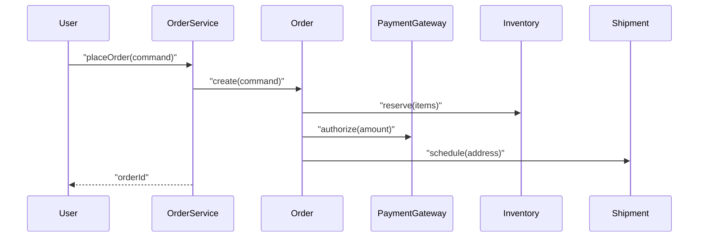

# 01. 객체지향 패러다임의 본질과 철학

객체지향을 “클래스/상속 문법”으로만 배우면, 실무에서 바로 한계에 부딪힙니다. 객체지향의 핵심은 문법이 아니라 **변화하는 현실을 다루기 위한 모델링 전략**입니다.  
이 글은 객체지향을 **객체·책임·협력·메시지** 관점으로 다시 정의하고, 절차적 사고에서 객체지향 사고로 전환하는 출발점을 제공합니다.

## 학습 목표

- 객체지향을 “기능 나열”이 아니라 “협력하는 객체들의 시스템”으로 설명할 수 있다.
- 객체(데이터+행동)를 “상태 덩어리”가 아니라 “책임을 가진 역할”로 바라볼 수 있다.
- 객체지향이 유효한 맥락(변화/복잡성/협업)과 한계를 구분할 수 있다.

## 객체지향을 한 문장으로

객체지향은 **“변화하는 도메인을, 책임을 가진 객체들의 협력으로 표현하는 방식”**입니다.

여기서 핵심 단어는 네 가지입니다.

- **도메인(Domain)**: 우리가 해결하려는 문제 세계(주문/결제/배송, 환자/진료/처방 등)
- **책임(Responsibility)**: 객체가 “반드시 해내야 하는 일”과 “알아야 하는 것”
- **협력(Collaboration)**: 객체들이 책임을 나눠 수행하는 방식(시나리오)
- **메시지(Message)**: 협력의 인터페이스(무엇을 요청할지), 구현은 숨긴다

## 역사적 맥락: 왜 객체지향이 등장했나

객체지향을 이해하려면 “무엇이 불편했는지”부터 봐야 합니다. 객체지향은 갑자기 발명된 문법이 아니라, 다음 문제의식에서 출발했습니다.

- **복잡성의 폭발**: 시스템이 커지면 함수/전역 상태/공유 데이터가 엮이며 변경 비용이 급격히 증가
- **소프트웨어 위기(Software Crisis)**: 일정/품질/비용이 통제되지 않는 대규모 개발의 반복
- **모델과 구현의 단절**: 사람이 이해하는 ‘개념 모델’이 코드로 내려가며 사라지는 문제
- **협업의 어려움**: 팀이 커질수록 공통 언어/경계/계약이 없으면 코드베이스가 서로 침범

이 맥락에서 객체지향은 “세상을 이해하는 방식(모델)”을 “프로그램 구조(코드)”로 더 직접 연결하려는 시도였습니다.

## 기원과 계보: Simula → Smalltalk → 현대 OO

객체지향은 여러 뿌리를 갖지만, 역사적으로 자주 언급되는 흐름은 다음입니다.

- **Simula(1960s)**: 시뮬레이션을 위해 “객체(개체) + 상태 + 행동”을 묶는 구조가 필요했고, 클래스/인스턴스 개념이 정리됨
- **Smalltalk(1970s)**: Alan Kay가 “객체는 메시지를 주고받는 작은 컴퓨터”라는 관점을 강조하며, 시스템을 협력하는 객체들의 네트워크로 봄
- **산업적 확산(1980s~)**: C++/Java 등에서 OO가 보편화되며, 상속/클래스 중심의 해석이 강해짐(장점도 있었지만 오해도 커짐)

핵심은 “클래스 문법”이 아니라, **협력/경계/모델링**의 사고방식이었습니다.

## Alan Kay 관점: 객체는 ‘데이터 구조’가 아니라 ‘행위자’다

Alan Kay가 반복해서 강조한 축은 다음과 같습니다.

- 객체지향의 핵심은 **메시지 패싱**
- 객체는 내부 구현을 숨기고, 외부에는 **작은 인터페이스(계약)**만 노출
- 시스템은 “큰 함수”가 아니라 **협력하는 객체들의 구성**

이 관점을 취하면, 객체는 “필드가 많은 클래스”가 아니라 **역할과 책임을 가진 행위자**에 가깝습니다.

## 철학적 관점: 모델링은 ‘현실 복사’가 아니라 ‘목적 있는 단순화’다

객체지향을 “현실 세계를 그대로 옮긴다”고 오해하면 실패합니다. 좋은 모델은 현실의 모든 디테일이 아니라, 목적에 필요한 요소만 남깁니다.

- **추상화**: 본질을 선택하고, 나머지를 과감히 버린다
- **경계 설정**: 무엇을 시스템 책임으로 포함할지 결정한다
- **언어(용어)**: 팀이 같은 단어를 같은 의미로 쓰게 만든다(유비쿼터스 언어)

즉, 객체지향은 “현실 복제”가 아니라 **의사결정을 내포한 표현**입니다.

## 절차적 사고 vs 객체지향 사고

절차적 사고는 보통 “함수 중심”으로 시작합니다.

- 데이터는 여기저기 흩어져 있고
- 로직은 커다란 함수/서비스에 모이기 쉽습니다

객체지향 사고는 “책임 중심”으로 출발합니다.

- “이 규칙은 누가 책임져야 하지?”를 먼저 묻고
- 책임의 경계를 안정적으로 만들기 위해 캡슐화/추상화를 사용합니다

### 작은 예: 주문 흐름을 보는 관점

주문 시스템을 생각해봅시다.

- 절차적 접근: `placeOrder()` 안에 검증/결제/재고/배송예약이 길게 늘어남
- 객체지향 접근: `Order`, `Payment`, `Inventory`, `Shipment`가 자신의 책임을 수행하도록 협력 구조를 만든다

아래는 “협력”을 시각화한 최소 다이어그램입니다.

## 객체지향의 본질: “정보 은닉”과 “변화의 캡슐화”

객체지향에서 캡슐화는 단순히 `private`을 붙이는 게 아닙니다.

- “어떤 변경”이 자주 일어나는지(변경의 이유)를 식별하고
- 그 변경이 바깥으로 새어나가지 않도록 **경계를 만든다**

즉, **변화를 캡슐화**하면 시스템은 다음을 얻습니다.

- 변경 파급 감소(결합도 감소)
- 이해/테스트 단위가 작아짐
- 팀 협업이 쉬워짐(계약 중심)

## 객체지향의 오해: ‘상속’이 아니라 ‘경계’가 먼저다

산업적으로 객체지향이 확산되며, “상속 트리”가 객체지향의 중심처럼 여겨진 시기가 있었습니다. 하지만 실무에서 문제가 되는 건 보통 상속 자체가 아니라, 다음입니다.

- 경계 없이 커지는 서비스/도메인 객체(책임이 불분명)
- 내부 구현이 바깥으로 노출되는 설계(변경 파급 증가)
- 협력 구조가 불명확해지는 코드(시나리오로 설명 불가)

객체지향을 제대로 쓰려면 먼저 **경계/계약/협력**을 잡고, 상속은 나중에(필요하면) 쓰는 편이 안전합니다.

## 객체지향이 특히 유효한 상황

- **도메인 규칙이 복잡하고 자주 바뀌는** 비즈니스 시스템
- **팀이 커지고, 변경이 병렬로 일어나는** 코드베이스
- **테스트/리팩토링**을 기반으로 지속 개선해야 하는 제품

반대로 다음 상황에서는 객체지향이 “과도한 구조”가 될 수 있습니다.

- 매우 단순한 스크립트/일회성 자동화
- 계산 중심의 순수 함수 파이프라인이 더 자연스러운 문제

## 실무 체크리스트(입문)

- “핵심 규칙”이 어디에 모여 있는가? (흩어져 있으면 도메인 모델이 약함)
- 변경 요구가 들어오면 “어디를 고쳐야 할지” 바로 떠오르는가?
- 객체는 “데이터 보관함”이 아니라 “규칙을 지키는 주체”인가?

## 연습 과제

### 기초(★☆☆)
- 일상 시스템(도서관/카페/배달)을 선택하고, 핵심 개념 10개를 ‘명사’로 뽑아보세요.
- 각 개념에 “책임 2개”를 적어보세요(알아야 하는 것 1, 해야 하는 것 1).

### 중급(★★☆)
- “주문/결제/배송” 흐름을 유스케이스 1개로 쓰고, 협력 객체를 5개로 제한해 설계해보세요.

### 고급(★★★)
- 같은 요구사항을 “절차적(서비스 단일 함수)”과 “객체 협력(도메인 모델)” 두 버전으로 설계하고,
  변경 시나리오(쿠폰 정책 변경/부분취소 추가/배송 분기 추가)를 넣어 파급 범위를 비교하세요.

## 요약

- 객체지향은 문법이 아니라 **모델링과 변경 관리 전략**이다.
- 핵심은 객체의 “상태”가 아니라 **책임과 협력**이다.
- 캡슐화는 `private`이 아니라 **변화를 경계 안에 가두는 것**이다.

## 참고 키워드

- Alan Kay, Message Passing, Information Hiding
- “변화의 이유(Reasons to change)”와 SRP
- “도메인 모델”과 유비쿼터스 언어

## 참고 문헌 및 출처(추천)

- Alan Kay 관련 인터뷰/발표(“OOP is about messaging”로 요약되는 관점)
- Kristen Nygaard, Ole-Johan Dahl: Simula 계보
- David Parnas: Information Hiding(모듈성과 캡슐화의 이론적 기반)

---

## 다음 글

- 다음: [02. 분석과 설계의 핵심 개념](../02_analysis_design_core_concepts/)

