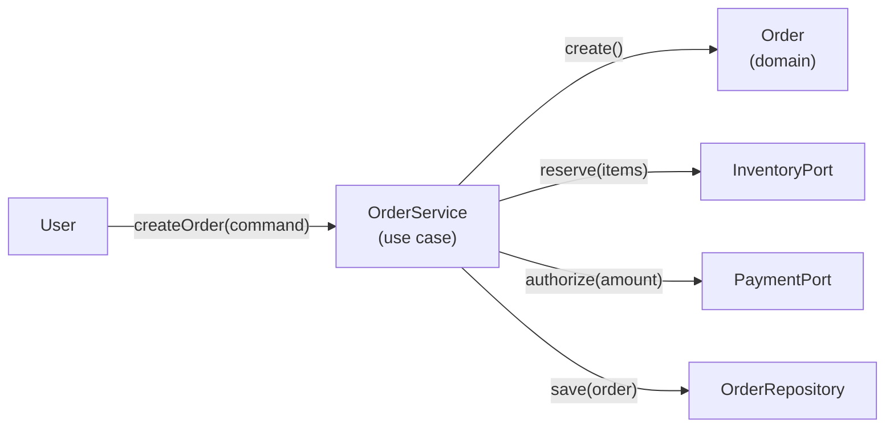

# 02. 분석과 설계의 핵심 개념

프로젝트가 커질수록 “설계가 나쁘다”는 말은 대부분 **분석과 설계의 경계가 흐려진 상태**에서 나옵니다.  
이 글의 목표는 단순합니다. **분석(What)**과 **설계(How)**를 구분하고, 요구사항에서 설계로 넘어갈 때 무엇을 “보존”해야 하는지(추적가능성/일관성/검증가능성)를 실무적으로 정리합니다.

## 학습 목표

- 분석(OOA)과 설계(OOD)의 산출물/관점 차이를 구분할 수 있다.
- 요구사항 → 도메인 모델 → 설계 모델로 이어지는 변환의 최소 단계를 설명할 수 있다.
- “모델이 맞는가?”를 검증하는 기준(시나리오/테스트/리뷰)을 체크리스트로 적용할 수 있다.

## 분석(What)과 설계(How)

### 분석(Analysis): “무엇을 해야 하는가?”

- 문제 영역(Problem Domain)을 이해한다
- 용어를 정리하고(유비쿼터스 언어) 비즈니스 규칙을 드러낸다
- 이해관계자와 소통 가능한 모델을 만든다

### 설계(Design): “어떻게 구현할 것인가?”

- 해결책 영역(Solution Domain)을 구성한다
- 책임을 코드 구조(클래스/모듈/레이어)로 매핑한다
- 기술 제약(트랜잭션, 성능, 배포)을 반영한다

## 역사와 방법론: 분석/설계를 ‘단계’로 보는 관점의 진화

분석과 설계를 구분하려는 시도는 “문서가 많아서”가 아니라, 대규모 개발에서 반복되는 실패를 줄이려는 공학적 반응이었습니다. 시간이 지나며 방법론은 다음처럼 진화했습니다.

- **폭포수적 관점**: 분석(요구 고정) → 설계 → 구현 → 테스트로 내려가는 단방향 흐름을 선호  
  - 장점: 단계/산출물/승인 체계가 명확  
  - 한계: 요구 변화가 현실에서 필연적으로 발생, 후반부에 비용 폭발

- **반복적/점진적 관점**: 분석과 설계가 한 번에 끝나는 것이 아니라, 구현/피드백으로 계속 정제됨  
  - 핵심: “완벽한 분석”보다 “검증 가능한 작은 설계”를 반복

- **OO 방법론의 통합(1990s)**: Booch/Rumbaugh/Jacobson의 UML 표준화 흐름과 함께, 분석/설계 모델을 팀 커뮤니케이션 자산으로 취급

- **애자일 이후**: 문서의 양이 아니라 “의사결정과 검증의 루프”가 중요해짐  
  - 분석/설계는 여전히 존재하지만, 배포/피드백 주기에 맞춰 더 얇고 빠르게 수행

이 관점에서 중요한 결론은 하나입니다.  
분석과 설계는 “서류 작업”이 아니라 **불확실성을 줄이기 위한 사고 도구**입니다.

## 산출물 관점: “무엇이 남아야 하는가”

분석과 설계는 서로 다른 언어를 사용하지만, 다음은 반드시 남아야 합니다.

- **용어/규칙(도메인 의미)**: 이름이 흔들리면 구현이 흔들립니다
- **시나리오(행동)**: 유스케이스/유저스토리의 흐름이 끊기면 설계는 검증 불가
- **제약(품질 속성)**: 성능/보안/가용성 같은 비기능 요구는 설계에서 구조를 바꿉니다

## 예제: “주문 생성” 유스케이스를 분석에서 설계로

### 1) 요구사항(텍스트)

- 사용자는 장바구니 아이템으로 주문을 생성한다
- 재고가 부족하면 주문은 생성되지 않는다
- 결제 승인에 실패하면 예약된 재고는 해제된다

### 2) 분석 모델(도메인 개념)

- `Order`, `OrderLine`, `Product`, `Inventory`, `PaymentAuthorization`
- 규칙: “재고 예약 → 결제 승인 → 주문 확정”

### 3) 설계 모델(구현 구조)

- `OrderService`(유스케이스 조정자)
- `InventoryPort`, `PaymentPort`(외부 시스템과의 경계)
- `OrderRepository`(영속성 경계)

핵심은 “클래스를 많이 만드는 것”이 아니라, **경계(Port/Repo)로 변경을 격리**하고, 유스케이스 흐름이 깨지지 않도록 **추적가능성을 확보**하는 것입니다.

## 추적가능성(Traceability) 최소 단위

실무에서는 “문서가 많다/적다”보다 **요구사항 ↔ 코드가 연결되는가**가 중요합니다.

- 유스케이스(또는 유저스토리) 1개 ↔ 유스케이스 서비스 1개(또는 1개의 엔트리포인트)
- 규칙 1개 ↔ 도메인 객체(또는 정책 객체) 1개
- 외부 의존 1개 ↔ Port/Adapter 1개

## 검증가능성(Verifiability): 모델을 ‘테스트 가능한 형태’로

분석 모델이 설계로 넘어가며 가장 자주 잃는 것은 “검증 기준”입니다.  
아래 3가지는 설계 단계에서 반드시 붙여두세요.

- **시나리오 테스트**: 기본/대안/예외 흐름을 테스트로 고정
- **불변조건**: 주문의 상태 전이, 금액 합계 등 깨지면 안 되는 규칙
- **경계 테스트**: Port/Adapter가 실패할 때 롤백/보상 동작이 맞는지

## 실무 체크리스트

- 분석 모델의 용어가 코드에서도 그대로 쓰이는가?
- 유스케이스 “대안 흐름(실패/취소/재시도)”가 설계에 반영되었는가?
- 비기능 요구(성능/보안/감사로그)가 구조(레이어/경계)를 바꿨는가?
- “도메인 규칙”이 서비스/컨트롤러에 새어나오지 않았는가?

## 연습 과제

### 기초(★☆☆)
- 유스케이스 3개를 골라 “기본 흐름/대안 흐름/예외 흐름”을 각각 5줄로 작성해보세요.

### 중급(★★☆)
- 위 “주문 생성” 예제에서 `PaymentPort` 실패 시 보상 로직을 설계해보세요(재고 해제/상태 기록).

### 고급(★★★)
- 비기능 요구(예: “주문 생성 P95 200ms”, “결제 요청 감사로그”)를 추가하고,
  설계 모델에서 무엇을 바꿔야 하는지(캐시/비동기/로그 아키텍처)를 제안해보세요.

## 요약

- 분석은 “무엇”, 설계는 “어떻게”다.
- 변환 과정에서 보존해야 할 것은 “용어/시나리오/제약”이다.
- 좋은 설계는 추적가능성과 검증가능성을 의식적으로 만든다.

## 참고 문헌 및 출처(추천)

- Craig Larman: Applying UML and Patterns(유스케이스/분석/설계 연결 관점)
- UML 표준화 흐름(Booch, Rumbaugh, Jacobson 계보)
- “Architecture Decision Record(ADR)” 실천(설계 의사결정을 남기는 현대적 문서화 방식)

---

## 다음 글

- 다음: [03. 객체지향 4대 원칙의 심층 분석](../03_oop_four_principles_deep_analysis/)

