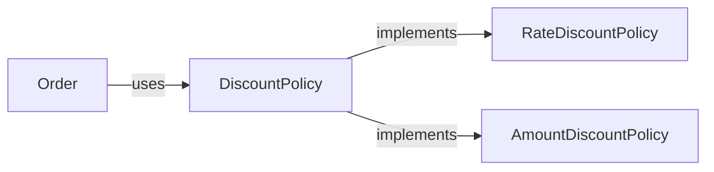

# 03. 객체지향 4대 원칙 심층 분석

객체지향 4대 원칙은 “지켜야 하는 규칙 목록”이 아니라 **변화의 비용을 줄이는 설계 선택지**입니다.  
이 글은 각 원칙을 실무 관점으로 재정의하고, **언제 쓰고 언제 피해야 하는지**를 기준/신호/안티패턴으로 정리합니다.

## 학습 목표

- 4대 원칙을 “문법”이 아니라 “트레이드오프가 있는 도구”로 설명할 수 있다.
- 과도한 상속/과도한 추상화 같은 남용 사례를 식별하고 개선 방향을 제안할 수 있다.
- 다형성을 통해 “확장 포인트”를 설계하는 최소 패턴(Strategy)을 적용할 수 있다.

## 역사적 배경: 4대 원칙은 ‘언어 기능’이 아니라 ‘복잡성 관리’에서 왔다

4대 원칙은 보통 교재에서 한 묶음으로 소개되지만, 실제로는 서로 다른 문제의식에서 출발해 함께 사용되며 “객체지향적 구조”를 형성합니다.

- **추상화/캡슐화**: 복잡한 내부를 숨기고 안정적인 계약을 만들려는 시도  
  - 특히 “정보 은닉(Information Hiding)”은 모듈성의 핵심으로 자주 언급됩니다.

- **상속/다형성**: “유형의 변형”을 받아들이고 확장을 가능하게 하려는 시도  
  - 다형성은 단순히 오버라이드가 아니라, “동일한 메시지에 대한 다양한 구현”을 허용하는 구조입니다.

객체지향을 이해하는 데 중요한 질문은 다음입니다.  
“이 원칙들이 실제로 줄이는 비용은 무엇이며, 새로 만드는 비용은 무엇인가?”

## 1) 추상화(Abstraction): 핵심을 남기고, 나머지는 지운다

추상화는 “복잡한 걸 감추는 것”이 아니라, **핵심을 선택하는 행위**입니다.

- 좋은 추상화: 변화하는 부분을 감추고, 안정적인 계약을 드러낸다
- 나쁜 추상화: 지금 필요 없는 미래를 상상해 계층을 늘린다(YAGNI 위반)

### 신호

- 같은 유형의 분기가 3곳 이상 반복된다(결제수단/배송정책/할인정책)
- “기능 추가”가 기존 코드 수정(분기 추가)을 유발한다

## 2) 캡슐화(Encapsulation): 상태를 숨겨 “규칙”을 지킨다

캡슐화는 `private`이 아니라 **불변조건을 지키게 하는 구조**입니다.

- 상태를 외부에서 직접 바꾸지 못하게 하고
- 변경은 “의도가 드러나는 메서드”로만 하게 만든다

### 나쁜 예(상태 직접 변경)

```python
# 나쁜 설계: 누구나 total을 마음대로 바꿀 수 있다
class Order:
    def __init__(self):
        self.total = 0
```

### 개선(의도가 드러나는 행위로 변경)

```python
class Order:
    def __init__(self):
        self._total = 0

    def add_line(self, price: int, qty: int) -> None:
        if qty <= 0:
            raise ValueError("qty must be positive")
        self._total += price * qty
```

## 3) 상속(Inheritance): “is-a”를 모델링하되, 비용을 안다

상속은 강력하지만 **결합도를 급격히 올릴 수 있는 도구**입니다.

- 개념적 상속: 분류 체계(도메인 의미)가 명확한 경우
- 구현 상속: 코드 재사용 목적이면 위험(부모 변경의 파급, 오버라이드 규칙)

### 실무 규칙(보수적 권장)

- 기본값은 **조합(Composition)**: 전략/구성요소를 주입한다
- 상속은 “행위 계약”이 명확하고 LSP를 만족할 때만

## 4) 다형성(Polymorphism): 확장 포인트를 “분기”에서 “객체”로 옮긴다

다형성의 실전 가치는 `if/else`를 줄이는 게 아니라, **확장 시 수정 범위를 줄이는 것**입니다.

### 예: 할인 정책(분기) → 전략(다형성)



#### 간단 코드 스케치

```python
from abc import ABC, abstractmethod

class DiscountPolicy(ABC):
    @abstractmethod
    def discount(self, total: int) -> int:
        raise NotImplementedError

class RateDiscountPolicy(DiscountPolicy):
    def __init__(self, rate: float):
        self.rate = rate
    def discount(self, total: int) -> int:
        return int(total * self.rate)

class AmountDiscountPolicy(DiscountPolicy):
    def __init__(self, amount: int):
        self.amount = amount
    def discount(self, total: int) -> int:
        return self.amount
```

## 원칙 남용(안티패턴) 빠른 진단

- **과도한 추상화**: 인터페이스/추상클래스만 잔뜩 있고 구현은 1개뿐
- **상속 트리 폭발**: 요구사항 추가가 “새 서브클래스”를 강제
- **빈약한 도메인 모델**: 규칙이 객체가 아니라 서비스/컨트롤러에 있음

## 실무 체크리스트

- 변경이 잦은 정책은 분기문이 아니라 “정책 객체”로 캡슐화했는가?
- 상태 변경이 메서드로만 일어나며 불변조건을 강제하는가?
- 상속은 “개념”을 표현하는가, 아니면 단순 코드 재사용인가?
- 새로운 기능 추가가 기존 코드 수정 없이 가능하도록 확장 포인트가 있는가?

## 연습 과제

### 기초(★☆☆)
- 현재 프로젝트(또는 샘플 코드)에서 “분기 3개 이상 반복”되는 지점을 찾아, 정책 객체로 분리해보세요.

### 중급(★★☆)
- 상속으로 구현된 기능을 조합(구성 요소 주입)으로 바꿔보세요. 무엇이 쉬워지고 무엇이 어려워졌나요?

### 고급(★★★)
- “할인 정책 + 배송 정책”을 동시에 확장 가능한 구조로 만들고, 테스트 케이스로 확장성을 검증해보세요.

## 요약

- 추상화: 핵심 계약을 선택한다
- 캡슐화: 규칙을 지키게 한다
- 상속: 강력하지만 비용을 안다
- 다형성: 확장 포인트를 분기에서 객체로 옮긴다

## 참고 문헌 및 출처(추천)

- David Parnas: Information Hiding(캡슐화/모듈성의 핵심 논지)
- Barbara Liskov: Substitution Principle(치환 가능성의 철학)
- “Abstract Data Type” 논의(추상화/인터페이스-구현 분리의 이론적 기반)

---

## 다음 글

- 다음: [04. SOLID 원칙과 실무 적용](../04_solid_principles_practical_application/)

