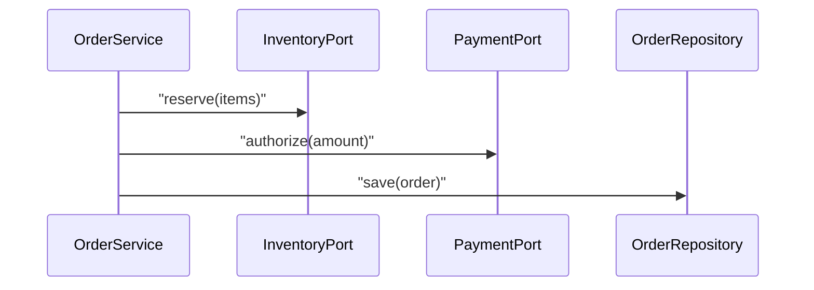
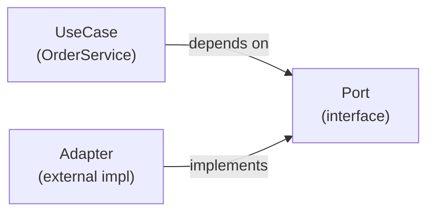

# 04. SOLID 원칙 실무 적용

SOLID를 “암기 과목”으로 끝내면, 실무에서는 두 가지로 망합니다.

- 규칙을 과도하게 적용해 **필요 이상으로 복잡한 구조**를 만들거나
- 반대로 “현실은 바쁘다”를 이유로 **원칙을 아예 무시**해 기술 부채를 키우거나

이 글은 SOLID를 **변경 비용을 낮추기 위한 판단 기준**으로 재해석하고, 점진적으로 적용하는 방법을 예제로 보여줍니다.

## 학습 목표

- 각 원칙을 “언제 이득이고 언제 비용인지”를 설명할 수 있다.
- 기존 코드에서 SOLID 위반 신호를 찾아 “작은 리팩토링”으로 개선할 수 있다.
- DIP/ISP를 이용해 테스트 가능한 경계를 만들 수 있다.

## 역사적 맥락: SOLID는 ‘룰’이 아니라 ‘모듈성의 요약’이다

SOLID는 종종 “5개 규칙”로만 소개되지만, 실제로는 더 오래된 공학적 문제의식(모듈성/변경 격리/계약)을 요약한 형태에 가깝습니다.

- 대규모 시스템에서 **변경의 파급**이 커질수록, “구조적 안정성”이 핵심 품질이 됨
- 그 안정성을 위해 필요한 것이
  - 책임의 경계(SRP)
  - 변경 지점의 추상화(OCP)
  - 계약의 일관성(LSP)
  - 클라이언트 관점의 인터페이스(ISP)
  - 의존성 방향의 역전(DIP)

즉 SOLID는 “정답 공식”이 아니라, **변경을 통제하기 위한 구조적 언어**입니다.

## 철학적 해석: ‘좋은 설계’는 무엇을 최적화하는가

SOLID를 적용할 때 흔히 놓치는 점은 “무엇을 최적화하는가”입니다.

- 대부분의 비즈니스 소프트웨어는 실행 시간보다 **변경 시간**이 더 비싸다
- 설계 원칙은 CPU 사이클이 아니라, **사람의 이해/협업/검증 비용**을 줄이려는 시도다
- 따라서 SOLID의 비용(추상화/계층/분리)이 과하면, 원칙 자체가 목표를 해친다

이 관점이 있어야 “원칙을 쓰는 타이밍/강도”를 결정할 수 있습니다.

## 예제 도메인: 주문 생성(재고/결제/배송)

우리는 02~03에서 봤던 “주문 생성” 흐름을 계속 씁니다.



## SRP: “변경의 이유”를 기준으로 나눈다

SRP의 요점은 “클래스당 책임 1개”가 아니라 **변경의 이유를 1개로 유지**하는 것입니다.

### 위반 신호

- 주문 서비스가 “검증/결제/재고/로그/메일”까지 모두 한다
- 작은 정책 변경(쿠폰 계산)에도 서비스가 계속 수정된다

### 개선 방향

- “정책”은 정책 객체로 분리(할인 정책, 배송 정책)
- “외부 연동”은 Port/Adapter로 분리(결제 게이트웨이, 재고 시스템)

## OCP: 확장은 열고 수정은 닫는다(=분기문을 줄인다)

OCP는 “상속을 쓰라”가 아니라 **변경이 발생하는 지점을 추상화**하라는 말입니다.

### 위반 신호

- 결제 수단 추가가 `if paymentType == ...` 분기 추가를 강제

### 개선 예: 결제 전략

```python
from abc import ABC, abstractmethod

class PaymentStrategy(ABC):
    @abstractmethod
    def authorize(self, amount: int) -> str:
        raise NotImplementedError

class CardPayment(PaymentStrategy):
    def authorize(self, amount: int) -> str:
        return "auth_card"

class BankTransfer(PaymentStrategy):
    def authorize(self, amount: int) -> str:
        return "auth_bank"
```

## LSP: “상속 가능”이 아니라 “치환 가능”이어야 한다

LSP는 상속을 쓰는 순간 필수 체크입니다.

### 위반 신호

- 서브클래스가 예외를 더 자주 던진다
- 부모 계약의 의미를 바꾼다(예: `withdraw()`가 잔액을 늘린다)

### 실무 팁

상속이 애매하면, 조합/전략/위임으로 바꾸는 것이 보통 더 안전합니다.

## ISP: 클라이언트가 쓰지 않는 메서드에 의존하지 않게

ISP는 “인터페이스를 잘게 쪼개라”가 아니라, **클라이언트 기준으로 분리**하라는 말입니다.

### 위반 신호

- 결제 포트 인터페이스에 “환불/정산/통계”가 한꺼번에 들어 있다
- 테스트 더블 작성이 어려워진다

### 개선 방향

- `PaymentAuthorizePort`, `PaymentRefundPort`처럼 목적 중심으로 분리

## DIP: 구체가 아니라 추상에 의존한다

DIP는 OOAD에서 “구조”를 바꾸는 원칙입니다.



이 구조가 되면:

- 유스케이스는 외부 SDK에 휘둘리지 않고
- 테스트에서 Port를 쉽게 대체할 수 있습니다

## 점진적 리팩토링 절차(현실 버전)

1. **행동 고정**: 현재 동작을 테스트(또는 승인된 로그/샘플 데이터)로 고정
2. **분기 식별**: 자주 바뀌는 분기/정책을 찾는다
3. **정책 추출**: Strategy/Policy 객체로 추출한다(OCP)
4. **경계 분리**: 외부 의존을 Port로 감싼다(DIP/ISP)
5. **책임 정리**: 유스케이스는 조정, 도메인은 규칙(SRP)

## 코드리뷰 체크리스트(SOLID)

- SRP: 이 클래스/모듈의 변경 이유는 1개인가?
- OCP: 새로운 타입/정책 추가가 기존 코드 수정(분기)을 요구하는가?
- LSP: 상속/구현체가 계약(사전/사후조건)을 지키는가?
- ISP: 인터페이스가 클라이언트 관점으로 분리돼 테스트가 쉬운가?
- DIP: 핵심 정책/유스케이스가 외부 SDK/DB에 직접 의존하는가?

## 연습 과제

### 기초(★☆☆)
- 현재 코드에서 “if/else 분기 5개 이상”인 함수를 찾아 정책 객체로 분리해보세요.

### 중급(★★☆)
- 결제 연동 코드를 Port/Adapter로 감싸고, 단위 테스트에서 Fake 구현을 붙여보세요.

### 고급(★★★)
- 레거시 서비스(대형 클래스) 하나를 선택해, 위 “점진 절차”를 3번 반복하며 구조를 개선해보세요.

## 요약

- SOLID는 “정답”이 아니라 변경 비용을 낮추는 휴리스틱이다.
- 현실에서는 “점진적 적용 + 테스트로 행동 고정”이 핵심이다.
- DIP/ISP를 도입하면 테스트 가능성과 구조 안정성이 크게 올라간다.

## 참고 문헌 및 출처(추천)

- Robert C. Martin: SOLID 계열 원칙 소개/정리(클린 코드/클린 아키텍처로 이어짐)
- David Parnas: 모듈성/정보 은닉(원칙들의 공통 기반으로 이해에 도움)
- Craig Larman: 패턴과 원칙을 유스케이스/모델링과 연결하는 관점

---

## 다음 글

- 다음: [05. 요구사항 분석과 도메인 모델링](../05_requirement_analysis_domain_modeling/)

