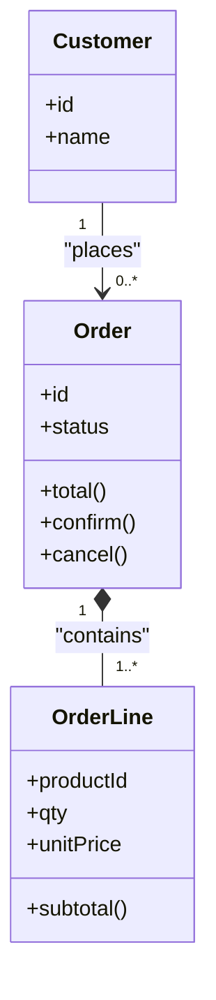
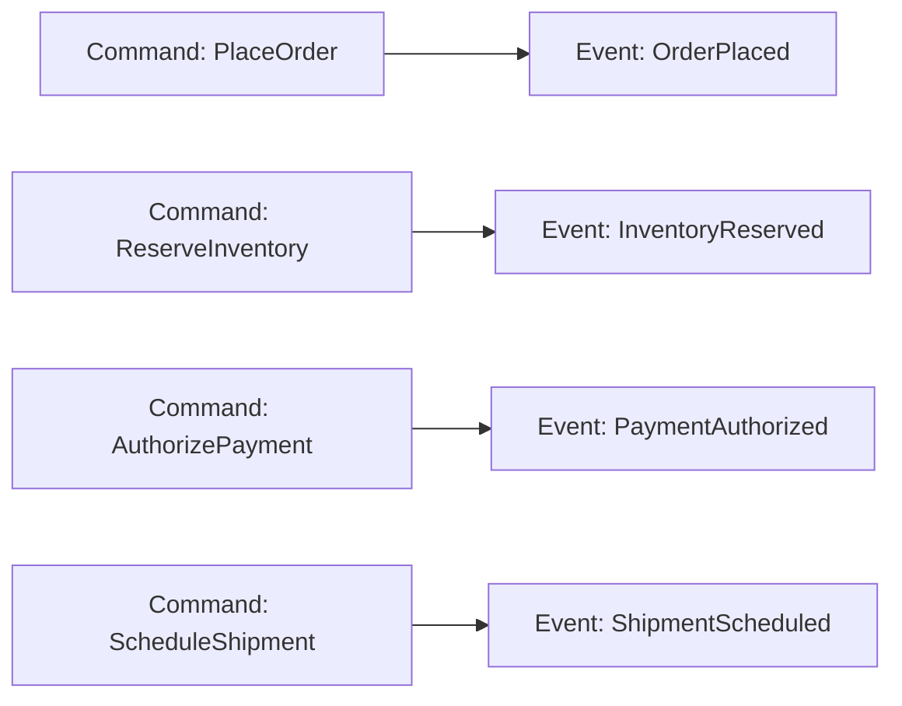

# 05. 요구사항 분석과 도메인 모델링

요구사항이 흐릿하면, 설계는 “멋진 구조”처럼 보여도 결국 **변경에 취약한 우연의 산물**이 됩니다.  
이 챕터는 요구사항을 수집/정제하고, 도메인 모델로 변환하는 실무 프로세스를 정리합니다.

## 학습 목표

- 기능/비기능 요구사항을 분리해 정리할 수 있다.
- 유비쿼터스 언어(용어집)를 만들고, 팀이 같은 단어를 같은 의미로 쓰게 할 수 있다.
- 개념 클래스/관계/규칙을 도메인 모델로 표현하고 시나리오로 검증할 수 있다.

## 1) 요구사항 수집: “말”을 “사실”로

### 대표 기법

- **인터뷰**: “왜 그렇게 해야 하죠?”를 끝까지 파고든다
- **워크숍**: 도메인 전문가/개발자/운영이 함께 모델을 만든다
- **문서 분석**: 계약서/정책서/운영 매뉴얼/기존 DB 스키마
- **업무 관찰**: 실제 화면/엑셀/수기 업무에서 규칙이 튀어나온다

### 산출물(최소)

- 요구사항 목록(기능/비기능 구분)
- 용어집(유비쿼터스 언어)
- 대표 시나리오 3~5개(성공/실패/예외 포함)

## 2) 우선순위: MoSCoW로 “범위”를 고정

요구사항은 무한하지만, 일정은 유한합니다.

- Must / Should / Could / Won’t(이번 릴리즈 제외)
- “Won’t”을 명확히 써야 프로젝트가 산다

## 3) 도메인 모델링: 명사(개념)만 뽑는 게 아니다

도메인 모델은 “명사 나열”이 아니라,

- 개념들 간 **관계**
- 시스템이 지켜야 하는 **규칙**

까지 담아야 합니다.

### 예: 주문 도메인(초기 모델)

여기서 중요한 질문:

- `Order.status`는 어떤 값이 있으며, 어떤 이벤트로 바뀌나?
- “부분 취소”가 들어오면 모델이 어떻게 변하나?

## 4) CRC 카드: 책임과 협력을 빠르게 잡는 도구

CRC(Class-Responsibility-Collaborator)는 “정답 UML”이 아니라,
팀이 빠르게 합의하는 프로토타이핑 도구입니다.

- 클래스: Order
- 책임: 주문 합계 계산, 상태 전이 규칙 보장
- 협력자: Inventory(재고), Payment(결제), Shipment(배송)

## 5) 이벤트 스토밍: 사건(이벤트)으로 규칙을 드러낸다

이벤트 스토밍은 “흐름”을 빠르게 정렬하는 데 특히 강합니다.

- 도메인 이벤트: OrderPlaced, InventoryReserved, PaymentAuthorized, ShipmentScheduled
- 커맨드: PlaceOrder, ReserveInventory, AuthorizePayment, ScheduleShipment

## 6) 검증: 시나리오로 모델을 깨본다

모델 검증은 “도면 리뷰”가 아니라 “사건 흐름”으로 합니다.

- 성공 시나리오 1개
- 실패 시나리오 2개(재고 부족, 결제 실패)
- 예외 시나리오 1개(부분 취소/주소 변경 등)

## 실무 체크리스트

- 용어집이 있고, PR/이슈/코드에서 동일하게 쓰이는가?
- 비기능 요구(성능/감사로그/보안)가 문서에만 있고 설계에 반영되지 않은 건 아닌가?
- 대표 시나리오가 도메인 전문가에게 “맞다” 승인 받았는가?
- 도메인 규칙이 “어디에 살아야 하는지”(도메인/정책/유스케이스) 합의했는가?

## 연습 과제

### 기초(★☆☆)
- “주문 생성” 요구사항 10줄을 쓰고 기능/비기능으로 분류해보세요.

### 중급(★★☆)
- 이벤트 스토밍으로 이벤트 10개를 뽑고, 커맨드/정책/외부시스템을 매핑해보세요.

### 고급(★★★)
- “부분 취소” 요구를 추가했을 때 모델이 어떻게 바뀌는지,
  클래스/상태/이벤트 관점에서 각각 갱신해보세요.

## 요약

- 요구사항의 품질이 설계의 품질을 결정한다.
- 도메인 모델은 개념+관계+규칙이다.
- CRC/이벤트 스토밍/시나리오 검증으로 빠르게 정제한다.

---

## 다음 글

- 다음: [06. 유스케이스 기반 분석 기법](../06_usecase_based_analysis_techniques/)

