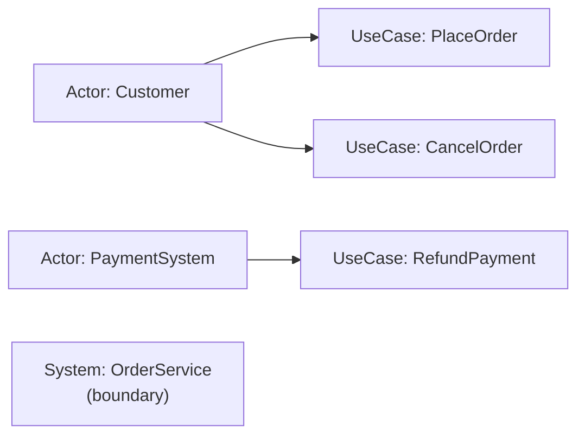
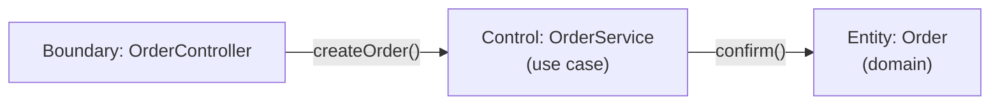
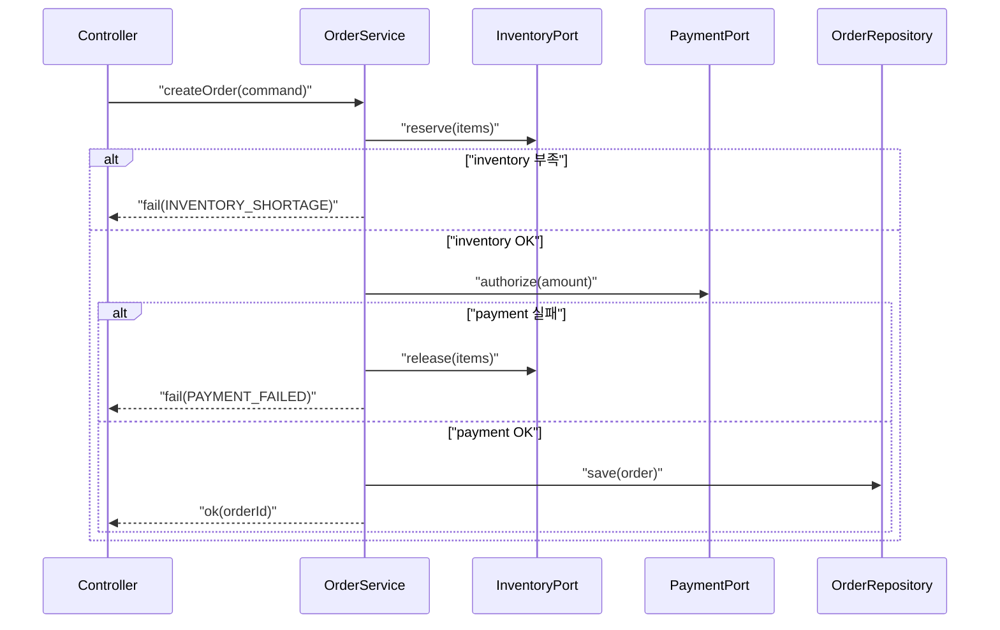

# 06. 유스케이스 기반 분석 기법

유스케이스는 “화면 목록”이나 “기능 목록”이 아닙니다.  
유스케이스는 **사용자 목표를 달성하는 시나리오**이며, 분석과 설계를 연결해주는 강력한 접착제입니다.

## 학습 목표

- 액터/시스템 경계/유스케이스를 명확히 구분할 수 있다.
- 기본/대안/예외 흐름을 구조화해 유스케이스 명세서를 작성할 수 있다.
- 유스케이스를 시퀀스 다이어그램과 설계 구조로 자연스럽게 연결할 수 있다.

## 1) 액터와 시스템 경계

- **액터**: 시스템 밖에서 목표를 가지고 상호작용하는 역할(사람/외부시스템)
- **경계**: “우리 시스템이 책임지는 범위”를 문장으로 고정

경계가 흔들리면 유스케이스도 흔들립니다.

## 2) 유스케이스 다이어그램(최소 버전)

## 3) 유스케이스 명세서 템플릿(실무형)

### 유스케이스: 주문 생성(PlaceOrder)

- **목표**: 사용자가 장바구니로 주문을 생성하고 결제를 승인받는다
- **액터**: Customer(주), PaymentSystem(보조), InventorySystem(보조)
- **사전조건**: 장바구니에 아이템이 있고 배송지/결제수단이 유효
- **사후조건(성공)**: 주문이 `CONFIRMED`, 재고 예약 완료, 결제 승인 기록
- **사후조건(실패)**: 주문이 생성되지 않거나 `FAILED`, 재고/결제 상태가 일관됨

#### 기본 흐름(Main Flow)

1. 사용자가 “주문하기”를 누른다  
2. 시스템은 재고를 예약한다  
3. 시스템은 결제를 승인 요청한다  
4. 시스템은 주문을 확정하고 주문번호를 반환한다  

#### 대안 흐름(Alternate Flow)

- A1(재고 부족): 2단계에서 재고가 부족하면 주문 생성이 중단되고 사용자에게 안내한다  
- A2(결제 실패): 3단계에서 결제가 실패하면 예약된 재고를 해제하고 실패 사유를 기록한다  

#### 품질 속성(비기능 요구)

- P95 200ms(내부 처리), 외부 결제 지연 시 타임아웃/재시도 정책
- 감사로그: 결제 요청/응답의 추적 가능한 로그

## 4) 유스케이스 → 설계로: B-C-E(경계/제어/엔티티) 힌트

유스케이스를 설계로 옮길 때 흔히 도움이 되는 분해 관점:

- **Boundary**: UI/API(요청을 받는 경계)
- **Control**: 유스케이스 조정자(흐름을 진행)
- **Entity**: 규칙을 가진 도메인 객체(상태/불변조건)

## 5) 시퀀스 다이어그램으로 검증하기

유스케이스는 시퀀스로 “진짜로 흘러갈 수 있는지” 확인합니다.

## 실무 체크리스트

- 유스케이스가 “사용자 목표”로 이름 지어졌는가? (CreateOrder, PlaceOrder 등)
- 기본 흐름이 10단계를 넘는다면 분해/추상화가 필요한가?
- 대안/예외 흐름이 설계(보상/트랜잭션/상태)에 반영되었는가?
- 비기능 요구가 유스케이스에 명시되어 구조 변화가 필요한지 검토했는가?

## 연습 과제

### 기초(★☆☆)
- 현재 서비스의 핵심 기능 3개를 골라 유스케이스 템플릿으로 작성해보세요.

### 중급(★★☆)
- “주문 생성” 유스케이스에 “부분 취소”를 추가하고, 대안 흐름과 사후조건을 갱신해보세요.

### 고급(★★★)
- 유스케이스 2개(주문 생성, 주문 취소)가 공유하는 정책/엔티티를 정리하고,
  중복 없이 설계 구조로 연결해보세요.

## 요약

- 유스케이스는 기능 목록이 아니라 목표 중심 시나리오다.
- 대안/예외 흐름이 설계 품질을 좌우한다.
- B-C-E 관점과 시퀀스 다이어그램으로 검증하며 설계로 연결한다.

---

## 다음 글

- 다음: [07. 클래스 다이어그램과 관계 모델링](../07_class_diagram_relationship_modeling/)

