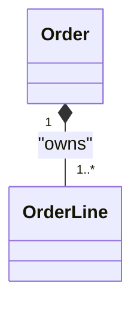
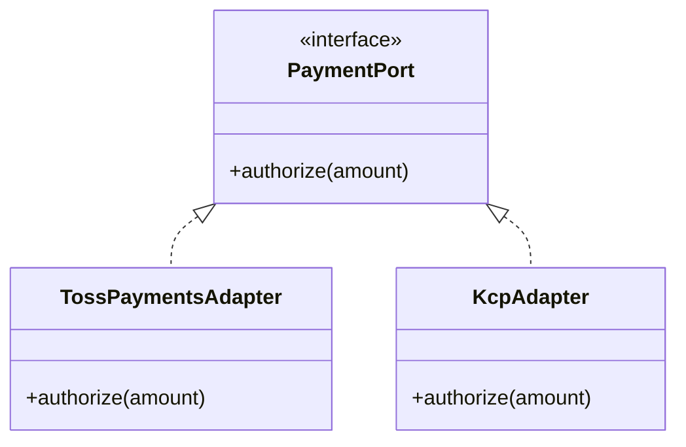

# 07. 클래스 다이어그램과 관계 모델링

클래스 다이어그램은 “클래스를 예쁘게 그리는 문서”가 아니라, 팀이 합의한 모델을 **관계/경계/의존성** 관점에서 검증하는 도구입니다.  
특히 연관/합성/일반화의 오해를 바로잡는 것만으로도 유지보수성이 크게 좋아집니다.

## 학습 목표

- 연관/집합/합성의 차이를 “생명주기” 관점에서 구분할 수 있다.
- 다중성/방향/의존성 방향을 포함해 모델을 검증할 수 있다.
- 분석 모델(개념)과 설계 모델(구현)의 차이를 인지하고 자연스럽게 연결할 수 있다.

## 1) 관계 모델링의 핵심 질문

- 이 관계는 **지식(참조)** 인가, **소유(생명주기)** 인가?
- 누가 누구를 “알아야” 하는가(의존 방향)?
- 컬렉션/다중성이 비즈니스 규칙을 반영하는가?

## 2) 연관(Association): “알고 있다”

연관은 가장 약한 관계입니다. 보통 “참조”로 구현됩니다.

- 단방향 연관을 기본으로 권장(불필요한 양방향은 결합도를 키움)
- 양방향이 필요하면 “조회 요구”가 정말 강한지 먼저 검토

## 3) 집합(Aggregation) vs 합성(Composition)

많이 헷갈리는 지점입니다.

- **집합**: 부분이 전체 없이도 살 수 있다(생명주기 독립)
- **합성**: 부분이 전체에 소유된다(전체가 사라지면 부분도 사라짐)

### 예: Order와 OrderLine은 합성에 가깝다

반대로 “Customer와 Address”는 도메인에 따라 다릅니다.

- 고객이 주소를 여러 개 갖고, 주소가 고객에 종속이면 합성
- 주소가 별도 주소록 엔티티로 공유되면 집합/연관

## 4) 일반화(Generalization)와 실현(Realization)

### 일반화(상속)는 개념을 표현할 때만

상속은 강력하지만 결합이 강합니다.  
“코드 재사용”만 목적이면 조합이 보통 더 안전합니다.

### 실현(인터페이스 구현)은 확장 포인트를 만든다

## 5) 다중성(Multiplicity)은 규칙이다

다중성은 단순한 자료구조 선택이 아니라 **비즈니스 규칙**입니다.

- “주문은 최소 1개의 주문라인을 가진다”는 규칙이면 `1..*`
- “배송은 주문당 0..1개”인지 “분할배송이라 0..*”인지가 모델을 바꿉니다

## 6) 분석 모델 vs 설계 모델: 언제 무엇을 그릴까

- 분석(OOA): 도메인 개념 중심, 기술 세부사항 배제
- 설계(OOD): 구현 책임/경계/의존성 포함(Port/Repo, 레이어)

실무에서는 1장의 도메인 모델을 만들고, 그 위에 설계 요소를 얇게 덧씌우는 방식이 잘 맞습니다.

## 실무 체크리스트

- 합성 관계가 남발되어 “모든 것이 소유됨”으로 그려지지 않았는가?
- 양방향 연관이 정말 필요한가? 조회 요구를 유스케이스로 검증했는가?
- 다중성이 규칙을 반영하는가, 아니면 “그냥 리스트니까”로 넣었는가?
- 상속이 코드 재사용 목적이 아닌 “개념 계약”을 표현하는가?

## 연습 과제

### 기초(★☆☆)
- 도메인(주문/결제/배송)에서 개념 10개를 뽑고 관계(연관/합성)를 구분해 그려보세요.

### 중급(★★☆)
- “분할배송” 요구를 추가하고, 다중성/관계가 어떻게 바뀌는지 갱신해보세요.

### 고급(★★★)
- 결제 어댑터를 2개 이상 추가 가능한 구조로 모델링하고,
  인터페이스 분리(ISP) 관점에서 Port를 분해해보세요.

## 요약

- 클래스 다이어그램의 핵심은 관계/경계/의존성 검증이다.
- 합성은 소유/생명주기, 연관은 참조다.
- 다중성은 구현이 아니라 규칙이다.

---

## 다음 글

- 다음: [08. 동적 모델링: 시퀀스와 상태 다이어그램](../08_dynamic_modeling_sequence_state/)

