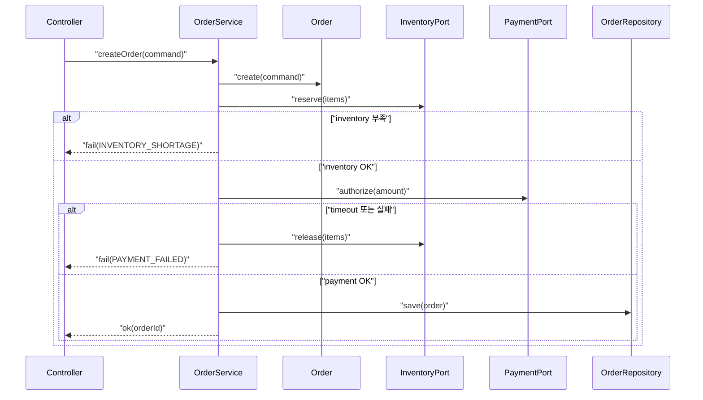
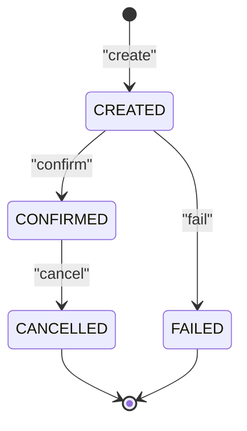

# 08. 동적 모델링: 시퀀스와 상태 다이어그램

클래스 다이어그램이 “정답”처럼 보여도, 유스케이스가 실제로 흘러갈 때 깨지는 경우가 많습니다.  
동적 모델링은 바로 이 지점을 잡아냅니다. **상호작용(시퀀스)**과 **상태 전이(상태 머신)**로 모델을 검증해봅시다.

## 학습 목표

- 시퀀스 다이어그램으로 기본/대안/예외 흐름을 검증할 수 있다.
- 상태 다이어그램으로 객체의 상태 전이와 불변조건을 고정할 수 있다.
- 외부 시스템 실패(타임아웃/재시도)와 보상 흐름을 모델에 반영할 수 있다.

## 1) 시퀀스 다이어그램: “협력”을 검증한다

시퀀스는 “누가 누구에게 무엇을 요청하는지”를 확인하는 도구입니다.

### 주문 생성 시퀀스(예외 포함)

### 시퀀스 리뷰 포인트

- 유스케이스의 대안/예외 흐름이 누락되지 않았는가?
- 외부 의존 실패 시 “보상”이 존재하는가?
- 멱등성/재시도/타임아웃 정책이 필요한가?

## 2) 상태 다이어그램: “규칙”을 고정한다

상태 머신은 객체의 생명주기와 규칙을 고정하는 데 최적입니다.  
주문은 대표적인 상태 머신입니다.

### 상태 모델을 쓰면 좋은 때

- 상태에 따라 가능한 행동이 달라진다(예: CONFIRMED만 취소 가능)
- 예외/실패/보상 처리가 중요하다
- 운영/고객지원에서 상태를 기준으로 문제를 파악한다

## 3) 동적 모델과 정적 모델의 연결

좋은 동적 모델은 다음을 강제합니다.

- 클래스 다이어그램의 메서드(행동)와 시퀀스 메시지가 일치
- 상태 전이가 코드에서 강제(불가능한 전이 차단)
- 테스트 케이스가 자연스럽게 도출(상태 전이 테스트, 예외 흐름 테스트)

## 4) 실무 팁: 실패/지연을 먼저 모델링하라

성공 흐름만 그리면 시스템은 배포 후에 깨집니다.  
아래 항목을 최소 1번씩 시퀀스/상태에 반영하세요.

- 타임아웃
- 재시도(재시도 가능한지/멱등성)
- 부분 실패(재고 성공, 결제 실패)
- 보상(재고 해제, 상태 기록)

## 실무 체크리스트

- 예외 흐름이 시퀀스에 표현되어 있는가?
- 외부 의존 실패 시 “보상”이 명시되어 있는가?
- 상태 전이 규칙이 문서/코드/테스트에서 일관되는가?
- 운영 관점에서 상태가 “관측 가능”(로그/메트릭)한가?

## 연습 과제

### 기초(★☆☆)
- “주문 취소” 유스케이스를 시퀀스로 작성하고, 어떤 객체가 어떤 책임을 갖는지 표시해보세요.

### 중급(★★☆)
- 결제 타임아웃 정책(재시도 2회)을 추가하고, 멱등성 키 설계를 포함해 시퀀스를 갱신해보세요.

### 고급(★★★)
- 분산 환경에서 “주문 생성”을 사가(Saga)로 모델링하고,
  보상 이벤트를 상태 머신에 반영해보세요.

## 요약

- 시퀀스는 협력과 예외 흐름을 검증한다.
- 상태 머신은 규칙과 생명주기를 고정한다.
- 성공보다 실패/지연을 먼저 모델링하라.

---

## 다음 글

- 다음: [09. 설계 원칙과 패턴 적용 전략](../09_design_principles_pattern_strategy/)

