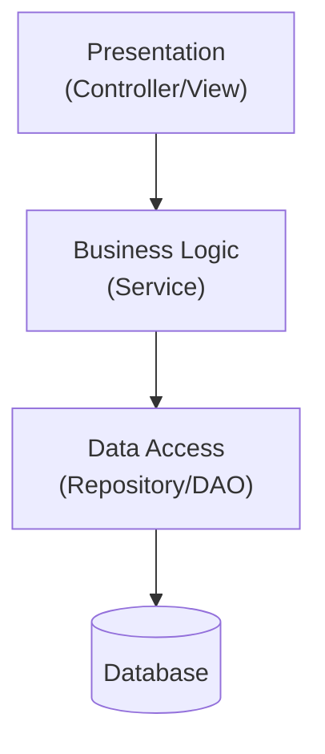
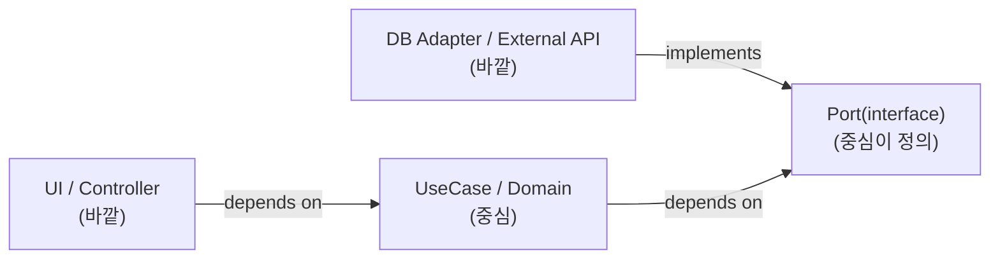

# 10. 아키텍처 설계와 레이어 분리

09장에서 패턴 선택 기준을 정리했다면, 10장은 그 패턴들이 배치되는 **더 큰 그림**, 즉 아키텍처를 다룹니다. 레이어(계층)를 나누는 일은 흔히 “컨트롤러/서비스/리포지터리 폴더를 만드는 작업”으로 오해되지만, 실제로 중요한 것은 폴더 구조가 아니라 **의존성이 어느 방향으로 흐르는가**입니다.

## 학습 목표

- 전통적 3계층 아키텍처가 어떤 문제에서 출발했고, 어떤 지점에서 한계에 부딪히는지 설명할 수 있다.
- 의존성 방향을 도메인 쪽으로 역전시키는 이유를 설명할 수 있다.
- 아키텍처 품질 속성(가용성/성능/보안/유지보수성)이 레이어 설계와 어떻게 연결되는지 판단할 수 있다.

## 왜 레이어를 나누는가: 관심사의 분리

레이어드 아키텍처의 근본 동기는 Edsger Dijkstra가 1974년 논문 「On the Role of Scientific Thought」에서 제시한 **관심사의 분리(Separation of Concerns)** 개념으로 거슬러 올라갑니다. 사람은 한 번에 하나의 관심사만 온전히 다룰 수 있으므로, 시스템을 “화면 표시”, “업무 규칙”, “데이터 저장”처럼 서로 다른 관심사 단위로 나누면 각 부분을 독립적으로 이해·수정·테스트할 수 있습니다.

전통적인 3계층 아키텍처(프레젠테이션-비즈니스 로직-데이터 접근)는 이 아이디어를 가장 단순하게 구현한 형태입니다.



이 구조는 작은 시스템에서 충분히 잘 동작합니다. 문제는 시스템이 커지면서 나타납니다. Business 계층이 DataAccess 계층의 구체 클래스(예: 특정 ORM 엔티티)에 직접 의존하면, 데이터베이스를 바꾸거나 저장 방식을 바꿀 때 업무 규칙 코드까지 함께 수정해야 합니다. 즉 **가장 안정적이어야 할 핵심 로직이, 가장 자주 바뀌는 인프라에 종속**됩니다.

## 의존성 방향을 뒤집는다: Dependency Rule

이 문제를 해결하는 핵심 아이디어는 “계층을 위에서 아래로 쌓지 말고, **가장 안정적인 것을 중심에 두고 나머지가 그것에 의존하게 하라**”는 것입니다. 이 아이디어는 여러 이름으로 독립적으로 정리됐습니다.

- **포트와 어댑터(Ports and Adapters, 흔히 헥사고날 아키텍처)**: Alistair Cockburn이 2005년에 제안. 애플리케이션 코어는 "포트"라는 인터페이스만 노출하고, 외부 시스템(웹, DB, 메시지 큐)은 "어댑터"로 포트에 연결됨
- **어니언 아키텍처(Onion Architecture)**: Jeffrey Palermo가 2008년 블로그에서 제안. 도메인 모델을 가장 안쪽에 두고, 바깥 계층이 안쪽에만 의존하는 동심원 구조
- **클린 아키텍처(Clean Architecture)**: Robert C. Martin이 2012년 블로그 글, 이후 2017년 동명의 책으로 정리. **Dependency Rule**(의존성은 항상 바깥에서 안쪽으로만 향해야 한다)로 원칙을 요약

세 이름 모두 표현 방식은 다르지만 본질은 같습니다. **비즈니스 규칙(도메인)은 프레임워크·DB·UI를 몰라야 하고, 그 반대는 허용된다**는 것입니다. 18장에서 이 세 접근을 더 깊이 비교하고, 10장에서는 실무에 바로 적용할 수 있는 최소 형태만 다룹니다.



이 구조에서 도메인은 `Port`라는 인터페이스만 알고, 실제 구현체(어댑터)는 도메인이 아니라 바깥쪽에서 그 인터페이스를 구현합니다. 실행 시점의 호출 방향과 컴파일 시점의 의존 방향이 반대가 되는 것이 이 구조의 핵심입니다(11장에서 다룰 의존성 역전 원칙과 직접 연결됩니다).

```python
from abc import ABC, abstractmethod

class OrderRepositoryPort(ABC):
    """도메인이 정의하는 포트: 저장 방식은 모른다"""

    @abstractmethod
    def save(self, order_id: str, total: int) -> None:
        raise NotImplementedError


class OrderService:
    """도메인/유스케이스: Port에만 의존"""

    def __init__(self, repository: OrderRepositoryPort) -> None:
        self._repository = repository

    def place_order(self, order_id: str, total: int) -> None:
        self._repository.save(order_id, total)


class SqlOrderRepository(OrderRepositoryPort):
    """바깥쪽 어댑터: 구체적인 저장 기술을 안다"""

    def save(self, order_id: str, total: int) -> None:
        print(f"INSERT INTO orders VALUES ({order_id}, {total})")
```

`OrderService`는 `SqlOrderRepository`라는 이름조차 모릅니다. DB를 NoSQL로 바꾸거나 테스트에서 메모리 구현으로 대체해도 `OrderService`는 한 줄도 수정되지 않습니다.

## 아키텍처 품질 속성과 레이어 설계의 관계

레이어를 나누는 이유를 “깔끔해 보여서”로만 설명하면 설계 판단이 흔들립니다. 소프트웨어 아키텍처 품질은 흔히 ISO/IEC 25010 품질 모델이나 SEI의 ATAM(Architecture Tradeoff Analysis Method)에서 다루는 품질 속성으로 설명되는데, 그중 레이어 설계와 직접 관련된 속성은 다음과 같습니다.

- **유지보수성(Maintainability)**: 도메인이 인프라와 분리되어 있으면, 인프라 교체가 도메인 코드에 영향을 주지 않습니다.
- **테스트 용이성(Testability)**: Port를 가짜(Fake) 구현으로 바꿔치기할 수 있어 외부 시스템 없이 도메인 로직을 검증할 수 있습니다.
- **가용성/신뢰성(Availability/Reliability)**: 외부 어댑터(결제 API 등)의 장애가 도메인 로직 자체를 오염시키지 않도록 경계를 둘 수 있습니다.
- **성능(Performance)**: 계층을 너무 잘게 나누면 계층 간 변환(DTO ↔ 도메인 객체)이 늘어나 오버헤드가 생깁니다. 품질 속성은 서로 트레이드오프 관계이므로, 유지보수성을 높이는 선택이 성능 비용을 동반할 수 있음을 인지해야 합니다.

## 흔한 오해: 레이어가 많을수록 아키텍처가 좋다

"프레젠테이션-애플리케이션-도메인-인프라"처럼 계층을 잘게 나누는 것 자체가 목표가 되면, 단순한 CRUD 기능 하나에도 4~5개 파일을 오가야 하는 상황이 생깁니다. 계층 분리의 목적은 **변경의 파급을 막는 것**이지 계층 수를 늘리는 것이 아닙니다. 도메인 규칙이 거의 없는 단순 조회 기능이라면, 굳이 완전한 헥사고날 구조를 적용하지 않고 얇은 서비스 계층만 두는 편이 합리적일 수 있습니다. 반대로 도메인 규칙이 복잡하고 자주 바뀌는 핵심 영역이라면, 계층 분리 비용을 지불할 가치가 충분합니다. 이 판단은 프로젝트 전체가 아니라 **모듈/바운디드 컨텍스트 단위**로 내리는 것이 바람직하며, 이 기준은 14장에서 다시 다룹니다.

## 실무 체크리스트

- 도메인/비즈니스 규칙 코드가 특정 프레임워크·ORM·HTTP 라이브러리를 import하고 있는가?
- 저장 방식(SQL → NoSQL)을 바꾸는 상상을 했을 때, 도메인 코드를 얼마나 고쳐야 하는가?
- 테스트에서 실제 DB/외부 API 없이 핵심 로직만 검증할 수 있는가?
- 계층 수가 도메인 복잡도에 비해 과도하지 않은가?

## 연습 과제

### 기초(★☆☆)
- 여러분의 프로젝트에서 서비스 계층 코드가 특정 DB 라이브러리 타입을 직접 참조하는 곳을 찾아 표시해보세요.

### 중급(★★☆)
- 위에서 찾은 의존성을 `Port` 인터페이스로 감싸고, 테스트용 메모리 구현체를 만들어 단위 테스트를 작성해보세요.

### 고급(★★★)
- 하나의 유스케이스를 골라 전통적 3계층 버전과 포트/어댑터 버전 두 가지로 구현하고, 저장소를 교체하는 변경을 각각 가해 수정 범위를 비교해보세요.

## 요약

- 레이어 분리의 본질은 폴더 구조가 아니라 의존성 방향의 통제다.
- 도메인이 인프라에 의존하지 않고, 인프라가 도메인이 정의한 포트에 의존하도록 방향을 뒤집는다.
- 계층 수는 도메인 복잡도에 비례해야 하며, 과도한 계층은 그 자체로 유지보수 비용이다.

## 참고 문헌 및 출처(추천)

- Robert C. Martin, 「The Clean Architecture」(2012, 블로그), 『Clean Architecture』(2017)
- Alistair Cockburn, "Hexagonal Architecture"(2005)
- Jeffrey Palermo, "The Onion Architecture"(2008, 블로그 시리즈)

---

## 다음 글

- 다음: [11. 의존성 관리와 인터페이스 설계](../11_dependency_management_interface_design/)
