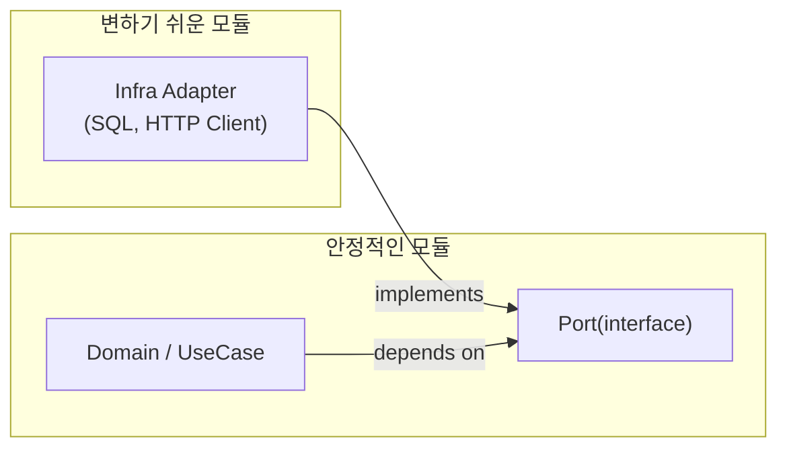

# 11. 의존성 관리와 인터페이스 설계

10장에서 "도메인이 인프라가 아니라 포트(인터페이스)에 의존하게 하라"는 방향을 정했다면, 11장은 그 방향을 실제 클래스 설계 규칙으로 구체화합니다. 의존성 역전은 단순히 인터페이스 파일을 하나 추가하는 기계적 작업이 아니라, **"어느 쪽이 더 안정적이어야 하는가"를 결정하는 설계 판단**입니다.

## 학습 목표

- 의존성 역전 원칙(DIP)을 "인터페이스를 쓰라"가 아니라 "안정성 방향을 결정하라"로 설명할 수 있다.
- 생성자 주입을 기본으로 선택하고, 다른 주입 방식이 필요한 예외적 상황을 구분할 수 있다.
- 인터페이스 분리 원칙(ISP)을 이용해 테스트 더블을 쉽게 만들 수 있는 경계를 설계할 수 있다.

## 의존성 역전 원칙을 다시 읽는다

Robert C. Martin은 DIP를 두 문장으로 정의합니다: 상위 모듈은 하위 모듈에 의존해서는 안 되며, 둘 다 추상화에 의존해야 한다. 그리고 추상화는 세부 사항에 의존해서는 안 되며, 세부 사항이 추상화에 의존해야 한다. 이 정의에서 놓치기 쉬운 부분은 **"상위/하위"가 코드 상의 호출 방향이 아니라 정책의 안정성 순서**를 가리킨다는 점입니다.

여기서 상위 모듈이란 더 일반적이고 정책에 가까운 코드(주문을 생성한다)를 말하고, 하위 모듈은 더 구체적이고 세부적인 코드(MySQL에 INSERT한다)를 말합니다. `OrderService`가 `SqlOrderRepository`를 직접 참조하면, 정책(주문 생성 규칙)이 세부 사항(SQL 저장 방식)에 종속됩니다. 이 관계를 뒤집기 위해 `OrderRepositoryPort`라는 인터페이스를 두고, `OrderService`와 `SqlOrderRepository` 둘 다 그 인터페이스에 의존하게 만드는 것이 10장에서 본 구조입니다.

## 안정적 의존성 원칙: 변하기 쉬운 것이 안정적인 것에 의존한다

Robert C. Martin은 패키지/모듈 수준의 원칙으로 **안정적 의존성 원칙(Stable Dependencies Principle, SDP)**과 **안정적 추상화 원칙(Stable Abstractions Principle, SAP)**도 함께 제시했습니다. SDP는 "자주 바뀌는 모듈은 자주 바뀌지 않는 모듈에 의존해야 한다"는 규칙이고, SAP는 "안정적인 모듈일수록 더 추상적이어야 한다"는 규칙입니다.

이 두 원칙을 합치면, 도메인 계층(자주 바뀌지 않아야 하는 정책)은 인터페이스처럼 추상적인 형태로 유지되고, 인프라 계층(자주 바뀌는 세부 구현)이 그 추상화를 향해 의존해야 한다는 결론이 나옵니다. 즉 DIP는 개별 클래스 하나를 인터페이스로 감싸는 국소적 기법이 아니라, **모듈 전체의 안정성 위계를 설계하는 원칙**입니다.



## 의존성 주입 방식: 생성자 주입을 기본으로

DIP를 실제 객체 생성 시점에 적용하는 기법이 **의존성 주입(Dependency Injection, DI)**입니다. 주입 방식은 크게 세 가지입니다.

- **생성자 주입**: 객체 생성 시점에 필요한 의존성을 모두 전달. 필수 의존성이 없으면 객체 자체를 만들 수 없어 누락을 컴파일/초기화 시점에 잡을 수 있음
- **세터 주입**: 객체 생성 후 setter로 의존성을 나중에 주입. 선택적 의존성이나 순환 참조를 풀어야 할 때 예외적으로 사용
- **인터페이스 주입**: 별도의 주입 인터페이스를 구현하게 하는 방식. 현대 언어/프레임워크에서는 거의 쓰이지 않음

기본값은 생성자 주입입니다. 세터 주입은 "생성은 됐지만 아직 사용할 준비가 안 된" 어중간한 상태를 허용하기 때문에, 필수 의존성에는 적합하지 않습니다.

```python
class PaymentGateway:
    def authorize(self, amount: int) -> str:
        raise NotImplementedError


class OrderService:
    def __init__(self, payment: PaymentGateway) -> None:
        # 생성자 주입: OrderService는 payment 없이 존재할 수 없다
        self._payment = payment

    def place_order(self, amount: int) -> str:
        return self._payment.authorize(amount)
```

`IoC(Inversion of Control) 컨테이너`나 DI 프레임워크(Spring, Google Guice 등)는 이런 생성자 조합을 애플리케이션 시작 시점에 자동으로 연결해주는 도구일 뿐, DIP 자체를 대체하지 않습니다. 컨테이너 없이 `main()` 함수에서 손으로 객체를 조립해도(Pure DI) DIP는 그대로 적용됩니다. 작은 프로젝트에서는 프레임워크 도입 비용이 이득보다 클 수 있습니다.

## 인터페이스 분리 원칙: 클라이언트 기준으로 쪼갠다

인터페이스를 하나 뒀다고 끝이 아닙니다. `OrderRepositoryPort`에 저장, 조회, 환불, 통계 집계까지 모두 넣으면, `OrderService`는 자신이 쓰지 않는 메서드(통계 집계)까지 알아야 하고, 테스트에서 가짜 구현을 만들 때도 쓰지 않는 메서드를 억지로 구현해야 합니다. **인터페이스 분리 원칙(ISP)**은 "인터페이스를 무조건 잘게 쪼개라"는 뜻이 아니라, **인터페이스를 사용하는 쪽(클라이언트) 기준으로 필요한 만큼만 노출하라**는 뜻입니다.

```python
from abc import ABC, abstractmethod


class OrderReader(ABC):
    @abstractmethod
    def find(self, order_id: str) -> dict:
        raise NotImplementedError


class OrderWriter(ABC):
    @abstractmethod
    def save(self, order_id: str, total: int) -> None:
        raise NotImplementedError


class OrderService:
    def __init__(self, writer: OrderWriter) -> None:
        # 조회가 필요 없는 OrderService는 OrderReader를 몰라도 된다
        self._writer = writer
```

이렇게 나누면 `OrderService`를 테스트할 때 `OrderWriter`만 구현한 가짜 객체(Fake) 하나면 충분합니다. `find()`까지 억지로 구현할 필요가 없어지므로, 테스트 더블 작성 비용이 인터페이스 크기에 비례해 줄어듭니다.

## 흔한 오해: DIP는 항상 인터페이스를 만들라는 뜻이다

안정성이 이미 낮은 두 클래스 사이(둘 다 자주 함께 바뀌는 관계)에 인터페이스를 끼워 넣으면, 실질적인 이득 없이 간접 계층만 늘어납니다. DIP가 필요한 지점은 **안정성 차이가 있는 경계**, 즉 정책(도메인)과 세부 사항(인프라, 외부 SDK, UI 프레임워크)이 만나는 지점입니다. 같은 계층 안에서 서로 강하게 결합된 클래스들끼리는 인터페이스보다 책임 재배치(SRP)가 먼저입니다. "인터페이스가 있으면 무조건 유연하다"는 생각은 오해이며, 구현체가 하나뿐이고 교체될 가능성이 없는 곳에 인터페이스를 두면 오히려 코드를 따라가기만 어려워집니다.

## 실무 체크리스트

- 이 인터페이스를 실제로 구현하는 클래스가 2개 이상이거나, 테스트에서 가짜 구현이 필요한가? (둘 다 아니면 인터페이스가 불필요할 수 있다)
- 인터페이스에 클라이언트가 쓰지 않는 메서드가 섞여 있지 않은가?
- 생성자 주입만으로 필수 의존성이 모두 표현되는가?
- 순환 의존성이 있다면, 책임을 재배치해 없앨 수 있는가, 아니면 세터 주입/이벤트로 풀어야 하는가?

## 연습 과제

### 기초(★☆☆)
- 프로젝트에서 하나의 인터페이스에 메서드가 5개 이상 섞여 있는 곳을 찾아, 실제로 이 인터페이스를 쓰는 클라이언트가 각 메서드를 모두 사용하는지 확인해보세요.

### 중급(★★☆)
- 위에서 찾은 인터페이스를 클라이언트 기준으로 2개 이상으로 분리하고, 각각에 대한 테스트 더블을 작성해보세요.

### 고급(★★★)
- 두 서비스가 서로를 참조하는 순환 의존성 상황을 만들고, 책임 재배치와 이벤트 기반 분리 두 가지 방식으로 각각 해소해 트레이드오프를 비교해보세요.

## 요약

- DIP는 인터페이스 추가가 아니라 안정성 방향(정책이 세부 사항에 의존하지 않게)을 정하는 원칙이다.
- 의존성 주입은 생성자 주입을 기본으로 하고, IoC 컨테이너는 이를 자동화하는 도구일 뿐이다.
- ISP는 클라이언트 기준으로 인터페이스를 나눠 테스트 더블 작성 비용을 낮춘다.

## 참고 문헌 및 출처(추천)

- Robert C. Martin, "The Dependency Inversion Principle"(1996, C++ Report), 『Agile Software Development, Principles, Patterns, and Practices』(2002)
- Robert C. Martin, "Stable Dependencies Principle / Stable Abstractions Principle" — 『Agile Software Development』 패키지 원칙 장
- Mark Seemann, 『Dependency Injection Principles, Practices, and Patterns』(2019)

---

## 다음 글

- 다음: [12. 확장성과 유연성을 위한 설계 기법](../12_extensibility_flexibility_design_techniques/)
