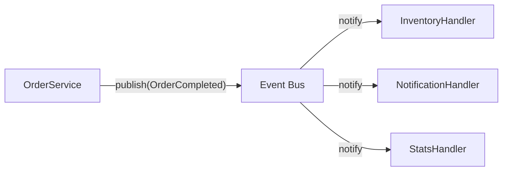

# 12. 확장성과 유연성을 위한 설계 기법

Phase 3의 마지막 장인 12장은 09~11장에서 다룬 패턴 선택, 레이어 분리, 의존성 관리를 종합해 **"어디에 확장 포인트를 만들 것인가"**라는 질문에 답합니다. 확장 포인트는 공짜가 아닙니다. 모든 곳에 인터페이스와 전략 객체를 미리 만들어 두면 코드는 유연해지지만 이해하기 어려워지고, 반대로 확장 포인트가 전혀 없으면 요구사항이 하나 늘 때마다 기존 코드를 계속 고쳐야 합니다.

## 학습 목표

- 개방-폐쇄 원칙(OCP)을 "상속을 열어둔다"가 아니라 "변경 지점을 추상화 뒤로 감춘다"로 설명할 수 있다.
- 변화 빈도와 영향도를 근거로 확장 포인트의 우선순위를 정할 수 있다.
- 전략 기반 확장과 이벤트 기반 확장의 차이와 각각의 적용 상황을 구분할 수 있다.

## 개방-폐쇄 원칙을 다시 읽는다

Bertrand Meyer는 1988년 저서 『Object-Oriented Software Construction』에서 개방-폐쇄 원칙(Open-Closed Principle, OCP)을 "모듈은 확장에는 열려 있어야 하고, 수정에는 닫혀 있어야 한다"고 정의했습니다. 09장 예제에서 본 것처럼, 새로운 할인 정책이 추가될 때 기존 `if/elif` 코드를 고치지 않고 새 클래스만 추가하는 구조가 OCP를 지키는 예입니다.

주의할 점은 OCP가 "모든 곳을 상속·전략 패턴으로 열어두라"는 뜻이 아니라는 것입니다. 확장에 열려 있어야 할 지점은 **실제로 자주 바뀌는 지점**뿐입니다. 거의 바뀌지 않는 로직까지 미리 추상화해두면, 그 자체가 불필요한 간접 계층이 되어 09장에서 다룬 패턴병과 같은 문제를 일으킵니다.

## 확장 포인트 우선순위: 변화 빈도 × 영향도

어디에 확장 포인트를 둘지 결정하는 실무적인 방법은 두 축으로 후보를 정리하는 것입니다.

| 변화 빈도 | 영향도(파급 범위) | 판단 |
|---|---|---|
| 높음 | 큼 | 확장 포인트 최우선 (Strategy/Policy로 분리) |
| 높음 | 작음 | 설정값·파라미터로 충분, 별도 추상화는 과함 |
| 낮음 | 큼 | 당장은 단순 구현, 변화 조짐이 보이면 리팩토링 |
| 낮음 | 작음 | 확장 포인트 불필요 |

예컨대 할인율 숫자 자체는 자주 바뀌지만 영향도가 작으므로 설정값으로 충분하고, 할인 "계산 방식"(정액/정률/한도 적용 여부)은 새 정책이 계속 추가되고 여러 화면·정산 로직에 영향을 주므로 확장 포인트로 만들 가치가 있습니다. 이 표를 채우기 전에 "지난 6개월간 이 영역이 몇 번 바뀌었는가"를 실제로 확인하는 것이, 추측만으로 확장 포인트를 설계하는 것보다 훨씬 신뢰할 수 있는 근거가 됩니다.

## 전략 기반 확장: 정책 객체와 레지스트리

09장의 `DiscountPolicy`처럼 개별 전략을 클래스로 분리한 뒤, 어떤 전략을 쓸지 선택하는 책임까지 정리하면 **정책 레지스트리**가 됩니다.

```python
from abc import ABC, abstractmethod


class DiscountPolicy(ABC):
    @abstractmethod
    def apply(self, amount: int) -> int:
        raise NotImplementedError


class PolicyRegistry:
    def __init__(self) -> None:
        self._policies: dict[str, DiscountPolicy] = {}

    def register(self, code: str, policy: DiscountPolicy) -> None:
        self._policies[code] = policy

    def resolve(self, code: str) -> DiscountPolicy:
        if code not in self._policies:
            raise KeyError(f"unknown policy: {code}")
        return self._policies[code]
```

새 할인 정책이 추가되면 `PolicyRegistry`에 등록만 하면 되고, 정책을 사용하는 코드(`OrderService`)는 전혀 수정되지 않습니다. 이 구조는 확장 포인트가 "정책 종류가 자주 늘어난다"는 실제 변화 패턴에 정확히 대응하기 때문에 비용을 지불할 가치가 있습니다.

## 이벤트 기반 확장: 하나의 변화에 여러 반응이 붙을 때

정책 교체와 다른 종류의 확장 요구도 있습니다. "주문이 완료되면 재고를 차감하고, 알림을 보내고, 통계를 갱신한다"처럼 **하나의 사건에 여러 독립적인 반응이 붙어야 하는 경우**입니다. 이런 상황에 정책 객체를 쓰면 `OrderService`가 재고·알림·통계 모듈을 모두 알아야 해 SRP를 위반합니다. 대신 Observer 패턴(GoF, 1994)을 이벤트 발행/구독 형태로 적용합니다.



`OrderService`는 "주문이 완료됐다"는 이벤트만 발행하고, 누가 구독하는지 알 필요가 없습니다. 새로운 반응(예: 포인트 적립)이 추가되어도 `OrderService`는 수정되지 않고 새 핸들러만 등록하면 됩니다. 다만 이벤트 기반 확장은 실행 순서를 코드에서 직접 추적하기 어려워지므로, 반응들 사이에 순서 의존성이나 트랜잭션 일관성이 필요한 경우에는 오히려 복잡도를 키울 수 있습니다. 순서가 중요하지 않고 서로 독립적인 반응들에만 적용하는 것이 안전합니다.

## 전략 vs 이벤트: 선택 기준

두 확장 기법은 "확장에 열려 있다"는 목적은 같지만 적용 상황이 다릅니다.

- **전략 기반**은 "여러 방법 중 하나를 선택해서 실행"하는 상황에 맞습니다. 결과가 호출자에게 바로 필요할 때(할인액 계산 결과를 즉시 써야 함) 적합합니다.
- **이벤트 기반**은 "하나의 사건에 여러 독립적 반응이 뒤따르는" 상황에 맞습니다. 반응 결과가 호출자에게 즉시 필요하지 않고, 반응이 실패해도 원래 흐름(주문 완료)이 영향받지 않아야 할 때 적합합니다.

## 흔한 오해: 확장성은 많을수록 좋다

YAGNI(You Aren't Gonna Need It) 원칙은 "아직 필요하지 않은 확장 포인트를 미리 만들지 말라"는 경고입니다. 확장 포인트마다 인터페이스, 레지스트리, 이벤트 핸들러 등록 코드가 따라오므로, 실제로 확장된 적 없는 포인트는 순수한 비용입니다. 확장성 설계의 목표는 "모든 것을 열어두는 것"이 아니라, **위 우선순위 표에서 "변화 빈도 높음 × 영향도 큼"에 해당하는 지점만 정확히 열어두는 것**입니다. 이 판단을 잘못하면 12장에서 만든 유연한 구조가 오히려 10~11장에서 지키려던 단순성을 해칩니다.

## 실무 체크리스트

- 이 확장 포인트는 실제 변경 이력(과거 몇 번 바뀌었는지)으로 뒷받침되는가, 아니면 "혹시 몰라서"인가?
- 정책 교체(전략)와 사건 후속 처리(이벤트) 중 어느 쪽에 더 가까운 요구사항인가?
- 확장 포인트를 추가한 뒤, 실제로 새 정책/핸들러를 등록하는 코드가 기존 핵심 로직을 건드리지 않는가?
- 확장 포인트가 실제로 한 번도 확장되지 않은 채 6개월 이상 지났다면, 제거를 고려했는가?

## 연습 과제

### 기초(★☆☆)
- 프로젝트에서 "새 케이스가 추가될 때마다 같은 함수를 계속 고치는" 지점을 하나 찾아, 변화 빈도와 영향도를 표로 정리해보세요.

### 중급(★★☆)
- 위 지점에 `PolicyRegistry` 방식의 전략 기반 확장을 적용해보세요.

### 고급(★★★)
- "주문 완료" 같은 하나의 사건에 3개 이상의 독립적 반응이 필요한 상황을 설계하고, 전략 기반과 이벤트 기반 두 가지로 각각 구현해 코드 변경 범위를 비교해보세요.

## 요약

- OCP는 모든 곳이 아니라 실제로 자주 바뀌는 지점만 확장에 열어두라는 원칙이다.
- 확장 포인트 우선순위는 변화 빈도와 영향도로 근거를 남겨 판단한다.
- 정책 선택은 전략 기반, 하나의 사건에 대한 여러 독립적 반응은 이벤트 기반이 더 잘 맞는다.

## 참고 문헌 및 출처(추천)

- Bertrand Meyer, 『Object-Oriented Software Construction』(1988) — OCP 최초 정식화
- Erich Gamma 외, 『Design Patterns』(1994) — Strategy, Observer 원전
- Martin Fowler, "Yagni"(2015, martinfowler.com)

---

## 다음 글

- 다음: [13. 도메인 주도 설계(DDD)의 핵심 개념](../13_domain_driven_design_core_concepts/)
