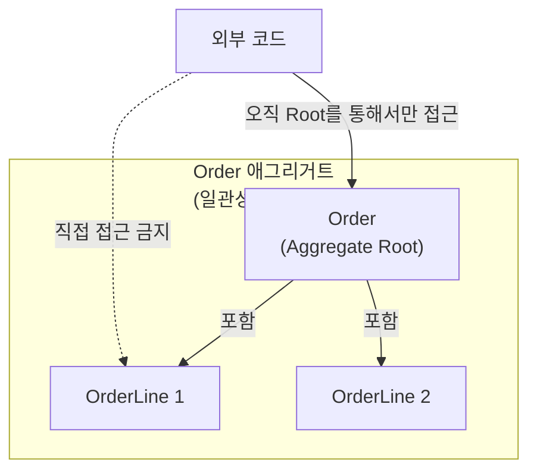

# 16. 애그리거트와 리포지터리 패턴

15장에서 엔티티와 밸류 오브젝트로 개별 개념을 표현하는 법을 다뤘다면, 16장은 이 요소들을 **하나의 트랜잭션으로 일관되게 저장·조회하는 단위**로 묶는 방법을 다룹니다. 애그리거트(Aggregate)와 리포지터리(Repository)는 Phase 4의 마지막 전술 패턴이며, 이 둘을 정확히 이해하지 못하면 15장에서 잘 설계한 엔티티·밸류 오브젝트도 저장 시점에 일관성이 깨질 수 있습니다.

## 학습 목표

- 애그리거트를 "연관 객체 묶음"이 아니라 "트랜잭션 일관성 경계"로 설명할 수 있다.
- 애그리거트 루트를 통해서만 내부를 수정하게 만드는 이유를 설명할 수 있다.
- 리포지터리가 컬렉션처럼 동작해야 하는 이유와, ORM의 `Repository`와의 차이를 구분할 수 있다.

## 애그리거트: 일관성 경계를 정의한다

"주문(Order)"과 "주문 항목(OrderLine)"은 서로 연관돼 있습니다. 주문 항목들의 합계가 주문 총액과 일치해야 한다는 불변조건(invariant)이 있다면, 이 둘은 항상 함께 일관성이 유지돼야 합니다. 만약 `OrderLine`을 독립적으로 아무 코드에서나 추가·삭제할 수 있게 허용하면, 총액과 항목 합계가 어긋나는 순간이 생길 수 있습니다.

**애그리거트**는 이런 불변조건을 지켜야 하는 객체들의 묶음을 하나의 트랜잭션 경계로 정의합니다. Vaughn Vernon은 2011년 발표한 "Effective Aggregate Design" 3부작 논문에서, 애그리거트 설계의 핵심 원칙을 다음과 같이 요약했습니다. 하나의 트랜잭션에서는 **하나의 애그리거트만** 수정해야 하고, 애그리거트는 **가능한 한 작게** 설계해야 합니다.



## 애그리거트 루트: 유일한 진입점

애그리거트 안에는 반드시 하나의 **애그리거트 루트(Aggregate Root)**가 있고, 외부 코드는 오직 루트를 통해서만 애그리거트 내부에 접근·수정할 수 있습니다. 루트가 불변조건을 검증하는 책임을 집니다.

```python
from dataclasses import dataclass, field


@dataclass(frozen=True)
class OrderLine:
    product_id: str
    quantity: int
    unit_price: int

    @property
    def subtotal(self) -> int:
        return self.quantity * self.unit_price


class Order:
    """애그리거트 루트: 불변조건(총액 = 항목 합계)을 스스로 지킨다"""

    def __init__(self, order_id: str) -> None:
        self.order_id = order_id
        self._lines: list[OrderLine] = []

    def add_line(self, line: OrderLine) -> None:
        if line.quantity <= 0:
            raise ValueError("quantity must be positive")
        self._lines.append(line)

    @property
    def total(self) -> int:
        return sum(line.subtotal for line in self._lines)

    @property
    def lines(self) -> tuple[OrderLine, ...]:
        # 내부 리스트를 그대로 노출하지 않고 읽기 전용 튜플로 반환
        return tuple(self._lines)
```

외부 코드는 `order._lines.append(...)`처럼 내부 리스트에 직접 접근할 방법이 없고, 반드시 `order.add_line(...)`을 거쳐야 합니다. 이 메서드가 수량 검증 같은 불변조건을 강제하는 유일한 통로가 되므로, `Order`가 존재하는 한 총액과 항목 합계가 어긋나는 상태는 만들어질 수 없습니다.

## 애그리거트는 작게 설계한다

애그리거트를 "연관된 모든 것을 묶은 큰 덩어리"로 설계하는 것은 흔한 실수입니다. 예컨대 `Order` 애그리거트에 고객 정보, 배송 이력, 리뷰까지 모두 포함시키면, 리뷰 하나를 추가하는 작업조차 `Order` 전체를 잠그고 트랜잭션을 시작해야 합니다. 동시에 여러 사용자가 같은 주문에 접근하면 잠금 경합이 심해지고, 로드해야 할 데이터도 커집니다.

Vernon의 권고는 **애그리거트 경계를 실제 불변조건이 요구하는 만큼만** 두라는 것입니다. "리뷰 개수가 주문 항목 수를 넘을 수 없다"처럼 강한 불변조건이 없다면, 리뷰는 별도 애그리거트로 분리하고 `Order`의 식별자만 참조하게 합니다. 애그리거트 간 참조는 객체 전체가 아니라 **식별자(ID)**로만 하는 것이 원칙입니다. 이렇게 하면 한 애그리거트를 메모리에 올릴 때 다른 애그리거트까지 줄줄이 로드되는 문제(과도한 즉시 로딩)를 피할 수 있습니다.

## 리포지터리: 컬렉션처럼 보이는 저장소

**리포지터리(Repository)**는 애그리거트를 저장·조회하는 책임을 캡슐화하는 패턴으로, Evans의 DDD와 Martin Fowler의 『Patterns of Enterprise Application Architecture』(2002)에서 함께 정리됐습니다. 핵심 아이디어는 리포지터리가 "테이블에 대한 CRUD 래퍼"가 아니라 **메모리에 있는 컬렉션처럼 보이는 인터페이스**여야 한다는 것입니다.

```python
from abc import ABC, abstractmethod


class OrderRepository(ABC):
    """도메인이 바라보는 컬렉션 같은 인터페이스"""

    @abstractmethod
    def find_by_id(self, order_id: str) -> Order | None:
        raise NotImplementedError

    @abstractmethod
    def save(self, order: Order) -> None:
        raise NotImplementedError
```

이 인터페이스에는 `runQuery()`나 SQL 관련 메서드가 없습니다. 도메인 코드는 "주문을 저장한다", "ID로 주문을 찾는다"는 개념만 알면 되고, 실제로 관계형 DB를 쓰는지, 문서 DB를 쓰는지는 구현 클래스(어댑터)의 책임입니다. 이는 10~11장에서 다룬 포트/어댑터 구조를 애그리거트 저장에 특화한 형태입니다. **리포지터리는 항상 애그리거트 루트 단위로만 존재**하며, `OrderLineRepository`처럼 애그리거트 내부 요소에 대한 리포지터리는 만들지 않습니다. `OrderLine`은 반드시 `Order`를 통해서만 저장·조회되기 때문입니다.

## 동시 수정 문제: 낙관적 잠금

여러 트랜잭션이 동시에 같은 애그리거트를 수정하려 하면 어떻게 될까요. 애그리거트가 트랜잭션 일관성 경계라는 것은, 곧 동시 접근 제어도 애그리거트 단위로 처리해야 함을 의미합니다. 실무에서 흔히 쓰는 방법은 **낙관적 잠금(Optimistic Concurrency Control)**으로, 애그리거트에 버전 번호를 두고 저장 시점에 버전이 로드했을 때와 같은지 확인합니다. 버전이 다르면 그사이 다른 트랜잭션이 먼저 수정했다는 뜻이므로 저장을 거부하고 재시도를 요청합니다. 애그리거트를 작게 설계할수록 이 충돌 빈도도 줄어든다는 점에서, "애그리거트는 작게"라는 원칙은 동시성 관점에서도 유효합니다.

## 흔한 오해: 리포지터리는 ORM의 Repository와 같다

Spring Data JPA 같은 프레임워크가 제공하는 `Repository` 인터페이스는 테이블 단위 CRUD를 자동 생성해주는 편의 도구입니다. 이것과 DDD의 리포지터리는 이름은 같지만 목적이 다릅니다. DDD 리포지터리는 **애그리거트 경계를 지키며 도메인 개념으로 저장/조회를 표현**하는 것이 목적이고, ORM 리포지터리는 테이블 접근을 편하게 하는 것이 목적입니다. 프레임워크의 `Repository`를 그대로 도메인 인터페이스로 노출하면, `findByStatusAndCreatedAtBetween(...)`처럼 쿼리 세부사항이 도메인 계층까지 새어 들어와 10장에서 지키려던 의존성 방향이 깨집니다. 프레임워크의 리포지터리는 어댑터 내부 구현에 감추고, 도메인이 보는 인터페이스는 위 예제처럼 애그리거트 중심 어휘로 유지하는 것이 안전합니다.

## 실무 체크리스트

- 이 애그리거트 경계가 실제 불변조건(항상 함께 일관돼야 하는 규칙)으로 뒷받침되는가, 아니면 "연관되어 보여서" 묶은 것인가?
- 애그리거트 내부 컬렉션이 외부에 그대로 노출되지 않고, 루트의 메서드를 통해서만 수정되는가?
- 애그리거트 간 참조가 객체 전체가 아니라 식별자로만 이루어지는가?
- 리포지터리 인터페이스에 SQL/쿼리 세부사항이 새어 나오지 않고 도메인 어휘로 표현되는가?

## 연습 과제

### 기초(★☆☆)
- 15장에서 설계한 `Order`에 `OrderLine` 추가/삭제 시 총액 불변조건을 강제하는 메서드가 없다면 추가해보세요.

### 중급(★★☆)
- `Order` 애그리거트에 대한 `OrderRepository` 인터페이스와, 메모리 딕셔너리를 이용한 테스트용 구현체(`InMemoryOrderRepository`)를 작성해보세요.

### 고급(★★★)
- 두 개의 트랜잭션이 동시에 같은 `Order`에 항목을 추가하는 상황을 가정하고, 버전 필드를 이용한 낙관적 잠금 검증 로직을 `save()`에 추가해보세요.

## 요약

- 애그리거트는 연관 객체 묶음이 아니라 트랜잭션 일관성 경계이며, 가능한 한 작게 설계한다.
- 애그리거트 루트만이 내부 수정의 유일한 진입점이 되어 불변조건을 강제한다.
- 리포지터리는 애그리거트 루트 단위로만 존재하며, 도메인 어휘로 저장/조회를 표현하는 컬렉션 같은 인터페이스다.

## 참고 문헌 및 출처(추천)

- Eric Evans, 『Domain-Driven Design』(2003) — Aggregate, Repository 정의
- Vaughn Vernon, "Effective Aggregate Design" Part I~III(2011)
- Martin Fowler 외, 『Patterns of Enterprise Application Architecture』(2002) — Repository 패턴

---

## 다음 글

- 다음: [17. 마이크로서비스 아키텍처와 OOAD](../17_microservices_architecture_ooad/)
