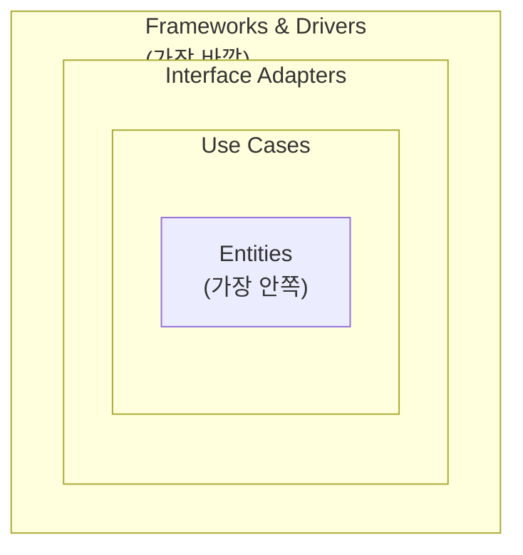

# 18. 클린 아키텍처와 헥사고날 아키텍처

10장에서 "도메인이 인프라에 의존하지 않도록 방향을 뒤집는다"는 원칙을 소개하며 클린/헥사고날/어니언이라는 이름을 잠깐 언급했습니다. 18장은 그 세 이름을 정확히 구분하고, 특히 가장 널리 쓰이는 **클린 아키텍처**의 4개 동심원 구조와 "경계를 넘을 때 무엇을 주고받는가"라는, 10장에서 다루지 않은 실무적 세부사항을 정리합니다.

## 학습 목표

- 클린 아키텍처의 4개 동심원(엔티티, 유스케이스, 인터페이스 어댑터, 프레임워크/드라이버)과 각 계층의 책임을 설명할 수 있다.
- 계층 경계를 넘을 때 도메인 객체 대신 DTO를 써야 하는 이유를 설명할 수 있다.
- 클린/헥사고날/어니언이 이름은 다르지만 같은 규칙을 표현한다는 것을 설명하고, 어떤 상황에 이 구조 전체가 과할 수 있는지 판단할 수 있다.

## 클린 아키텍처의 4개 동심원

Robert C. Martin은 2012년 블로그 글 "The Clean Architecture"에서, 이후 2017년 동명의 책에서 아키텍처를 4개의 동심원으로 그렸습니다.



- **엔티티(Entities)**: 가장 안쪽. 애플리케이션과 무관하게, 도메인 자체가 갖는 핵심 업무 규칙. 13~16장에서 다룬 엔티티/밸류 오브젝트/애그리거트가 여기에 해당
- **유스케이스(Use Cases)**: 애플리케이션 고유의 업무 흐름(주문 생성, 결제 승인 등). 06장에서 다룬 유스케이스가 여기서 코드로 구현됨
- **인터페이스 어댑터(Interface Adapters)**: 유스케이스의 입출력을 바깥 세계의 형식(HTTP 요청/응답, DB 레코드)으로 변환하는 컨트롤러, 프레젠터, 게이트웨이
- **프레임워크와 드라이버(Frameworks & Drivers)**: 가장 바깥. 웹 프레임워크, DB 드라이버, UI 라이브러리 등 구체적인 기술

**의존성 규칙(Dependency Rule)**은 이 그림에서 화살표가 항상 안쪽을 향해야 한다는 것입니다. 바깥 원은 안쪽 원을 참조할 수 있지만, 안쪽 원은 바깥 원에 있는 어떤 것도(클래스 이름조차) 알아서는 안 됩니다.

## 경계를 넘는 데이터: 도메인 객체를 그대로 넘기지 않는다

10장 예제에서는 `Port` 인터페이스로 의존 방향을 뒤집는 것까지만 다뤘습니다. 실무에서 자주 놓치는 부분은 **계층 경계를 넘어갈 때 무엇을 주고받는가**입니다. 유스케이스 계층의 출력을 인터페이스 어댑터 계층(예: HTTP 컨트롤러)에 도메인 엔티티 객체를 그대로 반환하면, 도메인 엔티티에 웹 프레임워크가 요구하는 직렬화 애너테이션이나 필드가 섞여 들어가기 쉽습니다. 이는 다시 안쪽 계층이 바깥쪽 기술을 알게 되는 결과를 낳습니다.

이를 막기 위해 클린 아키텍처는 계층 경계를 넘을 때 **단순한 데이터 구조(DTO, Data Transfer Object)**만 주고받도록 권장합니다.

```python
from dataclasses import dataclass


@dataclass(frozen=True)
class PlaceOrderInput:
    """유스케이스로 들어가는 경계용 데이터: 도메인 타입에 의존하지 않는다"""
    customer_id: str
    product_id: str
    quantity: int


@dataclass(frozen=True)
class PlaceOrderOutput:
    """유스케이스에서 나오는 경계용 데이터"""
    order_id: str
    total: int


class PlaceOrderUseCase:
    def __init__(self, order_repository) -> None:
        self._repository = order_repository

    def execute(self, input_data: PlaceOrderInput) -> PlaceOrderOutput:
        order = Order(order_id=self._generate_id())
        order.add_line(OrderLine(input_data.product_id, input_data.quantity, unit_price=10000))
        self._repository.save(order)
        return PlaceOrderOutput(order_id=order.order_id, total=order.total)

    def _generate_id(self) -> str:
        import uuid
        return str(uuid.uuid4())
```

`PlaceOrderInput`/`PlaceOrderOutput`은 HTTP도, DB도 모릅니다. 컨트롤러(인터페이스 어댑터)가 HTTP 요청 본문을 `PlaceOrderInput`으로 변환해 유스케이스를 호출하고, 유스케이스가 반환한 `PlaceOrderOutput`을 다시 JSON 응답으로 변환합니다. 이 변환을 전담하는 두 역할이 **컨트롤러(입력 변환)**와 **프레젠터(출력 변환)**입니다.

## 헥사고날, 어니언, 클린: 같은 규칙, 다른 어휘

10장에서 소개한 세 접근은 동심원 개수와 이름이 다를 뿐 본질적으로 같은 규칙(안쪽은 바깥쪽을 모른다)을 표현합니다.

| 구분 | 제안자 | 핵심 어휘 | 층 구조 |
|---|---|---|---|
| 헥사고날(포트와 어댑터) | Alistair Cockburn(2005) | 포트, 어댑터 | 안(애플리케이션 코어) / 밖(어댑터), 2층 중심 |
| 어니언 | Jeffrey Palermo(2008) | 도메인, 서비스, 인프라 | 도메인을 중심으로 3~4개 동심원 |
| 클린 아키텍처 | Robert C. Martin(2012/2017) | 엔티티, 유스케이스, 인터페이스 어댑터, 프레임워크 | 4개 동심원 명시 |

세 접근 중 무엇을 쓸지는 "어떤 어휘가 팀에 더 익숙한가"의 문제에 가깝습니다. 헥사고날의 "포트/어댑터"는 외부 연동이 많은 시스템(여러 외부 API, 메시지 큐)을 설명하기 쉽고, 클린 아키텍처의 4개 동심원은 유스케이스와 엔티티를 명확히 분리하고 싶을 때 유용합니다. 팀 내에서 셋을 섞어 쓰면(포트라고 부르다가 갑자기 인터페이스 어댑터라고 부르는 식) 오히려 혼란이 커지므로, 프로젝트 초반에 하나의 어휘를 정하고 일관되게 씁니다.

## 흔한 오해: 계층이 많을수록 클린하다

클린 아키텍처를 문자 그대로 따라 모든 기능에 유스케이스 클래스, 컨트롤러, 프레젠터, DTO를 각각 만들면, 단순한 조회 기능 하나에도 파일 5~6개가 필요해집니다. Robert C. Martin 자신도 책에서 "이 구조가 모든 애플리케이션에 필요한 것은 아니다"라고 언급했습니다. 10장에서 다룬 판단 기준(도메인 복잡도가 계층 분리 비용을 정당화하는가)이 여기서도 그대로 적용됩니다. 업무 규칙이 거의 없는 단순 CRUD 기능까지 4개 동심원을 강제하면, 오히려 코드를 읽는 사람이 실제 로직보다 계층 간 변환 코드를 더 많이 읽게 됩니다. 실무에서는 핵심 도메인(주문, 결제처럼 규칙이 복잡하고 자주 바뀌는 영역)에만 온전한 구조를 적용하고, 단순 조회는 얇은 서비스로 남겨두는 절충이 흔합니다.

## 실무 체크리스트

- 계층 경계를 넘어갈 때 도메인 엔티티가 아니라 DTO(Input/Output)를 주고받는가?
- 컨트롤러/프레젠터가 각각 입력 변환과 출력 변환의 책임만 지고, 업무 규칙을 포함하고 있지 않은가?
- 프로젝트 안에서 포트/어댑터, 인터페이스 어댑터 같은 용어가 일관되게 쓰이는가?
- 단순 조회 기능까지 4개 동심원 구조를 강제해 파일 수만 늘리고 있지 않은가?

## 연습 과제

### 기초(★☆☆)
- 10장에서 만든 `OrderService` 예제를 클린 아키텍처의 유스케이스로 다시 표현하고, `PlaceOrderInput`/`PlaceOrderOutput` DTO를 추가해보세요.

### 중급(★★☆)
- HTTP 컨트롤러가 유스케이스를 호출하는 코드를 작성하고, 컨트롤러(입력 변환)와 프레젠터(출력 변환) 역할을 분리해보세요.

### 고급(★★★)
- 여러분의 프로젝트에서 단순 CRUD 기능 하나와 복잡한 업무 규칙이 있는 기능 하나를 골라, 전자는 얇은 구조로 후자는 4개 동심원 구조로 각각 설계해 코드량을 비교해보세요.

## 요약

- 클린 아키텍처는 엔티티-유스케이스-인터페이스 어댑터-프레임워크의 4개 동심원과 안쪽 방향 의존성 규칙으로 구성된다.
- 계층 경계를 넘을 때는 도메인 객체가 아니라 DTO를 주고받아 안쪽 계층이 바깥쪽 기술을 모르게 유지한다.
- 헥사고날/어니언/클린은 어휘가 다를 뿐 같은 규칙이며, 도메인 복잡도가 낮은 곳까지 강제할 필요는 없다.

## 참고 문헌 및 출처(추천)

- Robert C. Martin, "The Clean Architecture"(2012, 블로그), 『Clean Architecture』(2017)
- Alistair Cockburn, "Hexagonal Architecture"(2005)
- Jeffrey Palermo, "The Onion Architecture"(2008)

---

## 다음 글

- 다음: [19. 이벤트 기반 아키텍처와 CQRS](../19_event_driven_architecture_cqrs/)
