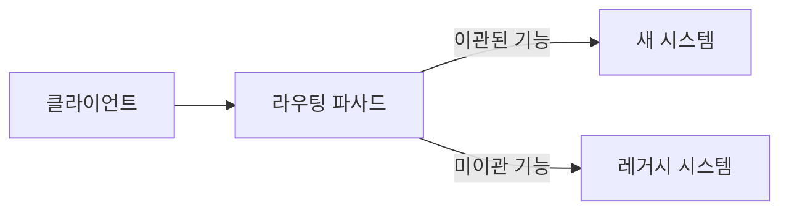

# 20. 레거시 시스템 현대화 전략

20편에 걸친 이 시리즈의 마지막 장은 지금까지 배운 모든 것을 실전에서 가장 자주 마주치는 상황, 즉 **이미 존재하는 레거시 시스템을 어떻게 안전하게 개선할 것인가**에 적용합니다. 새 프로젝트에 원칙을 적용하는 것보다, 이미 돌아가고 있고 정확히 무엇을 하는지 아무도 확신할 수 없는 시스템을 개선하는 쪽이 훨씬 흔하고 훨씬 어렵습니다.

## 학습 목표

- 전면 재작성(Big Bang Rewrite)이 실패하는 이유와, 점진적 교체가 더 안전한 이유를 설명할 수 있다.
- 스트랭글러 무화과 패턴과 추상화를 통한 분기 기법으로 레거시를 점진적으로 이관하는 절차를 설계할 수 있다.
- 특성화 테스트로 기존 동작을 먼저 고정한 뒤 리팩토링을 시작해야 하는 이유를 설명할 수 있다.

## 왜 전면 재작성은 대부분 실패하는가

레거시 코드를 마주한 팀이 가장 먼저 떠올리는 선택지는 "차라리 처음부터 새로 짜자"입니다. Joel Spolsky는 2000년 에세이 "Things You Should Never Do, Part I"에서 이런 전면 재작성이 반복적으로 실패하는 이유를 설명했습니다. 기존 코드가 지저분해 보여도, 그 안에는 수년간 쌓인 수많은 예외 처리와 실무 판단(왜 이 조건이 이렇게 짜여 있는지 아무도 기억 못 하지만 실제로는 특정 고객사의 요구사항을 처리하는 코드)이 녹아 있습니다. 재작성은 이 지식을 무시한 채 처음부터 다시 쌓아야 하고, 그동안 신규 기능 개발은 멈추거나 두 배로 늘어나며, 재작성이 끝나기 전에 요구사항이 다시 바뀌는 경우가 흔합니다.

## 스트랭글러 무화과 패턴: 점진적으로 감싸며 교체한다

Martin Fowler는 2004년 글 "StranglerFigApplication"(원래 제목은 "Strangler Application", 2022년 무화과나무의 생태를 더 정확히 반영해 개칭)에서 대안을 제시했습니다. 열대의 무화과나무는 다른 나무를 감싸며 자라다가, 결국 숙주 나무를 대체합니다. 레거시 현대화도 같은 방식으로 접근합니다. 새 시스템이 기존 시스템을 한 번에 대체하는 것이 아니라, **기능 단위로 조금씩 새 시스템이 요청을 가로채고, 기존 시스템의 비중이 점점 줄어들다가 결국 제거**됩니다.



이 구조에서 라우팅 파사드는 10장에서 다룬 어댑터, 14장에서 다룬 부패 방지 계층과 같은 역할을 합니다. 새 시스템은 레거시의 낡은 데이터 형식을 그대로 받아들이지 않고, 파사드가 요청을 번역해 넘겨줍니다. 기능을 하나씩 이관할 때마다 파사드의 라우팅 규칙만 바꾸면 되므로, 언제든 문제가 생기면 해당 기능만 레거시로 되돌릴 수 있습니다.

## 추상화를 통한 분기: 코드 수준의 스트랭글러

시스템 전체가 아니라 **하나의 클래스/모듈 내부**를 점진적으로 교체해야 할 때는 Martin Fowler가 정리한 **추상화를 통한 분기(Branch by Abstraction)** 기법을 씁니다. 기존 구현과 새 구현 사이에 인터페이스를 하나 두고, 기능 플래그로 어느 구현을 쓸지 전환하면서 점진적으로 검증합니다.

```python
from abc import ABC, abstractmethod


class PricingCalculator(ABC):
    @abstractmethod
    def calculate(self, order_total: int) -> int:
        raise NotImplementedError


class LegacyPricingCalculator(PricingCalculator):
    """기존 코드를 그대로 감싼 어댑터"""

    def calculate(self, order_total: int) -> int:
        return legacy_calculate_price(order_total)  # 기존 함수 재사용


class NewPricingCalculator(PricingCalculator):
    """9~12장에서 다룬 Strategy 기반 새 구현"""

    def __init__(self, policy: "DiscountPolicy") -> None:
        self._policy = policy

    def calculate(self, order_total: int) -> int:
        return order_total - self._policy.apply(order_total)


def resolve_calculator(feature_flags: dict) -> PricingCalculator:
    if feature_flags.get("new_pricing_enabled"):
        return NewPricingCalculator(policy=SeasonDiscount())
    return LegacyPricingCalculator()
```

이 구조는 10장에서 다룬 포트/어댑터와 형태가 같습니다. 차이는 목적입니다. 포트/어댑터는 "인프라를 교체 가능하게" 만드는 것이 목적이지만, 여기서는 **레거시 구현과 신규 구현을 안전하게 병행 운영**하는 것이 목적입니다. 두 구현이 같은 인터페이스를 만족하는 동안은 언제든 플래그 하나로 되돌릴 수 있어, 재작성의 가장 큰 위험(되돌릴 수 없음)을 제거합니다.

## 리팩토링 전에 행동을 고정한다: 특성화 테스트

레거시 코드는 대부분 테스트가 없거나 부족합니다. 04장에서 언급한 "점진적 리팩토링 절차"의 첫 단계, **행동 고정**은 레거시 현대화에서 특히 중요해집니다. 이때 쓰는 테스트를 Michael Feathers는 『Working Effectively with Legacy Code』(2004)에서 **특성화 테스트(Characterization Test)**라 불렀습니다. 이 테스트는 "코드가 무엇을 해야 하는가"가 아니라 **"코드가 지금 실제로 무엇을 하는가"**를 기록합니다.

```python
def test_characterize_legacy_pricing():
    # 레거시 함수의 실제 출력을 그대로 기록한다.
    # (왜 15%가 아니라 14.7%인지는 몰라도, 지금 이렇게 동작한다는 사실만 고정)
    assert legacy_calculate_price(100000) == 85300
```

이 테스트의 목적은 "정답을 검증"하는 것이 아니라 **리팩토링 전후로 동작이 바뀌지 않았음을 보장**하는 것입니다. 특성화 테스트로 기존 동작을 감싼 뒤에야 안전하게 내부 구조를 바꿀 수 있고, 이 안전망 위에서 위 `resolve_calculator` 같은 추상화를 통한 분기를 적용합니다.

## 어디서부터 시작할 것인가: 위험과 가치 기준

레거시 시스템 전체를 한 번에 이관 대상으로 삼으면 압도됩니다. 12장에서 다룬 "변화 빈도 × 영향도" 우선순위 기준을 여기서도 그대로 적용할 수 있습니다. 변경 요구가 잦고(비즈니스 가치가 큼) 결합도가 낮은(위험이 작음) 모듈부터 먼저 이관합니다. 결합도가 높고 이관 위험이 큰 핵심 모듈은, 주변 모듈들이 먼저 정리되어 경계가 뚜렷해진 뒤 마지막에 다루는 것이 안전합니다. 14장에서 다룬 바운디드 컨텍스트 식별 작업은 레거시 현대화에서도 유효합니다. "이 레거시 코드에서 실제로 몇 개의 서로 다른 모델이 뒤섞여 있는가"를 먼저 파악하는 것이, 무작정 코드를 나누는 것보다 훨씬 신뢰할 수 있는 출발점입니다.

## 흔한 오해: 현대화는 기술 스택 교체다

레거시 현대화를 "오래된 프레임워크를 최신 프레임워크로 바꾸는 작업"으로만 이해하면, 기술만 바뀌고 서비스 계층에 흩어진 업무 규칙, 뒤섞인 바운디드 컨텍스트, 애그리거트 경계 없는 트랜잭션 같은 근본 문제는 그대로 남습니다. 이 시리즈에서 다룬 원칙들(SOLID, 레이어 분리, DDD 전술 패턴)은 새 프레임워크를 도입할 때 반드시 함께 적용해야 진짜 의미의 현대화가 됩니다. 기술 스택만 바뀐 레거시는, 새 언어로 쓰인 낡은 설계일 뿐입니다.

## 실무 체크리스트

- 이관하려는 기능에 대해 특성화 테스트로 기존 동작을 먼저 고정했는가?
- 라우팅 파사드나 기능 플래그로 언제든 레거시 구현으로 되돌릴 수 있는가?
- 이관 순서가 "변화 빈도 × 영향도" 같은 근거 기반 우선순위를 따르는가?
- 기술 스택 교체와 함께 설계 원칙(SOLID, 레이어 분리, DDD)도 함께 적용되는가?

## 연습 과제

### 기초(★☆☆)
- 여러분이 아는 레거시 코드 하나를 골라, 그 코드에 대한 특성화 테스트를 3개 작성해보세요(정답이 아니라 현재 동작을 기록).

### 중급(★★☆)
- 위 코드에 추상화를 통한 분기 구조(인터페이스 + 레거시 구현 + 신규 구현 + 기능 플래그)를 적용해보세요.

### 고급(★★★)
- 여러분의 팀이 다루는(또는 가정한) 레거시 시스템을 스트랭글러 무화과 패턴으로 이관한다고 가정하고, 6개월 로드맵을 "변화 빈도 × 영향도" 우선순위로 단계별로 설계해보세요.

## 요약

- 전면 재작성은 기존 코드에 쌓인 암묵 지식을 무시하므로 대부분 실패하며, 점진적 교체가 더 안전하다.
- 스트랭글러 무화과 패턴(시스템 수준)과 추상화를 통한 분기(코드 수준)는 언제든 되돌릴 수 있는 안전망을 제공한다.
- 특성화 테스트로 기존 동작을 먼저 고정한 뒤에만 리팩토링을 시작한다.

## 참고 문헌 및 출처(추천)

- Martin Fowler, "StranglerFigApplication"(2004/2022 개정, martinfowler.com)
- Martin Fowler, "BranchByAbstraction"(martinfowler.com bliki)
- Michael Feathers, 『Working Effectively with Legacy Code』(2004) — Characterization Test
- Joel Spolsky, "Things You Should Never Do, Part I"(2000)

---

## OOAD 마스터 시리즈를 마치며

1편에서 "객체지향은 문법이 아니라 변화하는 도메인을 다루는 모델링 전략"이라는 문장으로 시작한 이 여정은, 이제 레거시 시스템을 안전하게 현대화하는 방법까지 닿았습니다. Phase 1에서는 객체지향의 철학적 기반과 SOLID 원칙을, Phase 2에서는 요구사항을 도메인 모델과 UML로 분석하는 방법을, Phase 3에서는 패턴과 아키텍처로 설계하는 전략을, Phase 4에서는 복잡한 도메인을 DDD로 다루는 법을, Phase 5에서는 그 모든 것을 마이크로서비스·이벤트 기반 아키텍처·레거시 현대화라는 실전 맥락에 적용하는 법을 다뤘습니다.

20편에 걸쳐 반복해서 강조한 것은 한 문장으로 요약됩니다.

> **"설계 원칙과 패턴은 정답 공식이 아니라, 변경 비용을 낮추기 위해 상황에 맞게 선택하는 판단 기준이다."**

SOLID도, 디자인 패턴도, 클린 아키텍처도, DDD도 무조건 따라야 할 규칙이 아니라, 지금 마주한 복잡도가 그 비용을 정당화하는지 판단한 뒤 선택하는 도구입니다. 이 시리즈에서 반복해서 등장한 "위반 신호를 먼저 찾는다", "변화 빈도와 영향도로 우선순위를 정한다", "패턴을 뺐을 때 더 단순해지면 과잉 적용이다"라는 질문들을 실무의 매 설계 결정에 그대로 적용해보시기 바랍니다.
