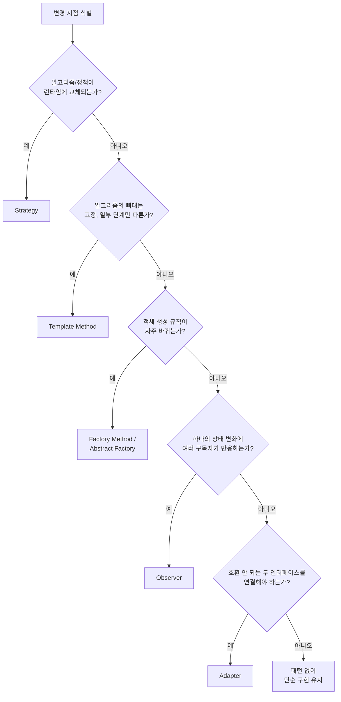

# 09. 설계 원칙과 패턴 적용 전략

08장까지는 “정적/동적 모델을 어떻게 그리는가”를 다뤘습니다. 09장부터 시작하는 Phase 3은 “모델을 어떤 구조로 구현하는가”, 즉 **설계 전략**을 다룹니다. 그 출발점은 디자인 패턴을 언제, 왜 쓰는지에 대한 판단 기준입니다.

패턴을 처음 배운 개발자가 가장 자주 저지르는 실수는 두 가지입니다. 패턴 이름을 외운 뒤 억지로 코드에 끼워 맞추거나(패턴병, pattern mania), 반대로 “패턴은 과한 설계”라며 반복되는 문제를 매번 즉흥적으로 해결하는 것입니다. 이 글은 패턴을 “암기할 카탈로그”가 아니라 **반복되는 설계 문제에 대한 검증된 해법 어휘**로 보고, 언제 꺼내 쓸지 판단하는 절차를 제공합니다.

## 학습 목표

- SOLID 위반 신호를 보고 어떤 패턴 계열(생성/구조/행동)이 후보인지 좁힐 수 있다.
- 패턴을 적용하기 전에 “지금 이 복잡도가 패턴의 비용을 정당화하는가”를 판단할 수 있다.
- 패턴 오남용(패턴병)의 징후를 식별하고 되돌릴 수 있다.

## 역사적 맥락: 패턴은 어디서 왔는가

디자인 패턴이라는 용어는 소프트웨어보다 먼저 건축에서 나왔습니다. 건축가 Christopher Alexander는 1977년 저서 『A Pattern Language』에서, 반복되는 공간 문제(예: 빛이 잘 드는 방 배치)에는 반복되는 해법 구조가 있다고 주장했습니다. Erich Gamma, Richard Helm, Ralph Johnson, John Vlissides(흔히 **GoF**, Gang of Four로 불림)는 이 아이디어를 소프트웨어로 옮겨 1994년 『Design Patterns: Elements of Reusable Object-Oriented Software』를 출간했고, 23개의 패턴을 **생성(Creational)**, **구조(Structural)**, **행동(Behavioral)** 세 계열로 분류했습니다.

중요한 점은 GoF 패턴이 “새로 발명한 기법”이 아니라 **당시 이미 여러 프로젝트에서 반복적으로 관찰된 해법을 정리하고 이름을 붙인 것**이라는 사실입니다. 이름이 있으면 팀 내 의사소통 비용이 줄어듭니다. "여기는 Strategy로 갑시다"라는 한 문장이, 알고리즘 교체 가능한 구조를 매번 설명하는 수고를 대신합니다.

## 패턴을 고르기 전에: 원칙에서 힘(force)을 읽는다

패턴을 고르는 첫 단계는 패턴 이름이 아니라 **지금 코드가 어떤 원칙을 위반하고 있는지** 읽는 것입니다. 4장에서 다룬 SOLID 위반 신호는 그대로 패턴 선택의 입력이 됩니다.

- OCP 위반(새 타입 추가 시 기존 분기 수정) → 알고리즘/정책 교체가 필요하면 **Strategy**, 알고리즘의 뼈대는 고정하고 일부만 바꾸려면 **Template Method**
- 생성 로직이 여러 곳에 흩어져 있고 생성 규칙이 자주 바뀜 → **Factory Method**, 제품군이 함께 바뀌면 **Abstract Factory**
- 하나의 이벤트에 여러 구독자가 반응해야 함(느슨한 결합) → **Observer**
- 인터페이스가 호환되지 않는 두 컴포넌트를 연결해야 함 → **Adapter**
- 복잡한 서브시스템을 단순한 진입점 뒤로 감추고 싶음 → **Facade**

패턴 이름을 먼저 떠올리고 코드를 거기에 맞추면 순서가 거꾸로 됩니다. **먼저 위반 신호를 찾고, 그 신호를 해소하는 최소한의 패턴을 고르는 순서**가 안전합니다.

## 예제: 할인 정책이 늘어나는 주문 시스템

04장에서 쓴 주문 예제를 이어갑니다. 주문에 쿠폰 할인, 회원 등급 할인, 시즌 할인이 추가되면서 다음과 같은 코드가 생겼다고 가정합니다.

```python
def calculate_discount(order_type: str, amount: int) -> int:
    if order_type == "coupon":
        return amount * 10 // 100
    elif order_type == "membership":
        return amount * 5 // 100
    elif order_type == "season":
        return min(amount * 15 // 100, 50000)
    else:
        return 0
```

이 함수는 할인 정책이 하나 추가될 때마다 `elif`가 늘어납니다. OCP 위반 신호가 명확하므로, Strategy 패턴으로 각 정책을 별도 타입으로 분리합니다.

```python
from abc import ABC, abstractmethod

class DiscountPolicy(ABC):
    @abstractmethod
    def apply(self, amount: int) -> int:
        raise NotImplementedError

class CouponDiscount(DiscountPolicy):
    def apply(self, amount: int) -> int:
        return amount * 10 // 100

class MembershipDiscount(DiscountPolicy):
    def apply(self, amount: int) -> int:
        return amount * 5 // 100

class SeasonDiscount(DiscountPolicy):
    def apply(self, amount: int) -> int:
        return min(amount * 15 // 100, 50000)

def calculate_discount(policy: DiscountPolicy, amount: int) -> int:
    return policy.apply(amount)
```

새 할인 정책이 추가되면 기존 코드를 고치지 않고 `DiscountPolicy`를 구현하는 클래스만 추가하면 됩니다. 다만 정책이 2~3개뿐이고 앞으로 늘어날 근거가 없다면, 이 구조는 클래스 3개와 추상화 1개를 위해 지불하는 비용이 `elif` 3줄보다 큽니다. 패턴 적용은 **복잡도가 이미 있거나 곧 늘어난다는 근거가 있을 때** 정당화됩니다.

## 패턴 선택 흐름

여러 후보가 겹칠 때는 “무엇이 바뀌는가”를 기준으로 좁힙니다.



## 패턴 조합과 진화

실무 코드에서 패턴은 단독으로 쓰이기보다 조합됩니다. 예컨대 위 `DiscountPolicy`들을 어떤 정책을 쓸지 결정하는 로직이 다시 필요해지면 **Factory**로 정책 생성을 감싸고, 여러 정책을 순서대로 적용해야 하면 **Chain of Responsibility**나 정책 목록을 순회하는 합성으로 확장합니다. 이때 흔한 실수는 “나중에 필요할 것 같다”는 이유로 아직 필요 없는 조합까지 미리 만들어 두는 것입니다. YAGNI(You Aren't Gonna Need It) 원칙은 이런 선제적 일반화를 경계하라는 뜻이지, 패턴 자체를 쓰지 말라는 뜻이 아닙니다.

## 흔한 오해: 패턴이 많을수록 좋은 설계다

패턴을 배운 지 얼마 안 된 팀에서 자주 나오는 오해는 “패턴을 많이 쓸수록 설계가 고급스럽다”는 것입니다. 실제로는 정반대인 경우가 많습니다. GoF 저자들도 패턴을 “강제로 적용할 규칙”이 아니라 **선택지 중 하나**로 제시했습니다. 클래스 3개짜리 유틸리티에 Abstract Factory, Builder, Visitor를 모두 적용하면, 코드를 읽는 사람은 실제 로직보다 패턴 뼈대를 이해하는 데 더 많은 시간을 씁니다. 이런 상태를 <strong>패턴병(pattern mania)</strong>이라 부르며, 리팩토링의 방향은 대개 패턴을 “더 넣는” 것이 아니라 **불필요한 간접 계층을 제거해 단순화**하는 것입니다.

또 하나 흔한 오해는 “패턴을 쓰면 SOLID를 자동으로 지킨다”는 것입니다. 패턴은 원칙을 지키기 위한 도구일 뿐, 잘못 쓰면 패턴을 적용하고도 SRP를 위반할 수 있습니다(예: Strategy 클래스 안에 로깅·검증·정책 계산을 모두 넣는 경우). 패턴 적용 후에도 원칙 기준의 코드리뷰는 그대로 유지해야 합니다.

## 적용 체크리스트

- 지금 겪는 문제가 실제로 반복되는 문제인가, 아니면 한 번뿐인 특수 케이스인가?
- 이 패턴을 적용하지 않으면 어떤 구체적인 변경 비용이 발생하는가? (설명할 수 없다면 아직 이르다)
- 패턴 적용 후 클래스 수/간접 계층이 늘어난 만큼, 읽는 사람의 이해 비용도 함께 계산했는가?
- 패턴을 뺐을 때 코드가 더 간단해진다면, 그 패턴은 과잉 적용이다.

## 연습 과제

### 기초(★☆☆)
- `calculate_discount` 예제에서 정책이 4번째(예: 첫 구매 할인) 추가된다고 가정하고, `elif` 버전과 Strategy 버전 각각에서 몇 줄을 고쳐야 하는지 비교해보세요.

### 중급(★★☆)
- 여러분의 프로젝트에서 `if/elif` 분기가 5개 이상인 함수를 하나 찾아, 위 패턴 선택 흐름을 적용해 어떤 패턴이 후보인지 판단해보세요.

### 고급(★★★)
- Strategy로 분리한 할인 정책들을 순서대로 적용해야 하는 요구사항(쿠폰 → 회원 등급 → 시즌, 최대 할인 한도 적용)이 추가됐다고 가정하고, 정책 조합 구조를 설계해보세요.

## 요약

- 패턴은 암기할 카탈로그가 아니라 반복되는 설계 문제의 해법 어휘다.
- 패턴을 고르기 전에 SOLID 위반 신호로 “무엇이 바뀌는가”를 먼저 읽는다.
- 패턴을 뺐을 때 더 단순해진다면 과잉 적용이다.

## 참고 문헌 및 출처(추천)

- Erich Gamma, Richard Helm, Ralph Johnson, John Vlissides, 『Design Patterns: Elements of Reusable Object-Oriented Software』(1994)
- Christopher Alexander, 『A Pattern Language』(1977) — 패턴이라는 개념의 원류
- Martin Fowler, 『Refactoring』(1999/2018) — 패턴으로 향하는 점진적 리팩토링 절차

---

## 다음 글

- 다음: [10. 아키텍처 설계와 레이어 분리](../architecture-design-layer-separation/)
