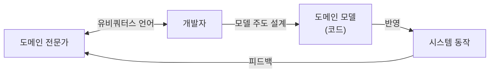
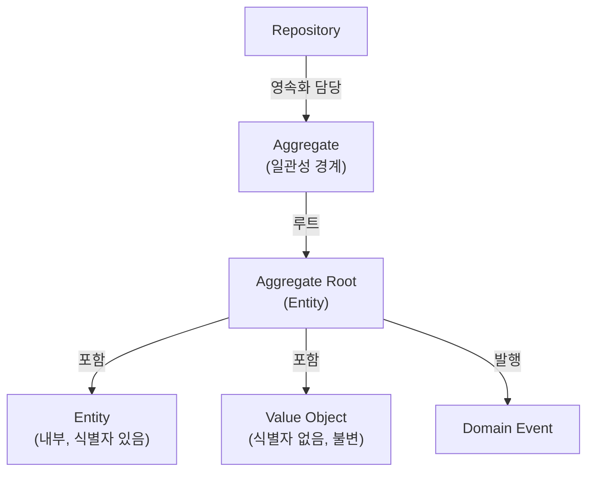

# 13. 도메인 주도 설계(DDD)의 핵심 개념

Phase 3까지는 "코드를 어떻게 구조화할 것인가"를 다뤘습니다. Phase 4에서 시작하는 도메인 주도 설계(Domain-Driven Design, DDD)는 질문의 방향이 다릅니다. <strong>"복잡한 업무 규칙을 어디에, 어떤 형태로 둬야 시간이 지나도 코드가 그 규칙을 정확히 반영하는가"</strong>를 묻습니다. 13장은 14~16장에서 다룰 바운디드 컨텍스트, 엔티티/밸류 오브젝트, 애그리거트/리포지터리라는 빌딩 블록들이 전체 그림에서 어디에 위치하는지 먼저 지도로 그립니다.

## 학습 목표

- DDD가 해결하려는 문제(도메인 지식의 소실과 왜곡)를 구체적으로 설명할 수 있다.
- 유비쿼터스 언어와 모델 주도 설계의 관계를 설명할 수 있다.
- 전략적 설계와 전술적 설계의 차이를 구분하고, 14~16장에서 각각 무엇을 다룰지 예측할 수 있다.

## 탄생 배경: 왜 DDD가 필요했는가

Eric Evans는 2003년 저서 『Domain-Driven Design: Tackling Complexity in the Heart of Software』에서 DDD를 체계화했습니다. Evans가 관찰한 문제는 단순했습니다. 프로젝트 초기에 도메인 전문가와 개발자가 함께 정리한 개념 모델은 시간이 지나면서 코드와 점점 멀어집니다. 화면에 필드를 추가하고, 서비스 클래스에 조건문을 끼워 넣는 과정이 반복되면, 정작 "주문을 취소할 수 있는 조건"같은 핵심 규칙은 여러 서비스 클래스에 흩어진 `if`문으로만 존재하게 됩니다. 새로 합류한 개발자는 코드를 다 읽어야만 업무 규칙을 알 수 있고, 도메인 전문가는 코드를 읽을 수 없으니 검증에서 배제됩니다.

DDD는 이 문제를 "모델과 코드를 분리된 산출물로 취급하지 말고, **모델이 곧 코드가 되도록** 설계하라"는 방향으로 풀어냅니다. 이 접근은 10장에서 다룬 클린/헥사고날 아키텍처와 자연스럽게 맞물립니다. 도메인 모델이 프레임워크·DB로부터 독립적으로 설계돼야, 모델이 업무 규칙을 순수하게 표현할 수 있기 때문입니다.

## 유비쿼터스 언어: 같은 단어를 같은 의미로

DDD의 첫 번째 실천 도구는 <strong>유비쿼터스 언어(Ubiquitous Language)</strong>입니다. 이는 도메인 전문가와 개발자가 대화, 문서, 코드 전체에서 동일한 용어를 동일한 의미로 사용하기로 합의하는 것입니다. "주문 취소"와 "주문 반품"이 업무적으로 다른 개념이라면, 코드에서도 `cancelOrder()`와 `returnOrder()`처럼 구분된 이름을 써야 합니다. 코드에서 이 둘을 뭉뚱그려 `updateOrderStatus()`로 처리하면, 나중에 두 규칙이 달라져야 할 때(반품은 환불 절차가 필요하지만 취소는 아님) 어디를 고쳐야 할지 코드만으로는 알 수 없습니다.

유비쿼터스 언어는 한 번 정하고 끝나는 용어집이 아니라, 도메인 전문가와의 대화에서 계속 다듬어지는 **살아있는 합의**입니다. 이 언어가 명확할수록 코드의 클래스명·메서드명이 업무 규칙을 그대로 드러내게 됩니다.

## 모델 주도 설계: 모델이 코드가 된다

유비쿼터스 언어로 정리된 개념은 <strong>모델 주도 설계(Model-Driven Design)</strong>를 통해 실제 클래스 구조로 옮겨집니다. 이때 핵심은 "분석 모델"과 "설계 모델"을 별도 산출물로 만들지 않는다는 것입니다. UML 다이어그램은 참고 자료일 뿐이고, **실제 진실의 원천은 코드**입니다. 05~08장에서 다룬 요구사항 분석, 유스케이스, 클래스/동적 모델링은 DDD에서도 그대로 쓰이지만, 결과물이 "문서용 다이어그램"에 머무르지 않고 "코드 구조 그 자체"가 되어야 한다는 점이 다릅니다.

## DDD의 두 층위: 전략적 설계와 전술적 설계

DDD는 흔히 두 층위로 나눠 설명됩니다.

- **전략적 설계(Strategic Design)**: 큰 시스템을 어떤 경계로 나눌 것인가를 다룹니다. 하나의 유비쿼터스 언어가 일관되게 통하는 범위를 <strong>바운디드 컨텍스트(Bounded Context)</strong>라 부르고, 여러 바운디드 컨텍스트 사이의 관계를 정리한 것이 <strong>컨텍스트 맵(Context Map)</strong>입니다. 14장에서 다룹니다.
- **전술적 설계(Tactical Design)**: 하나의 바운디드 컨텍스트 안에서 도메인 모델을 실제로 구현하는 패턴들을 다룹니다. 정체성을 가진 **엔티티(Entity)**, 값 자체로 의미를 갖는 **밸류 오브젝트(Value Object)**, 일관성 경계를 이루는 **애그리거트(Aggregate)**, 저장을 추상화하는 <strong>리포지터리(Repository)</strong>가 이 층위에 속합니다. 15~16장에서 다룹니다.

한 문장으로 정리하면, 전략적 설계는 "어디까지가 하나의 모델인가"를 정하고, 전술적 설계는 "그 모델을 코드로 어떻게 표현하는가"를 정합니다. 대규모 시스템에서는 전략적 설계 없이 전술적 설계 패턴만 적용하면, 잘 만든 엔티티·애그리거트가 서로 다른 의미의 "주문"을 뒤섞어 참조하는 문제가 생깁니다. 반드시 전략적 설계가 전술적 설계보다 먼저 판단되어야 합니다.

## 빌딩 블록 한눈에 보기

16장까지 다룰 전술적 설계 요소들의 관계를 미리 정리하면 다음과 같습니다.

이 그림에서 보듯, 밸류 오브젝트와 엔티티는 애그리거트 안에 속하고, 리포지터리는 애그리거트 단위로만 저장/조회를 담당합니다. "리포지터리가 엔티티 하나하나를 저장한다"고 오해하기 쉬운데, 정확히는 **애그리거트 루트 단위**로 저장한다는 점을 16장에서 자세히 다룹니다.

## 흔한 오해: DDD는 엔티티·밸류 오브젝트 같은 코딩 패턴이다

DDD를 처음 접하면 "Entity 클래스와 Value Object 클래스를 구분해서 쓰는 기법"으로 오해하기 쉽습니다. 하지만 Evans가 강조한 것은 전술적 패턴이 아니라 **유비쿼터스 언어와 모델 주도 설계라는 협업 방식**이었습니다. 전술적 패턴(엔티티, 밸류 오브젝트, 애그리거트)은 그 협업의 결과물을 코드로 옮기는 도구에 불과합니다. 도메인 전문가와의 대화 없이 Entity/Value Object 코딩 스타일만 흉내 내면, 클래스 이름만 DDD식이고 실제 업무 규칙은 여전히 서비스 계층에 흩어진 "DDD처럼 보이는 코드"가 됩니다. 또한 모든 도메인에 DDD 전술 패턴이 필요한 것도 아닙니다. 규칙이 단순한 CRUD 위주 도메인이라면, 무거운 애그리거트 구조 없이 단순한 트랜잭션 스크립트로도 충분합니다.

## 실무 체크리스트

- 도메인 전문가와 개발자가 회의에서 쓰는 용어와 코드의 클래스/메서드명이 일치하는가?
- "취소"와 "반품"처럼 업무적으로 다른 개념이 코드에서도 다른 이름으로 구분되는가?
- 핵심 업무 규칙이 서비스 계층의 조건문이 아니라 도메인 모델 안에 있는가?
- 이 프로젝트의 도메인이 DDD 전술 패턴을 정당화할 만큼 복잡한가, 아니면 단순 CRUD로 충분한가?

## 연습 과제

### 기초(★☆☆)
- 여러분의 프로젝트에서 도메인 전문가(기획자/PM)가 쓰는 용어와 코드의 변수·메서드명이 다른 곳을 3개 찾아보세요.

### 중급(★★☆)
- 하나의 업무 규칙(예: "재고가 없으면 주문을 만들 수 없다")이 코드의 어느 위치(서비스 계층? 도메인 객체?)에 있는지 추적해보세요.

### 고급(★★★)
- 여러분의 도메인에서 "주문"이라는 단어가 실제로는 서로 다른 의미로 쓰이는 팀·화면이 있는지 조사하고, 그 경계를 14장에서 다룰 바운디드 컨텍스트 후보로 표시해보세요.

## 요약

- DDD는 코딩 패턴이 아니라, 유비쿼터스 언어와 모델 주도 설계로 도메인 지식의 소실을 막는 접근이다.
- 전략적 설계(경계를 정한다)가 전술적 설계(경계 안을 구현한다)보다 먼저다.
- 모든 도메인에 DDD 전술 패턴이 필요한 것은 아니며, 복잡도가 그 비용을 정당화할 때 적용한다.

## 참고 문헌 및 출처(추천)

- Eric Evans, 『Domain-Driven Design: Tackling Complexity in the Heart of Software』(2003)
- Vaughn Vernon, 『Implementing Domain-Driven Design』(2013)
- Martin Fowler, "DomainDrivenDesign"(martinfowler.com bliki)

---

## 다음 글

- 다음: [14. 전략적 설계: 바운디드 컨텍스트](../strategic-design-bounded-context/)
