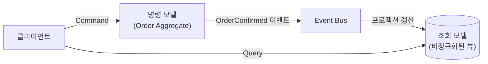
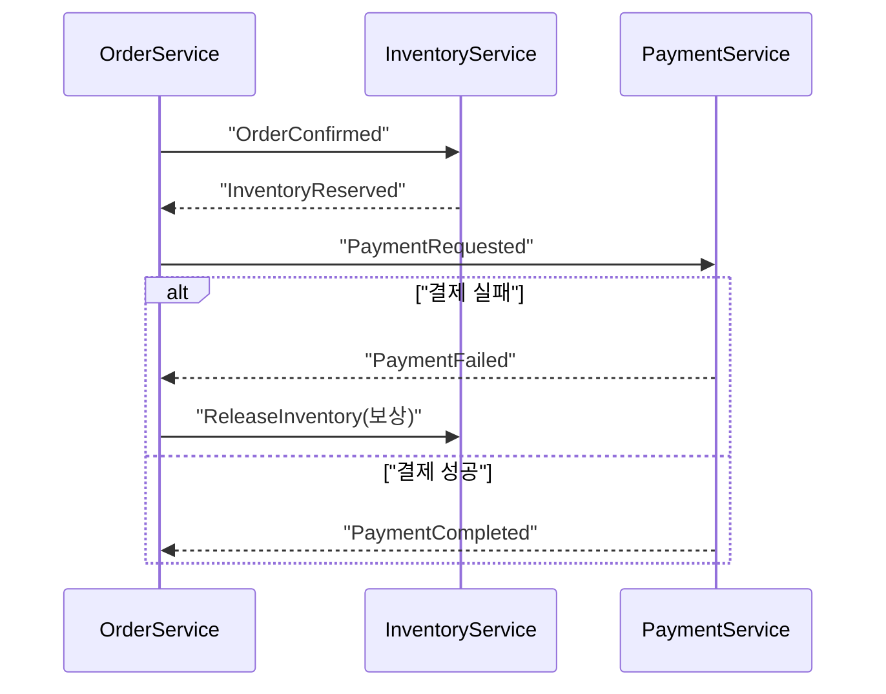

# 19. 이벤트 기반 아키텍처와 CQRS

17장에서 서비스 간 통신을 API 호출뿐 아니라 이벤트로도 할 수 있다고 언급했습니다. 19장은 그 이벤트를 도메인 모델 안에서 어떻게 발행하는지, 그리고 쓰기와 읽기 요구사항이 크게 다를 때 모델 자체를 분리하는 CQRS(Command Query Responsibility Segregation)를 다룹니다.

## 학습 목표

- 도메인 이벤트를 애그리거트 내부 변경의 부산물로 발행하는 구조를 설계할 수 있다.
- CQRS가 "쓰기 모델과 읽기 모델을 나눈다"는 것의 실제 의미와, 이것이 강제하는 최종 일관성을 설명할 수 있다.
- 이벤트 기반 아키텍처가 필요한 상황과, 오히려 복잡도만 늘리는 상황을 구분할 수 있다.

## 도메인 이벤트: 애그리거트가 일어난 사실을 알린다

13장에서 예고했던 <strong>도메인 이벤트(Domain Event)</strong>는 "애그리거트 안에서 의미 있는 일이 일어났다"는 사실을 표현하는 불변 객체입니다. 12장에서 다룬 이벤트 기반 확장(Observer 패턴)과 유사하지만, 도메인 이벤트는 단순한 콜백이 아니라 **"주문이 확정됐다"처럼 유비쿼터스 언어로 이름 붙은 사실**이라는 점이 다릅니다.

```python
from dataclasses import dataclass, field


@dataclass(frozen=True)
class OrderConfirmed:
    order_id: str
    total: int


class Order:
    def __init__(self, order_id: str) -> None:
        self.order_id = order_id
        self._lines: list = []
        self._events: list = []

    def confirm(self, total: int) -> None:
        # 상태 변경과 함께, 그 사실을 이벤트로 기록한다
        self._events.append(OrderConfirmed(order_id=self.order_id, total=total))

    def pull_events(self) -> list:
        events, self._events = self._events, []
        return events
```

애그리거트는 자신의 상태를 바꾸면서 동시에 이벤트를 쌓아두고, 애플리케이션 서비스(유스케이스)가 저장 트랜잭션이 성공한 뒤 이 이벤트들을 꺼내 이벤트 버스에 발행합니다. 16장에서 다룬 "하나의 트랜잭션에는 하나의 애그리거트만"이라는 원칙과 결합하면, 다른 애그리거트나 다른 서비스에 대한 영향은 항상 **이벤트를 통한 사후 처리**로 이뤄지고, 절대 하나의 트랜잭션 안에 여러 애그리거트를 묶지 않게 됩니다.

## CQRS: 쓰기 모델과 읽기 모델을 분리한다

Greg Young이 정리한 CQRS는 Bertrand Meyer가 제안한 **명령-쿼리 분리(Command-Query Separation, CQS)** 원칙(메서드는 상태를 바꾸거나 값을 반환하거나 둘 중 하나만 해야 한다)을 아키텍처 수준으로 확장한 것입니다. 하나의 도메인 모델로 쓰기(명령)와 읽기(조회)를 모두 처리하려 하면 문제가 생기는 경우가 있습니다. 주문 목록 화면은 "고객명, 상품명, 배송 상태"처럼 여러 애그리거트에 걸친 데이터를 한 번에 보여줘야 하는데, 16장에서 다룬 애그리거트 원칙(작게, 식별자로만 참조)을 그대로 지키면 이런 조회는 여러 번의 조회와 조합이 필요해 비효율적입니다.

CQRS는 이 둘을 아예 다른 모델로 분리합니다. <strong>명령 모델(쓰기)</strong>은 애그리거트 중심으로 불변조건을 강제하는 데 최적화되고, <strong>조회 모델(읽기)</strong>은 화면이 필요로 하는 형태로 미리 비정규화된 데이터를 제공하는 데 최적화됩니다.



조회 모델은 명령 모델이 발행한 이벤트를 구독해 자신의 데이터(프로젝션, Projection)를 갱신합니다. 이 구조에서 조회 모델은 명령이 반영된 직후 즉시 최신 상태가 아니라, 이벤트가 전달되고 처리될 때까지의 짧은 지연을 갖습니다. 이를 <strong>최종 일관성(Eventual Consistency)</strong>이라 부르며, CQRS를 도입한다는 것은 이 지연을 감수하겠다는 트레이드오프를 받아들이는 것입니다.

## 이벤트 소싱과의 관계

CQRS는 흔히 <strong>이벤트 소싱(Event Sourcing)</strong>과 함께 언급되지만 별개의 개념입니다. 이벤트 소싱은 애그리거트의 현재 상태를 저장하는 대신, **상태에 이르기까지의 모든 이벤트를 순서대로 저장**하고 필요할 때 이벤트를 재생해 현재 상태를 재구성하는 기법입니다(Martin Fowler, "Event Sourcing", martinfowler.com). CQRS는 이벤트 소싱 없이도(전통적인 테이블에 현재 상태만 저장하면서도) 쓰기/읽기 모델만 분리해 적용할 수 있습니다. 반대로 이벤트 소싱을 도입하면 자연스럽게 CQRS가 함께 필요해지는 경우가 많은데, 이벤트 스트림 자체는 화면에 바로 쓰기 어려운 형태이므로 별도의 조회용 프로젝션이 사실상 필수이기 때문입니다.

## 서비스 간 최종 일관성: 사가 패턴

17장에서 언급한 "여러 서비스에 걸친 트랜잭션은 단일 트랜잭션으로 묶을 수 없다"는 문제도 도메인 이벤트로 풀 수 있습니다. 주문 확정 → 재고 차감 → 결제 승인이 서로 다른 서비스에 걸쳐 있다면, 각 단계가 이벤트로 다음 단계를 트리거하고, 중간 단계가 실패하면 이미 완료된 이전 단계를 취소하는 **보상 이벤트**를 발행하는 방식을 <strong>사가 패턴(Saga Pattern)</strong>이라 부릅니다. 08장에서 다룬 "실패를 먼저 모델링하라"는 조언이 분산 환경에서 사가로 구체화되는 것입니다.



## 흔한 오해: CQRS는 항상 두 개의 데이터베이스를 뜻한다

CQRS를 "명령용 DB와 조회용 DB를 물리적으로 분리하는 기법"으로만 이해하는 것은 흔한 오해입니다. 가장 단순한 형태의 CQRS는 같은 데이터베이스 안에서 쓰기용 리포지터리(애그리거트 단위)와 읽기용 쿼리(단순 SQL 뷰나 별도 조회 메서드)를 코드 상으로만 분리하는 것으로 시작할 수 있습니다. 물리적으로 별도의 저장소(읽기 전용 캐시, 검색 엔진 등)까지 분리하는 것은 조회 성능이 실제로 병목이 될 때 추가하는 다음 단계입니다. 처음부터 물리적 분리와 이벤트 소싱까지 모두 도입하면, 대부분의 CRUD 위주 기능에는 불필요한 운영 복잡도(이벤트 버스 장애 대응, 프로젝션 재구성 로직)를 떠안게 됩니다.

## 실무 체크리스트

- 쓰기 모델(애그리거트)과 읽기 모델(화면용 조회)의 요구사항이 실제로 크게 다른가, 아니면 단순 조회로 충분한가?
- 도메인 이벤트가 애그리거트 트랜잭션이 성공한 뒤에만 발행되도록 보장되는가?
- 조회 모델의 최종 일관성 지연이 사용자 경험상 허용 가능한 수준인가?
- 여러 서비스에 걸친 작업에 보상 이벤트(사가) 전략이 정의돼 있는가?

## 연습 과제

### 기초(★☆☆)
- `Order.confirm()`처럼 상태 변경 메서드에 도메인 이벤트를 함께 기록하는 패턴을 15~16장에서 설계한 `Order` 애그리거트에 추가해보세요.

### 중급(★★☆)
- 주문 목록 조회 화면에 필요한 데이터(고객명, 상품명, 상태)를 프로젝션 테이블로 설계하고, `OrderConfirmed` 이벤트를 구독해 이 테이블을 갱신하는 핸들러를 작성해보세요.

### 고급(★★★)
- 주문-재고-결제 3단계로 이뤄진 사가를 설계하고, 결제 실패 시 재고를 복원하는 보상 이벤트 흐름을 시퀀스 다이어그램으로 그려보세요.

## 요약

- 도메인 이벤트는 애그리거트 트랜잭션이 성공한 뒤 발행되는, 유비쿼터스 언어로 이름 붙은 사실이다.
- CQRS는 쓰기 모델과 읽기 모델을 분리해 각각을 목적에 맞게 최적화하되, 최종 일관성이라는 비용을 동반한다.
- 서비스 경계를 넘는 작업은 사가 패턴으로, 실패 시 보상 이벤트를 함께 설계해야 한다.

## 참고 문헌 및 출처(추천)

- Greg Young, "CQRS Documents"(2010) 및 관련 발표
- Martin Fowler, "Event Sourcing", "CQRS"(martinfowler.com)
- Chris Richardson, 『Microservices Patterns』(2018) — Saga 패턴 장

---

## 다음 글

- 다음: [20. 레거시 시스템 현대화 전략](../legacy-system-modernization-strategy/)
