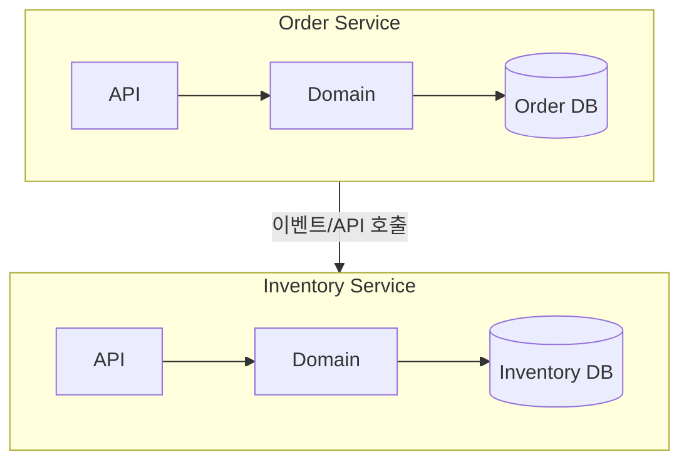

# 17. 마이크로서비스 아키텍처와 OOAD

14장에서 정의한 바운디드 컨텍스트는 "모델의 경계"였고, 17장은 그 경계를 **배포 단위**로 실현하는 마이크로서비스 아키텍처를 다룹니다. 마이크로서비스는 유행하는 기술 스타일이 아니라, 조직이 커질 때 바운디드 컨텍스트 경계를 물리적으로도 분리해 팀의 자율성을 확보하는 선택지 중 하나입니다.

## 학습 목표

- 마이크로서비스 경계를 기술 계층이 아니라 바운디드 컨텍스트/비즈니스 역량 기준으로 나눠야 하는 이유를 설명할 수 있다.
- "데이터베이스는 서비스마다 하나"라는 원칙이 지키는 것과, 이를 어겼을 때 생기는 문제를 설명할 수 있다.
- 마이크로서비스 도입이 정당화되는 조건과, 오히려 손해가 되는 조건을 구분할 수 있다.

## 서비스 경계를 어떻게 그을 것인가

마이크로서비스를 처음 도입할 때 흔히 저지르는 실수는 계층(레이어)을 서비스 경계로 오해하는 것입니다. "UI 서비스", "비즈니스 로직 서비스", "DB 서비스"처럼 10장에서 다룬 계층을 그대로 네트워크로 쪼개면, 요청 하나를 처리하는 데 서비스 3개를 순서대로 호출해야 하고 서비스 간 결합도는 오히려 모놀리식보다 높아집니다.

Chris Richardson은 『Microservices Patterns』(2018)에서 서비스 분해 전략으로 **비즈니스 역량 기준 분해(Decompose by Business Capability)**와 **하위 도메인 기준 분해(Decompose by Subdomain)**를 제시합니다. 두 전략 모두 핵심은 같습니다. 서비스를 "레이어"가 아니라 **14장에서 정의한 바운디드 컨텍스트** 기준으로 나눈다는 것입니다. "주문 컨텍스트", "재고 컨텍스트", "정산 컨텍스트"가 각각 하나의 서비스가 되고, 각 서비스는 자신의 컨텍스트 안에서는 스스로 계층(UI-비즈니스-DB)을 온전히 갖춥니다.

## 데이터 소유권: 서비스마다 자신의 데이터베이스를 가진다

마이크로서비스 아키텍처의 가장 엄격한 원칙 중 하나는 **각 서비스가 자신의 데이터베이스를 독점적으로 소유하고, 다른 서비스는 그 데이터에 직접 접근할 수 없다**는 것입니다. 여러 서비스가 하나의 공유 DB를 바라보면, 스키마를 바꾸려 할 때 다른 팀의 서비스가 함께 영향을 받아 배포를 독립적으로 할 수 없게 되고, 이는 마이크로서비스로 나눈 목적(팀의 독립적 배포) 자체를 무너뜨립니다.

이 원칙은 16장에서 다룬 애그리거트 경계와 정확히 대응합니다. 애그리거트가 "하나의 트랜잭션에서 일관돼야 하는 최소 단위"였다면, 마이크로서비스 경계는 그 애그리거트/컨텍스트를 넘어서는 트랜잭션을 애초에 만들지 않도록 강제합니다. 주문 서비스가 재고 데이터를 직접 SELECT하는 대신, 재고 서비스가 제공하는 API나 이벤트를 통해서만 정보를 얻어야 합니다. 이 통신 방식은 19장에서 다룰 이벤트 기반 아키텍처와 자연스럽게 연결됩니다.

## 분산 시스템이 가져오는 새로운 문제

서비스를 네트워크로 분리하면 모놀리식에는 없던 문제가 생깁니다. 함수 호출은 실패하지 않는다고 가정할 수 있지만, 네트워크 호출은 타임아웃·부분 실패·순서 뒤바뀜이 항상 가능합니다. 08장에서 다룬 시퀀스 다이어그램의 "실패/지연을 먼저 모델링하라"는 조언은 마이크로서비스 환경에서 선택이 아니라 필수가 됩니다.

- **부분 실패**: 주문 서비스가 재고 서비스 호출에 실패했을 때 무엇을 해야 하는가(재시도? 실패 처리? 보상?)
- **데이터 일관성**: 여러 서비스에 걸친 작업은 단일 트랜잭션으로 묶을 수 없으므로, 최종 일관성(eventual consistency)을 받아들여야 함
- **관측 가능성**: 요청 하나가 여러 서비스를 거치므로, 분산 추적(distributed tracing)과 중앙화된 로깅 없이는 문제를 진단하기 어려움

## 흔한 오해: 마이크로서비스가 곧 좋은 아키텍처다

마이크로서비스는 조직이 커지고, 팀마다 독립적으로 배포해야 하는 실질적 압력이 있을 때 그 비용(운영 복잡도, 분산 시스템 문제, 네트워크 지연)을 정당화합니다. 팀 하나가 전체 시스템을 관리하는 초기 스타트업이 처음부터 서비스를 10개로 쪼개면, 배포 자율성이라는 이득 없이 분산 시스템의 비용만 떠안게 됩니다. 게다가 14장에서 언급했듯, 컨텍스트 경계를 명확히 정하지 않은 채 서비스만 물리적으로 나누면 서비스 간 호출이 뒤엉킨 "분산된 진흙 덩어리(Distributed Big Ball of Mud)"가 됩니다. 이는 모놀리식의 문제를 네트워크 지연이라는 비용까지 얹어 반복하는 결과입니다.

이런 이유로 많은 팀이 **모듈러 모놀리스(Modular Monolith)**를 절충안으로 택합니다. 하나의 배포 단위 안에서 바운디드 컨텍스트별로 모듈 경계(패키지/모듈 수준의 강한 캡슐화)를 엄격히 지키다가, 실제로 팀을 분리하고 독립 배포가 필요해지는 시점에 해당 모듈을 별도 서비스로 추출하는 방식입니다. 컨텍스트 경계가 이미 명확하다면 이 추출은 비교적 안전하게 이뤄집니다.

## 실무 체크리스트

- 서비스 경계가 레이어(UI/로직/DB)가 아니라 바운디드 컨텍스트 기준으로 그어졌는가?
- 서비스가 다른 서비스의 데이터베이스에 직접 쿼리를 던지고 있지 않은가?
- 여러 서비스에 걸친 호출에서 타임아웃/재시도/보상 전략이 정의돼 있는가?
- 지금 조직 구조와 배포 빈도가 마이크로서비스 도입 비용을 정당화하는가, 아니면 모듈러 모놀리스로도 충분한가?

## 연습 과제

### 기초(★☆☆)
- 14장에서 그린 컨텍스트 맵을 그대로 서비스 경계 후보로 옮겨보고, 레이어 기준으로 나눴다면 어떻게 달랐을지 비교해보세요.

### 중급(★★☆)
- 주문 서비스가 재고 서비스를 호출하는 시나리오에서, 재고 서비스가 3초간 응답하지 않을 때의 타임아웃/재시도 정책을 설계해보세요.

### 고급(★★★)
- 현재 모놀리식으로 운영 중인(또는 가정한) 시스템을 모듈러 모놀리스로 먼저 재구성하는 계획을 세우고, 어느 모듈을 가장 먼저 별도 서비스로 추출할지 우선순위를 근거와 함께 정해보세요.

## 요약

- 마이크로서비스 경계는 레이어가 아니라 바운디드 컨텍스트/비즈니스 역량 기준으로 긋는다.
- 각 서비스는 자신의 데이터베이스를 독점 소유해야 애그리거트 일관성 경계가 네트워크를 넘어 깨지지 않는다.
- 조직 규모와 독립 배포 압력이 비용을 정당화하지 않는다면 모듈러 모놀리스가 더 나은 절충안일 수 있다.

## 참고 문헌 및 출처(추천)

- Chris Richardson, 『Microservices Patterns』(2018)
- Sam Newman, 『Building Microservices』(2015/2021)
- Melvin Conway, "How Do Committees Invent?"(1968) — Conway's Law

---

## 다음 글

- 다음: [18. 클린 아키텍처와 헥사고날 아키텍처](../clean-hexagonal-architecture/)
