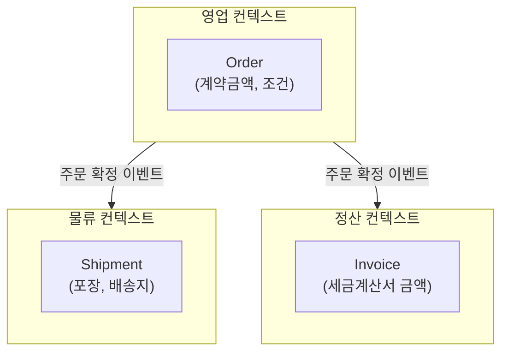
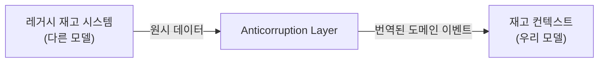

# 14. 전략적 설계: 바운디드 컨텍스트

13장에서 DDD의 전체 지도를 그렸다면, 14장은 그 지도의 첫 단계인 **전략적 설계**를 다룹니다. 전략적 설계의 핵심 질문은 "우리 시스템 안에서 하나의 모델이 통용되는 범위는 어디까지인가"입니다. 이 범위를 잘못 정하면, 아무리 정교한 엔티티·애그리거트를 만들어도(15~16장) 서로 다른 의미의 개념을 하나의 클래스로 뭉뚱그리는 근본적인 문제가 남습니다.

## 학습 목표

- 바운디드 컨텍스트가 "모듈 폴더"가 아니라 "유비쿼터스 언어가 일관되는 경계"임을 설명할 수 있다.
- 컨텍스트 맵의 주요 관계 패턴(공유 커널, 컨포미스트, 부패 방지 계층, 공개 호스트 서비스)을 구분하고 언제 쓰는지 판단할 수 있다.
- 하나의 시스템에서 같은 이름이 다른 의미로 쓰이는 지점을 찾아 컨텍스트 경계 후보로 표시할 수 있다.

## 바운디드 컨텍스트: 같은 단어, 다른 뜻

"주문(Order)"이라는 단어를 생각해봅시다. 영업팀에게 주문은 "고객이 계약하기로 합의한 금액과 조건"을 의미하고, 물류팀에게 주문은 "포장하고 배송해야 할 상품 목록과 주소"를 의미하며, 정산팀에게 주문은 "세금계산서를 발행할 금액과 날짜"를 의미합니다. 세 팀 모두 "주문"이라는 같은 단어를 쓰지만 실제로 필요한 데이터와 규칙은 다릅니다.

이 세 가지 의미를 억지로 하나의 `Order` 클래스에 담으면, 영업팀 요구사항으로 필드를 추가할 때마다 물류팀 로직이 영향받을 위험이 생깁니다. <strong>바운디드 컨텍스트(Bounded Context)</strong>는 이 문제에 대한 답입니다. "주문"이라는 단어가 하나의 일관된 의미로 통용되는 범위를 명시적으로 정하고, 그 범위 밖에서는 같은 단어라도 다른 모델(다른 클래스, 다른 필드)로 취급합니다.

바운디드 컨텍스트를 나누는 기준은 조직 구조와도 밀접하게 연관됩니다. Evans는 컨텍스트 경계가 보통 **하나의 팀이 일관되게 관리할 수 있는 범위**와 겹친다고 관찰했습니다. 이는 Conway's Law(시스템 설계는 그 시스템을 만든 조직의 커뮤니케이션 구조를 반영한다, Melvin Conway, 1968)와도 연결되며, 17장에서 다룰 마이크로서비스 경계 설정의 이론적 근거가 됩니다.

## 컨텍스트 맵: 경계 사이의 관계를 명시한다

바운디드 컨텍스트를 나누는 것만으로는 충분하지 않습니다. 컨텍스트들은 서로 무관하지 않고 데이터를 주고받아야 하므로, **그 관계의 성격**을 명시적으로 정해야 합니다. Evans와 이후 Vaughn Vernon(『Implementing Domain-Driven Design』, 2013)이 정리한 주요 관계 패턴은 다음과 같습니다.

- **공유 커널(Shared Kernel)**: 두 컨텍스트가 일부 모델(예: 공통 `Money` 값 타입)을 공유하기로 명시적으로 합의. 공유 범위가 넓어질수록 두 팀의 결합도가 높아지므로 최소한으로 유지
- **고객-공급자(Customer-Supplier)**: 한 컨텍스트(공급자)가 다른 컨텍스트(고객)의 요구사항을 우선 반영하기로 합의한 관계. 두 팀 간 우선순위 협상이 필요
- **순응자(Conformist)**: 고객 컨텍스트가 공급자의 모델을 그대로 따르는 관계. 외부 API를 바꿀 힘이 없을 때(외부 결제사 등) 현실적으로 선택
- **부패 방지 계층(Anticorruption Layer, ACL)**: 외부/레거시 모델을 그대로 들여오지 않고, 번역 계층을 둬서 자신의 모델을 오염시키지 않는 관계. 레거시 연동이나 원치 않는 외부 모델을 다룰 때 사용
- **공개 호스트 서비스(Open Host Service)**: 여러 컨텍스트가 함께 쓸 수 있도록 잘 정의된 공개 API/이벤트 형식(공개 언어, Published Language)을 제공하는 관계

부패 방지 계층은 10장에서 다룬 포트/어댑터 구조와 본질적으로 같은 발상입니다. 차이는 헥사고날 아키텍처가 "인프라 기술"과 도메인을 분리한다면, ACL은 "다른 팀의 도메인 모델"과 우리 도메인을 분리한다는 점입니다.

## 언제 나눌 것인가: 지나친 분할의 비용

컨텍스트를 나누는 것 자체에도 비용이 따릅니다. 컨텍스트 경계마다 번역 계층, 이벤트 발행/구독, 데이터 중복이 필요해집니다. 컨텍스트를 너무 잘게 나누면 간단한 기능 하나를 구현하는 데도 여러 컨텍스트를 오가며 이벤트를 설계해야 하는 오버헤드가 생깁니다. 반대로 너무 크게 묶으면 13장에서 지적한 "같은 이름, 다른 뜻" 문제가 다시 나타납니다.

실무적인 판단 기준은 다음과 같습니다. 두 후보 영역에서 **같은 명사(주문, 상품, 사용자 등)가 서로 다른 속성/규칙을 요구하고, 그 차이가 팀 간 조율 없이는 해소되지 않는다면** 별도 컨텍스트로 나눌 근거가 있습니다. 반대로 용어와 규칙이 대체로 일치하고 팀도 같다면, 굳이 컨텍스트를 나눠 번역 비용을 만들 필요가 없습니다.

## 흔한 오해: 바운디드 컨텍스트는 마이크로서비스와 같다

바운디드 컨텍스트를 마이크로서비스와 동일시하는 것은 흔한 오해입니다. 바운디드 컨텍스트는 **모델의 경계**(설계 개념)이고, 마이크로서비스는 **배포 단위**(운영 개념)입니다. 하나의 바운디드 컨텍스트를 여러 서비스로 나누거나, 초기에는 여러 바운디드 컨텍스트를 하나의 배포 단위(모듈러 모놀리스) 안에 두고 서비스 경계는 나중에 확정할 수도 있습니다. 컨텍스트 경계를 먼저 명확히 정하지 않은 채 마이크로서비스부터 나누면, 물리적으로는 분리됐지만 논리적으로는 여전히 뒤섞인 "분산된 진흙 덩어리(Distributed Big Ball of Mud)"가 됩니다. 이 구분은 17장에서 마이크로서비스 경계를 설계할 때 다시 다룹니다.

## 실무 체크리스트

- 같은 명사(주문, 상품, 사용자)가 우리 시스템 안에서 서로 다른 속성/규칙으로 쓰이는 곳이 있는가?
- 두 영역 사이의 관계가 공유 커널/순응자/부패 방지 계층 중 어디에 가까운지 명시적으로 합의했는가?
- 외부 시스템이나 레거시 모델을 우리 도메인에 그대로 들여오고 있지는 않은가?
- 컨텍스트 경계와 팀 조직 구조가 크게 어긋나 있지는 않은가?

## 연습 과제

### 기초(★☆☆)
- 13장에서 찾은 "같은 단어, 다른 뜻" 사례를 컨텍스트 맵으로 그려보세요(박스 2~3개, 관계 화살표 표시).

### 중급(★★☆)
- 외부 결제사 API를 연동하는 상황을 가정하고, 부패 방지 계층 없이 연동했을 때와 부패 방지 계층을 뒀을 때 도메인 모델이 어떻게 달라지는지 비교해보세요.

### 고급(★★★)
- 여러분의 실제 프로젝트(또는 익숙한 서비스)의 컨텍스트 맵을 그리고, 각 관계에 공유 커널/고객-공급자/순응자/ACL/공개 호스트 서비스 중 어느 것이 적용되는지 표시해보세요.

## 요약

- 바운디드 컨텍스트는 유비쿼터스 언어가 일관되게 통용되는 모델의 경계다.
- 컨텍스트 간 관계는 공유 커널, 순응자, 부패 방지 계층 등으로 명시적으로 정의해야 결합도를 통제할 수 있다.
- 바운디드 컨텍스트는 설계 개념이고 마이크로서비스는 배포 개념이므로, 둘을 동일시하지 않는다.

## 참고 문헌 및 출처(추천)

- Eric Evans, 『Domain-Driven Design』(2003) — Bounded Context, Context Map 원전
- Vaughn Vernon, 『Implementing Domain-Driven Design』(2013)
- Melvin Conway, "How Do Committees Invent?"(1968) — Conway's Law 원전

---

## 다음 글

- 다음: [15. 전술적 설계: 엔티티와 밸류 오브젝트](../tactical-design-entity-value-object/)
