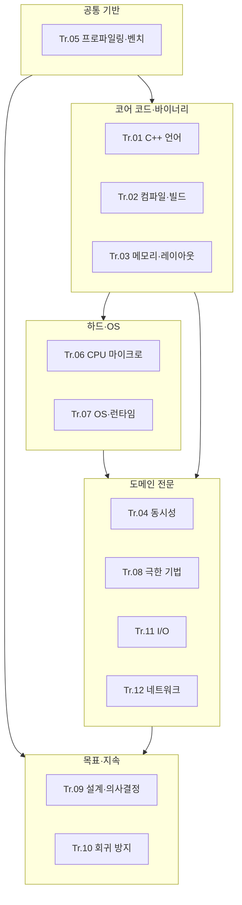

이 문서는 **12개 Low-latency 최적화 트랙**을 한 지도 위에 올려, 무엇을 먼저 읽고 **언제 심화(전문) 챕터로 들어갈지** 판단하는 데 쓰입니다. 각 트랙의 세부 커리큘럼·난이도 열·Phase 설명은 해당 트랙의 **00-introduction**에 있습니다. 여기서는 **트랙 간 선행 관계**와 **Tr.07(개요) ↔ Tr.11·Tr.12(심화)** 같은 분산 심화 구조만 압축해 연결합니다.

**Tr.NN**은 저장소 폴더 `optimization-NN-*` 트랙을 가리킵니다. 아래 링크는 모두 각 트랙의 도입(00) 페이지입니다.

## 편집 목표 난이도 비율 (시리즈 정책)

각 트랙 `00-introduction` 커리큘럼 표의 **난이도** 분포는 재분류·신규 챕터 추가로 아래 **가이드**에 점진적으로 맞춥니다. 수치는 전 트랙 챕터 합계 기준이며, 트랙마다 편차를 둘 수 있습니다.

| 난이도 | 목표 비율 (가이드) | 현재 분포 (213챕터) |
|--------|---------------------|----------------------|
| 기초 | 약 12% | 24 (11.3%) |
| 중급 | 약 45% | 96 (45.1%) |
| 심화 | 약 33% | 71 (33.3%) |
| 전문 | 약 10% | 22 (10.3%) |

각 트랙에는 **기초** 챕터가 최소 1~2개 배치되어 있으며, 대부분 "선행: 챕터 01 전에 읽기 권장"으로 표기되어 있습니다. 입문자는 관심 트랙의 기초 챕터부터 읽으면 전체 구조를 빠르게 잡을 수 있습니다.

**전문** 챕터는 보통 Tr.05로 병목이 좁혀진 뒤, Tr.09(또는 팀 정책)으로 **운영·보안·규제 리스크**를 정리한 다음 진입하는 흐름을 권장합니다.

## 난이도 표 읽는 법

이 시리즈의 **기초·중급·심화·전문**은 "이론 난이도"만이 아니라 **권장 진입 시점**도 함께 뜻합니다. **기초**는 용어·직관·첫 판단 기준을 잡는 장, **중급**은 실무에서 반복해서 꺼내 쓰는 핵심 장, **심화**는 특정 환경·플랫폼·운영 조건이 붙는 장, **전문**은 팀 거버넌스·하드웨어 제약·운영 리스크까지 같이 감당해야 하는 장으로 읽으면 각 트랙 00의 표를 훨씬 덜 헷갈리게 볼 수 있습니다.

## 권장 큰 줄기 (한 문단 요약)

측정과 가설 검증 없이는 어떤 트랙도 공학이 되기 어렵기 때문에 **Tr.05(프로파일링·벤치마크)**를 가능한 한 앞쪽에 둡니다. 그다음 **Tr.01(C++ 언어)·Tr.02(컴파일러)·Tr.03(메모리·레이아웃)**으로 “코드와 바이너리에서 바로 만질 수 있는” 비용을 줄입니다. 그 후 **Tr.06(CPU)·Tr.07(OS)**로 하드웨어·운영환경과 맞닿는 병목을 해석하고, 필요에 따라 **Tr.04(동시성)·Tr.08(극한 기법)·Tr.11(I/O)·Tr.12(네트워크)**로 확장합니다. **Tr.09(설계·의사결정)·Tr.10(회귀 방지)**는 기술 트랙과 병행해 목표·게이트·운영을 닫는 역할을 합니다.

이 문서에서 말하는 **기본 경로**는 `Tr.05 → Tr.01 → Tr.02 → Tr.03 → Tr.06 → Tr.07`입니다. 아래 역할별 경로는 이 기본 경로를 뒤집는 또 다른 표준이 아니라, 실제 병목이 특정 레이어에서 먼저 드러났을 때 **일부 트랙을 앞당기거나 늦추는 예외 경로**로 이해하면 됩니다.

즉, 이 문서에서도 **트랙 표와 번호는 참조용 기준**으로 유지하고, 본문에서만 “누가 먼저 무엇을 읽으면 좋은지”를 설명합니다. 표는 시리즈 전체 지도를 안정적으로 보여 주고, 본문은 현재 역할과 병목에 맞는 온보딩 경로를 안내하는 역할을 맡습니다.

## 단계도: 기반 → 코어 → 시스템 → 전문 → 운영

아래 다이어그램은 **학습·실무 적용 순서의 뼈대**이며, 모든 화살표를 “완주”해야 한다는 뜻은 아닙니다. 병목이 드러난 레이어의 트랙을 우선 열면 됩니다.

## 심화 진입 조건 (실무용 가이드)

**Tr.08 극한 기법**: Tr.05로 핫패스와 병목 가설이 잡혀 있고, Tr.06으로 캐시·분기 이벤트를 해석할 맥락이 있을 때 진입하는 것이 안전합니다. Tr.01~03만으로 남는 비용이 **명령·벡터·prefetch** 쪽으로 좁혀졌다는 신호가 있으면 우선순위가 올라갑니다.

**Tr.04 lock-free·wait-free 다수 챕터**: 경합과 꼬리 지연이 Tr.05·운영 지표에서 **주된 병목**일 때 집중합니다. 메모리 모델·레이아웃(Tr.03) 없이 들어가면 디버깅 비용이 폭증하기 쉽습니다. 먼저 기초(동기화 비용·락 선택)와 중급(barrier/latch·condition_variable·병렬 알고리즘)을 익힌 뒤 lock-free 심화로 넘어가는 것을 권장합니다.

**Tr.11·Tr.12**: Tr.07의 **io_uring·XDP·eBPF·커널 바이패스 개요**를 읽은 뒤, 같은 주제의 **심화**를 Tr.11(파일·블록)·Tr.12(패킷·DPDK)에서 이어 받는 구조입니다. 반대로 Tr.11·12만 보고 Tr.07을 건너뛰면 syscall·스케줄링 맥락이 비어 있을 수 있습니다.

**Tr.09·Tr.10**: Tr.09로 목표·예산·SLO를 정의하고, Tr.10으로 PR·릴리즈 게이트와 연결하는 흐름이 자연스럽습니다. 기술 트랙을 아무리 잘해도 **합의·자동화**가 없으면 성능은 다시 흐트러집니다.

**전문 난이도 챕터 일반**: BOLT·전역 할당자 튜닝·커널/eBPF 경계·규제 하 성능·분산 환경 회귀 등은 **니치·환경 의존**이 큽니다. 표에서 **전문**으로 표시된 행은 스테이징·카나리·롤백 계획(Tr.10)과 세트로 검토하는 것이 안전합니다.

## 트랙 목록과 도입(00) 링크

| Tr | 주제 | 챕터 수 | 도입(00) |
|----|------|---------|-----------|
| 05 | 프로파일링·성능 분석 | 20 | [Tr.05 00](/collection/optimization-05-profiling/00-introduction/) |
| 01 | C++ 언어 최적화 | 19 | [Tr.01 00](/collection/optimization-01-cpp-language/00-introduction/) |
| 02 | 컴파일러·빌드 | 15 | [Tr.02 00](/collection/optimization-02-compiler/00-introduction/) |
| 03 | 메모리·할당·레이아웃 | 16 | [Tr.03 00](/collection/optimization-03-memory-allocation/00-introduction/) |
| 06 | CPU 마이크로아키텍처 | 18 | [Tr.06 00](/collection/optimization-06-cpu-microarchitecture/00-introduction/) |
| 07 | OS·런타임 | 18 | [Tr.07 00](/collection/optimization-07-os-runtime/00-introduction/) |
| 04 | 동시성 | 19 | [Tr.04 00](/collection/optimization-04-concurrency/00-introduction/) |
| 08 | 극한 최적화 기법 | 17 | [Tr.08 00](/collection/optimization-08-optimization-techniques/00-introduction/) |
| 09 | 성능 설계·의사결정 | 18 | [Tr.09 00](/collection/optimization-09-design-decisions/00-introduction/) |
| 10 | 성능 회귀 방지 | 17 | [Tr.10 00](/collection/optimization-10-regression-prevention/00-introduction/) |
| 11 | I/O 최적화 | 17 | [Tr.11 00](/collection/optimization-11-io-network/00-introduction/) |
| 12 | 네트워크 최적화 | 19 | [Tr.12 00](/collection/optimization-12-network/00-introduction/) |

## Tr.07 ↔ Tr.11·Tr.12: 개요와 심화의 역할 나누기

Tr.07에서는 운영자·개발자가 **판단과 측정**에 필요한 수준으로 io_uring, XDP, eBPF, 커널 바이패스를 **개요**로 다룹니다. Tr.11에서는 **파일·블록·DB I/O** 맥락에서 io_uring 등을 **심화**하고, Tr.12에서는 **네트워크 패킷 경로**에서 DPDK·XDP/eBPF를 **심화**합니다. 같은 키워드가 나와도 책임 경계가 다르므로, “이미 Tr.07에서 본 개념을 어디까지 이 트랙에서 실전화하는가”를 표의 난이도·핵심 내용 열과 함께 읽으면 혼선이 줄어듭니다.

## 최소 권장 경로 예시 (역할별)

아래 예시는 어디까지나 **역할별 예외 경로**입니다. 표준 뼈대는 위 기본 경로를 따르되, 병목이 명확할 때만 일부 순서를 조정하는 식으로 읽는 것을 권장합니다.

**애플리케이션 엔지니어**는 Tr.05 → Tr.01 → Tr.03 → (필요 시 Tr.02) 순으로 대부분의 µs 병목을 다룰 수 있는 경우가 많습니다. **인프라에 가까운 저지연 서비스**는 Tr.07을 Tr.06과 묶어 early에 열고, I/O·네트워크가 핫이면 Tr.11·12로 확장합니다. **리드·아키텍트**는 Tr.09를 Tr.05와 같이 일찍 열어 목표와 트랙 경계를 합의한 뒤, Tr.10으로 측정 성과를 고정합니다.

## 평가 기준: 이 문서를 읽은 후 확인

- [ ] 12개 트랙 각각이 대략 어떤 질문에 답하는지 말할 수 있는가?
- [ ] Tr.07 개요와 Tr.11·Tr.12 심화의 차이를 한 문장으로 설명할 수 있는가?
- [ ] 자신의 현재 병목에 맞춰 “다음에 열 트랙” 세트를 고를 수 있는가?

## 핵심 요약

| 항목 | 요약 |
|------|------|
| 전체 규모 | 12 트랙, 213 챕터 (기초 24 · 중급 96 · 심화 71 · 전문 22) |
| 공통 기반 | Tr.05 측정·프로파일링을 전제로 두는 것이 안전하다 |
| 코어 | Tr.01·02·03에서 코드·바이너리·메모리 비용을 먼저 다룬다 |
| 시스템 | Tr.06·07로 CPU·OS 병목을 해석한다 |
| 심화 분산 | Tr.07 개요 → Tr.11·12 심화로 I/O·네트워크를 이어 읽는다 |
| 운영 | Tr.09·10으로 목표·회귀 방지로 닫는다 |
| 난이도 정책 | 기초~전문 목표 비율은 위 표 참고; 전문은 증거·거버넌스 선행 권장 |

## 다음에 읽을 곳

첫 트랙을 고르기 어렵다면 **Tr.05** 도입부터 시작하세요.

→ [Tr.05 Introduction: 프로파일링·성능 분석](/collection/optimization-05-profiling/00-introduction/)

## 비판적 시각

로드맵은 **평균적인** 학습·실무 순서를 제안할 뿐, 팀의 레거시·배포 플랫폼·규제 환경을 모두 반영하지는 못합니다. 예를 들어 네트워크 장비 운영자는 Tr.12를 먼저 열고 Tr.07을 병행하는 편이 자연스러울 수 있고, 임베디드 펌웨어 팀은 Tr.06·Tr.08의 비중이 커질 수 있습니다. 중요한 것은 표에 적힌 순서를 맹목적으로 따르기보다, **Tr.05에서 만든 증거**로 “지금 레이어가 맞는지”를 주기적으로 되묻는 것입니다.

## 용어 정리

- **Tr.NN**: 이 시리즈에서 `content/collection/optimization-NN-*` 디렉터리에 해당하는 트랙 번호입니다.
- **개요(본 트랙) / 심화(본 트랙)**: Tr.07·Tr.11·Tr.12 도입 표에서 쓰는 표기로, 같은 주제를 OS 관점에서 짧게 보느냐(개요), 파일·패킷 실전으로 파느냐(심화)를 구분합니다.
- **핫패스**: 실행 시간이나 지연 예산에서 상당 비중을 차지하는 코드 경로입니다.
- **꼬리 지연**: p95·p99·p999처럼 분포의 상단에서 측정되는 지연으로, 평균만으로는 놓치기 쉽습니다.

## 이 문서에서 다룬 내용 (요약 체크)

- 12 트랙의 역할과 00-introduction 링크 표.
- 공통 기반(Tr.05)과 코어(Tr.01~03)·시스템(Tr.06~07)·전문(Tr.04·08·11·12)·운영(Tr.09~10)의 관계를 보여 주는 Mermaid 단계도.
- Tr.07 개요와 Tr.11·Tr.12 심화의 연계, 심화 진입에 대한 실무형 조건.
- 역할별 최소 경로 예시와 평가·비판·용어 정리.
