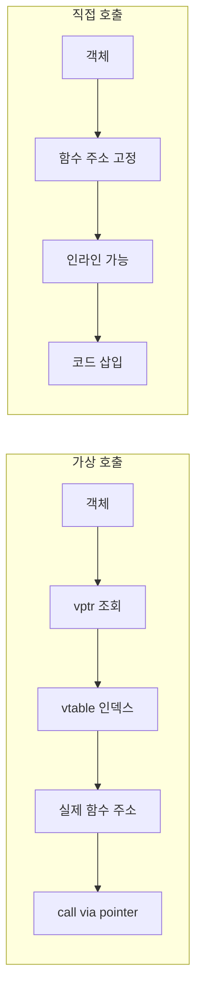

**추상화 비용**이란 가상 함수, RTTI, 예외처럼 "편의성·유연성"을 주는 언어 메커니즘이 런타임에 치르는 대가를 말합니다. 본 챕터에서는 이 세 가지의 정량적 비용을 마이크로벤치마크로 측정하고, **devirtualization**·인라이닝 유도 등으로 그 비용을 줄이는 방법을 다룹니다. Low-latency 경로에서는 추상화 한 번이 전체 지연의 상당 부분을 차지할 수 있으므로, 비용을 수치로 알고 상황에 맞게 대체하는 것이 목표입니다.

### 추상화 비용이 중요한 이유 (배경)

가상 함수는 C++에 처음 도입된 이래(1980년대) 다형성과 캡슐화의 핵심 수단이 되어 왔고, RTTI와 예외 역시 표준화 과정에서 "편의성 vs 비용" 트레이드오프로 논의되어 왔습니다. Itanium C++ ABI 등으로 **zero-cost exception** 모델이 정착한 뒤에도, "예외를 던지는 경로"의 비용은 여전히 크기 때문에, 트레이딩·게임·임베디드 등 지연이 중요한 도메인에서는 **언제 가상 호출을 쓸지**, **RTTI 대신 무엇을 쓸지**, **예외 대신 에러 코드/expected를 쓸지**를 선택할 수 있어야 합니다. 이 챕터는 그 선택을 정량적으로 뒷받침하기 위해 "추상화 1개" 단위 비용을 측정하고 대안을 비교하는 방법을 다룹니다. 표준화 위원회와 컴파일러 구현체는 계속해서 devirtualization·인라이닝·예외 경로 최적화를 개선하고 있지만, "측정 후 선택"하는 습관은 어떤 환경에서도 유효합니다.

## 가상 함수 호출 비용

C++에서 **가상 함수**는 **vtable(가상 테이블)**을 통해 동작합니다. 객체 내부에 **vptr**(가상 테이블 포인터)가 있고, 호출 시 vptr → vtable → 실제 함수 주소로 **간접 호출**이 일어납니다. 이로 인해 다음 비용이 발생합니다.

1. **간접 분기**: CPU는 호출 직전까지 실제 타깃을 알 수 없어 분기 예측이 어렵고, 예측 실패 시 파이프라인 플러시 비용이 듭니다. 간접 점프의 타깃이 매 호출마다 같으면 예측기가 학습할 수 있지만, 여러 파생 타입이 섞여 호출되면 예측 실패가 늘어납니다.
2. **인라이닝 불가**: 컴파일러가 호출 지점에서 구현을 알 수 없으므로 대부분 인라인하지 못하고, 호출/반환 오버헤드와 레지스터 저장·복원이 남습니다. 인라인되면 상수 전파·루프 최적화 등 추가 최적화 기회가 생기므로, 인라인 불가는 그 기회까지 잃는 결과가 됩니다.
3. **캐시**: vtable과 여러 파생 클래스 구현이 흩어지면 I-cache·D-cache 미스가 늘어날 수 있습니다. 특히 서로 다른 파생 타입 객체를 번갈아 접근하면 캐시 라인이 자주 바뀌어 비용이 누적될 수 있습니다.

실제 수치는 플랫폼·컴파일러·호출 패턴에 따라 다르지만, 동일한 로직을 가상 호출 vs 직접 호출로 비교하면 **직접 호출이 인라인되면 수 배에서 수십 배까지** 차이가 나는 경우가 있습니다. µs 단위 핫패스에서는 가상 호출 한 번이 전체 지연의 상당 부분을 차지할 수 있으므로, 가능하면 devirtualization을 유도하거나 가상 호출을 피하는 설계가 중요합니다.

**vtable과 vptr**: 각 다형 클래스마다 컴파일러가 **vtable**(가상 함수 주소 배열)을 생성하고, 객체에는 그 vtable을 가리키는 **vptr**이 보통 객체 선두에 배치됩니다. 호출 시 `*(obj->vptr + offset)`으로 함수 주소를 읽어 `call *reg` 형태의 간접 호출을 수행합니다. 다중 상속·가상 상속이 있으면 vptr가 여러 개일 수 있어 오프셋 계산과 캐시 동작이 더 복잡해질 수 있습니다.

### 가상 호출 vs 직접 호출 흐름

가상 호출은 간접 참조를 거치고, 직접 호출(인라인)은 호출부에서 바로 코드가 펼쳐집니다. 구조 차이는 아래와 같습니다.



### 가상 vs 직접 호출 마이크로벤치마크 예시

동일한 `compute()` 로직을 가상 함수와 일반 함수로 나누어 반복 호출한 뒤, 반복당 사이클 또는 나노초를 측정합니다. 벤치마크 도구(Google Benchmark, nanobench 등)로 안정적으로 측정하고, 직접 호출·인라인된 버전을 기준으로 가상 호출 오버헤드를 "추상화 1개" 단위로 보고할 수 있습니다. 아래는 그 패턴을 보여 주는 최소 예시입니다.

```cpp
// 가상 호출 vs 직접 호출 비교용 구조
struct Base {
  virtual int compute(int x) const { return x + 1; }
  virtual ~Base() = default;
};
struct Derived final : Base {
  int compute(int x) const override { return x + 1; }
};

// 직접 호출(인라인 후보): 같은 TU에 정의되어 인라인 가능
inline int compute_direct(int x) { return x + 1; }

// 벤치마크: 가상 호출 N번 vs 직접 호출 N번
// Google Benchmark: BENCHMARK_TEMPLATE 또는 루프 내에서
//   Base* p = &obj;  for (int i = 0; i < N; ++i) sink = p->compute(i);
//   vs  for (int i = 0; i < N; ++i) sink = compute_direct(i);
// 측정 시 Derived가 final이면 devirtualization으로 차이가 줄어들 수 있음
```

실제 측정 시에는 `volatile` 또는 `DoNotOptimize`로 컴파일러가 루프를 제거하지 못하게 하고, 반복 횟수를 충분히 늘려 안정된 나노초를 얻습니다. `Derived`를 `final`로 두고 LTO를 켜면, 많은 컴파일러에서 가상 호출이 직접 호출로 바뀌어 차이가 거의 없어질 수 있습니다.

**벤치마크 해석**: 가상 호출과 직접 호출 벤치마크의 차이가 크면(예: 2배 이상), 해당 경로가 핫패스에 있다면 devirtualization 또는 구체 타입 사용을 검토할 가치가 있습니다. 차이가 작다면(예: 10% 미만) 다른 병목(메모리 접근, 분기 예측 등)을 먼저 살펴보는 것이 좋습니다. LTO·final 적용 후 다시 측정해, 개선이 나왔는지와 어셈블리에서 직접 호출로 바뀌었는지를 함께 확인합니다.

## RTTI 비용

**RTTI(Run-Time Type Information)**는 `typeid`와 `dynamic_cast`에 사용됩니다. RTTI를 쓰면 컴파일러는 타입 정보를 오브젝트 파일에 남기고, `dynamic_cast` 시 상속 계층을 따라가며 타입을 검사합니다.

- **typeid**: 타입 정보 조회. 가상 함수가 있는 클래스에서는 vtable을 통해 타입 정보를 가져오며, 비교·이름 조회 비용이 있습니다. `typeid(...).name()`은 구현체마다 맹글링된 이름을 반환할 수 있어, 디버깅 외에는 비용 대비 이득이 적을 수 있습니다.
- **dynamic_cast**: 포인터/참조에 대해 다운캐스트·크로스캐스트를 수행하며, 실패 시 null 또는 예외. 상속 깊이·다중 상속에 따라 검사 비용이 증가합니다. 상속 계층이 깊거나 다중 상속이 있으면 한 번의 dynamic_cast가 여러 분기와 포인터 조정을 유발할 수 있습니다.

RTTI 사용 시점은 "실제로 런타임에 타입을 알아야 할 때"로 한정하는 것이 좋습니다. 대안으로는 **std::variant + std::visit**, **Visitor 패턴**, **타입 태그 + switch** 등이 있으며, 이들은 컴파일 타임에 타입 집합이 고정되어 있어 RTTI 없이 구현할 수 있고, 인라이닝·분기 예측에 유리할 수 있습니다. 타입 집합이 고정된 경우 아래처럼 `std::variant`와 `std::visit`로 RTTI 없이 디스패치할 수 있습니다.

```cpp
#include <variant>
#include <cstdio>

using Var = std::variant<int, double, std::string>;

int get_tag(const Var& v) {
  return std::visit([](const auto& x) -> int {
    if constexpr (std::is_same_v<std::decay_t<decltype(x)>, int>) return 0;
    else if constexpr (std::is_same_v<std::decay_t<decltype(x)>, double>) return 1;
    else return 2;
  }, v);
}
// 컴파일러가 visit를 switch 또는 인라인된 분기로 최적화할 수 있음.
// dynamic_cast + typeid 대신 타입 집합이 고정되면 이 패턴이 RTTI 비용을 제거함.
```

**RTTI on/off**: `-fno-rtti`(GCC/Clang)로 RTTI를 끄면 타입 정보가 오브젝트에 포함되지 않아 코드 크기가 줄고, RTTI를 쓰는 코드는 컴파일되지 않습니다. RTTI에 의존하지 않도록 설계하면 바이너리 크기와 간접 접근을 줄일 수 있습니다.

**RTTI 대안 선택 가이드**: 타입 집합이 컴파일 타임에 고정되고 개수가 적으면(예: 2~10개) `std::variant` + `std::visit`가 구현이 단순하고 인라이닝에 유리합니다. 타입별로 다른 연산(방문)이 많고 타입 추가가 드물면 Visitor 패턴이 적합할 수 있고, 단순히 정수 태그로 구분하면 될 때는 열거형 + switch가 가장 저렴합니다. 타입 집합이 열려 있거나 플러그인 경계에서는 RTTI 사용을 받아들이고, 그 사용을 경계 밖으로 두는 것이 현실적입니다.

## 예외 처리의 정량적 비용

C++ 예외는 정상 경로에서의 오버헤드를 최소화하는 **zero-cost exception** 모델을 목표로 합니다.

> "With zero-cost exception handling, the cost of adding exception handling to a program is negligible when no exception is thrown; the cost is paid when an exception is thrown." — Itanium C++ ABI: Exception Handling (https://itanium-cxx-abi.github.io/cxx-abi/abi-eh.html)

즉, 예외를 던지지 않는 경로에서는 추가 분기나 테이블 조회 비용을 최소화합니다. 반면 **예외가 발생한 경로**에서는 스택 언와인딩, landing pad 탐색, catch 블록 타입 매칭 등으로 상당한 비용이 듭니다.

| 경로 | 비용 특성 |
|------|-----------|
| 정상 경로 (예외 미발생) | zero-cost 목표: 추가 분기·테이블 조회 최소화 |
| 예외 경로 (throw ~ catch) | 스택 언와인딩, 소멸자 호출, landing pad 탐색, 타입 매칭 — 스택 깊이·프레임 수에 비례 |

- **정상 경로**: 컴파일러에 따라 약간의 메타데이터·테이블만 두고, 분기 비용을 거의 없애는 구현이 많습니다. 자세한 내용은 챕터 09에서 다룹니다.
- **예외 경로**: 스택을 되감으며 소멸자를 호출하고, 맞는 catch를 찾는 비용이 커서, "예외는 예외적인 상황에만" 사용하는 것이 성능·설계 측면에서 모두 유리합니다.
- **에러 코드 / std::expected**: 정상·에러 모두 같은 코드 경로로 처리하므로, 핫패스에서 실패 가능성이 있으면 예외 대신 에러 코드나 expected를 쓰는 편이 예측 가능한 비용을 줍니다. 챕터 09(예외 심화), 챕터 11(variant/optional/expected)에서 이어서 다룹니다.

**예외 vs 에러 코드 (코드 패턴)**: 핫패스에서 실패가 나올 수 있는 경우, 예외 throw는 "실패 경로"에서만 비용이 크고, 에러 코드나 `std::expected`는 호출부에서 한 번의 분기로 처리할 수 있어 비용이 예측 가능합니다. 아래는 같은 인터페이스를 예외 경로와 에러 코드 경로로 나눈 개념 예시입니다.

```cpp
// 예외 경로: parse가 실패하면 throw. 호출부는 try/catch 또는 그대로 전파.
// int result = parse_throw(input);  // 실패 시 스택 언와인딩 비용

// 에러 코드 경로: 반환값으로 성공/실패 전달. 핫패스에서 실패 가능하면 이쪽이 비용 예측 가능.
// auto r = parse_expected(input);
// if (!r) return r.error();
// int result = *r;
```

실제 선택 시에는 챕터 09(noexcept·예외 경로 비용), 챕터 11(std::expected)를 참고해, "정상만 있는 경로"와 "실패가 가끔 나오는 경로"를 구분해 설계합니다.

**Visitor 패턴 vs variant**: 타입 집합이 고정일 때 **Visitor 패턴**은 각 타입별로 `accept`/`visit`를 구현해 컴파일 타임에 디스패치를 고정할 수 있어, RTTI 없이 타입별 처리가 가능합니다. **std::variant + std::visit**도 비슷하게 타입 집합이 템플릿 인자로 고정되므로, 컴파일러가 switch 또는 인라인된 분기로 최적화할 수 있습니다. Visitor는 타입 추가 시 방문자 인터페이스와 모든 구체 타입을 수정해야 하고, variant는 타입 목록만 바꾸면 되므로, 타입 수가 많거나 자주 바뀌면 variant가 유지보수에 유리할 수 있습니다.

## Devirtualization

**Devirtualization**은 컴파일러가 가상 호출을 제거하고 직접 호출(또는 인라인)로 바꾸는 최적화입니다. 다음 조건에서 가능성이 높아집니다.

- **final**: 클래스나 메서드가 `final`이면 더 이상 오버라이드가 없으므로, 해당 호출을 직접 호출로 고정할 수 있습니다.
- **단일 구현**: 링크/번역 단위에서 파생 클래스가 하나만 보이면 그 구현으로 고정할 수 있습니다.
- **LTO(Link Time Optimization)**: 링크 시점에 전체 프로그램을 보므로, 실제로 사용되는 타입이 하나로 좁혀지면 devirtualization이 더 많이 일어납니다.

확인 방법으로는 **어셈블리 출력**(`-S`, `objdump -d`)에서 가상 호출이 `call *reg`가 아니라 `call _ZN7Derived7computeEv` 같은 직접 호출로 나오는지 보거나, **컴파일러 최적화 리포트**(`-fopt-info`, `-fdevirtualization` 등)를 사용할 수 있습니다. GCC/Clang에서는 `-fopt-info-inline`·`-fopt-info=inline`으로 인라인된 함수 목록을, `-fdevirtualization` 관련 옵션이 있으면 devirtualization 적용 여부를 로그로 확인할 수 있습니다. 어셈블리에서 `call *rax` 또는 `call *r8` 형태는 간접 호출(가상 호출 유지), `call _ZN7Derived7computeEv` 형태는 직접 호출(devirtualization 적용)로 해석하면 됩니다.

| 어셈블리 패턴 | 의미 |
|--------------|------|
| `call *reg` (예: `call *rax`) | 간접 호출 — 가상 호출 유지 |
| `call _ZNK7Derived7computeEi` | 직접 호출 — devirtualization 적용 |

`final`을 전략적으로 쓰고, 가능한 한 LTO를 사용하면 핫패스의 가상 호출 비용을 줄일 수 있습니다.

**캡슐화 경계와 DLL**: 다른 번역 단위(.cpp)나 **DLL/공유 라이브러리** 경계를 넘어서 호출하면, 컴파일러는 해당 번역 단위나 라이브러리 내부에 파생 클래스 구현이 있는지 알 수 없어 devirtualization을 하지 못합니다. 따라서 **핫패스에 있는 인터페이스는 같은 번역 단위에 구현을 두거나, final·LTO로 보완**하는 것이 좋습니다. 플러그인·외부 모듈이 Base*를 반환하는 API는 경계 밖이므로, 그 포인터를 통한 가상 호출은 피할 수 없을 수 있고, 그 경우 호출 횟수를 줄이거나 경계 안쪽으로 중요한 로직을 옮기는 설계를 검토합니다.

## 측정과 검증

이 트랙의 기본 원칙은 **"추상화 1개" 단위로 비용을 분리 측정**하는 것입니다. 예를 들어 "가상 함수 한 번", "dynamic_cast 한 번", "예외 throw 한 번"을 격리한 마이크로벤치마크를 두고, 동일 조건에서 대안(직접 호출, variant, 에러 코드)과 비교합니다.

**측정 순서 요약**: (1) 프로파일러로 핫패스와 그 안의 가상 호출·RTTI·예외 사용처를 파악한다. (2) 해당 연산 하나만 격리한 벤치마크를 작성해 나노초(또는 사이클)를 측정한다. (3) 대안(예: final·variant·expected)을 적용한 동일 벤치마크를 만들어 차이를 비교한다. (4) 개선안을 실제 코드에 반영한 뒤 동일 벤치마크로 회귀가 없는지 확인한다. 이때 컴파일러의 `-fopt-info-inline`·`-S`로 devirtualization·인라이닝 적용 여부를 함께 보면, "왜 차이가 났는지"를 설명할 수 있습니다.

모든 변경 후에는 **회귀 검증**을 권장합니다. 벤치마크를 CI에 넣거나, 로컬에서 변경 전/후 수치를 기록해 성능이 나빠지지 않았는지 확인합니다. 추상화를 제거·대체한 경우에는 해당 마이크로벤치마크에서 개선이 나와야 하며, 다른 벤치마크에서의 회귀도 함께 점검하면 안전합니다.

### 실무 적용: 진단 순서

핫패스에서 추상화 비용을 줄일 때는 아래 순서로 진행하면 효율적입니다.

1. **프로파일링**: CPU 프로파일러로 핫패스를 식별하고, 해당 경로에서 가상 호출·`dynamic_cast`·`typeid`·예외 throw가 호출되는지 코드와 함께 확인합니다.
2. **격리 측정**: 의심되는 연산 하나만 반복하는 마이크로벤치마크를 작성해 baseline 나노초를 측정합니다. 가능하면 직접 호출·variant·에러 코드 등 대안도 동일한 벤치마크로 측정합니다.
3. **대안 적용**: final·LTO·같은 TU 배치, variant+visit, expected 등으로 대체한 뒤, 동일 벤치마크에서 개선이 나오는지 확인합니다. 어셈블리 또는 `-fopt-info`로 devirtualization·인라이닝이 적용되었는지 검증합니다.
4. **회귀 검증**: 변경을 메인 코드에 반영한 뒤, 관련 벤치마크를 CI 또는 로컬에서 돌려 회귀가 없는지 확인합니다.

이 순서를 따르면 "측정 없이 추측으로 제거"하는 일을 줄이고, 개선 효과를 수치로 보장할 수 있습니다.

## 한눈에 보기: 추상화 메커니즘별 비용과 대안

| 메커니즘 | 주요 비용 | 대안·완화 |
|----------|-----------|-----------|
| 가상 함수 | 간접 분기, 인라이닝 불가, 캐시 분산 | final, LTO, 같은 TU에 구현, 직접 호출 설계 |
| RTTI (typeid/dynamic_cast) | 타입 정보 조회·상속 탐색 | variant+visit, Visitor, 타입 태그+switch, -fno-rtti |
| 예외 (throw 경로) | 스택 언와인딩, landing pad 탐색 | 예외는 예외 상황에만, 핫패스는 에러 코드/expected |

**추상화별 대안 요약**: 가상 함수는 같은 TU 배치·final·LTO로 devirtualization을 유도하거나, 핫패스 구간만 구체 타입을 사용하도록 설계를 바꿀 수 있습니다. RTTI는 타입 집합이 고정되면 `std::variant` + `std::visit`, Visitor 패턴, 열거형·타입 태그 + switch로 대체하고, 타입 집합이 열려 있으면 RTTI 사용을 경계·핫패스 밖으로 제한합니다. 예외는 정상 경로만 있는 함수에 `noexcept`를 붙이고, 핫패스에서 실패 가능성이 있으면 `std::expected` 또는 에러 코드로 전달해 비용을 예측 가능하게 합니다.

**요약**: 위 표는 "무엇이 비용인지"와 "어떤 대안이 있는지"를 한눈에 보기 위한 것입니다. 실제 적용 시에는 반드시 격리 벤치마크로 수치를 확인한 뒤, 비용이 클 때만 대안을 도입합니다.

### 정량적 비용 비교 (참고)

아래는 "추상화 1개" 단위로 격리 측정했을 때 흔히 관찰되는 상대적 차이를 정성적으로 요약한 것입니다. 실제 수치는 플랫폼·컴파일러·데이터에 따라 다르므로, 반드시 대상 환경에서 마이크로벤치마크로 확인해야 합니다.

| 비교 대상 | 일반적 관찰 (상대적) |
|-----------|----------------------|
| 가상 호출 vs 직접 호출 (인라인) | 직접 호출이 수 배~수십 배 빠를 수 있음; final·LTO 시 차이 축소 |
| dynamic_cast vs variant visit | variant가 타입 수가 적을 때 더 예측 가능하고 인라이닝 유리 |
| 예외 throw vs 에러 코드 반환 | throw 경로는 스택 깊이에 비례해 비용; 에러 코드는 분기 1회 수준 |

## 평가 기준 (학습 성과 목표)

이 글을 읽은 후 다음을 할 수 있어야 합니다.

- 가상 함수 호출이 **vtable·vptr·간접 호출**로 동작하는 방식을 설명하고, 인라이닝 불가·분기 예측 불리함이 왜 비용이 되는지 설명할 수 있다.
- **RTTI**와 **variant/Visitor/타입 태그**의 차이를 구분하고, "런타임에 타입을 꼭 알아야 할 때"만 RTTI를 쓴다고 판단할 수 있다.
- **zero-cost exception**의 의미(정상 경로 vs 예외 경로 비용)를 설명하고, 핫패스에서 예외 대신 에러 코드/expected를 선택할 수 있다.
- **Devirtualization**이 일어나는 조건(final, 단일 구현, LTO)을 나열하고, 어셈블리 또는 최적화 리포트로 확인할 수 있다.
- "추상화 1개" 단위 마이크로벤치마크를 설계하고, 변경 전/후 회귀 검증을 수행할 수 있다.

## 판단 기준 (언제 쓸고 언제 피할지)

| 상황 | 권장 | 비권장 |
|------|------|--------|
| 핫패스(µs 단위)에 다형성 필요 | final + LTO, 또는 같은 TU 구현으로 devirtualization 유도 | 경계 넘는 가상 호출, 불필요한 가상화 |
| 런타임에 구체 타입만 가끔 필요 | variant + visit, Visitor, 타입 태그 | dynamic_cast·typeid 남발 |
| 에러 처리 (핫패스에서 실패 가능) | 에러 코드, std::expected | 예외 throw (실패 경로 비용 큼) |
| 바이너리 크기·ABI 단순화 | -fno-rtti 설계, RTTI 미사용 | RTTI 의존 설계 |

**적용 체크리스트**: (1) 핫패스에 가상 호출이 있으면 final·LTO·TU 배치로 제거 가능한지 검토한다. (2) RTTI 사용처를 variant/Visitor로 대체할 수 있는지 검토한다. (3) 예외를 던지는 경로가 핫패스에 있으면 expected·에러 코드로 대체를 검토한다.

### 자주 하는 실수

- **가상 호출을 없애려다 ABI·캡슐화를 과도하게 깨는 경우**: 인터페이스와 구현을 같은 TU에 두면 devirtualization이 잘 되지만, 헤더 의존성과 컴파일 시간이 늘어날 수 있습니다. 필요한 구간만 구체 타입을 쓰고 나머지는 인터페이스로 유지하는 식으로 범위를 나누는 것이 좋습니다.
- **RTTI를 무조건 금지하는 경우**: 플러그인·외부 라이브러리와의 경계에서는 타입 집합이 컴파일 타임에 고정되지 않아 RTTI가 실용적입니다. 대신 RTTI 사용을 그 경계로 한정하고, 핫패스 안쪽에서는 variant·Visitor를 쓰도록 설계합니다.
- **예외를 전역 금지하는 경우**: 예외는 리소스 정리와 오류 전파를 맞추는 데 유리합니다. 핫패스와 실패 경로만 분리하고, 실패 경로 비용이 문제될 때만 해당 모듈에서 expected·에러 코드로 대체하는 것이 균형적입니다.

### 리팩토링 시 주의

가상 호출을 제거하거나 RTTI를 variant로 바꿀 때, **호출처 전부**가 새 인터페이스(구체 타입·variant·expected)를 사용하도록 바꿔야 합니다. 일부만 바꾸면 타입 불일치나 런타임 오류가 날 수 있으므로, 리팩토링 범위를 명확히 하고 단위 테스트·벤치마크로 회귀를 확인합니다. 예외를 expected로 바꾸는 경우, 기존에 예외를 catch하던 상위 레이어에서 `expected`의 `error()`를 처리하도록 바꿔야 하며, 예외와 expected가 혼재하면 오류 전파 경로가 복잡해질 수 있어, 모듈 경계를 단위로 점진적으로 전환하는 것이 좋습니다.

## 비판적 시각: 한계와 트레이드오프

- **가상 함수**: 다형성과 캡슐화는 유지보수·테스트에 유리하다. "무조건 제거"가 아니라, 핫패스 구간만 격리 측정한 뒤 비용이 클 때만 대체하는 것이 합리적이다. 테스트에서 모의 객체(mock)를 주입하려면 가상 인터페이스가 필요할 수 있으므로, 핫패스와 테스트 경로를 분리하거나, 핫패스에서는 구체 타입을 직접 사용하고 경계에서만 인터페이스를 쓰는 식으로 타협할 수 있다.
- **RTTI**: 플러그인·외부 라이브러리와의 경계처럼 타입 집합이 컴파일 타임에 고정되지 않는 경우에는 RTTI가 실용적일 수 있다. 대신 그 경계를 최소화하고, 핫패스 밖으로 두는 설계가 좋다. `-fno-rtti`를 쓰면 RTTI를 사용하는 서드파티 라이브러리와 호환되지 않을 수 있으므로, 빌드 옵션과 의존성을 함께 검토해야 한다.
- **예외**: 예외는 오류 전파와 스택 언와인딩을 일치시켜 리소스 정리를 안전하게 해준다. "예외 금지"가 아니라, 핫패스와 실패 경로를 분리하고 실패 경로 비용이 문제될 때만 expected 등으로 대체하는 식으로 균형을 잡는다. 레거시 코드가 예외를 전파하는 경우, 경계에서 예외를 catch한 뒤 expected나 에러 코드로 변환하는 어댑터 레이어를 두면, 핫패스 안쪽에서는 예외 비용을 피할 수 있다.

## 핵심 요약

| 항목 | 요약 |
|------|------|
| 가상 함수 | vtable 간접 호출 → 인라이닝 불가·분기 비용; final·LTO·같은 TU로 완화 |
| RTTI | typeid/dynamic_cast 비용·코드 크기; variant/Visitor로 대체 가능 시 사용 |
| 예외 | 정상 경로는 zero-cost, throw 경로는 비쌈; 핫패스 실패 시 expected·에러 코드 고려 |
| 검증 | 추상화 1개 단위 벤치마크 + 회귀 검증 |

### 용어 정리

| 용어 | 설명 |
|------|------|
| **vtable** | 가상 함수 주소 배열; 클래스별로 하나 생성됨 |
| **vptr** | 객체 내부의 vtable 포인터; 보통 객체 선두에 배치 |
| **devirtualization** | 컴파일러가 가상 호출을 직접 호출(또는 인라인)로 바꾸는 최적화 |
| **RTTI** | Run-Time Type Information; typeid·dynamic_cast에 사용되는 타입 정보 |
| **zero-cost exception** | 예외가 발생하지 않을 때 추가 비용을 거의 두지 않는 예외 모델 |
| **landing pad** | 예외 발생 시 스택 언와인딩 중 제어가 넘어가는 지점 |

### 실전 시나리오: 핫패스에서 가상 호출 제거

프로파일러에서 특정 경로가 전체 시간의 상당 부분을 차지하고, 그 경로 안에 `Base*`를 통한 가상 호출이 많이 나온다고 가정합니다. (1) 먼저 해당 호출만 반복하는 마이크로벤치마크를 작성해 "가상 한 번" 비용을 나노초로 측정합니다. (2) 파생 클래스가 하나만 사용된다면 해당 클래스와 메서드에 `final`을 붙이고 LTO를 켠 뒤, 동일 벤치마크를 다시 돌려 차이가 줄었는지 확인합니다. (3) 어셈블리(`-S`)에서 해당 호출이 `call *reg`에서 `call _ZN7...` 형태로 바뀌었는지 봅니다. (4) 개선이 확인되면 실제 코드에 반영하고, 관련 벤치마크를 CI에 넣어 회귀를 방지합니다. 파생 타입이 여러 개이지만 핫패스에서는 한 타입만 쓰인다면, 핫패스 구간만 그 구체 타입을 사용하도록 분기하거나, 팩토리에서 핫 경로용 구체 타입을 반환하도록 바꾸는 설계를 검토할 수 있습니다.

### 벤치마크 결과 해석 가이드

격리 측정 후 얻은 나노초 수치를 어떻게 해석할지 정리합니다.

| 관찰 | 해석·다음 단계 |
|------|----------------|
| 가상 호출이 직접 호출 대비 2배 이상 느림 | 해당 경로가 핫패스면 final·LTO·TU 배치 검토; 어셈블리로 devirtualization 여부 확인 |
| 가상 vs 직접 차이가 10% 미만 | 다른 병목(메모리 접근, 분기) 우선 조사; 추상화 제거보다 캐시·분기 최적화가 효과적일 수 있음 |
| dynamic_cast가 variant visit 대비 수 배 느림 | 타입 집합이 고정이면 variant·Visitor 전환 검토; 상속 깊이·다중 상속이 원인일 수 있음 |
| 예외 throw가 에러 코드 대비 한 자릿수 이상 느림 | 핫패스에서 실패 가능하면 expected·에러 코드 도입 검토; 챕터 09·11 참고 |

**통계적 유의성**: 한 번 측정한 수치만으로 결론 내리지 말고, 여러 회 실행한 평균·중앙값·표준편차를 봅니다. 벤치마크 도구가 제공하는 신뢰구간이나 표준편차가 크면, 반복 횟수를 늘리거나 워밍 루프를 조정한 뒤 다시 측정합니다.

### 컴파일러별 devirtualization 동작 (참고)

- **GCC**: `-O2` 이상에서 final·단일 구현 시 devirtualization을 적용한다. `-flto` 사용 시 링크 타임에 더 많은 가상 호출이 제거될 수 있다. `-fopt-info-inline`으로 인라인된 함수를, `-fopt-info=devirtualization`(버전에 따라)으로 제거된 가상 호출을 로그로 확인할 수 있다.
- **Clang**: 비슷하게 `-O2`/`-O3`와 LTO에서 final·가시성에 따라 devirtualization을 수행한다. `-Rpass=inline`으로 인라인 리포트를 볼 수 있다.
- **MSVC**: `/O2`와 LTCG(Link-Time Code Generation)에서 유사한 최적화가 적용된다. 핫패스가 DLL 경계를 넘으면 devirtualization이 어렵다는 점은 동일하다.

실제로는 대상 컴파일러·플랫폼에서 위 순서(벤치마크 → final·LTO 적용 → 어셈블리 확인)를 한 번 돌려 보는 것이 가장 정확합니다.

### 자주 묻는 질문 (FAQ)

**Q: 가상 함수를 전부 제거해야 하나요?**  
A: 아니요. 핫패스에서 측정했을 때 비용이 전체 지연의 일부 이상일 때만 대체를 검토합니다. 나머지 경로는 가상 함수로 다형성과 테스트 용이성을 유지하는 것이 좋습니다.

**Q: RTTI를 끄면(-fno-rtti) 서드파티 라이브러리가 깨질 수 있나요?**  
A: 네. RTTI를 사용하는 라이브러리(예: 일부 직렬화·리플렉션 라이브러리)는 typeid·dynamic_cast를 쓰므로, `-fno-rtti`를 쓰면 해당 라이브러리를 함께 쓸 수 없을 수 있습니다. RTTI 사용을 자신의 핫패스 밖으로 한정하고, 라이브러리 경계에서는 RTTI를 허용하는 방식이 현실적입니다.

**Q: 예외를 쓰지 말고 전부 expected로 바꿔야 하나요?**  
A: 아니요. 예외는 오류 전파와 리소스 정리에 유리합니다. 핫패스에서 실패가 가끔 나오는 경우에만 해당 모듈에서 expected·에러 코드를 쓰고, 나머지는 예외를 유지해도 됩니다. 점진적 전환이 가능합니다.

**Q: final을 남발하면 확장성이 떨어지지 않나요?**  
A: 확장이 필요 없는 구체 타입(예: 내부 구현 클래스)에만 final을 붙이고, 외부에 공개되는 인터페이스 기반 클래스는 필요 시 final을 생략할 수 있습니다. "핫패스에서만 쓰이는" 구체 타입에 final을 붙이면 devirtualization 이득을 얻으면서도 공개 API는 유지할 수 있습니다.

**Q: variant로 바꾼 뒤 타입을 추가하려면?**  
A: variant의 템플릿 인자 목록에 타입을 추가하고, visit하는 람다에 해당 타입 분기를 추가해야 합니다. Visitor 패턴은 타입 추가 시 모든 방문자에 케이스를 추가해야 하므로, 타입 추가가 잦으면 variant가 유지보수에 유리할 수 있습니다.

### 적용 체크리스트 (실무용)

게시 전 또는 리팩토링 전에 아래를 확인합니다.

- [ ] 핫패스에 가상 호출이 있는지 프로파일러로 확인했는가?
- [ ] 가상 호출이 있으면 "가상 한 번" 격리 벤치마크로 나노초를 측정했는가?
- [ ] final·LTO 적용 후 동일 벤치마크에서 개선이 나왔는가? 어셈블리에서 직접 호출로 바뀌었는가?
- [ ] RTTI 사용처가 있는지 검색하고, 타입 집합이 고정이면 variant·Visitor 대체를 검토했는가?
- [ ] 핫패스에서 예외를 던지는지 확인하고, 실패 가능 시 expected·에러 코드 도입을 검토했는가?
- [ ] 변경 후 관련 벤치마크로 회귀 검증을 했는가?

### RTTI 대안 상세: 타입 태그 + switch

타입 집합이 작고(예: 3~5개) 각 타입별로 하는 일이 단순하면, **열거형 + switch**가 가장 저렴합니다. RTTI나 variant 없이 정수 태그만으로 분기할 수 있어, 인라이닝과 분기 예측에 유리합니다.

```cpp
enum class ShapeTag { Circle, Rect, Triangle };

struct Shape {
  ShapeTag tag;
  // 공통 필드 또는 union
};

void process(const Shape& s) {
  switch (s.tag) {
    case ShapeTag::Circle:   /* ... */ break;
    case ShapeTag::Rect:    /* ... */ break;
    case ShapeTag::Triangle: /* ... */ break;
  }
}
```

타입 추가 시 switch에 case를 추가하고, 태그와 실제 데이터의 동기화를 수동으로 유지해야 합니다. 타입이 자주 바뀌거나 연산이 복잡하면 variant + visit가 더 나을 수 있습니다.

### 예외 vs 에러 코드: 호출 체인 비교

핫패스에서 파싱·조회가 실패할 수 있다고 가정합니다.

- **예외**: `parse_throw()` → 실패 시 throw → 상위에서 catch. 실패 시에만 스택 언와인딩 비용이 발생하지만, 실패 빈도가 높으면 비용이 누적됩니다.
- **에러 코드**: `parse_result parse(); if (!result.ok()) return result.error();` — 매 호출에서 한 번의 분기. 실패 시 비용이 예측 가능하고 작습니다.
- **std::expected**: `std::expected<int, ParseError> parse();` — C++23. 에러 코드와 유사하게 한 번의 분기로 처리할 수 있고, 타입 안전합니다. 챕터 11에서 다룹니다.

핫패스에서 실패 가능성이 0에 가깝다면 예외도 허용할 수 있고, 실패가 가끔이라면 expected·에러 코드가 지연 예측에 유리합니다.

### 요약: 이 장의 핵심 메시지

1. **가상 함수·RTTI·예외**는 편의성 대신 런타임 비용이 있으므로, 핫패스에서는 "추상화 1개" 단위로 측정한 뒤 필요할 때만 대체한다.
2. **Devirtualization**은 final·LTO·같은 TU 배치로 유도하고, 어셈블리나 최적화 리포트로 확인한다.
3. **RTTI**는 타입 집합이 고정이면 variant·Visitor·타입 태그로 대체하고, 열려 있으면 경계·핫패스 밖으로 한정한다.
4. **예외**는 정상 경로는 zero-cost이지만 throw 경로는 비용이 크므로, 핫패스에서 실패 가능하면 expected·에러 코드를 검토한다.
5. 모든 변경은 **격리 벤치마크 + 회귀 검증**으로 수치를 확인한 뒤 반영한다.

### 진단 도구 요약

| 목적 | 도구·옵션 | 활용 |
|------|-----------|------|
| 가상 호출 vs 직접 호출 나노초 | Google Benchmark, nanobench | 격리 벤치마크로 "추상화 1개" 비용 측정 |
| devirtualization 적용 여부 | `-S`(어셈블리), `objdump -d` | `call *reg` vs `call _ZN7...` 형태 확인 |
| 인라인 적용 여부 | `-fopt-info-inline`(GCC), `-Rpass=inline`(Clang) | 어떤 함수가 인라인되었는지 로그 확인 |
| RTTI 제거 | `-fno-rtti` | 바이너리 크기 감소; RTTI 미사용 코드만 가능 |
| 예외 경로 비용 | 챕터 09 | zero-cost 상세, noexcept·throw 경로 측정 |

이 표는 이 챕터에서 언급한 도구를 한곳에 모은 것입니다. 실제 진단 시에는 프로파일러로 먼저 핫패스를 찾고, 위 도구로 격리 측정·검증 순서를 따릅니다.

### 추가 읽기 및 관련 챕터

- **챕터 02 (STL 컨테이너)**: 컨테이너 선택에 따른 메모리 레이아웃·캐시 효율. 가상 호출과 무관한 병목일 때 참고.
- **챕터 09 (예외 심화)**: zero-cost exception 동작, noexcept 전략, 예외 경로 비용 측정.
- **챕터 11 (variant/optional/expected)**: RTTI 대안으로서의 std::variant·std::expected, 타입 안전 에러 전달.
- **외부 자료**: Itanium C++ ABI (vtable 레이아웃·예외 처리), 각 컴파일러 매뉴얼의 최적화 옵션.

### 이 장을 마치며

추상화 비용(가상 함수·RTTI·예외)은 "제거만 하면 된다"가 아니라 **측정 후 선택**하는 것이 핵심입니다. 프로파일러로 핫패스를 찾고, 해당 경로에서 위 세 가지가 얼마나 기여하는지 격리 측정한 뒤, 비용이 클 때만 final·LTO·variant·expected 등으로 대체합니다. 다음 장(02)에서는 STL 컨테이너의 비용 모델과 캐시 효율을 다루므로, "가상 호출이 아니라 컨테이너 접근이 병목"인 경우 02를 참고하면 됩니다.

**추상화별 한 줄 요약**:
- **가상 함수**: vtable 간접 호출 → final·LTO·같은 TU로 devirtualization 유도; 어셈블리로 확인.
- **RTTI**: typeid/dynamic_cast → 타입 고정이면 variant·Visitor·태그; 열려 있으면 경계 밖으로.
- **예외**: 정상 경로는 zero-cost, throw 경로는 비쌈 → 핫패스 실패 시 expected·에러 코드.

**참고: 다중 상속·가상 상속과 vptr**: 단일 상속에서는 보통 객체당 vptr 하나입니다. **다중 상속**에서는 베이스마다 vptr가 있을 수 있어 오프셋 조정(thunk)이 필요하고, **가상 상속**에서는 공유 베이스의 위치가 런타임에 결정되므로 vtable이 더 복잡해집니다. 이 경우 가상 호출 비용과 캐시 동작이 단일 상속보다 불리할 수 있어, 핫패스에 다중·가상 상속이 있다면 격리 벤치마크로 실제 차이를 측정하고, 가능하면 단일 상속·구체 타입으로 단순화하는 것을 검토합니다.

**학습 후 자가 점검**: 이 장을 읽은 뒤 아래 질문에 답할 수 있으면 목표를 달한 것입니다. (1) vtable과 vptr이 가상 호출에서 어떤 역할을 하는가? (2) devirtualization이 일어나는 조건 세 가지는? (3) RTTI 대안으로 variant·Visitor·타입 태그 중 어떤 경우에 무엇을 쓰는가? (4) zero-cost exception의 의미와 예외 경로가 비싼 이유는? (5) "추상화 1개" 격리 측정 후 다음 단계로 무엇을 하는가?

**다음 단계**: 챕터 02(STL 컨테이너 비용)로 넘어가면 vector·map·unordered_map의 메모리 레이아웃과 캐시 효율, 접근·삽입 패턴별 비용을 다룹니다. 추상화 비용(01)과 컨테이너 비용(02)을 구분해, 프로파일러에서 보인 병목이 "가상 호출"인지 "컨테이너 접근"인지에 따라 01 또는 02를 참고하면 됩니다.

**이 장의 학습 목표 재확인**:
- 가상 함수·RTTI·예외의 비용을 "추상화 1개" 단위로 측정할 수 있다.
- Devirtualization 조건과 확인 방법(어셈블리·최적화 리포트)을 설명할 수 있다.
- RTTI 대안(variant, Visitor, 타입 태그)을 상황별로 선택할 수 있다.
- 예외 vs 에러 코드·expected의 트레이드오프를 설명할 수 있다.
- 격리 벤치마크와 회귀 검증으로 변경 효과를 수치로 확인할 수 있다.

위 목표를 달성했다면 챕터 02(STL 컨테이너 비용)로 진행해, 컨테이너 선택에 따른 비용을 배울 수 있습니다. 02에서는 vector·map·unordered_map의 메모리 레이아웃과 캐시 효율을 다루므로, "어디서 시간이 든다"는 프로파일 결과와 함께 01·02를 번갈아 참고하면 됩니다.

- **챕터 01 정리**: 추상화 비용 측정 → 대안 적용 → 회귀 검증. 다음은 02(STL 컨테이너)입니다.
- **다음 장 링크**: [STL 컨테이너 비용](/post/cpp-optimization/stl-container-cost/) (챕터 02).

### 이 장에서 다룬 내용

- **추상화 비용**의 정의와 배경: 가상 함수·RTTI·예외가 런타임에 치르는 대가를 정량적으로 다루는 이유.
- **가상 함수**: vtable·vptr·간접 호출, 인라이닝 불가·캐시 영향; 마이크로벤치마크 예시와 devirtualization 조건(final, 단일 구현, LTO); 어셈블리·최적화 리포트로 확인하는 방법; DLL·TU 경계에서의 한계.
- **RTTI**: typeid·dynamic_cast 비용; 대안으로 std::variant+visit, Visitor, 타입 태그; -fno-rtti와 바이너리 크기.
- **예외**: zero-cost exception(정상 경로 vs throw 경로); 예외 vs 에러 코드·expected 패턴.
- **측정과 검증**: "추상화 1개" 격리 측정, 실무 진단 순서, 회귀 검증.
- **판단 기준·비판적 시각·리팩토링 시 주의**.
- **보조 절**: 벤치마크 결과 해석 가이드, 컴파일러별 devirtualization, FAQ, 적용 체크리스트, RTTI 대안(타입 태그+switch), 예외 vs 에러 코드 호출 체인, 진단 도구 요약, 추가 읽기.

## 다음 장에서는

**이전 장**: [Introduction: Low-latency C++ 언어 최적화](/post/cpp-optimization/getting-started-cpp-language-performance-tuning/) (챕터 00)

**STL 컨테이너 비용**을 다룹니다. vector, map, unordered_map의 비용 모델과 캐시 효율성, 컨테이너 선택에 따른 메모리 레이아웃·접근 패턴 차이를 마이크로벤치마크로 측정하는 방법을 정리합니다.

**참고 자료**: Itanium C++ ABI(예외 처리·vtable 레이아웃), ISO C++ 표준(예외 처리·RTTI), 컴파일러 문서(GCC/Clang `-fopt-info`, `-fno-rtti`). 챕터 09(예외 심화), 챕터 11(variant/optional/expected)에서 예외 대안과 타입 안전 유니온을 이어서 다룹니다.

→ [STL 컨테이너 비용](/post/cpp-optimization/stl-container-cost/) (챕터 02)
