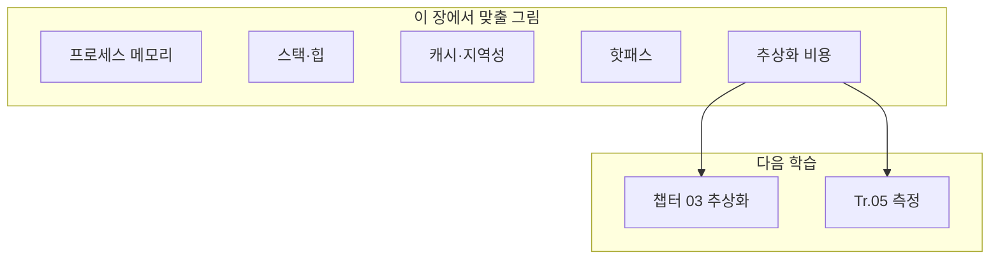

---
collection_order: 1
date: 2026-03-24
lastmod: 2026-07-10
draft: false
image: wordcloud.png
title: "[Optimization(C++) 01] C++ 실행 모델·µs 최적화 어휘 (기초)"
slug: cpp-execution-model-microsecond-vocabulary-fundamentals
description: "Low-latency C++ 트랙 선행 기초 장입니다. 프로세스 메모리·스택/힙·캐시·핫패스·추상화 비용 등 µs 튜닝 용어를 문단으로 정리하고, Tr.05 프로파일링과 챕터 03 본편으로 이어지는 경로·이전·다음 장 내비게이션을 안내합니다."
tags:
  - C++
  - Performance
  - Optimization
  - Memory
  - Stack
  - Heap
  - CPU
  - Cache
  - Latency
  - Throughput
  - Profiling
  - Benchmark
  - Compiler
  - ABI
  - Concurrency
  - Linux
  - Windows
  - Embedded
  - Backend
  - Code-Quality
  - Software-Architecture
  - Best-Practices
  - Clean-Code
  - Implementation
  - Data-Structures
  - Time-Complexity
  - Testing
  - Debugging
  - Documentation
  - Git
  - CI-CD
  - 성능
  - 최적화
  - 메모리
  - 프로파일링
  - 컴파일러
  - 지연시간
  - 처리량
  - 백엔드
  - 임베디드
  - 코드품질
  - 소프트웨어아키텍처
  - 클린코드
  - 구현
  - 자료구조
  - 테스트
  - 디버깅
  - 문서화
  - 가이드
  - Tutorial
  - 튜토리얼
  - Reference
  - 참고
  - Deep-Dive
  - Fundamentals
  - 기초
  - Vocabulary
  - 용어
---

본 장은 **기초** 난이도로, 이 트랙의 챕터 03(추상화 비용)을 읽기 전에 **같은 말을 하기 위한 어휘와 그림**을 맞추는 것이 목적입니다. 여기서는 수식이나 마이크로벤치마크 구현 대신, “무엇을 줄이려는지”를 한 문장으로 설명할 수 있게 만드는 데 집중합니다. 이미 C++과 운영체제를 잘 안다면 빠르게 훑고 넘어가도 됩니다.

## 이 장을 읽기 전에

**완전한 초보자?** 이 장은 이 트랙의 **선행 기초**로, 다른 챕터의 선행 지식을 요구하지 않습니다. C++ 문법(함수·클래스·포인터)을 한 번이라도 다뤄 봤다면 충분합니다. 트랙 전체 동기는 [00장: Introduction](/post/cpp-optimization/getting-started-cpp-language-performance-tuning/)을 먼저 보면 좋습니다.

**이 장의 깊이**: 이 장은 **기초~중급**을 포괄합니다. 프로세스 메모리·스택/힙·캐시 라인·핫패스 같은 어휘를 한 그림으로 맞추는 것이 목적이며, 전문가 구간에서는 측정·검증 어휘와 타 트랙(CPU·OS·동시성)과의 경계까지 정리합니다. **다루지 않는 것**: 가상 함수·컨테이너 등 실제 추상화 비용([03장](/post/cpp-optimization/abstraction-cost/) 이후)과 CPU 마이크로아키텍처의 하드 분석(CPU 트랙)입니다.

## 당신의 수준에 맞는 경로

| 수준 | 읽을 부분 | 핵심 목표 |
|------|---------|---------|
| **초보자** | "프로세스 메모리의 큰 덩어리" ~ "캐시 라인과 지역성" | 실행 모델의 머릿속 그림 맞추기 |
| **중급자** | "핫패스와 추상화 비용" ~ "측정·검증 어휘 (Tr.05와 연결)" | 측정 어휘로 같은 말을 쓰기 |
| **전문가** | "이 트랙·타 트랙과의 경계" ~ "판단 기준: 이 장을 언제 끝까지 읽고 언제 훑을까" | 트랙 경계를 구분해 읽기 전략 세우기 |

---

## 왜 이 장이 따로 있는가

µs 단위 최적화 글은 곧바로 가상 함수·컨테이너·인라이닝으로 들어가기 쉽습니다. 그러나 독자마다 **실행 모델**(메모리가 어디에 있고, 호출이 무엇을 의미하는지)에 대한 머릿속 그림이 다릅니다. 그림이 다르면 같은 벤치마크 숫자를 두고도 서로 다른 결론을 내기 쉽습니다. 이 장은 그 **공통 바닥**을 짧게 깔아 두기 위한 장입니다.

## 프로세스 메모리의 큰 덩어리

C++ 프로그램은 보통 **프로세스** 안에서 실행됩니다. 프로세스는 가상 주소 공간을 가지며, 그 안에 **코드**(텍스트), **전역/정적 데이터**, **힙**, **스택** 등이 배치됩니다. 성능 이야기에서 자주 나오는 구분은 다음과 같습니다.

**코드 영역**에는 기계어로 번역된 함수 본문이 들어갑니다. 핫패스가 여기서 많이 실행되면 **명령 캐시(I-cache)** 상태가 중요해집니다. **데이터 영역**에는 전역 객체·상수 등이 올라가고, **힙**은 `new`·컨테이너·`std::string`처럼 **런타임에 크기가 정해지는** 객체가 주로 쓰는 공간입니다. **스택**은 함수 호출마다 프레임이 쌓이는 공간으로, 지역 변수와 호출 규약에 따른 임시 공간이 여기에 올라갑니다.

힙 할당은 일반적으로 **할당자**와 **시스템 호출·락**을 동반할 수 있어 µs 예산에서 눈에 띄게 비쌀 수 있습니다. 스택은 힙보다 “가볍다”고들 하지만, 스택 오버플로나 과도한 프레임 깊이는 다른 종류의 문제를 만듭니다. 이 트랙 뒤쪽 챕터에서는 힙·스택·복사·이동이 어떻게 조합되는지 구체적으로 다룹니다.

## 스택 vs 힙: 직관 한 줄

**스택**은 호출이 끝나면 대부분 되돌려지는 **LIFO** 성격의 공간이고, **힙**은 프로그래머(또는 라이브러리)가 수명을 관리하는 **더 자유로운** 공간입니다. Low-latency 코드에서는 “핫패스에서 힙을 얼마나 치느냐”가 자주 쟁점이 됩니다. 반대로 스택만으로 해결하려다 **큰 객체**를 값으로 이리저리 넘기면 복사 비용이 힙 못지않게 커질 수 있어, 둘 중 하나만 고집하면 안 됩니다.

또한 각 스레드는 **자신의 스택**을 가집니다. 스레드가 늘어나면 스택 예약 메모리가 커질 수 있고, 동시성 트랙(Tr.04)에서 다루는 것처럼 **경합**이 달라집니다. 이 장에서는 스레드 동기화까지 확장하지 않지만, “스택은 스레드 단위”라는 점만 기억해도 이후 챕터에서 혼선이 줄어듭니다.

## 캐시 라인과 지역성

CPU는 메인 메모리보다 **작고 빠른 캐시**에 데이터를 끌어와서 씁니다. 데이터는 보통 **캐시 라인**(대개 64바이트 등, 플랫폼 의존) 단위로 이동합니다. **시간 지역성**은 같은 주소를 곧바로 다시 접근할 때 유리하고, **공간 지역성**은 인접한 주소를 순서대로 접근할 때 유리합니다. 컨테이너를 순회할 때 메모리가 흩어져 있으면 캐시 미스가 늘어나 지연이 커질 수 있습니다. 이 직관만 있어도 챕터 04(STL)·Tr.03(레이아웃)을 읽을 때 표가 이해되기 쉬워집니다.

## 핫패스와 추상화 비용

**핫패스**는 실행 시간이나 지연 예산에서 **유의미한 비중**을 차지하는 코드 경로입니다. 프로파일러에서 “위에 떠 있는 함수”가 곧 핫패스 후보이지만, µs 시스템에서는 **호출 횟수 × 한 번 비용**이 중요합니다. **추상화 비용**은 가상 호출·RTTI·예외처럼 “편의를 위한 메커니즘”이 런타임에 추가하는 비용을 넓게 부르는 말입니다. 챕터 03에서는 이 중 일부를 **숫자로** 분리해 측정합니다.

추상화를 줄이는 가장 흔한 도구는 **인라인**입니다. 함수가 인라인되면 호출 오버헤드는 줄지만, **코드 크기**가 커져 I-cache 압박이 생길 수 있습니다. 그래서 “모든 함수를 인라인”은 답이 아닙니다. 컴파일러 트랙(Tr.02)과 챕터 12(인라이닝 유도)은 이 트레이드오프를 **리포트와 크기**로 검증하는 쪽으로 이어집니다.

## 측정·검증 어휘 (Tr.05와 연결)

**마이크로벤치마크**는 보통 작은 함수나 연산을 반복 측정해 **한 가지 요인**의 평균·분산을 보는 도구입니다. **샘플링 프로파일러**는 일정 간격으로 PC를 찍어 **어디가 뜨거운지**를 봅니다. **트레이스**는 시간축에 이벤트를 남겨 **호출 순서·지연**을 봅니다. “벤치가 좋은데 프로덕션은 나쁘다”면 입력·캐시 상태·동시성이 다를 수 있으므로, Tr.05에서 **노이즈와 대표성**을 다룹니다.

측정 환경 자체도 변수입니다. 최신 OS·CPU는 **ASLR**, **스택 가드**, **CFI** 같은 보안 기능으로 측정에 **노이즈**를 더하거나 특정 빌드에서만 다른 결과를 만들 수 있습니다. µs 튜닝 문서가 “같은 바이너리·같은 환경”을 강조하는 이유입니다. 보안을 끄고 벤치하는 것은 **연구용**으로만 제한하고, 제품 빌드와의 괴리를 기록해 둡니다.



## 이 트랙·타 트랙과의 경계

이 장은 **언어 실행과 메모리 큰 그림**만 다룹니다. **컴파일러 플래그·LTO**는 Tr.02, **할당기·레이아웃**은 Tr.03, **CPU 이벤트 해석**은 Tr.06, **syscall·스케줄링**은 Tr.07에서 이어집니다. 경계를 알아 두면 “왜 이 챕터에서는 어셈블리를 깊게 안 다루는가”에 대한 답이 됩니다.

## 시나리오로 익히기 (문단 연습)

**시나리오 A — 작은 구조체 값 반환과 필수 복사 생략**: 작은 구조체를 값으로 반환하는 함수가 핫패스에 있다. 아래처럼 이름 없는 임시 객체를 그 자리에서 만들어 반환하는 형태(prvalue 반환)는 C++17부터 **필수 복사 생략(guaranteed copy elision)**의 대상이라, 컴파일러 재량이 아니라 표준이 "복사·이동 생성자를 호출하지 않고 호출부의 반환 슬롯에 곧바로 구성한다"고 보장한다. (이름 붙은 지역 변수를 반환하는 NRVO는 여전히 컴파일러 재량의 최적화이며 표준이 보장하지 않는다 — 06장에서 이 둘의 차이를 더 다룬다.) 아래 코드를 `-O2`로 컴파일하면 `make_point`가 반환 슬롯에 직접 써넣는 형태로 컴파일되는 것을 확인할 수 있다.

```cpp
#include <cstdio>

struct Point { double x, y; };

Point make_point(double a, double b) {
    return Point{a, b};   // C++17부터 필수 복사 생략 대상: 항상 반환 슬롯에 직접 구성됨
}

int main() {
    Point p = make_point(1.0, 2.0);
    std::printf("%f %f\n", p.x, p.y);
    return 0;
}
```

**시나리오 B — 루프 안의 가상 호출 vs 직접 호출**: 다형 인터페이스 뒤에 구현이 숨겨져 있고, 루프 안에서 가상 호출이 반복된다. 코드 영역의 **간접 점프**와 데이터 영역의 **vtable 접근**이 섞여, 컴파일러가 타입을 확정하지 못하면 인라인이 막힌다. 같은 일을 하는 직접 호출과 나란히 두고 한 번 호출당 비용을 비교한다.

```cpp
#include <cstdio>

struct Base {
    virtual int step(int x) const { return x + 1; }
    virtual ~Base() = default;
};
struct Derived : Base {
    int step(int x) const override { return x + 2; }
};

static int direct_step(int x) { return x + 2; }

int main() {
    Derived d;
    const Base* b = &d;          // 정적 타입을 숨겨 가상 디스패치 유도
    long acc = 0;
    for (int i = 0; i < 1000000; ++i) acc += b->step(i);   // 간접 호출
    for (int i = 0; i < 1000000; ++i) acc += direct_step(i); // 직접/인라인 가능
    std::printf("%ld\n", acc);
    return 0;
}
```

가상 호출 루프는 `g++ -O2 -S`로 보면 대략 다음처럼 **메모리에서 타깃을 읽어 간접 호출**하는 형태가 남는다(직접 호출은 인라인되어 사라지는 경우가 많다).

```text
mov    rax, QWORD PTR [rbx]        ; vptr 로드
call   QWORD PTR [rax]             ; vtable 슬롯으로 간접 호출
```

**시나리오 C — 핫패스 힙 할당**: 로그 문자열을 매 요청마다 조합해 힙에 올린다. CPU 연산은 가벼워 보여도 할당자와 OS 페이지 상태에 따라 꼬리 지연이 커질 수 있다. Tr.03·챕터 05(문자열)과 연결해 **“할당 횟수”**를 지표로 잡고, 미리 확보한 버퍼로 줄일 수 있는지 본다.

```cpp
#include <string>
#include <cstdio>

// 매 반복마다 임시 std::string이 힙을 칠 수 있는 핫패스
static std::size_t hot_log(int n) {
    std::size_t total = 0;
    for (int i = 0; i < n; ++i) {
        std::string line = "req-" + std::to_string(i); // 할당 후보
        total += line.size();
    }
    return total;
}

int main() {
    std::printf("%zu\n", hot_log(100000));
    return 0;
}
```

## 표: 자주 섞어 쓰는 말 바로잡기

| 흔한 표현 | 더 짚고 갈 말 |
|-----------|----------------|
| 느리다 | 평균인가 p99인가, 어느 하드웨어인가 |
| 최적화했다 | 수치가 얼마나 바뀌었는가, 회귀 테스트는 있는가 |
| 캐시 친화적 | 순차 접근인가, stride가 큰가, false sharing은 없는가 |
| zero-cost | 어떤 경로가 zero인가(해피 패스 vs 예외 경로) |

## 비판적 시각

실행 모델을 아는 것만으로는 병목이 사라지지 않습니다. 반대로, 모델을 모르면 **우연히 빠른 코드**를 **재현 가능하게** 만들기 어렵습니다. 이 장은 “암기”가 아니라 **팀 내 용어 통일**용으로 쓰고, 세부 수치는 항상 측정으로 확인하는 태도를 유지하는 것이 좋습니다.

## 판단 기준: 이 장을 언제 끝까지 읽고 언제 훑을까

**끝까지 읽을 가치가 큰 경우**는 챕터 03·04·06의 벤치마크 숫자를 팀과 공유해야 하는데 “스택·힙·캐시”를 서로 다르게 쓰고 있을 때입니다. 용어만 맞춰도 회의 시간이 줄고, 잘못된 최적화(예: 힙만 없애고 복사를 키우기)를 예방할 수 있습니다.

**빠르게 훑고 넘어가도 되는 경우**는 이미 OS·컴파일러 과정을 들었고, 핫패스·할당·가상 호출을 구분해 말할 수 있을 때입니다. 이 독자는 바로 챕터 03이나 Tr.05로 가도 되고, 막히는 용어만 이 장 표로 되짚으면 됩니다.

**피할 태도**는 이 장을 “정답 암기”로만 소비하는 것입니다. 캐시 라인 크기나 페이지 정책은 플랫폼마다 다르므로, 문장으로 짚은 직관은 유지하되 수치는 항상 본인 환경에서 측정합니다.

## 평가 기준: 이 장을 읽은 후

이 체크리스트는 개인 점검뿐 아니라 팀 내 용어 합의에도 쓸 수 있습니다. 특히 핫패스의 정의(프로파일러 상위 N% vs SLA 직결 경로), µs 예산을 코드 한 줄이 아니라 요청 단위로 잡는지, 힙 할당의 대체 수단(스택 버퍼·풀·SSO)을 표준으로 정했는지, 벤치마크 결과를 공유할 때 빌드 타입·CPU 고정·반복 횟수를 함께 적는지는 팀마다 답이 갈리기 쉬운 지점입니다.

- [ ] 스택·힙·코드 영역을 구분해 말할 수 있는가?
- [ ] 캐시 라인·지역성을 한두 문장으로 설명할 수 있는가?
- [ ] 핫패스와 추상화 비용을 구분해 말할 수 있는가?
- [ ] 팀이 말하는 핫패스의 정의(프로파일러 상위 N% vs SLA 직결 경로)에 합의할 수 있는가?
- [ ] 힙 할당·가상 호출이 의심될 때 각각 무엇을 볼지(할당 횟수, 어셈블리의 간접 `call`) 구체적으로 말할 수 있는가?
- [ ] 다음에 챕터 03과 Tr.05 중 무엇을 열지 선택할 근거를 말할 수 있는가?

## 핵심 요약

| 용어 | 한 줄 |
|------|------|
| 프로세스 | 실행 중인 프로그램과 그 가상 주소 공간 |
| 스택 | 호출 프레임·지역 변수가 쌓이는 영역 |
| 힙 | 동적 할당이 주로 일어나는 영역 |
| 캐시 라인 | 캐시가 한 번에 다루는 메모리 덩어리 단위 |
| 핫패스 | 지연·시간 예산에서 비중이 큰 경로 |
| 추상화 비용 | 편의 메커니즘이 추가하는 런타임 비용 |

## 더 읽을 거리 (트랙 내)

- [챕터 00 도입](/post/cpp-optimization/getting-started-cpp-language-performance-tuning/)
- [객체 수명 최적화](/post/cpp-optimization/object-lifetime/) — 스택/힙과 복사·이동이 만나는 지점
- [Parameter Passing](/post/cpp-optimization/parameter-passing/) — 호출 규약과 비용
- [cppreference: Storage duration](https://en.cppreference.com/w/cpp/language/storage_duration) — automatic(스택)·static·dynamic(힙)·thread 저장 기간을 정의하는 표준 라이브러리 참조 문서, "스택 vs 힙" 절의 공식 근거

## 다음 장에서는

이 트랙의 **첫 본편 장**입니다. 바로 앞은 [00. Introduction](/post/cpp-optimization/getting-started-cpp-language-performance-tuning/)이고, 다음은 소유권·참조 카운트 비용을 같은 어휘로 정리하는 [Smart Pointer 비용 기초](/post/cpp-optimization/smart-pointer-cost-fundamentals/) (챕터 02)입니다. 여기서 맞춘 실행 모델·핫패스·추상화 비용 어휘는 챕터 03(추상화 비용)부터 본격적으로 쓰입니다. 챕터 03을 읽다가 막히면 이 장의 표·시나리오로 돌아와 **vtable**이 코드/데이터 중 어디에 가까운지, **예외 테이블**이 코드 크기·배치에 어떤 영향을 주는지, **RTTI**가 타입 정보를 어디서 읽는지 다시 확인하면 좋습니다.

→ [Smart Pointer 비용 기초](/post/cpp-optimization/smart-pointer-cost-fundamentals/) (챕터 02)
