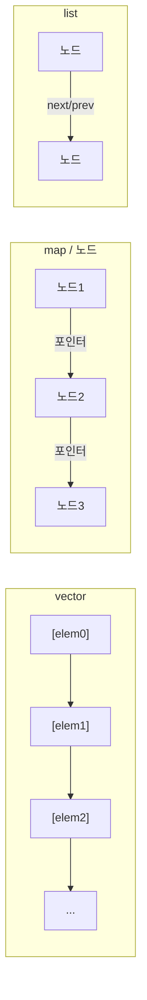

**STL 컨테이너 비용**이란 표준 라이브러리의 vector, map, unordered_map 등이 메모리 레이아웃·접근 패턴에 따라 치르는 런타임 비용을 말합니다. 본 챕터에서는 컨테이너별 비용 모델과 캐시 효율성을 정리하고, 접근·삽입·순회를 마이크로벤치마크로 측정하는 방법을 다룹니다. Low-latency에서는 "연속성·캐시 친화성"과 "연산 복잡도"를 함께 보고 선택하는 것이 핵심입니다.

## STL과 표준 컨테이너 (역사·배경)

**STL(Standard Template Library)**은 Alexander Stepanov 등이 설계하고, 1994년경 HP에서 발표된 후 C++ 표준화에 반영되었습니다. 1998년 ISO C++ 표준(C++98)에 **sequence container**(vector, deque, list)와 **associative container**(map, set, multiset, multimap)가 포함되었고, C++11에서 **unordered_map**, **unordered_set** 등 해시 기반 연관 컨테이너가 추가되었습니다. 표준은 각 컨테이너의 **복잡도 요구사항**과 **반복자 요구사항**만 정의하고, 메모리 레이아웃·성장 정책은 구현체에 맡기므로, "vector는 연속", "map은 보통 레드-블랙 트리"처럼 구현체별로 통용되는 사실을 알고 있어야 비용을 예측할 수 있습니다. 본 챕터는 그 비용 모델을 정리하고, 선택·reserve·벤치마크로 검증하는 방법을 다룹니다.

> "The standard library containers are designed to be efficient for their intended use. For example, vector is optimized for random access and compact storage; list is optimized for insertion and deletion without moving other elements." — ISO C++ Standard (container requirements). 선택 시 "의도된 사용"과 "실제 워크로드"가 맞는지 확인하는 것이 중요합니다.

## vector

`std::vector`는 요소를 **연속 메모리**에 저장합니다. 이 때문에 순차 접근·순회 시 캐시 라인을 효율적으로 채우고, 반복자가 단순 포인터 연산으로 구현되어 최적화하기 좋습니다. 인덱스 접근 `v[i]`는 한 번의 포인터 오프셋으로 끝나며, 분기 예측도 유리합니다.

용량이 부족하면 **reallocate**가 일어납니다. 대부분의 구현은 2배 성장(또는 1.5배 등) 정책을 쓰므로, 삽입이 많을 때는 **`reserve(size)`**로 필요한 크기를 미리 잡아 재할당 횟수를 줄이는 것이 좋습니다. 재할당 시 기존 요소는 이동(또는 복사)되므로, 이동이 저렴한 타입이면 비용이 상대적으로 작습니다.

- **접근**: O(1), 캐시 친화적.
- **끝에 삽입**: 분할 재할당이 없으면 O(1) 분할(amortized); 재할당 시 O(n).
- **앞이나 중간 삽입/삭제**: 요소 이동이 필요해 O(n). 빈번하면 `vector`보다 `deque`나 다른 구조를 고려합니다.

Low-latency 경로에서는 **연속 순회**가 많을 때 `vector`가 가장 유리하고, 크기를 미리 알 수 있으면 `reserve`로 할당을 한 번으로 줄이는 것이 핵심입니다.

**reserve 유무에 따른 삽입 비용**: 크기를 미리 알 때 `reserve`를 호출하면 재할당 횟수가 줄어 삽입 총 비용이 크게 감소합니다. 아래는 그 차이를 보여 주는 패턴입니다.

```cpp
#include <vector>

// 재할당이 여러 번 발생할 수 있음 (성장 정책에 따라)
std::vector<int> v1;
for (int i = 0; i < 100000; ++i) v1.push_back(i);

// reserve로 재할당 1회로 제한
std::vector<int> v2;
v2.reserve(100000);
for (int i = 0; i < 100000; ++i) v2.push_back(i);
```

벤치마크에서는 `v1` 방식과 `v2` 방식의 소요 시간을 비교해, reserve 효과를 정량적으로 확인할 수 있습니다. 삽입할 요소 수를 정확히 모를 때도 대략적인 상한으로 `reserve`를 호출하면 재할당 횟수를 줄일 수 있습니다.

## map / set (노드 기반)

`std::map`과 `std::set`은 보통 **레드-블랙 트리**로 구현됩니다. 각 노드는 키(및 값)와 왼쪽/오른쪽 자식 포인터를 가지므로, 메모리가 **연속되지 않고** 노드 단위로 흩어집니다. 이로 인해 순회·탐색 시 포인터를 따라가며 **캐시 미스**가 자주 발생할 수 있고, 포인터 추적 비용이 있습니다.

- **탐색**: O(log N). 비교 비용과 캐시 미스가 누적됩니다.
- **삽입/삭제**: O(log N). 회전 등으로 트리 균형을 맞춥니다.
- **순회**: 중위 순회는 포인터를 따라가므로, `vector` 순회보다 캐시 효율이 낮은 경우가 많습니다.

요소 수가 **작고**(예: 수십 개 이하) 키 순서가 중요하지 않다면, **정렬된 vector + 이분 탐색**이나 **flat_map** 형태가 캐시에 유리해 더 빠를 수 있습니다. 요소가 많거나 삽입·삭제가 빈번하면 map/set이 적합합니다. Low-latency에서는 "작은 N"일 때 flat 구조를 시도해 보고, 벤치마크로 비교하는 것이 좋습니다.

**정렬 vector + lower_bound 예시**: 키로 찾기만 하고 삽입·삽입이 드물 때, 정렬된 vector에서 `std::lower_bound`로 이분 탐색하면 캐시에 유리할 수 있습니다.

```cpp
#include <vector>
#include <algorithm>

std::vector<std::pair<int, int>> sorted_vec = /* ... 정렬된 (key, value) */;
auto it = std::lower_bound(sorted_vec.begin(), sorted_vec.end(), key,
  [](const auto& p, int k) { return p.first < k; });
if (it != sorted_vec.end() && it->first == key)
  return it->second;  // 찾음
```

삽입·삭제가 빈번하면 정렬을 유지하는 비용이 커지므로, 그때는 map/set이 적합합니다.

## unordered_map / unordered_set

`std::unordered_map`과 `std::unordered_set`은 **해시 테이블** 기반입니다. 키의 해시값으로 버킷을 정하고, 그 버킷 안에서 키를 찾습니다.

- **해시 비용**: 키 타입의 `hash` 연산 비용이 매 접근마다 듭니다. 복잡한 키는 해시 계산이 병목이 될 수 있습니다.
- **리해시**: 요소 수가 `load_factor` × `bucket_count`를 넘으면 버킷 수를 늘리고 재해시합니다. 이 순간에는 일시적으로 비용이 커지므로, 크기를 미리 알 수 있으면 **`reserve(n)`**으로 재해시 횟수를 줄입니다.
- **로드 팩터**: 기본값(보통 1.0 근처)이 높으면 충돌이 많아져 탐색이 길어집니다. 충돌이 많을수록 체이닝이면 리스트 탐색, 개방 주소면 프로빙이 늘어납니다.

구현체에 따라 **개방 주소**(open addressing) 또는 **체이닝**을 쓰며, 캐시 효율과 삽입/삭제 특성이 달라집니다. 키·값이 작으면 한 캐시 라인에 여러 엔트리가 들어가 유리하고, 크면 캐시 미스가 늘어납니다. 평균 O(1)이지만 상수 인자와 캐시 동작이 실제 성능을 좌우하므로, 핫패스에서는 벤치마크로 확인하는 것이 안전합니다.

## 기타 컨테이너

- **deque**: 여러 **청크(블록)**로 나누어 저장합니다. 앞·뒤 삽입은 O(1) 분할(amortized)이고, 중간 삽입은 여전히 비쌉니다. 연속 순회는 vector만큼 캐시 친화적이지는 않지만, 앞뒤 확장이 필요할 때 vector보다 재할당이 적습니다.
- **list**: **이중 연결 리스트**로, 노드마다 포인터가 있어 캐시 효율이 낮습니다. 순차 접근이 캐시를 잘 활용하지 못하므로, 대량 순회가 있으면 vector나 deque를 우선 고려합니다. 앞뒤 삽입/삭제는 O(1)이지만, 실제로는 포인터 연산과 노드 할당 비용이 있습니다.

**기타 컨테이너 한눈에 보기**:

| 컨테이너 | 메모리 | 접근 | 앞/뒤 삽입 | 중간 삽입 | 순회 캐시 |
|----------|--------|------|------------|-----------|-----------|
| vector | 연속 | O(1) | amort O(1), 재할당 시 O(n) | O(n) | 매우 유리 |
| deque | 청크 단위 | O(1) | amort O(1) | O(n) | vector보다 불리 |
| list | 노드 흩어짐 | O(n) 순차 | O(1) | O(1) 삽입 위치 알 때 | 불리 |

### 컨테이너 선택 기준 요약

| 사용 패턴 | 우선 고려 | 비고 |
|-----------|-----------|------|
| 연속 순회, 인덱스 접근 | vector | reserve로 재할당 최소화 |
| 정렬된 키, 작은 N | 정렬 vector / flat_map | 캐시 친화 |
| 정렬된 키, 큰 N 또는 동적 삽입·삭제 | map/set | 트리 비용 감수 |
| 키로 빠른 찾기, 순서 불필요 | unordered_map/set | 해시·로드 팩터·reserve |
| 앞뒤 삽입·삭제 많음 | deque | 중간 삽입은 비쌈 |
| 빈번한 중간 삽입·삭제(특수한 경우) | list | 캐시 비효율 주의 |

실제 선택은 **접근·삽입·삭제·순회 비율**과 **N의 크기**에 따라 달라지므로, 프로파일과 마이크로벤치마크로 결정하는 것이 좋습니다.

### 메모리 레이아웃 비교 (vector vs map vs list)

vector는 한 블록의 연속 메모리, map은 노드가 흩어진 트리, list는 노드가 흩어진 리스트이므로 캐시 동작이 다릅니다. 개념적으로 아래와 같이 구분할 수 있습니다.



연속 레이아웃(vector)은 순차 접근 시 캐시 라인을 효율적으로 사용하고, 노드 기반(map, list)은 접근마다 포인터를 따라가며 캐시 미스가 날 수 있습니다.

## 측정과 검증

- **접근**: 인덱스/키로 N번 접근하는 루프를 벤치마크하여 컨테이너별 접근 비용을 비교합니다.
- **삽입**: 빈 컨테이너에 순차 삽입(또는 랜덤 삽입) 시 `reserve` 유무, map vs unordered_map 등을 비교합니다.
- **순회**: 전체 순회 시간을 측정해 캐시 효율 차이(vector vs list, map 순회 등)를 확인합니다.

가능하면 **메모리 프로파일러**나 **캐시 시뮬레이션**으로 레이아웃·미스 수를 보면서, 컨테이너 선택이 실제 워크로드에 미치는 영향을 검증합니다.

## 평가 기준 (학습 성과 목표)

- vector·map·unordered_map·deque·list의 **메모리 레이아웃**과 **접근·삽입·순회** 비용을 설명할 수 있다.
- "연속 순회 vs 노드 흩어짐", "캐시 친화성"이 성능에 미치는 영향을 구분할 수 있다.
- 사용 패턴(접근/삽입/삭제/순회 비율, N 크기)에 따라 컨테이너를 선택하고, reserve·로드 팩터 등으로 재할당·재해시를 줄일 수 있다.
- 마이크로벤치마크로 접근·삽입·순회 비용을 측정하고, 프로파일과 함께 검증할 수 있다.

## 판단 기준 (언제 쓸고 언제 피할지)

| 상황 | 권장 | 비권장 |
|------|------|--------|
| 연속 순회·인덱스 접근이 주 | vector + reserve | list, 불필요한 map |
| 정렬된 키, N 작음 | 정렬 vector / flat_map | map (캐시 비효율) |
| 키 탐색 빈번, 순서 불필요 | unordered_map + reserve | map (log N 비용) |
| 앞뒤 삽입 많음 | deque | vector 앞쪽 삽입 |
| 중간 삽입·삭제 빈번 | (특수 케이스만) list | 일반적으로 vector/deque 우선 |

**적용 체크리스트**: (1) 핫패스 순회가 있으면 vector·연속 구조 우선 검토. (2) 삽입 전에 reserve로 재할당·재해시 횟수 최소화. (3) N이 작을 때 flat 구조 vs map/unordered_map 벤치마크로 비교.

### 컨테이너별 상세 비교 (참고)

| 컨테이너 | 접근 | 삽입(평균) | 순회 | 메모리 | 캐시 | 비고 |
|----------|------|------------|------|--------|------|------|
| vector | O(1) 인덱스 | 뒤쪽 O(1) 분할상환, 중간 O(n) | 연속, 매우 유리 | 연속, 재할당 시 이동 | 매우 좋음 | reserve 필수 |
| deque | O(1) 인덱스 | 앞뒤 O(1), 중간 O(n) | 청크 단위 연속 | 청크 배열 | 좋음 | 앞뒤 삽입 시 |
| list | O(n) 순차 | 삽입 위치 알면 O(1) | 노드마다 포인터 추종 | 노드 흩어짐 | 나쁨 | 특수 케이스만 |
| map/set | O(log N) | O(log N) | 순회 시 중위 순회 | 노드 기반 | 보통~나쁨 | 정렬·범위 필요 시 |
| unordered_* | O(1) 기대 | O(1) 기대, 재해시 시 O(n) | 버킷 순서, 캐시 불리할 수 있음 | 버킷+노드 | 상황 의존 | reserve, 로드 팩터 |

실제 수치는 플랫폼·데이터 크기·접근 패턴에 따라 다르므로, 위 표는 복잡도와 특성 참고용이며 반드시 벤치마크로 확인합니다.

### 실전 시나리오: 핫패스에서 map을 vector로

프로파일러에서 특정 경로가 map::operator[] 또는 map 순회에 시간을 많이 쓴다고 가정합니다. (1) 해당 구간만 격리한 벤치마크를 만들어 map 접근(또는 순회) 비용을 나노초로 측정합니다. (2) 키 집합이 고정이거나 삽입이 적다면, 정렬된 vector + lower_bound 또는 flat_map으로 같은 연산을 구현해 동일 벤치마크에서 비교합니다. (3) 개선이 나오면 실제 코드에 반영하고, 반복자 무효화 규칙이 바뀌지 않았는지 확인한 뒤 회귀 벤치마크를 돌립니다. (4) 삽입이 빈번한 구간은 map/unordered_map을 유지하고, 읽기 전용 또는 읽기 위주 구간만 연속 구조로 바꾸는 식으로 범위를 나눌 수 있습니다.

### 요약: 이 장의 핵심 메시지

1. **연속 레이아웃**(vector, deque)은 순회·인덱스 접근 시 캐시에 유리하다; 노드 기반(map, list)은 접근마다 포인터를 따라가 비용이 클 수 있다.
2. **reserve**로 vector·unordered_map의 재할당·재해시 횟수를 줄인다.
3. **N이 작고** 키 탐색·범위 탐색이 있으면 **정렬 vector + lower_bound** 또는 **flat_map**이 map보다 빠를 수 있다; 벤치마크로 확인한다.
4. **접근·삽입·순회 비율**과 **N 크기**에 따라 컨테이너를 선택하고, 변경 후에는 격리 벤치마크와 회귀 검증을 수행한다.

## 비판적 시각: 한계와 트레이드오프

- **vector**: 중간 삽입·삭제가 많으면 O(n) 이동 비용이 누적된다. 그런 패턴이면 deque나 전용 구조를 고려한다.
- **map/set**: 정렬·순서 유지가 필요하거나 범위 탐색이 있으면 트리가 적합하다. "무조건 unordered"가 아니라 요구사항에 맞게 선택한다.
- **flat 구조**: 삽입·삭제가 빈번하면 재정렬·이동 비용이 커질 수 있어, "작은 N"이거나 읽기 위주일 때 유리하다.

## 핵심 요약

| 항목 | 요약 |
|------|------|
| vector | 연속 메모리, 캐시 친화, reserve로 재할당 최소화 |
| map/set | 노드 기반, O(log N), 작은 N이면 flat 대안 검토 |
| unordered_* | 해시, reserve·로드 팩터, 키 해시 비용 주의 |
| 선택 | 접근·삽입·순회 비율 + N 크기 → 벤치마크로 결정 |

### 용어 정리

| 용어 | 설명 |
|------|------|
| **reallocate** | vector 등이 용량 부족 시 더 큰 버퍼를 할당하고 요소를 이동/복사하는 동작 |
| **reserve** | 미리 용량을 잡아 재할당 횟수를 줄이는 멤버 함수 (vector, unordered_*) |
| **load_factor** | unordered_*에서 (요소 수) / (버킷 수); 충돌 빈도와 관련 |
| **flat_map** | 키-값을 연속 메모리에 저장하고 이분 탐색하는 비표준 구조; 작은 N에서 캐시 유리 |
| **분할 재할당 (amortized)** | vector 등이 용량을 늘릴 때 "한 번에 한 요소" 비용으로 쪼개어 보는 분석 |
| **반복자 무효화** | 재할당·삽입·삭제 후 기존 반복자가 유효하지 않게 되는 규칙; 컨테이너별로 다름 |

**컨테이너별 한 줄 요약**: vector = 연속 + reserve; map = 노드 + O(log N), 작은 N이면 flat 검토; unordered_map = 해시 + reserve; deque = 앞뒤 삽입; list = 특수 케이스만.

### 벤치마크 결과 해석 가이드

| 관찰 | 해석·다음 단계 |
|------|----------------|
| vector 순회가 list 순회보다 수 배 빠름 | 연속 접근이 캐시에 유리; 순회가 핫패스면 vector·연속 구조 유지 |
| map 접근이 unordered_map보다 느림 | O(log N) vs O(1) 기대; N이 크면 unordered_map, 작으면 flat_map도 벤치마크 |
| reserve 없이 삽입 시 구간별 지연 스파이크 | 재할당·재해시 발생; reserve(size) 또는 reserve(예상 상한) 적용 |
| deque 앞쪽 삽입이 vector보다 빠름 | vector는 앞쪽 삽입 시 이동 비용; 앞뒤 삽입 많으면 deque 검토 |

**통계**: 여러 회 실행한 평균·표준편차를 보고, 한 번의 수치로 결론 내리지 않습니다.

### 자주 묻는 질문 (FAQ)

**Q: 무조건 vector를 써야 하나요?**  
A: 아니요. 연속 순회·인덱스 접근이 주일 때 vector가 유리합니다. 키 탐색이 많고 순서가 불필요하면 unordered_map, 정렬·범위 탐색이 필요하면 map이 맞을 수 있습니다.

**Q: flat_map은 표준인가요?**  
A: C++23에 std::flat_map이 도입되었습니다. 이전에는 boost::container::flat_map 등 비표준 구현을 썼습니다. 작은 N에서 캐시 효율이 좋으므로 벤치마크로 비교해 보세요.

**Q: list는 언제 쓰나요?**  
A: 중간 삽입·삭제가 매우 빈번하고 요소가 크며 이동 비용이 클 때만 검토합니다. 대부분의 경우 vector + reserve나 deque가 더 나은 캐시 동작으로 이깁니다.

**Q: unordered_map의 load_factor를 조정해야 하나요?**  
A: 기본값으로 충분한 경우가 많습니다. 재해시 비용이 프로파일에서 보이면 reserve로 초기 버킷 수를 잡거나, max_load_factor를 조정해 볼 수 있습니다.

**Q: reserve 크기를 어떻게 정하나요?**  
A: 삽입할 요소 수의 상한을 알면 그 값으로 reserve합니다. 모르면 경험적 상한이나 점진적 reserve(예: 2배씩)를 쓰고, 프로파일로 재할당 횟수를 확인합니다.

### 적용 체크리스트 (실무용)

- [ ] 핫패스에 순회·접근이 있는지 프로파일러로 확인했는가?
- [ ] 연속 접근이 주인지, 키 탐색이 주인지 구분했는가?
- [ ] vector·unordered_map 사용 시 reserve를 호출했는가?
- [ ] N이 작을 때 flat_map·정렬 vector와 map/unordered_map을 벤치마크로 비교했는가?
- [ ] 중간 삽입·삭제가 많다면 list 대신 vector/deque 이동 비용을 측정했는가?
- [ ] 변경 후 관련 벤치마크로 회귀 검증을 했는가?

### 진단 도구 요약

| 목적 | 도구·방법 |
|------|-----------|
| 접근·순회 나노초 | Google Benchmark, nanobench로 컨테이너별 루프 벤치마크 |
| 재할당 횟수 | 사용자 정의 할당자 훅, 메모리 프로파일러(massif 등) |
| 캐시 미스 | perf, VTune 등으로 캐시 미스 이벤트 확인 |
| 메모리 레이아웃 | sizeof, 반복자 거리로 요소 간격·연속성 확인 |

### 학습 후 자가 점검

(1) vector·map·unordered_map의 메모리 레이아웃 차이는? (2) "연속 vs 노드"가 캐시에 미치는 영향은? (3) reserve를 써야 하는 컨테이너와 이유는? (4) flat_map·정렬 vector를 고려하는 상황은? (5) 접근·삽입·순회 비율에 따라 컨테이너를 선택할 수 있는가?

### 자주 하는 실수

- **reserve 없이 반복 삽입**: 재할당이 여러 번 일어나 지연 스파이크와 불필요한 복사가 발생합니다. 삽입 전에 reserve(예상 크기)를 호출합니다.
- **모든 곳에 map 사용**: 키 탐색이 적고 순회가 많으면 정렬 vector + lower_bound나 flat_map이 더 빠를 수 있습니다. 벤치마크로 확인합니다.
- **list를 "삽입 많으니까" 사용**: 중간 삽입이 정말 빈번한지, 요소 이동 비용이 큰지 측정한 뒤에만 list를 검토합니다. 대부분 vector/deque가 유리합니다.

### 리팩토링 시 주의

컨테이너 타입을 바꾸면 반복자 무효화 규칙이 달라집니다. vector는 재할당 시 모든 반복자가 무효화되고, map/unordered_map은 삽입 시 일부만 무효화됩니다. 반복자를 캐시해 두는 코드가 있다면 리팩토링 후 무효화 시점을 다시 확인하고, 단위 테스트·벤치마크로 회귀를 검증합니다.

### 상세 예: 정렬 vector로 map 대체 (작은 N)

키-값 쌍이 적고(예: 수십~수백 개), 삽입보다 조회·순회가 많을 때 정렬된 vector + binary_search(lower_bound)가 map보다 캐시에 유리할 수 있습니다. 패턴만 보여 줍니다.

```cpp
#include <vector>
#include <algorithm>

struct KVPair { int key; int value; };

std::vector<KVPair> vec = { {3,30}, {1,10}, {2,20} };
std::ranges::sort(vec, {}, &KVPair::key);

auto it = std::ranges::lower_bound(vec, 2, {}, &KVPair::key);
if (it != vec.end() && it->key == 2)
  return it->value;  // 찾음
// 없음
```

삽입이 가끔이면 정렬을 유지하는 비용이 들고, N이 크면 map의 O(log N)이 더 나을 수 있으므로 반드시 벤치마크로 비교합니다. C++23 std::flat_map을 쓸 수 있으면 구현이 더 단순해집니다.

### 컴파일러·플랫폼별 참고

- **GCC/Clang**: vector의 성장 정책(보통 2배), unordered_map의 기본 버킷 수와 max_load_factor는 구현체마다 다릅니다. 문서를 확인하고, 필요하면 reserve·max_load_factor로 동작을 조정합니다.
- **MSVC**: 비슷하게 vector는 연속, map은 레드-블랙 트리, unordered_*는 해시 테이블로 구현됩니다. 벤치마크는 대상 플랫폼에서 수행하는 것이 정확합니다.
- **캐시 크기**: L1/L2/L3 크기에 따라 "연속 블록이 캐시에 온전히 들어가는지"가 달라질 수 있어, 매우 큰 vector 순회 시 캐시 미스가 늘어날 수 있습니다. 이 경우는 챕터 01·컴파일러 트랙과 함께 접근합니다.

### 이 장을 마치며

STL 컨테이너 선택은 "연속 vs 노드", "접근·삽입·순회 비율", "N 크기"를 함께 보고 결정합니다. reserve로 재할당을 줄이고, N이 작을 때 flat·정렬 vector를 map과 벤치마크로 비교한 뒤 적용합니다. 다음 장(03)에서는 문자열(string·string_view·SSO) 비용을 다룹니다.

**이 장의 학습 목표 재확인**: vector·map·unordered_map·deque·list의 비용 모델을 설명할 수 있는가? 연속 vs 노드가 캐시에 미치는 영향을 구분할 수 있는가? reserve와 flat 구조를 상황에 맞게 적용할 수 있는가? 격리 벤치마크와 회귀 검증을 수행할 수 있는가?

### 추가 읽기 및 관련 챕터

- **챕터 01 (추상화 비용)**: 가상 호출·RTTI가 병목일 때.
- **챕터 03 (문자열 최적화)**: string·string_view, SSO; 문자열이 많이 쓰일 때.
- **챕터 14 (SBO)**: std::function 등 타입 소거 컨테이너 내부.
- **외부**: C++ 표준 컨테이너 요구사항, boost flat_map, std::flat_map (C++23).

### 이 장에서 다룬 내용

- STL과 표준화 배경, vector·map·unordered_map·deque·list의 비용 모델.
- 연속 vs 노드 레이아웃과 캐시, reserve·정렬 vector+lower_bound 예시, 메모리 레이아웃 비교 Mermaid.
- 측정·선택 기준·판단 기준·비판적 시각.
- 벤치마크 해석 가이드, FAQ, 적용 체크리스트, 진단 도구, 학습 후 자가 점검, 자주 하는 실수, 리팩토링 시 주의.
- 컨테이너별 상세 비교 표, 실전 시나리오(map→vector), 요약 핵심 메시지, 상세 예(정렬 vector), 컴파일러·플랫폼 참고, 이 장을 마치며, 학습 목표 재확인, 추가 읽기.

**챕터 02 정리**: 컨테이너 선택 = 연속 vs 노드 + 접근/삽입/순회 비율 + N 크기; reserve·flat 구조 검토; 다음은 03(문자열 최적화)입니다.

### 순회·접근 패턴별 권장 (요약)

| 패턴 | 권장 | 이유 |
|------|------|------|
| 순차 순회만, 인덱스 불필요 | vector | 연속 메모리, 캐시 최고 |
| 인덱스 접근·끝 삽입 위주 | vector + reserve | O(1) 접근, 재할당 최소화 |
| 키로 조회, 순서 불필요, N 중간~큼 | unordered_map + reserve | O(1) 기대, 해시 비용 |
| 키로 조회, N 작음 | 정렬 vector / flat_map | 캐시 유리, 벤치마크로 확인 |
| 정렬·범위 검색 필요 | map 또는 정렬 vector | O(log N), 요구사항에 따라 |
| 앞·뒤 삽입 많음 | deque | 앞쪽 삽입 시 vector 이동 비용 회피 |
| 중간 삽입·삭제 매우 빈번, 요소 큼 | list (드묾) | O(1) 삽입; 먼저 vector 이동 비용 측정 |

### 선택 플로우 (개념)

1. 핫패스에서 **순회·접근·삽입** 중 무엇이 주인지 파악한다.
2. **순회·인덱스 접근**이 주면 vector(또는 deque) + reserve를 우선 검토한다.
3. **키 탐색**이 주면: N이 작으면 정렬 vector·flat_map과 map/unordered_map을 벤치마크; N이 크면 unordered_map(순서 불필요) 또는 map(정렬·범위 필요).
4. **삽입**이 많으면 reserve로 재할당·재해시를 줄이고, 중간 삽입이 정말 빈번한지 측정한 뒤에만 list를 검토한다.
5. 변경 후 **격리 벤치마크 + 회귀 검증**을 수행한다.

### 참고 자료

- ISO C++ Standard (Container requirements), cppreference (vector, map, unordered_map).
- Boost.Container flat_map, C++23 std::flat_map.
- 챕터 01(추상화), 03(문자열), 14(SBO)와 함께 참고.

### 이 장의 평가 기준 재확인

이 장을 읽은 후 다음을 할 수 있어야 합니다: (1) vector·map·unordered_map·deque·list의 메모리 레이아웃과 접근·삽입·순회 비용을 설명할 수 있다. (2) 연속 vs 노드가 캐시에 미치는 영향을 구분할 수 있다. (3) 사용 패턴과 N 크기에 따라 컨테이너를 선택하고 reserve·flat 구조를 적용할 수 있다. (4) 마이크로벤치마크로 접근·삽입·순회 비용을 측정하고 회귀 검증을 수행할 수 있다. 위를 달성했다면 챕터 03(문자열 최적화)으로 진행하면 됩니다.

**정량적 비교 (참고)**: 실제 수치는 플랫폼·데이터·컴파일러에 따라 다릅니다. 일반적으로 "vector 순회 vs list 순회"는 같은 N에서 vector가 수 배 빠른 경우가 많고, "map 접근 vs 정렬 vector lower_bound"는 N이 작을 때(예: 수백 이하) vector가 더 빠를 수 있습니다. 반드시 대상 환경에서 격리 벤치마크로 확인합니다.

**다음 장(03) 미리보기**: 문자열 최적화에서는 std::string의 SSO(Small String Optimization), std::string_view로 불필요한 복사·할당을 줄이는 방법, 파싱·포맷팅에서의 문자열 비용을 다룹니다. 컨테이너에 string을 많이 넣는 경우 02와 03을 함께 참고하면 됩니다.

**요약: 이 장의 핵심 (최종)**:
- 연속 메모리(vector, deque)는 순회·인덱스 접근에 캐시 유리; 노드 기반(map, list)은 접근마다 포인터 추종으로 비용이 클 수 있음.
- reserve로 vector·unordered_map의 재할당·재해시를 최소화함.
- N이 작고 키 탐색·범위가 있으면 정렬 vector·flat_map을 map과 벤치마크로 비교함.
- 접근·삽입·순회 비율과 N 크기에 따라 컨테이너를 선택하고, 변경 후 격리 벤치마크와 회귀 검증을 수행함.
- list는 중간 삽입·삭제가 매우 빈번하고 요소가 클 때만 검토하고, 대부분 vector/deque가 유리함.

**용어·개념 복습**: reallocate, reserve, load_factor, flat_map, 반복자 무효화, 분할 재할당(amortized). 이 용어들을 설명할 수 있으면 이 장의 내용을 잘 소화한 것입니다.

**참고: 반복자 종류와 무효화**: vector·deque는 **랜덤 액세스 반복자**로 인덱스·차이 연산이 O(1)입니다. list는 **양방향 반복자**로만 순차 이동이 가능합니다. map·unordered_map은 삽입·삭제 시 해당 노드가 아닌 다른 반복자는 무효화되지 않는 경우가 많지만, 구현체에 따라 다르므로 표준 문서를 확인합니다. 리팩토링 시 반복자를 캐시하는 코드가 있다면 무효화 시점이 바뀌지 않았는지 꼭 검증합니다.

**실무 팁**: (1) 프로파일러에서 "map::operator[]" 또는 "vector::push_back"이 많이 나오면 해당 컨테이너 사용 패턴을 코드로 확인하고, reserve·flat 대안을 검토합니다. (2) CI에 "핵심 경로" 벤치마크를 넣어 회귀를 방지합니다. (3) N이 작은 설정·캐시 등은 정렬 vector·flat_map을 우선 시도해 보고, 벤치마크로 이득이 있을 때만 도입합니다. (4) 중간 삽입이 많은 구조는 "실제로 얼마나 많은지" 프로파일로 확인한 뒤, list보다 vector 이동 비용을 측정해 보는 것이 좋습니다.

**이 장을 읽은 후 확인할 수 있는 것**:
- vector·map·unordered_map·deque·list의 메모리 레이아웃과 접근·삽입·순회 복잡도를 표로 정리할 수 있다.
- "연속 vs 노드"가 캐시에 미치는 영향을 한 문장으로 설명할 수 있다.
- reserve를 써야 하는 컨테이너와, 쓰지 않을 때 발생하는 비용을 설명할 수 있다.
- flat_map·정렬 vector를 고려하는 상황(작은 N, 키 탐색·범위)을 나열할 수 있다.
- 주어진 워크로드(접근/삽입/순회 비율, N)에 대해 적절한 컨테이너를 선택하고, 벤치마크로 검증할 수 있다.
- 반복자 무효화 규칙이 컨테이너별로 어떻게 다른지 설명할 수 있다.

위 항목을 스스로 설명해 보며 02를 마무리한 뒤, 챕터 03(문자열 최적화)으로 넘어가면 됩니다.

**최종 정리**: (1) STL 컨테이너 비용은 메모리 레이아웃(연속 vs 노드)과 연산 복잡도로 이해한다. (2) vector·unordered_map은 reserve로 재할당·재해시를 줄인다. (3) N이 작을 때 정렬 vector·flat_map이 map보다 캐시에 유리할 수 있으므로 벤치마크로 비교한다. (4) list는 특수한 경우에만 사용하고, 대부분 vector·deque가 유리하다. (5) 컨테이너 변경 시 반복자 무효화 규칙을 확인하고 회귀 벤치마크를 수행한다. (6) 다음 장 03에서는 문자열(string·string_view·SSO) 비용을 다룬다.

**참고: C++23 std::flat_map**: C++23에서는 `std::flat_map`, `std::flat_set`이 표준에 추가되었습니다. 키-값(또는 키)을 연속 메모리에 저장하고 이분 탐색으로 조회하므로, 작은 N에서 map보다 캐시에 유리합니다. 삽입·삭제 시 정렬을 유지하는 비용이 있으므로, 읽기 위주 또는 N이 작을 때 사용을 검토하고 벤치마크로 확인합니다. 이전에는 boost::container::flat_map 등을 사용했습니다.

**이 장의 학습 성과 점검**: 위 "이 장을 읽은 후 확인할 수 있는 것" 여섯 항목을 말로 설명할 수 있으면 학습 목표를 달한 것입니다. 다음 장(03)에서는 문자열 최적화—SSO, string_view, 할당·복사 줄이기—를 다룹니다.

| 구분 | 내용 |
|------|------|
| 이 장의 범위 | STL 컨테이너(vector, map, unordered_map, deque, list) 비용 모델, 연속 vs 노드, reserve·flat 구조 |
| 다음 장(03) | 문자열 최적화: SSO, string_view, 할당·복사 줄이기 |
| 연계 챕터 | 01(추상화), 03(문자열), 14(SBO) |

이 표로 02의 범위와 선후 관계를 정리합니다. 02를 마친 후 03으로 넘어가면 문자열 관련 비용을 체계적으로 배우게 됩니다.

**게시 전·복습 체크**: (1) 도입·정의·예시(코드·Mermaid)·비교·마무리가 있는가? (2) 학습 성과 목표·판단 기준·비판적 시각이 있는가? (3) 벤치마크 해석·FAQ·체크리스트·진단 도구가 있는가? (4) 용어 정리·이 장에서 다룬 내용·다음 장 링크가 있는가? (5) 트랙 분량·구성(분량 기준 문서 `CONTENT_LENGTH_TARGETS.md`(트랙 폴더 루트))을 점검했는가? 위를 확인한 뒤 챕터 03(문자열 최적화)으로 진행합니다.

**참고**: 컨테이너 선택은 "복잡도"만 보지 말고 "실제 워크로드"와 "캐시 동작"을 함께 봅니다. 이 장에서 제시한 표와 플로우는 출발점이며, 반드시 프로파일러와 격리 벤치마크로 검증한 뒤 적용합니다. 챕터 03에서는 문자열(string·string_view) 비용을 다루므로, 컨테이너에 string을 많이 넣는 경우 02와 03을 함께 참고하세요.

**마무리**: 이 장(02)에서는 STL 컨테이너의 비용 모델, 연속 vs 노드, reserve·flat 구조, 벤치마크와 판단 기준을 다뤘습니다. 다음 장(03)으로 넘어가면 문자열 최적화를 배우게 됩니다.

**요약 (한 줄씩)**: vector = 연속 + reserve. map = 노드, 작은 N이면 flat 검토. unordered_map = 해시 + reserve. deque = 앞뒤 삽입. list = 특수 케이스. 선택 시 접근/삽입/순회 비율과 N 크기를 보고 벤치마크로 검증한다.

이상으로 챕터 02(STL 컨테이너 비용)를 마칩니다. 다음 장(03)에서는 문자열 최적화—SSO, string_view, 할당·복사 줄이기—를 다룹니다.

- **다음 장(03)**: 문자열 최적화 — SSO, string_view, 파싱·포맷팅 비용.
- **연계**: 01(추상화), 03(문자열), 14(SBO).
- **복습**: 위 "이 장을 읽은 후 확인할 수 있는 것" 여섯 항목을 설명할 수 있으면 02를 완료한 것입니다.

(챕터 02 끝. 다음은 03 문자열 최적화입니다.)

→ [문자열 최적화](/post/cpp-optimization/string-optimization/) (챕터 03)

## 다음 장에서는

**이전 장**: [추상화 비용 분석](/post/cpp-optimization/abstraction-cost/) (챕터 01)

**문자열 최적화**를 다룹니다. SSO, string_view, 문자열 처리 시 할당·복사 비용을 줄이는 기법과 파싱·포맷팅에서의 정량적 접근을 정리합니다.

→ [문자열 최적화](/post/cpp-optimization/string-optimization/) (챕터 03)
