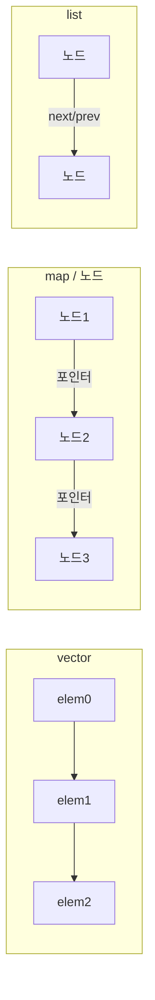

**STL 컨테이너 비용**이란 표준 라이브러리의 vector, map, unordered_map 등이 메모리 레이아웃·접근 패턴에 따라 치르는 런타임 비용을 말합니다. 본 챕터에서는 컨테이너별 비용 모델과 캐시 효율성을 정리하고, 접근·삽입·순회를 마이크로벤치마크로 측정하는 방법을 다룹니다. Low-latency에서는 "연속성·캐시 친화성"과 "연산 복잡도"를 함께 보고 선택하는 것이 핵심입니다.

## 이 장을 읽기 전에

**완전한 초보자?** 이 장은 바로 앞 [03장: 추상화 비용 분석](/post/cpp-optimization/abstraction-cost/)의 "격리 측정" 흐름을 전제로 합니다. 캐시 라인·지역성 같은 용어는 [01장: C++ 실행 모델·µs 최적화 어휘](/post/cpp-optimization/cpp-execution-model-microsecond-vocabulary-fundamentals/)에 따로 정리되어 있지만, 이 장에서 필요한 만큼은 본문에서 바로 짚으므로 **순서대로 읽어도 됩니다**. `std::vector`·`std::map`의 기본 사용법과 빅오(O) 표기를 안다면 충분합니다.

**이 장의 깊이**: 이 장은 **중급~전문가**를 포괄합니다. 각 컨테이너의 메모리 레이아웃·비용 모델을 정리하는 것부터 시작해, 전문가 구간에서는 `vector` vs `list` 순회, `map::find` vs 정렬 `vector`의 `lower_bound`를 마이크로벤치마크로 비교하고 캐시 효율로 해석합니다. **다루지 않는 것**: 커스텀 할당자·메모리 풀 설계(Tr.03 메모리·할당 트랙)와 동시 접근 시 락 비용(Tr.04 동시성 트랙)입니다.

## 당신의 수준에 맞는 경로

| 수준 | 읽을 부분 | 핵심 목표 |
|------|---------|---------|
| **초보자** | "vector" ~ "기타 컨테이너" | 컨테이너별 메모리 레이아웃·비용 모델 이해 |
| **중급자** | "벤치마크 1" ~ "측정과 검증" | 순회·탐색 비용을 직접 측정·비교 |
| **전문가** | "판단 기준" ~ "비판적 시각" | N·접근 패턴에 따른 컨테이너 선택 |

---

## STL과 표준 컨테이너 (역사·배경)

**STL(Standard Template Library)**은 Alexander Stepanov 등이 설계하고, 1994년경 HP에서 발표된 후 C++ 표준화에 반영되었습니다. 1998년 ISO C++ 표준(C++98)에 **sequence container**(vector, deque, list)와 **associative container**(map, set 등)가 포함되었고, C++11에서 **unordered_map**, **unordered_set** 등 해시 기반 연관 컨테이너가 추가되었습니다. 표준은 각 컨테이너의 **복잡도 요구사항**과 **반복자 요구사항**만 정의하고, 메모리 레이아웃·성장 정책은 구현체에 맡기므로, "vector는 연속", "map은 보통 레드-블랙 트리"처럼 구현체별로 통용되는 사실을 알아야 비용을 예측할 수 있습니다.

## vector

`std::vector`는 요소를 **연속 메모리**에 저장합니다. 이 때문에 순차 접근·순회 시 캐시 라인을 효율적으로 채우고, 반복자가 단순 포인터 연산으로 구현되어 최적화하기 좋습니다. 인덱스 접근 `v[i]`는 한 번의 포인터 오프셋으로 끝납니다.

용량이 부족하면 **reallocate**가 일어납니다. 대부분의 구현은 2배(또는 1.5배 등) 성장 정책을 쓰므로, 삽입이 많을 때는 **`reserve(size)`**로 필요한 크기를 미리 잡아 재할당 횟수를 줄이는 것이 좋습니다.

- **접근**: O(1), 캐시 친화적.
- **끝에 삽입**: 재할당이 없으면 분할상환 O(1); 재할당 시 O(n).
- **앞·중간 삽입/삭제**: 요소 이동이 필요해 O(n). 빈번하면 `deque`나 다른 구조를 고려합니다.

```cpp
#include <vector>

// 재할당이 여러 번 발생할 수 있음 (성장 정책에 따라)
std::vector<int> v1;
for (int i = 0; i < 100000; ++i) v1.push_back(i);

// reserve로 재할당 1회로 제한
std::vector<int> v2;
v2.reserve(100000);
for (int i = 0; i < 100000; ++i) v2.push_back(i);
```

## map / set (노드 기반)

`std::map`과 `std::set`은 보통 **레드-블랙 트리**로 구현됩니다. 각 노드는 키(및 값)와 자식 포인터를 가지므로, 메모리가 **연속되지 않고** 노드 단위로 흩어집니다. 이로 인해 순회·탐색 시 포인터를 따라가며 **캐시 미스**가 자주 발생할 수 있습니다.

- **탐색**: O(log N). 비교 비용과 캐시 미스가 누적됩니다.
- **삽입/삭제**: O(log N). 회전 등으로 트리 균형을 맞춥니다.
- **순회**: 중위 순회는 포인터를 따라가므로, `vector` 순회보다 캐시 효율이 낮은 경우가 많습니다.

요소 수가 **작고**(예: 수십~수백 개) 삽입·삭제가 드물면, **정렬된 vector + `lower_bound`**(또는 `flat_map`)가 캐시에 유리해 더 빠를 수 있습니다.

## unordered_map / unordered_set

`std::unordered_map`과 `std::unordered_set`은 **해시 테이블** 기반입니다. 키의 해시값으로 버킷을 정하고, 그 버킷 안에서 키를 찾습니다.

- **해시 비용**: 키 타입의 `hash` 연산 비용이 매 접근마다 듭니다. 복잡한 키는 해시 계산이 병목이 될 수 있습니다.
- **리해시**: 요소 수가 `load_factor` × `bucket_count`를 넘으면 버킷 수를 늘리고 재해시합니다. 크기를 미리 알 수 있으면 **`reserve(n)`**으로 재해시 횟수를 줄입니다.
- **로드 팩터**: 높으면 충돌이 많아져 탐색이 길어집니다.

평균 O(1)이지만 상수 인자와 캐시 동작이 실제 성능을 좌우하므로, 핫패스에서는 벤치마크로 확인하는 것이 안전합니다.

## 기타 컨테이너

- **deque**: 여러 **청크(블록)**로 나누어 저장합니다. 앞·뒤 삽입은 분할상환 O(1)이고, 중간 삽입은 여전히 비쌉니다. 연속 순회는 vector만큼 캐시 친화적이지는 않습니다.
- **list**: **이중 연결 리스트**로, 노드마다 포인터가 있어 캐시 효율이 낮습니다. 앞뒤 삽입/삭제는 O(1)이지만, 실제로는 포인터 연산과 노드 할당 비용이 있습니다.

| 컨테이너 | 메모리 | 접근 | 앞/뒤 삽입 | 중간 삽입 | 순회 캐시 |
|----------|--------|------|------------|-----------|-----------|
| vector | 연속 | O(1) | amort O(1), 재할당 시 O(n) | O(n) | 매우 유리 |
| deque | 청크 단위 | O(1) | amort O(1) | O(n) | vector보다 불리 |
| list | 노드 흩어짐 | O(n) 순차 | O(1) | O(1) 위치 알 때 | 불리 |

### 메모리 레이아웃 비교 (vector vs map vs list)

vector는 한 블록의 연속 메모리, map은 노드가 흩어진 트리, list는 노드가 흩어진 리스트이므로 캐시 동작이 다릅니다.



## 벤치마크 1: vector 순회 vs list 순회

같은 N개의 정수를 `std::vector`와 `std::list`에 담고 전체를 합산하는 순회를 비교합니다. vector는 연속 메모리라 프리페치·캐시 라인 활용에 유리하고, list는 노드마다 포인터를 따라가 캐시 미스가 누적됩니다. 아래는 그대로 컴파일·실행할 수 있습니다(`-O2 -lbenchmark`).

```cpp
#include <benchmark/benchmark.h>
#include <vector>
#include <list>
#include <numeric>

constexpr int N = 100000;

static void BM_VectorScan(benchmark::State& state) {
  std::vector<int> v(N);
  std::iota(v.begin(), v.end(), 0);
  for (auto _ : state) {
    long long sum = 0;
    for (int x : v) sum += x;
    benchmark::DoNotOptimize(sum);
  }
}
BENCHMARK(BM_VectorScan);

static void BM_ListScan(benchmark::State& state) {
  std::list<int> l(N);
  std::iota(l.begin(), l.end(), 0);
  for (auto _ : state) {
    long long sum = 0;
    for (int x : l) sum += x;
    benchmark::DoNotOptimize(sum);
  }
}
BENCHMARK(BM_ListScan);

BENCHMARK_MAIN();
```

전형적인 데스크톱 환경에서 N=100,000 순회는 vector가 list보다 대략 5~10배 빠르게 나오는 경우가 많습니다(예: vector 약 30µs, list 약 200µs). 단, **측정값은 CPU·플래그에 따라 다름**이므로 반드시 대상 환경에서 확인합니다.

## 벤치마크 2: map::find vs 정렬 vector lower_bound

키로 조회만 하고 삽입이 드문 경우, 정렬된 `vector`에서 `std::lower_bound`로 이분 탐색하면 연속 메모리 덕분에 `map::find`보다 빠를 수 있습니다(특히 작은~중간 N).

```cpp
#include <benchmark/benchmark.h>
#include <vector>
#include <map>
#include <algorithm>

constexpr int N = 4096;

static void BM_MapFind(benchmark::State& state) {
  std::map<int, int> m;
  for (int i = 0; i < N; ++i) m.emplace(i * 2, i);
  int key = 0;
  for (auto _ : state) {
    key = (key + 2) % (N * 2);
    auto it = m.find(key);
    benchmark::DoNotOptimize(it == m.end() ? -1 : it->second);
  }
}
BENCHMARK(BM_MapFind);

static void BM_SortedVectorLowerBound(benchmark::State& state) {
  std::vector<std::pair<int, int>> v;
  v.reserve(N);
  for (int i = 0; i < N; ++i) v.emplace_back(i * 2, i);
  // 이미 정렬 상태 (i*2 증가). 일반적으로는 sort로 정렬 보장.
  int key = 0;
  for (auto _ : state) {
    key = (key + 2) % (N * 2);
    auto it = std::lower_bound(v.begin(), v.end(), key,
        [](const auto& p, int k) { return p.first < k; });
    int found = (it != v.end() && it->first == key) ? it->second : -1;
    benchmark::DoNotOptimize(found);
  }
}
BENCHMARK(BM_SortedVectorLowerBound);

BENCHMARK_MAIN();
```

N이 작거나 중간일 때(수천 이하) 정렬 vector가 map보다 빠른 경우가 흔합니다(예: lower_bound 약 30ns, map::find 약 60ns). 삽입·삭제가 빈번해 정렬 유지 비용이 커지면 map/set이 적합하므로, **측정값은 CPU·플래그에 따라 다름**을 전제로 대상 워크로드에서 비교합니다.

## 측정과 검증

- **접근**: 인덱스/키로 N번 접근하는 루프를 벤치마크하여 컨테이너별 접근 비용을 비교합니다.
- **삽입**: 빈 컨테이너에 순차/랜덤 삽입 시 `reserve` 유무, map vs unordered_map 등을 비교합니다.
- **순회**: 전체 순회 시간을 측정해 캐시 효율 차이(vector vs list 등)를 확인합니다.

가능하면 **메모리 프로파일러**(massif 등)나 **perf/VTune**으로 캐시 미스를 보면서, 컨테이너 선택이 실제 워크로드에 미치는 영향을 검증합니다.

## 평가 기준 (학습 성과 목표)

- vector·map·unordered_map·deque·list의 **메모리 레이아웃**과 **접근·삽입·순회** 비용을 설명할 수 있다.
- "연속 순회 vs 노드 흩어짐", "캐시 친화성"이 성능에 미치는 영향을 구분할 수 있다.
- 사용 패턴(접근/삽입/삭제/순회 비율, N 크기)에 따라 컨테이너를 선택하고, reserve·로드 팩터 등으로 재할당·재해시를 줄일 수 있다.
- 마이크로벤치마크로 접근·삽입·순회 비용을 측정하고, 프로파일과 함께 검증할 수 있다.

## 판단 기준 (언제 쓰고 언제 피할지)

| 상황 | 권장 | 비권장 |
|------|------|--------|
| 연속 순회·인덱스 접근이 주 | vector + reserve | list, 불필요한 map |
| 정렬된 키, N 작음 | 정렬 vector / flat_map | map (캐시 비효율) |
| 키 탐색 빈번, 순서 불필요 | unordered_map + reserve | map (log N 비용) |
| 앞뒤 삽입 많음 | deque | vector 앞쪽 삽입 |
| 중간 삽입·삭제 빈번 | (특수 케이스만) list | 일반적으로 vector/deque 우선 |

### 자주 하는 실수

- **reserve 없이 반복 삽입**: 재할당이 여러 번 일어나 지연 스파이크와 불필요한 복사가 발생합니다. 삽입 전에 reserve(예상 크기)를 호출합니다.
- **모든 곳에 map 사용**: 키 탐색이 적고 순회가 많으면 정렬 vector + lower_bound나 flat_map이 더 빠를 수 있습니다.
- **list를 "삽입 많으니까" 사용**: 중간 삽입이 정말 빈번한지, 요소 이동 비용이 큰지 측정한 뒤에만 list를 검토합니다.

### 리팩토링 시 주의

컨테이너 타입을 바꾸면 반복자 무효화 규칙이 달라집니다. vector는 재할당 시 모든 반복자가 무효화되고, map/unordered_map은 삽입 시 일부만 무효화됩니다. 반복자를 캐시하는 코드가 있다면 무효화 시점을 다시 확인하고, 단위 테스트·벤치마크로 회귀를 검증합니다.

## 비판적 시각: 한계와 트레이드오프

- **vector**: 중간 삽입·삭제가 많으면 O(n) 이동 비용이 누적된다. 그런 패턴이면 deque나 전용 구조를 고려한다.
- **map/set**: 정렬·순서 유지나 범위 탐색이 필요하면 트리가 적합하다. "무조건 unordered"가 아니라 요구사항에 맞게 선택한다.
- **flat 구조**: 삽입·삭제가 빈번하면 재정렬·이동 비용이 커질 수 있어, "작은 N"이거나 읽기 위주일 때 유리하다.

## 핵심 요약

| 항목 | 요약 |
|------|------|
| vector | 연속 메모리, 캐시 친화, reserve로 재할당 최소화 |
| map/set | 노드 기반, O(log N), 작은 N이면 flat 대안 검토 |
| unordered_* | 해시, reserve·로드 팩터, 키 해시 비용 주의 |
| 선택 | 접근·삽입·순회 비율 + N 크기 → 벤치마크로 결정 |

### 용어 정리

| 용어 | 설명 |
|------|------|
| **reallocate** | vector 등이 용량 부족 시 더 큰 버퍼를 할당하고 요소를 이동/복사하는 동작 |
| **reserve** | 미리 용량을 잡아 재할당 횟수를 줄이는 멤버 함수 (vector, unordered_*) |
| **load_factor** | unordered_*에서 (요소 수) / (버킷 수); 충돌 빈도와 관련 |
| **flat_map** | 키-값을 연속 메모리에 저장하고 이분 탐색하는 구조(C++23 std::flat_map); 작은 N에서 캐시 유리 |
| **반복자 무효화** | 재할당·삽입·삭제 후 기존 반복자가 유효하지 않게 되는 규칙; 컨테이너별로 다름 |

### 자주 묻는 질문 (FAQ)

**Q: 무조건 vector를 써야 하나요?**  
A: 아니요. 연속 순회·인덱스 접근이 주일 때 vector가 유리합니다. 키 탐색이 많고 순서가 불필요하면 unordered_map, 정렬·범위 탐색이 필요하면 map이 맞을 수 있습니다.

**Q: flat_map은 표준인가요?**  
A: C++23에 `std::flat_map`이 도입되었습니다. 이전에는 `boost::container::flat_map` 등을 썼습니다. 작은 N에서 캐시 효율이 좋으므로 벤치마크로 비교하세요.

**Q: list는 언제 쓰나요?**  
A: 중간 삽입·삭제가 매우 빈번하고 요소가 크며 이동 비용이 클 때만 검토합니다. 대부분 vector + reserve나 deque가 더 나은 캐시 동작으로 이깁니다.

**Q: reserve 크기를 어떻게 정하나요?**  
A: 삽입할 요소 수의 상한을 알면 그 값으로 reserve합니다. 모르면 경험적 상한이나 점진적 reserve를 쓰고, 프로파일로 재할당 횟수를 확인합니다.

### 적용 체크리스트 (실무용)

- [ ] 핫패스에 순회·접근이 있는지 프로파일러로 확인했는가?
- [ ] 연속 접근이 주인지, 키 탐색이 주인지 구분했는가?
- [ ] vector·unordered_map 사용 시 reserve를 호출했는가?
- [ ] N이 작을 때 flat_map·정렬 vector와 map/unordered_map을 벤치마크로 비교했는가?
- [ ] 중간 삽입·삭제가 많다면 list 대신 vector/deque 이동 비용을 측정했는가?
- [ ] 변경 후 관련 벤치마크로 회귀 검증을 했는가?

## 다음 장에서는

**이전 장**: [추상화 비용 분석](/post/cpp-optimization/abstraction-cost/) (챕터 03)

**문자열 최적화**를 다룹니다. SSO, string_view, 문자열 처리 시 할당·복사 비용을 줄이는 기법과 파싱·포맷팅에서의 정량적 접근을 정리합니다. 컨테이너에 string을 많이 넣는 경우 02와 03을 함께 참고하면 됩니다.

→ [문자열 최적화](/post/cpp-optimization/string-optimization/) (챕터 05)
