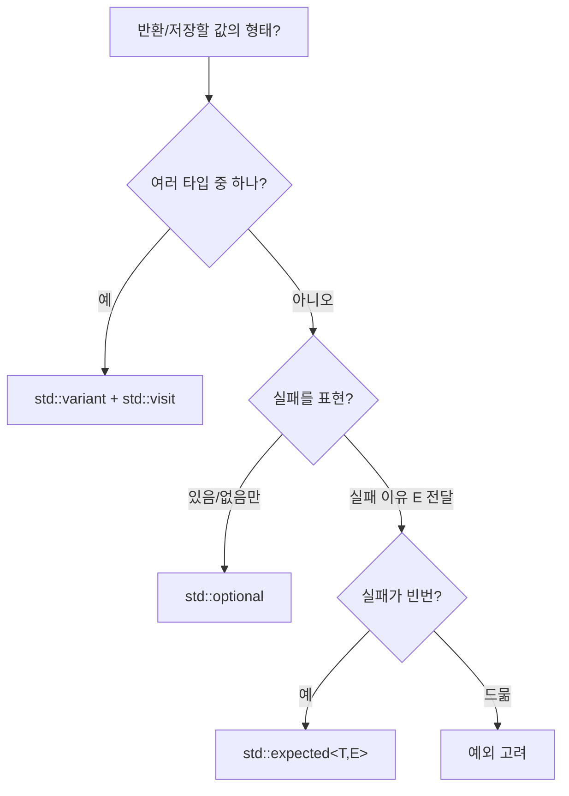

---
collection_order: 13
date: 2026-03-10
lastmod: 2026-07-10
draft: false
image: wordcloud.png
title: "[Optimization(C++) 13] std::variant/optional/expected"
slug: variant-optional-expected
description: "타입 안전 유니온과 옵셔널 타입인 std::variant, std::optional, std::expected의 성능 특성과 오버헤드를 분석합니다. 포인터·공용체 대비 비용과 예외 없이 실패를 표현하는 패턴의 성능을 다루며, 메모리 레이아웃과 visit/if-let 비용을 정리합니다."
tags:
  - C++
  - Performance
  - Optimization
  - 성능
  - 최적화
  - Type-Safety
  - Memory
  - 메모리
  - Data-Structures
  - 자료구조
  - Implementation
  - 구현
  - Code-Quality
  - 코드품질
  - Best-Practices
  - Clean-Code
  - 클린코드
  - Profiling
  - 프로파일링
  - Benchmark
  - Time-Complexity
  - 시간복잡도
  - Space-Complexity
  - 공간복잡도
  - Error-Handling
  - 에러처리
  - Testing
  - 테스트
  - Debugging
  - 디버깅
  - Refactoring
  - 리팩토링
  - Readability
  - Maintainability
  - Modularity
  - Compiler
  - 컴파일러
  - Git
  - CI-CD
  - Linux
  - Windows
  - Latency
  - Throughput
  - Backend
  - 백엔드
  - Embedded
  - 임베디드
  - Advanced
  - Deep-Dive
  - 실습
  - Guide
  - 가이드
  - Reference
  - 참고
  - Case-Study
  - Technology
  - 기술
  - Tutorial
  - 튜토리얼
  - Edge-Cases
  - 엣지케이스
  - Pitfalls
  - 함정
  - Software-Architecture
  - 소프트웨어아키텍처
  - Design-Pattern
  - 디자인패턴
  - Abstraction
  - 추상화
  - Documentation
  - 문서화
  - Comparison
  - 비교
---

**std::variant**·**std::optional**·**std::expected**는 타입 안전 유니온·"있음/없음"·성공/실패 전달을 위한 표준 타입입니다. 본 챕터에서는 이들의 성능 특성과 오버헤드를 분석하고, 포인터·공용체·예외 대비 비용과 선택 기준을 다룹니다.

## 이 장을 읽기 전에

**완전한 초보자?** 이 장은 [11장: 예외 처리 심화](/post/cpp-optimization/exception-deep-dive/)에서 본 "예외 vs 에러 코드" 트레이드오프와 [03장: 추상화 비용 분석](/post/cpp-optimization/abstraction-cost/)을 전제로 합니다. 유니온·"값이 있거나 없거나"가 무엇인지 정도만 알면 충분합니다.

**이 장의 깊이**: 이 장은 **중급~전문가**를 포괄합니다. `variant`·`optional`·`expected`의 의미와 사용법부터 시작해, 전문가 구간에서는 `sizeof` 레이아웃·접근 비용을 따지고 포인터·공용체·예외 대비 선택 기준을 다룹니다. **다루지 않는 것**: 예외 메커니즘 내부([11장](/post/cpp-optimization/exception-deep-dive/))와 타입 소거 일반론([19장](/post/cpp-optimization/type-erasure-cost-patterns/))입니다.

## 당신의 수준에 맞는 경로

| 수준 | 읽을 부분 | 핵심 목표 |
|------|---------|---------|
| **초보자** | "std::variant" ~ "std::optional" | 세 타입의 의미·사용법 이해 |
| **중급자** | "std::expected (C++23)" ~ "sizeof 레이아웃 노트" | 레이아웃·접근 비용 파악 |
| **전문가** | "선택 가이드" ~ "비판적 시각" | 포인터·예외 대비 선택 판단 |

---

## variant/optional/expected 표준화 (역사·배경)

**std::variant**와 **std::optional**은 C++17에서 표준에 추가되었습니다. variant는 타입 안전 유니온, optional은 "값이 있거나 없거나"를 표현합니다. **std::expected**는 C++23에서 도입되어 성공 타입 T 또는 실패 타입 E를 담고, 예외 없이 에러 전달을 표준화합니다. 이들로 RTTI·포인터·예외 대신 타입 안전하고 비용이 예측 가능한 패턴을 쓸 수 있어, Low-latency에서 선택지가 됩니다.

## std::variant

**std::variant**는 **타입 안전 유니온**입니다. 여러 타입 중 하나만 활성화되어 있고, **인덱스(타입 식별)**와 **정렬된 저장소**(가장 큰 타입 크기·정렬에 맞춤)로 표현됩니다. **std::visit**로 값을 방문할 때는 활성 타입에 따라 디스패치가 일어나며, 컴파일러가 visit 대상을 인라인할 수 있으면 switch/테이블 점프 수준으로 최적화됩니다. 포인터 하나로 간접 접근하는 방식보다 값을 직접 담아 캐시에 유리할 수 있습니다.

아래 예시는 `std::holds_alternative`로 활성 타입을 검사하고, `std::visit`로 활성 값을 한 번에 방문합니다. 대입으로 활성 타입을 전환하면 `index()`가 바뀌는 것을 확인할 수 있습니다.

```cpp
#include <variant>
#include <string>
#include <iostream>

int main() {
    std::variant<int, double, std::string> v = std::string{"hello"};

    if (std::holds_alternative<std::string>(v))
        std::cout << "string: " << std::get<std::string>(v) << '\n';

    std::visit([](auto&& x) { std::cout << "visit: " << x << '\n'; }, v);

    v = 42;                                       // 활성 타입 전환
    std::cout << "index=" << v.index() << '\n';   // 0 (int)
}
```

**포인터·수동 union 대비**: 포인터는 힙 할당과 간접 접근 비용이 있고, 수동 union은 타입 안전성이 없습니다. variant는 스택/멤버에 직접 담고 visit로 타입을 검사하므로 할당 없이 타입 안전하게 "여러 타입 중 하나"를 표현할 수 있습니다.

## std::optional

**std::optional&lt;T&gt;**는 "값이 있거나 없거나"를 표현합니다. 내부적으로는 **T**와 **값 존재 여부**(bool 판별자)를 갖습니다. 크기는 "**sizeof(T) + 판별자 1바이트 + 정렬 패딩**"으로 결정되며, 정확한 값은 **구현 정의**입니다. 예를 들어 `T`의 정렬이 1인 경우(`optional<char>`)는 2바이트가 흔하지만, `optional<int>`는 판별자 1바이트가 4바이트 경계로 패딩되어 보통 **8바이트**이고, `optional<double>`은 보통 16바이트입니다. 즉 "sizeof(T)+1"로 단정하지 말고 정렬 패딩을 함께 봐야 합니다. **값에 접근할 때**는 "값이 있는지" 한 번의 분기가 있고, 있으면 저장된 객체를 반환합니다. 대체로 오버헤드는 "한 번의 분기 + 정렬용 패딩" 수준입니다.

`value_or`는 값이 없을 때 기본값을 반환해 분기를 간결하게 합니다. 아래 함수는 빈 문자열이면 `std::nullopt`를 돌려주고, 호출 측은 `value_or(8080)`로 기본 포트를 사용합니다.

```cpp
#include <optional>
#include <string>
#include <iostream>

std::optional<int> parsePort(const std::string& s) {
    if (s.empty()) return std::nullopt;   // 값 없음
    return std::stoi(s);
}

int main() {
    int port = parsePort("").value_or(8080);  // 없으면 기본값
    std::cout << "port=" << port << '\n';      // 8080
}
```

**null 포인터·스마트 포인터**와 비교하면, optional은 **값을 직접 보관**하므로 할당이 없고, null 체크 한 번의 분기만 있습니다. 포인터는 간접 접근과 (힙 사용 시) 할당 비용이 있으므로, "값이 없을 수 있는 작은 객체"에는 optional이 성능·의도 표현 모두 유리한 경우가 많습니다.

## std::expected (C++23)

**std::expected&lt;T, E&gt;**는 "성공하면 T, 실패하면 E"를 담는 타입입니다. 에러 전파를 예외 없이 표현할 수 있어 **예외 대안**으로 쓰입니다. 에러 전달 비용은 **E**의 복사/이동 비용과 "성공/실패" 분기 한 번입니다. 인라인 가능하면 호출 오버헤드는 작고, 실패 경로가 예외보다 예측 가능한 비용을 가집니다.

아래 예시는 실패 시 `std::unexpected`로 에러 코드를 돌려줍니다. 호출 측은 `if (r)`로 성공/실패를 분기하고, 실패 경로에서 `r.error()`로 이유를 읽습니다.

```cpp
#include <expected>   // C++23
#include <string>
#include <cctype>
#include <iostream>

enum class Err { Empty, NotNumber };

std::expected<int, Err> parse(const std::string& s) {
    if (s.empty()) return std::unexpected(Err::Empty);
    for (unsigned char c : s)
        if (!std::isdigit(c)) return std::unexpected(Err::NotNumber);
    return std::stoi(s);
}

int main() {
    auto r = parse("abc");
    if (r) std::cout << "ok: " << *r << '\n';
    else   std::cout << "err code=" << static_cast<int>(r.error()) << '\n';
}
```

## sizeof 레이아웃 노트

레이아웃은 직접 출력해 보면 가장 확실합니다. `optional`은 판별자 1바이트가 정렬 경계로 패딩되고, `variant`는 "인덱스 + 가장 큰 멤버 + 정렬 패딩"이 됩니다. 아래 값은 흔한 64비트 구현 기준 예시이며 정확한 값은 구현 정의입니다.

```cpp
#include <optional>
#include <variant>
#include <string>
#include <cstdio>

int main() {
    std::printf("opt<char>=%zu opt<int>=%zu opt<double>=%zu\n",
        sizeof(std::optional<char>),    // 흔히 2
        sizeof(std::optional<int>),     // 흔히 8 (패딩)
        sizeof(std::optional<double>)); // 흔히 16
    std::printf("variant=%zu\n",
        sizeof(std::variant<int, double, std::string>)); // string 크기 + 인덱스
}
```

## 선택 가이드

- **단일 "있음/없음"**: 값이 있거나 비어 있거나만 구분하면 **optional**.
- **여러 타입 중 하나**: 고정된 타입 집합 중 하나만 활성화되면 **variant**와 **visit**.
- **실패 전파**: 반환값으로 성공/실패를 전달하고 예외를 피하고 싶으면 **expected**. 예외는 정상 경로 비용이 거의 없지만 실패 경로가 비싸므로, 실패가 자주 나오는 경로에는 expected가 유리할 수 있습니다.



## 흔한 오해

**"optional&lt;T&gt;의 크기는 항상 sizeof(T)+1이다"**는 틀린 통념입니다. 판별자 1바이트가 T의 정렬 경계로 패딩되므로, 위 sizeof 예제에서 보듯 `optional<int>`는 흔히 8바이트, `optional<double>`은 흔히 16바이트입니다(정확한 값은 구현 정의). "+1바이트"만 기대하고 구조체에 여러 optional 멤버를 촘촘히 배치하면 예상보다 메모리를 더 쓰게 됩니다.

**"expected는 예외보다 항상 빠르다"**도 과장된 통념입니다. zero-cost exception 모델(11장)에서는 예외를 던지지 않는 정상 경로의 비용이 거의 없으므로, 실패가 드물게만 일어나는 경로에서는 예외 쪽이 오히려 더 유리할 수 있습니다. expected가 이기는 지점은 "실패가 빈번해 예측 가능한 비용이 필요한 경로"이지, 모든 상황에서의 절대적 우위가 아닙니다.

## 비판적 시각: 한계와 트레이드오프

- **variant**는 타입 집합이 컴파일 타임에 고정되어야 합니다. 런타임에 타입이 열려 있으면 RTTI·상속이 나을 수 있습니다.
- **expected**는 에러 타입 E의 복사/이동 비용이 있으므로, E를 가볍게 두는 것이 좋습니다.

## 핵심 요약

| 항목 | 비용·이점 | 활용 기준 |
|------|-----------|-----------|
| variant | 인덱스+저장소, visit 디스패치, 할당 없음 | 고정 타입 집합 중 하나 |
| optional | 값+존재 플래그, 할당 없음, 분기 한 번 | 있음/없음 |
| expected | 성공 T/실패 E, 실패 경로 예측 가능 | 실패 빈번 시, E 가볍게 |

### 자주 묻는 질문 (FAQ)

**Q: variant vs 포인터·수동 union?**  
A: variant는 타입 안전 유니온으로 인덱스+저장소 레이아웃을 가집니다. visit 디스패치 비용이 있으나 할당 없이 타입 안전성·표현력을 얻습니다. 핫 경로에서는 마이크로벤치마크로 비교합니다.

**Q: optional은 언제 쓰나요?**  
A: "값이 있거나 없거나"만 구분할 때입니다. 값을 직접 보관하므로 할당이 없고, null 포인터 대비 성능·의도 표현 모두 유리한 경우가 많습니다.

**Q: expected vs 예외?**  
A: 실패가 예외적이면 예외, 실패가 빈번한 경로면 expected로 실패 비용을 예측 가능하게 합니다(챕터 11와 연계).

### 적용 체크리스트

- [ ] "있음/없음"은 optional, "여러 타입 중 하나"는 variant로 선택했는가?
- [ ] 실패가 자주 나면 expected를 검토했는가?
- [ ] 핫 경로에서 할당·분기·visit 디스패치를 벤치마크했는가?
- [ ] expected의 에러 타입 E를 가볍게 두었는가?

### 더 읽을 거리

- [cppreference: std::variant](https://en.cppreference.com/w/cpp/utility/variant) — 타입 안전 유니온의 표준 레퍼런스로, `visit`·`get`·`index()` 등 멤버 함수 명세를 확인할 수 있습니다.
- [cppreference: std::optional](https://en.cppreference.com/w/cpp/utility/optional) — `value_or`·`has_value` 등 API와 함께, 구현체별 레이아웃 차이를 다룰 때 참고할 근거 문서입니다.
- [cppreference: std::expected](https://en.cppreference.com/w/cpp/utility/expected) — C++23에서 추가된 `expected`의 정확한 인터페이스와 `unexpected`와의 관계를 확인할 수 있습니다.

## 다음 장에서는

**이전 장**: [인라이닝 유도 기법](/post/cpp-optimization/inlining-techniques/) (챕터 12)

**std::span과 뷰 패턴**을 다룹니다. 안전한 연속 구간 뷰인 span·string_view 활용과 성능 이점, non-owning 패턴을 정리합니다. → [std::span과 뷰 패턴](/post/cpp-optimization/span-and-views/) (챕터 14)
