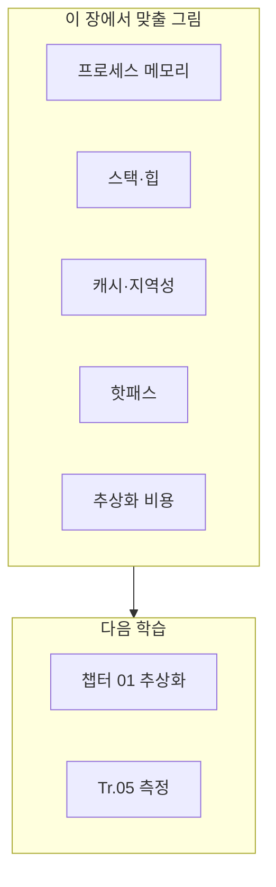

본 장은 **기초** 난이도로, 이 트랙의 챕터 01(추상화 비용)을 읽기 전에 **같은 말을 하기 위한 어휘와 그림**을 맞추는 것이 목적입니다. 여기서는 수식이나 마이크로벤치마크 구현 대신, “무엇을 줄이려는지”를 한 문장으로 설명할 수 있게 만드는 데 집중합니다. 이미 C++과 운영체제를 잘 안다면 빠르게 훑고 넘어가도 됩니다.

## 왜 이 장이 따로 있는가

µs 단위 최적화 글은 곧바로 가상 함수·컨테이너·인라이닝으로 들어가기 쉽습니다. 그러나 독자마다 **실행 모델**(메모리가 어디에 있고, 호출이 무엇을 의미하는지)에 대한 머릿속 그림이 다릅니다. 그림이 다르면 같은 벤치마크 숫자를 두고도 서로 다른 결론을 내기 쉽습니다. 이 장은 그 **공통 바닥**을 짧게 깔아 두기 위한 장입니다.

## 프로세스 메모리의 큰 덩어리

C++ 프로그램은 보통 **프로세스** 안에서 실행됩니다. 프로세스는 가상 주소 공간을 가지며, 그 안에 **코드**(텍스트), **전역/정적 데이터**, **힙**, **스택** 등이 배치됩니다. 성능 이야기에서 자주 나오는 구분은 다음과 같습니다.

**코드 영역**에는 기계어로 번역된 함수 본문이 들어갑니다. 핫패스가 여기서 많이 실행되면 **명령 캐시(I-cache)** 상태가 중요해집니다. **데이터 영역**에는 전역 객체·상수 등이 올라가고, **힙**은 `new`·컨테이너·`std::string`처럼 **런타임에 크기가 정해지는** 객체가 주로 쓰는 공간입니다. **스택**은 함수 호출마다 프레임이 쌓이는 공간으로, 지역 변수와 호출 규약에 따른 임시 공간이 여기에 올라갑니다.

힙 할당은 일반적으로 **할당자**와 **시스템 호출·락**을 동반할 수 있어 µs 예산에서 눈에 띄게 비쌀 수 있습니다. 스택은 힙보다 “가볍다”고들 하지만, 스택 오버플로나 과도한 프레임 깊이는 다른 종류의 문제를 만듭니다. 이 트랙 뒤쪽 챕터에서는 힙·스택·복사·이동이 어떻게 조합되는지 구체적으로 다룹니다.

## 스택 vs 힙: 직관 한 줄

**스택**은 호출이 끝나면 대부분 되돌려지는 **LIFO** 성격의 공간이고, **힙**은 프로그래머(또는 라이브러리)가 수명을 관리하는 **더 자유로운** 공간입니다. Low-latency 코드에서는 “핫패스에서 힙을 얼마나 치느냐”가 자주 쟁점이 됩니다. 반대로 스택만으로 해결하려다 **큰 객체**를 값으로 이리저리 넘기면 복사 비용이 힙 못지않게 커질 수 있어, 둘 중 하나만 고집하면 안 됩니다.

## 캐시 라인과 지역성

CPU는 메인 메모리보다 **작고 빠른 캐시**에 데이터를 끌어와서 씁니다. 데이터는 보통 **캐시 라인**(대개 64바이트 등, 플랫폼 의존) 단위로 이동합니다. **시간 지역성**은 같은 주소를 곧바로 다시 접근할 때 유리하고, **공간 지역성**은 인접한 주소를 순서대로 접근할 때 유리합니다. 컨테이너를 순회할 때 메모리가 흩어져 있으면 캐시 미스가 늘어나 지연이 커질 수 있습니다. 이 직관만 있어도 챕터 02(STL)·Tr.03(레이아웃)을 읽을 때 표가 이해되기 쉬워집니다.

## 핫패스와 추상화 비용

**핫패스**는 실행 시간이나 지연 예산에서 **유의미한 비중**을 차지하는 코드 경로입니다. 프로파일러에서 “위에 떠 있는 함수”가 곧 핫패스 후보이지만, µs 시스템에서는 **호출 횟수 × 한 번 비용**이 중요합니다. **추상화 비용**은 가상 호출·RTTI·예외처럼 “편의를 위한 메커니즘”이 런타임에 추가하는 비용을 넓게 부르는 말입니다. 챕터 01에서는 이 중 일부를 **숫자로** 분리해 측정합니다.

## 측정·검증 어휘 (Tr.05와 연결)

**마이크로벤치마크**는 보통 작은 함수나 연산을 반복 측정해 **한 가지 요인**의 평균·분산을 보는 도구입니다. **샘플링 프로파일러**는 일정 간격으로 PC를 찍어 **어디가 뜨거운지**를 봅니다. **트레이스**는 시간축에 이벤트를 남겨 **호출 순서·지연**을 봅니다. “벤치가 좋은데 프로덕션은 나쁘다”면 입력·캐시 상태·동시성이 다를 수 있으므로, Tr.05에서 **노이즈와 대표성**을 다룹니다.

## 이 트랙·타 트랙과의 경계

이 장은 **언어 실행과 메모리 큰 그림**만 다룹니다. **컴파일러 플래그·LTO**는 Tr.02, **할당기·레이아웃**은 Tr.03, **CPU 이벤트 해석**은 Tr.06, **syscall·스케줄링**은 Tr.07에서 이어집니다. 경계를 알아 두면 “왜 이 챕터에서는 어셈블리를 깊게 안 다루는가”에 대한 답이 됩니다.

## 비판적 시각

실행 모델을 아는 것만으로는 병목이 사라지지 않습니다. 반대로, 모델을 모르면 **우연히 빠른 코드**를 **재현 가능하게** 만들기 어렵습니다. 이 장은 “암기”가 아니라 **팀 내 용어 통일**용으로 쓰고, 세부 수치는 항상 측정으로 확인하는 태도를 유지하는 것이 좋습니다.

## 평가 기준: 이 장을 읽은 후

- [ ] 스택·힙·코드 영역을 구분해 말할 수 있는가?
- [ ] 캐시 라인·지역성을 한두 문장으로 설명할 수 있는가?
- [ ] 핫패스와 추상화 비용을 구분해 말할 수 있는가?
- [ ] 다음에 챕터 01과 Tr.05 중 무엇을 열지 선택할 근거를 말할 수 있는가?

## 핵심 요약

| 용어 | 한 줄 |
|------|------|
| 프로세스 | 실행 중인 프로그램과 그 가상 주소 공간 |
| 스택 | 호출 프레임·지역 변수가 쌓이는 영역 |
| 힙 | 동적 할당이 주로 일어나는 영역 |
| 캐시 라인 | 캐시가 한 번에 다루는 메모리 덩어리 단위 |
| 핫패스 | 지연·시간 예산에서 비중이 큰 경로 |
| 추상화 비용 | 편의 메커니즘이 추가하는 런타임 비용 |

## 다음 장에서는

본 트랙의 본격적인 첫 주제인 **추상화 비용**(가상 함수·RTTI·예외)으로 들어갑니다. 이 장의 그림을 떠올리면 vtable·간접 호출이 왜 “캐시·분기” 이야기와 연결되는지 읽기 쉬워집니다.

→ [추상화 비용 분석](/collection/optimization-01-cpp-language/01-abstraction-cost/)

## 팀 체크리스트: 용어 통일

아래 질문에 팀이 같은 답을 할 수 있으면, 이 장의 목적은 달성에 가깝습니다.

1. 우리가 말하는 **핫패스**는 프로파일러 상위 N%인가, 아니면 SLA에 직결된 경로인가?
2. **µs 예산**을 코드 한 줄이 아니라 **요청 단위**로 잡는가?
3. 힙 할당을 줄일 때 **대체 수단**(스택 버퍼, 풀, SSO) 중 무엇을 표준으로 쓰는가?
4. 벤치마크 결과를 공유할 때 **빌드 타입·CPU 고정·반복 횟수**를 함께 적는가?

## 시나리오로 익히기 (문단 연습)

**시나리오 A**: 작은 구조체를 값으로 반환하는 함수가 핫패스에 있다. 스택에는 프레임이 쌓이고, 반환값 최적화(RVO)가 적용되면 불필요한 복사가 줄어들 수 있다. 여기서 “스택/레지스터/복사” 중 무엇이 병목인지는 추측이 아니라 측정으로 가른다.

**시나리오 B**: 다형 인터페이스 뒤에 구현이 숨겨져 있고, 루프 안에서 가상 호출이 반복된다. 코드 영역의 간접 점프와 데이터 영역의 vtable 접근이 섞여 캐시 동작이 흔들릴 수 있다. 챕터 01에서는 이를 **한 번 호출당** 비용으로 분리해 본다.

**시나리오 C**: 로그 문자열을 매 요청마다 조합해 힙에 올린다. CPU는 가볍게 보여도 할당자와 OS 페이지 상태에 따라 꼬리 지연이 커질 수 있다. Tr.03·챕터 03(문자열)과 연결해 “할당 횟수”를 지표로 잡는다.

## 표: 자주 섞어 쓰는 말 바로잡기

| 흔한 표현 | 더 짚고 갈 말 |
|-----------|----------------|
| 느리다 | 평균인가 p99인가, 어느 하드웨어인가 |
| 최적화했다 | 수치가 얼마나 바뀌었는가, 회귀 테스트는 있는가 |
| 캐시 친화적 | 순차 접근인가, stride가 큰가, false sharing은 없는가 |
| zero-cost | 어떤 경로가 zero인가(해피 패스 vs 예외 경로) |

## 문단 심화: 주소 공간과 보안 기능

최신 OS와 CPU는 **ASLR**, **스택 가드**, **CFI** 같은 기능으로 보안을 강화합니다. 이들은 때로 성능 측정에 **노이즈**를 추가하거나, 특정 빌드에서만 다른 결과를 만들기도 합니다. µs 튜닝 문서에서 “같은 바이너리·같은 환경”을 강조하는 이유가 여기에 있습니다. 보안을 끄고 벤치하는 것은 **연구용**으로만 제한하고, 제품 빌드와의 괴리를 기록해 두어야 합니다.

## 문단 심화: 스레드와 스택

각 스레드는 **자신의 스택**을 가집니다. 스레드가 늘어나면 스택 예약 메모리가 커질 수 있고, 동시성 트랙(Tr.04)에서 다루는 것처럼 **경합**이 달라집니다. 이 장에서는 스레드 동기화까지 확장하지 않지만, “스택은 스레드 단위”라는 점만 기억해도 이후 챕터에서 혼선이 줄어듭니다.

## 문단 심화: 인라인과 코드 크기

함수가 **인라인**되면 호출 오버헤드는 줄지만, **코드 크기**가 커져 I-cache 압박이 생길 수 있습니다. 그래서 “모든 함수를 인라인”은 답이 아닙니다. 컴파일러 트랙(Tr.02)과 챕터 10(인라이닝 유도)은 이 트레이드오프를 **리포트와 크기**로 검증하는 쪽으로 이어집니다.

## 연습 문제 (서술형)

1. 힙 할당이 의심될 때, 코드를 바꾸기 전에 **어떤 지표**를 먼저 볼 것인가? (힌트: 할당 횟수, 시간, 둘 다)
2. 가상 호출이 의심될 때, **어셈블리에서** 무엇을 찾아볼 것인가? (힌트: 간접 call)
3. “캐시 미스가 난다”는 말을 **데이터 구조 선택**과 연결해 한 문단으로 써 보라.

## 부록: 챕터 01에서 되짚을 개념

챕터 01을 읽다가 막히면 이 장의 표와 시나리오로 돌아와 다음을 확인합니다. **vtable**은 코드/데이터 중 어디에 가깝게 놓이는가. **예외 테이블**은 코드 크기와 배치에 어떤 영향을 주는가. **RTTI**는 타입 정보를 어디서 읽는가. 질문 형태로 되짚으면 독해 속도가 빨라집니다.

## 더 읽을 거리 (트랙 내)

- [챕터 00 도입](/collection/optimization-01-cpp-language/00-introduction/)
- [객체 수명 최적화](/collection/optimization-01-cpp-language/04-object-lifetime/) — 스택/힙과 복사·이동이 만나는 지점
- [Parameter Passing](/collection/optimization-01-cpp-language/15-parameter-passing/) — 호출 규약과 비용

## 부록 B: 미니 레슨 (문단 20)

**레슨 1** 페이지 폴트는 “할당이 없는데도” 지연을 만들 수 있습니다. 첫 접근이 OS와 상호작용할 때 특히 그렇습니다.

**레슨 2** `memcpy`가 빨라 보여도 소스·목적지가 캐시에 없으면 대역폭 한계에 막힙니다.

**레슨 3** 작은 구조체를 값으로 넘기는 비용은 ABI와 레지스터 수에 좌우됩니다. “작다=싸다”는 항상 성립하지 않습니다.

**레슨 4** `std::function` 같은 타입 소거는 내부에 힙·SBO 분기가 있을 수 있습니다. 챕터 14에서 구체화합니다.

**레슨 5** `string_view`는 수명이 끊기면 미정의 동작입니다. 성능만 보고 도입하면 사고가 납니다.

**레슨 6** 컨테이너 `reserve`는 재할당을 줄이지만, 과도한 예약은 메모리 압박을 키웁니다.

**레슨 7** 람다는 캡처에 따라 크기와 복사 비용이 달라집니다. 챕터 13에서 다룹니다.

**레슨 8** `constexpr`는 컴파일 타임에 줄일 수 있는 일을 줄여 런타임 부담을 덜어 줍니다.

**레슨 9** 모듈과 헤더는 빌드 그래프를 바꿉니다. “런타임 성능”과 “개발 속도”가 동시에 변합니다.

**레슨 10** 코루틴은 상태 머신 코드로 lowering됩니다. 스택이 아니라 **프레임 힙**이 붙을 수 있습니다.

**레슨 11** 예외가 없는 경로는 빠를 수 있지만, 실패 경로는 비쌀 수 있습니다. 분포 측정이 필요합니다.

**레슨 12** `noexcept`는 이동 연산 선택에 영향을 줄 수 있습니다. 컨테이너 재할당과 연결됩니다.

**레슨 13** `final`은 devirtualization을 돕지만, 확장성을 줄입니다.

**레슨 14** CRTP는 정적 다형으로 간접 호출을 피할 수 있지만, 템플릿 인스턴스가 늘어납니다.

**레슨 15** 분기 예측은 데이터 패턴에 민감합니다. “같은 분기라도” 예측률이 달라질 수 있습니다.

**레슨 16** false sharing은 동시성 트랙 주제지만, 단일 스레드 벤치에서도 패딩 실험으로 혼동을 줄일 수 있습니다.

**레슨 17** 타이머 해상도가 나쁘면 마이크로 초 벤치가 거짓 자신감을 줍니다. Tr.05의 통계 절을 참고합니다.

**레슨 18** 최적화된 빌드와 디버그 빌드의 성능 차이는 “당연”이지만, 그 비율을 기록해 두면 회귀 탐지에 도움이 됩니다.

**레슨 19** 컴파일러 업데이트 한 번으로 동일 소스의 속도가 바뀔 수 있습니다. 성능 회귀는 **도구 체인**까지 범위에 넣습니다.

**레슨 20** 이 장은 지도입니다. 지도를 외운다고 여행이 끝나지 않습니다. 측정 나침반(Tr.05)을 함께 챙깁니다.

## 부록 C: 용어 카드 (빠른 참조)

| 카드 | 앞면 | 뒷면 |
|------|------|------|
| 1 | 스택 프레임 | 호출마다 생겼다 사라지는 활성화 레코드 |
| 2 | 힙 블록 | 할당자가 관리하는 가변 수명 객체 |
| 3 | 페이지 | OS가 다루는 고정 크기 가상 메모리 단위 |
| 4 | TLB | 가상→물리 주소 변환 캐시 |
| 5 | I-cache | 명령어용 캐시 |
| 6 | D-cache | 데이터용 캐시 |
| 7 | 분기 예측 | 분기 결과를 미리 추정하는 하드웨어 |
| 8 | 간접 호출 | 포인터를 통해 타깃이 결정되는 호출 |
| 9 | 인라인 | 호출부에 코드를 펼치는 최적화 |
| 10 | RVO/NRVO | 불필요한 복사를 줄이는 반환 최적화 |

## 부록 D: 자가 점검 표 (주간 회고용)

| 질문 | 이번 주 답 |
|------|------------|
| 핫패스 상위 3개는? | |
| 힙 할당 의심 지점은? | |
| 가상 호출 의심 지점은? | |
| 캐시·레이아웃 실험 TODO는? | |
| Tr.05에서 확인한 수치 링크는? | |

## 부록 E: 오해하기 쉬운 문장 30

아래 문장 각각에 대해 “언제 맞고 언제 틀리는지”를 한 문장씩 스스로 답해 보세요. 답은 챕터 01~15와 Tr.03·Tr.05를 읽으며 업데이트하면 됩니다.

1. “스택 할당은 항상 무료다.”  
2. “힙만 피하면 된다.”  
3. “작은 객체는 항상 값으로 넘긴다.”  
4. “가상 함수는 무조건 느리다.”  
5. “인라인이면 항상 빠르다.”  
6. “`-O3`이면 충분하다.”  
7. “벤치가 좋으면 프로덕션도 좋다.”  
8. “평균 지연이 낮으면 꼬리도 안전하다.”  
9. “캐시 미스는 CPU 트랙만의 문제다.”  
10. “문자열 최적화는 곧 SSO다.”  
11. “mutex는 항상 나쁘다.”  
12. “atomic은 항상 싸다.”  
13. “코루틴은 항상 저렴하다.”  
14. “예외를 쓰지 않으면 비용이 0이다.”  
15. “모듈이면 빌드도 런타임도 항상 이득이다.”  
16. “컨테이너는 vector가 답이다.”  
17. “unordered_map이 map보다 항상 낫다.”  
18. “포인터를 줄이면 항상 빨라진다.”  
19. “복사를 없애면 끝이다.”  
20. “이동만 쓰면 된다.”  
21. “람다는 스택에만 산다.”  
22. “템플릿은 런타임 비용이 없다.”  
23. “constexpr면 모든 게 컴파일 타임이다.”  
24. “바이트 정렬은 성능에 영향 없다.”  
25. “멀티스레드면 처리량이 항상 선형이다.”  
26. “큰 페이지는 항상 이득이다.”  
27. “프로파일러가 가리키는 줄이 항상 범인이다.”  
28. “한 번의 최적화로 영구히 안전하다.”  
29. “튜닝은 리드만 할 일이다.”  
30. “문서만 읽으면 현장에서 같은 결과가 난다.”  

## 부록 F: 읽기 순서 제안 (두 가지)

**순서 A (정석)**: 이 장(16) → 챕터 01 → 02 → … → 필요 시 17(전문).  
**순서 B (프로파일 우선)**: Tr.05로 핫패스 확정 → 챕터 매핑표로 해당 챕터만 → 막히면 이 장(16)으로 되돌아오기.

## 이 장의 정리

실행 모델 어휘는 **측정 가능한 질문**으로 바꿀 때 힘을 발휘합니다. “느리다”를 “어느 메모리 영역·어느 추상화·어느 분포에서”로 바꾸는 연습을 이어 가면, 이후 모든 챕터가 같은 지도 위에서 읽힙니다.
