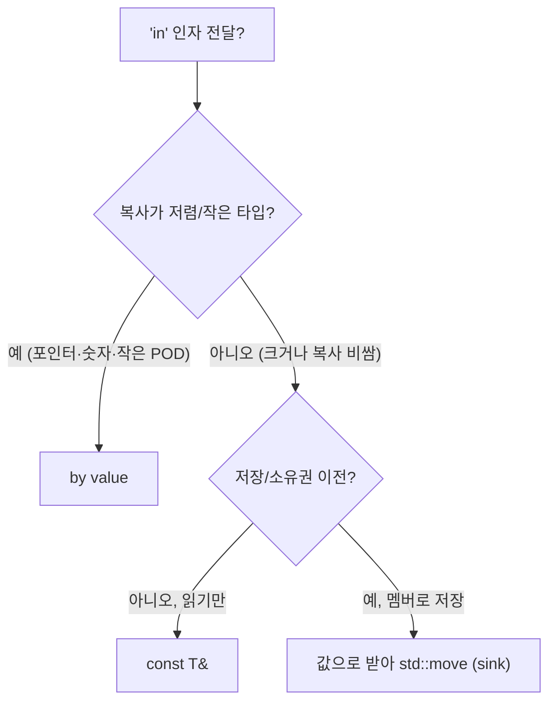

**Parameter Passing 전략**이란 인자 전달 방식을 타입 크기·복사/이동 비용에 맞게 선택하는 것을 말합니다. 본 챕터에서는 **by value**, **const reference**, **rvalue reference**의 정량적 분석과 선택 기준, 마이크로벤치마크로 검증하는 방법을 정리합니다.

## 이 장을 읽기 전에

**완전한 초보자?** 이 장은 [06장: 객체 수명 최적화](/post/cpp-optimization/object-lifetime/)의 복사·이동 비용을 전제로 합니다. 함수 인자를 값/참조/우측값 참조로 받을 수 있다는 정도만 알면 충분합니다.

**이 장의 깊이**: 이 장은 **중급~전문가**를 포괄합니다. by value·const reference·rvalue reference의 의미부터 시작해, 전문가 구간에서는 객체 크기·복사/이동 비용에 따른 전달 전략을 마이크로벤치마크로 정량 분석합니다. **다루지 않는 것**: non-owning 뷰 전달([14장](/post/cpp-optimization/span-and-views/))과 반환값 최적화([06장](/post/cpp-optimization/object-lifetime/))의 세부입니다.

## 당신의 수준에 맞는 경로

| 수준 | 읽을 부분 | 핵심 목표 |
|------|---------|---------|
| **초보자** | "by value" ~ "const reference" | 값/참조 전달의 비용 차이 이해 |
| **중급자** | "rvalue reference" ~ "정량 분석과 선택 기준" | 크기·이동 비용에 따른 전달 전략 |
| **전문가** | "비판적 시각" | 과잉 최적화 없이 전달 방식 판단 |

---

## 인자 전달 권장 사항의 변화 (역사·배경)

C++03에서는 "큰 타입은 const 참조로"가 일반적이었습니다. C++11에서 **이동 의미론**과 **RVO/NRVO** 강화로 "값으로 받고 이동"의 비용이 줄어들었고, **Effective Modern C++** 등에서 "작은 타입·이동 가능 타입은 값 전달을 기본으로" 권장하는 흐름이 생겼습니다. 오늘날에는 **작으면 값**, **크거나 읽기만 하면 const ref**, **소유권 이전 시 값+std::move 또는 T&&** 조합이 널리 쓰입니다.

> "For copyable types that are cheap to copy, pass by value. For types that are expensive to copy, pass by reference to const." — Scott Meyers, *Effective Modern C++*.

## by value

**값으로 전달**하는 것은 인자를 **복사**(또는 이동)해 함수에 넘기는 방식입니다. **작은 타입**(트리비얼 복사, 레지스터 몇 개로 넘어가는 크기)은 값 전달이 **저렴**하고, 레지스터나 스택에 그대로 넘어가므로 추가 간접 접근이 없습니다. **이동 가능한 타입**이고 복사 비용이 크면, 호출자가 **std::move**로 넘기면 이동 생성만 일어나 복사보다 비용이 적습니다.

## const reference

**큰 타입**이거나 **복사 비용이 큰** 타입을 **읽기만** 할 때는 **const T&**로 받으면 복사를 피할 수 있습니다. 참조는 보통 포인터 크기만 전달되므로 전달 비용이 작지만, 함수 내부에서 멤버에 접근할 때 **한 번의 간접 접근**이 따릅니다. **수명 연장** 규칙에 따라, **임시 객체**를 const 참조에 바인딩하면 그 임시의 수명이 참조의 수명까지 연장되므로 `f(std::string("hello"))`처럼 임시를 넘겨도 안전합니다.

## rvalue reference

**rvalue reference(T&&)**는 **이동 시맨틱**을 표현합니다. "소유권을 넘기거나 리소스를 재사용해도 된다"는 의미이므로, 함수 내부에서 **std::move**로 다른 함수에 넘기거나 멤버로 저장할 때 이동이 선택됩니다. **Perfect forwarding**은 **T&&**(forwarding reference)와 **std::forward**를 사용해, 인자를 "값 카테고리만 유지한 채" 다음 함수에 그대로 넘기는 패턴입니다.

아래 예시에서 함수 이름을 `fwd`로 둔 이유는 표준의 `std::forward`와 이름이 겹쳐 가려지는 것을 피하기 위해서입니다. `fwd`는 lvalue를 받으면 복사 후 이동, rvalue를 받으면 이동으로 `sink`에 전달합니다.

```cpp
#include <string>
#include <utility>
#include <vector>

std::vector<std::string> store;

void sink(std::string s) { store.push_back(std::move(s)); } // 값으로 받아 멤버로 이동

template<typename T>
void fwd(T&& x) { sink(std::forward<T>(x)); }  // 값 카테고리 유지 (forward를 호출)

int main() {
    std::string s = "lvalue";
    fwd(s);                  // lvalue → 복사 후 이동
    fwd(std::string{"rv"});  // rvalue → 이동만
}
```

## 정량 분석과 선택 기준

선택은 **객체 크기**와 **복사/이동 비용**에 따라 달라집니다. 아래 `Point`는 8바이트(`int` 2개) 트리비얼 타입이라 값 전달이 레지스터로 처리되어 const ref보다 간접 접근이 없습니다. 반면 `std::string`처럼 힙 버퍼를 가진 타입은 복사가 비싸므로, **멤버로 저장(sink)**할 때는 "값으로 받아 `std::move`"하는 패턴이 lvalue·rvalue 모두에 한 번의 복사 또는 이동만 들도록 해 줍니다.

```cpp
#include <string>
#include <utility>

struct Point { int x, y; };  // 8바이트, 트리비얼 복사

long dot_val(Point a, Point b)               // 값: 레지스터로 전달, 간접 접근 없음
{ return (long)a.x * b.x + (long)a.y * b.y; }

long dot_ref(const Point& a, const Point& b) // 참조: 포인터 전달 + 멤버 간접 접근
{ return (long)a.x * b.x + (long)a.y * b.y; }

class Widget {
    std::string name_;
public:
    void setName(std::string name)           // sink-by-value
    { name_ = std::move(name); }             // lvalue=복사1+이동1, rvalue=이동2
};
```

전달 방식별 비용을 예시 수치로 정리하면 다음과 같습니다(타입·플랫폼에 따라 다르며 마이크로벤치마크로 확인해야 하는 *예시* 값입니다).

| 전달 방식 | 대상 | 복사/이동 | 간접 접근 | 예시 상대 비용 |
|-----------|------|-----------|-----------|----------------|
| by value | 8바이트 `Point` | 복사 1 (레지스터) | 없음 | ~1x |
| const ref | 8바이트 `Point` | 없음 | 멤버마다 1 | ~1x~1.3x |
| const ref | 큰 `std::string` | 없음 | 1 | ~1x |
| by value(sink)+move | `std::string` rvalue | 이동 1 | 없음 | ~1x |
| by value | `std::string` lvalue | 복사 1 (힙 할당) | 없음 | ~10x+ |



## 비판적 시각: 한계와 트레이드오프

- "작은"의 기준(레지스터 크기·트리비얼 복사)은 플랫폼·ABI에 따라 다릅니다. 의심되면 벤치마크로 확인합니다.
- sink-by-value 패턴은 항상 한 번의 복사/이동을 강제하므로, "절대 저장하지 않고 읽기만" 하는 경우에는 `const T&`가 더 쌉니다.

## 핵심 요약

| 항목 | 비용·이점 | 활용 기준 |
|------|-----------|-----------|
| by value | 작은 타입 복사 저렴, 간접 접근 없음, RVO 조합 | 작은·트리비얼 타입 |
| const T& | 참조만, 복사 없음, 임시 수명 연장 | 큰 타입·읽기 전용 |
| 값+std::move / T&&+forward | 이동 유도, 값 카테고리 유지 | 멤버 저장·소유권 이전·템플릿 전달 |

### 자주 묻는 질문 (FAQ)

**Q: by value vs const ref 선택 기준은?**  
A: 작은 타입(포인터·숫자·작은 POD)은 by value가 복사 비용이 작고 인라이닝에 유리합니다. 큰 타입·복사 비싼 타입은 const ref로 읽고, 멤버로 저장한다면 값으로 받아 `std::move`하는 sink 패턴을 씁니다.

**Q: perfect forwarding이란?**  
A: `T&&`(forwarding reference)와 `std::forward`로 인자의 값 카테고리(lvalue/rvalue)를 유지한 채 하위로 전달하는 패턴입니다. 템플릿에서 한 번만 작성하고 lvalue/rvalue를 모두 처리합니다.

**Q: 인자 전달 권장이 바뀐 이유는?**  
A: C++11 이동 의미론 도입 후 "작은 타입은 value, 큰 타입은 const ref·이동"으로 정리되었고, 최적화·인라이닝 관점에서 작은 값 전달이 유리한 경우가 많아졌습니다.

### 적용 체크리스트

- [ ] 객체 크기·복사/이동 비용에 따라 by value·const ref·sink-by-value를 선택했는가?
- [ ] 작은 타입은 value, 큰 타입 읽기 전용은 const ref를 적용했는가?
- [ ] 멤버로 저장하는 경로에 값+`std::move` 또는 perfect forwarding을 사용했는가?
- [ ] 정량 분석·벤치마크로 전달 비용을 확인했는가?

## 다음 장에서는

**이전 장**: [Small Buffer Optimization](/post/cpp-optimization/small-buffer-optimization/) (챕터 16)

다음은 **ABI·링크 경계와 극한 튜닝**(전문)입니다. 지금까지 다룬 언어·라이브러리 수준의 비용이 번역 단위·링크·가시성 경계에서 어떻게 제약되는지로 범위를 넓힙니다. 전체 커리큘럼·권장 독해 순서는 [도입(00)](/post/cpp-optimization/getting-started-cpp-language-performance-tuning/)에서 확인할 수 있습니다.

→ [ABI·링크 경계와 극한 튜닝](/post/cpp-optimization/abi-link-boundaries-extreme-cpp-performance/) (챕터 18)
