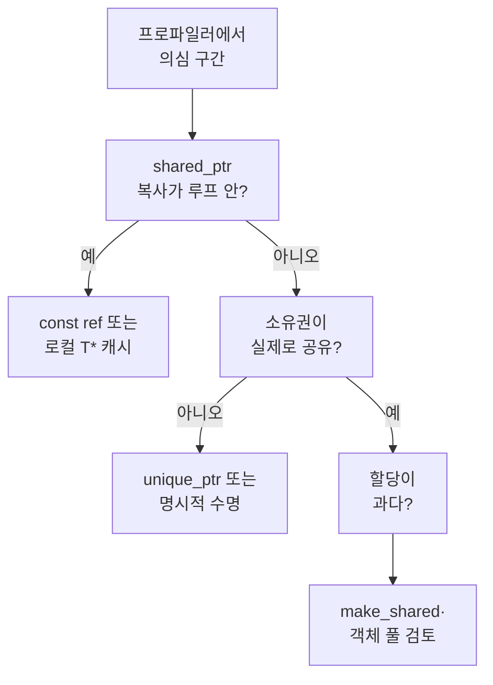

**스마트 포인터**는 소유권·수명을 표현하는 표준 도구이지만, Low-latency 경로에서는 **참조 카운트의 원자적 연산**, **제어 블록 접근**, **간접 한 단계**가 핫패스에 누적될 수 있습니다. 본 장은 `std::unique_ptr`, `std::shared_ptr`, 원시 포인터를 **같은 작업(역참조·전달·복사)** 기준으로 나누어 이해하고, “언제 스마트 포인터를 유지하고 언제 설계를 바꿀지” 판단할 근거를 제공합니다.

챕터 04(객체 수명)·챕터 15(파라미터 전달)와 함께 읽으면, **값/참조/이동**과 **소유권 단일성**이 만나는 지점에서 비용이 어떻게 달라지는지 한 그림으로 정리할 수 있습니다.

## 정의와 원칙

**unique_ptr**은 **독점 소유권**을 표현합니다. 일반적으로 크기는 원시 포인터 한 개와 같고, 역참조 비용도 원시 포인터와 동일한 한 단계 간접입니다. 소멸 시점에 커스텀 삭제자가 있으면 그 호출이 추가되지만, **참조 카운트나 원자적 연산은 없습니다**.

**shared_ptr**은 **공유 소유권**을 표현합니다. 구현은 보통 **제어 블록**(참조 강한 카운트, 약한 카운트, 삭제자, 할당자 등)과 **관리되는 객체 포인터**를 둡니다. **복사**는 강한 참조를 원자적으로 증가시키고, **이동**은 포인터만 옮기므로 원자적 연산이 없습니다. 따라서 핫패스에서 `shared_ptr`을 **값으로 자주 복사**하면, 객체 자체의 일보다 **원자적 증가/감소**가 먼저 의심됩니다.

**원시 포인터**는 표현력은 없지만 간접 한 단계만 있으므로 최소 비용에 가깝습니다. 대신 **수명 규약**을 문서·코드로 보장해야 하며, 실수 시 미정의 동작으로 이어집니다.

## 제어 블록과 make_shared

`std::make_shared<T>(args...)`는 **객체 T와 제어 블록을 한 번의 할당**에 묶는 경우가 많습니다. 반면 `std::shared_ptr<T>(new T(...))`는 **T용 블록**과 **제어 블록**이 분리 할당될 수 있어, 할당 횟수·캐시 지역성이 불리할 수 있습니다. µs 예산에서 할당 횟수를 줄이는 것이 목표라면 `make_shared`를 기본으로 두고, 커스텀 삭제자·약한 포인터 패턴 등으로 예외를 정하는 편이 안전합니다.

**weak_ptr**은 제어 블록의 약한 카운트만 건드리며, 객체 접근 전 `lock()`으로 `shared_ptr`을 얻습니다. `lock()`은 원자적 연산과 분기가 포함되므로, **매 틱마다** 호출하는 경로에서는 비용이 눈에 띌 수 있습니다. 캐시된 `shared_ptr`을 짧은 범위에서 재사용할 수 있는지 검토합니다.

## 코드로 보는 차이 (개념)

아래는 “동일한 힙 객체를 가리키며 루프 안에서 반복 사용”할 때의 **패턴만** 비교한 것입니다. 실제 수치는 빌드·CPU·컴파일러에 따라 달라지므로, 본인 환경에서 **격리 벤치마크**(챕터 00)로 확인해야 합니다.

```cpp
#include <memory>

void use_raw(int* p, int n) {
    for (int i = 0; i < n; ++i) {
        (void)(*p + i);  // 역참조만
    }
}

void use_unique(std::unique_ptr<int>& up, int n) {
    int* p = up.get();
    for (int i = 0; i < n; ++i) {
        (void)(*p + i);
    }
}

void use_shared_by_ref(const std::shared_ptr<int>& sp, int n) {
    int* p = sp.get();
    for (int i = 0; i < n; ++i) {
        (void)(*p + i);
    }
}

void use_shared_copy_each_iter(std::shared_ptr<int> sp, int n) {
    for (int i = 0; i < n; ++i) {
        std::shared_ptr<int> local = sp;  // 매 반복 복사 → 원자적 inc/dec 위험
        (void)(*local + i);
    }
}
```

**핵심**: 루프 안에서 `shared_ptr`을 **복사하지 않고** `const shared_ptr&` 또는 캐시한 `T*`로 일하면, 본문 비용은 `unique_ptr`·원시 포인터와 유사해질 **여지**가 큽니다. 반대로 **매번 복사**하는 패턴은 “로직은 가벼운데도 느리다”는 프로파일을 만들기 쉽습니다.

## 비교: 한눈에 보기

| 항목 | unique_ptr | shared_ptr (복사 시) | 원시 포인터 |
|------|------------|----------------------|-------------|
| 역참조 | 1단계 간접 | get() 후 1단계 간접 | 1단계 간접 |
| 소유권 표현 | 단일 | 공유 | 없음(약속) |
| 루프 내 복사 비용 | 이동만 저렴 | 원자적 카운트 | 포인터 복사만 |
| 수명 안전성 | RAII로 높음 | RAII로 높음 | 개발자 책임 |

## 핫패스 판단 흐름



## 챕터 04·15와의 연결

**챕터 04**에서 다룬 **RVO·NRVO·이동**은 `unique_ptr`을 **값으로 반환**할 때 흔히 등장합니다. 이동은 저렴하고 소유권 이전이 명확하므로, API가 “단일 소유권 이전”이면 `unique_ptr` 반환이 자연스럽습니다.

**챕터 15**의 **const T& vs T&&** 논의는 `shared_ptr`에도 그대로 적용됩니다. 핫 함수 인자로 `shared_ptr`을 넘길 때 **불필요한 복사**를 피하려면 `const std::shared_ptr<T>&` 또는 `std::shared_ptr<T>&&`(소비)를 상황에 맞게 선택합니다. “스레드 간 공유”가 아니라면 **참조 카운트 자체를 핫패스에서 제거**할 수 있는지 먼저 묻습니다.

## 실무 권장과 리팩토링

- **기본 소유권**은 `unique_ptr`로 두고, 정말로 여러 경로가 같은 수명을 공유할 때만 `shared_ptr`로 승격합니다.
- **그래프·캐시**처럼 공유가 필수면, 핫패스에서는 **제어 블록 접근 횟수**를 줄이기 위해 로컬 `T*` 캐시·짧은 범위의 `shared_ptr` 재사용을 검토합니다.
- **weak_ptr::lock()**을 고빈도 경로에 두지 말고, 상위에서 유효성을 한 번 검증한 `shared_ptr`을 넘기는 구조가 가능한지 봅니다.
- 벤치마크는 **“shared_ptr 복사 n회” vs “T* n회 역참조”**처럼 한 요인만 분리합니다 (챕터 00).

## 비판적 시각

스마트 포인터를 없애고 원시 포인터만 쓰는 것이 항상 빠른 것은 아닙니다. **수명 버그**로 인한 재현 어려운 장애는 성능 이슈보다 비용이 클 수 있습니다. 반대로 **과도한 shared_ptr**은 “안전해 보이지만 원자적 연산이 숨어 있는” 패턴이 됩니다. 측정으로 복사 횟수를 확인한 뒤, 소유권 모델을 바꾸는 순서가 안전합니다.

## 평가 기준: 이 장을 읽은 후

- [ ] unique_ptr과 shared_ptr의 런타임 차이(참조 카운트·원자적 연산)를 한 문장으로 설명할 수 있는가?
- [ ] make_shared가 분리 할당보다 유리할 수 있는 이유를 말할 수 있는가?
- [ ] 핫 루프에서 shared_ptr 복사를 피하는 두 가지 방법을 제시할 수 있는가?
- [ ] “공유가 필요 없다”고 판단할 때 어떤 타입으로 리팩토링할지 말할 수 있는가?

## 스레드 경계와 원자적 연산

`shared_ptr`의 참조 카운트는 표준적으로 스레드 안전해야 하므로, 복사·소멸 경로에 **원자적 연산**이 들어갑니다. 단일 스레드 프로그램에서도 이 비용은 사라지지 않습니다(구현이 항상 동일 코드 경로를 쓰는 경우). 반면 `unique_ptr`은 **이동만** 스레드 간 안전 의미가 명확하고, 복사 자체가 없어 카운트가 없습니다. “멀티스레드가 아니니까 shared_ptr 복사가 공짜”라고 생각하기 쉬운데, 이는 **틀린 직관**입니다.

## 자주 하는 실수

첫째, **멤버를 `std::shared_ptr<T>`로 두고** public API마다 값 복사로 넘깁니다. 호출이 잦으면 카운트 증가가 API 경계마다 반복됩니다. **const shared_ptr&** 로 받거나, 호출자가 이미 수명을 보장한다면 **T&** / **T*** 로 좁히는 설계를 검토합니다.

둘째, **`shared_ptr`을 컨테이너에 넣고** 매번 전체 벡터를 순회하며 복사해 새 컨테이너를 만듭니다. 이동·참조로 줄일 수 있는지, 아니면 **인덱스·핸들**로 간접 참조할 수 있는지 봅니다.

셋째, **`enable_shared_from_this` 없이** `this`로 임시 `shared_ptr`을 만들려 합니다. 이는 미정의 동작으로 이어질 수 있어 성능 이전에 **정확성** 문제입니다. 비동기 콜백에 `this`를 넘길 때는 수명 계약을 명시적으로 설계합니다.

## 격리 벤치마크 아이디어

챕터 00에서 권장한 도구(Google Benchmark, nanobench)로 아래를 **동일 머신·동일 최적화 옵션**에서 비교해 볼 수 있습니다.

1. **역참조만**: `int*` vs `unique_ptr<int>` vs `shared_ptr<int>`(루프 밖에서 한 번만 복사해 `get()` 사용).
2. **복사 비용**: 루프 안에서 `shared_ptr` 복사 n회 vs 루프 밖 한 번 복사 후 `T*` 사용.
3. **make_shared vs 분리 할당**: 생성·소멸만 반복하는 마이크로 케이스(할당 훅으로 횟수 확인).

해석할 때는 **인라인·LTO**가 `get()` 호출을 어떻게 접는지도 함께 보고, 어셈블리에서 **lock cmpxchg** 류가 루프에 남는지 확인합니다.

## 문단 심화: 소유권이 API 계약이 된다

성능 튜닝에서 `shared_ptr`을 걷어내면, 바뀌는 것은 타입뿐 아니라 **호출자와 피호출자의 계약**입니다. `unique_ptr`로 바꾼 순간 “이 이후 객체는 받는 쪽이 소유한다”는 규칙이 강해지고, **다른 스레드가 같은 객체를 붙잡는** 패턴과 충돌할 수 있습니다. 따라서 리팩토링은 (1) 수명 다이어그램을 그린 뒤 (2) 핫패스에서 복사 횟수를 잰 다음 (3) 계약을 문서화하는 순서가 안전합니다.

## 문단 심화: 커스텀 삭제자와 인라인화

`unique_ptr<T, Deleter>`에서 `Deleter`가 상태 없는 함수 객체면, 컴파일러가 **비용 없는 소멸**에 가깝게 접을 가능성이 큽니다. 반면 타입 소거된 삭제(예: 런타임에만 알려지는 삭제 정책)는 간접 호출을 남길 수 있습니다. “스마트 포인터가 느리다”기보다 **삭제 경로가 가상화**되어 있는지를 분리해 봅니다.

## 표: 언제 어떤 포인터를 고려할지

| 상황 | 우선 검토 |
|------|-----------|
| 단일 소유, 명확한 이전 | unique_ptr, 값 반환 |
| 여러 소비자가 같은 수명 공유 | shared_ptr + 복사 최소화 |
| 캐시·관찰만 | weak_ptr + 상위에서 lock 정책 |
| FFI·C API | 소유권 문서화된 raw + 경계에서만 RAII |
| 핫 루프 내부 | 로컬 T* 또는 const shared_ptr& |

## 핵심 메시지 요약

| 구분 | 내용 |
|------|------|
| 비용 핵심 | shared_ptr **복사** = 원자적 카운트; 역참조만이면 get() 후에는 T*와 유사해질 수 있음 |
| 할당 | make_shared로 객체+제어 블록 묶기 검토 |
| 설계 | 공유가 진짜 필요한지 먼저 판단한 뒤 타입 선택 |
| 검증 | 격리 벤치마크·프로파일러·할당 훅 |

## 이전 장 · 다음 장

목록의 `collection_order`를 그대로 따르면 **이전**은 [ABI·링크 경계와 극한 성능](/post/cpp-optimization/abi-link-boundaries-extreme-cpp-performance/) (챕터 17)입니다. 00장에서 권장하는 **16 → 18 → 01** 입문 경로에서는 챕터 17을 나중에 읽어도 되므로, 실행 모델만 맞춘 직후라면 [C++ 실행 모델·µs 최적화 어휘](/post/cpp-optimization/cpp-execution-model-microsecond-vocabulary-fundamentals/) (챕터 16)를 이전 단계로 두면 됩니다.

**다음**은 트랙 마지막 주제인 [Type Erasure 비용 패턴](/post/cpp-optimization/type-erasure-cost-patterns/) (챕터 19)입니다.

## 더 읽을 거리 (트랙 내)

- [객체 수명 최적화](/post/cpp-optimization/object-lifetime/) (챕터 04)
- [Parameter Passing 전략](/post/cpp-optimization/parameter-passing/) (챕터 15)
- [Small Buffer Optimization](/post/cpp-optimization/small-buffer-optimization/) (챕터 14) — 타입 소거 타입과 연계
- [도입·측정 방법론](/post/cpp-optimization/getting-started-cpp-language-performance-tuning/) (챕터 00)

## 다음 장에서는

**Type erasure**가 간접 호출·SBO·할당을 어떻게 조합하는지, `std::function` 너머의 패턴까지 묶어 다룹니다. 챕터 14(SBO)와 겹치는 부분은 심화 관점에서 정리합니다.

→ [Type Erasure 비용 패턴](/post/cpp-optimization/type-erasure-cost-patterns/) (챕터 19)

## FAQ

**Q. 단일 스레드인데도 shared_ptr 복사가 비싼가요?**  
A. 구현은 스레드 안전한 참조 카운트를 쓰는 경우가 많아, 원자적 연산이 남을 수 있습니다. 벤치마크로 확인하세요.

**Q. shared_ptr를 멤버로만 두고 get()만 쓰면 안전한가요?**  
A. `this` 수명과 별개로 객체가 파괴될 수 있으면 위험합니다. 수명 계약이 명확할 때만 `T*` 캐시를 씁니다.

**Q. weak_ptr만 있으면 순환 참조가 항상 해결되나요?**  
A. 순환을 끊는 데 도움이 되지만, `lock()` 비용과 설계 복잡도가 늘 수 있습니다. 소유권 그래프를 단순화하는 편이 근본적입니다.

## 시나리오: 로그 파이프라인

비동기 로거가 **메시지 소유권**을 `shared_ptr<std::string>`으로 넘긴다고 가정합니다. 큐에 넣을 때마다 복사가 일어나면 **카운트 증가**가 큐 처리 비용에 섞입니다. 대안으로 (1) **고정 버퍼 풀 + 핸들**, (2) **이동 가능한 unique_ptr**을 워커 하나에만 넘김, (3) **string_view + 상위 수명 보장** 등을 비교합니다. 어떤 대안이든 **수명 문서**가 따라와야 합니다.

## 시나리오: 캐시 히트 경로

캐시 조회 결과를 `shared_ptr<const T>`로 돌려준다면, 조회가 성공할 때마다 호출자가 **복사**를 하지 않도록 API를 설계합니다. 예를 들어 `optional<shared_ptr<const T>>` 대신 **내부 저장소에 대한 const 참조 + explicit 수명**을 쓸 수 있는지 검토합니다. µs 단위에서는 **API 형태가 복사 횟수를 결정**합니다.

## 표: 진단 질문

| 질문 | 예라면 볼 것 |
|------|----------------|
| 루프마다 shared_ptr를 넘기나? | const ref, T* 캐시 |
| 소유권 공유가 한 스레드 안에서만인가? | unique_ptr 승격 검토 |
| make_shared를 쓰지 않나? | 할당 횟수·캐시 지역성 |
| weak_ptr lock이 고빈도인가? | 캐시·수명 단축 |

## 게시 전 자가 점검 (챕터 18)

- 도입·정의·코드·비교·마무리·다음 장·평가 기준이 있는가?
- 챕터 04·15·14·00과의 연계 문장이 있는가?
- “측정 없이 shared_ptr 제거”가 아니라 판단 기준이 드러나는가?

## 부록: 한 줄 메모 20

1. unique_ptr 이동은 대체로 저렴하다.  
2. shared_ptr 복사는 카운트를 건드린다.  
3. get() 후 T*는 수명이 유효할 때만 쓴다.  
4. make_shared는 할당을 줄일 수 있다.  
5. enable_shared_from_this 없이 this를 포장하지 않는다.  
6. 커스텀 삭제자는 인라인 가능성을 본다.  
7. 원시 포인터는 계약이 없으면 위험하다.  
8. 약한 참조는 관찰용이다.  
9. lock()은 원자적 경로를 탄다.  
10. API 경계가 복사를 증폭시킬 수 있다.  
11. 컨테이너의 shared_ptr 이동을 우선한다.  
12. 불필요한 atomic은 프로파일에 남는다.  
13. LTO는 작은 래퍼를 접을 수 있다.  
14. 디버그 빌드는 카운트 경로가 더 무거울 수 있다.  
15. 할당 훅으로 횟수를 본다.  
16. 핫패스는 먼저 프로파일러로 찾는다.  
17. 스레드 경계는 수명과 분리해 생각한다.  
18. 순환은 weak만으로 끝나지 않을 수 있다.  
19. 소유권 단일화가 최선인 경우가 많다.  
20. 수치는 환경마다 다르다.

## 용어 정리

- **제어 블록**: `shared_ptr`이 공유하는 메타데이터(강한/약한 카운트, 삭제자 등)가 들어 있는 할당 블록.
- **강한 참조**: 객체 수명을 유지하는 `shared_ptr` 개수.
- **원자적 참조 카운트**: 다중 스레드에서 안전하게 증가·감소시키기 위한 연산; 단일 스레드 핫패스에서도 비용은 남습니다.
