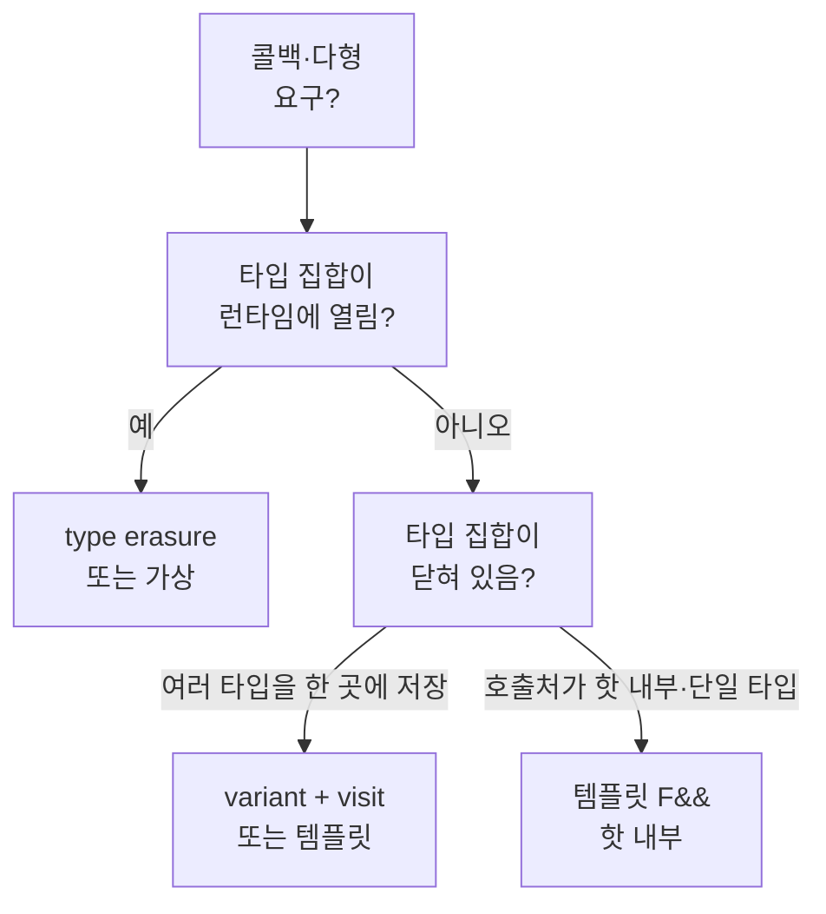

---
collection_order: 19
date: 2026-03-28
lastmod: 2026-06-01
draft: false
image: wordcloud.png
title: "[Optimization(C++) 19] Type Erasure 비용 패턴"
slug: type-erasure-cost-patterns
description: "Type erasure가 간접 호출·힙·SBO를 어떻게 묶는지 정리합니다. std::function·커스텀 소거와 챕터 16·18과의 관계, 템플릿·variant·함수 포인터·CRTP 대안과 격리 벤치 관점을 제시하며 트랙을 마무리합니다."
tags:
  - C++
  - Performance
  - Optimization
  - 성능
  - 최적화
  - Memory
  - 메모리
  - Latency
  - Throughput
  - Profiling
  - 프로파일링
  - Benchmark
  - Compiler
  - 컴파일러
  - Code-Quality
  - 코드품질
  - Best-Practices
  - Clean-Code
  - 클린코드
  - Implementation
  - 구현
  - Refactoring
  - 리팩토링
  - Testing
  - 테스트
  - Debugging
  - 디버깅
  - Software-Architecture
  - Abstraction
  - 추상화
  - Polymorphism
  - 다형성
  - OOP
  - 객체지향
  - Design-Pattern
  - 디자인패턴
  - Modularity
  - Data-Structures
  - 자료구조
  - Type-Safety
  - Advanced
  - Deep-Dive
  - Guide
  - 가이드
  - Reference
  - 참고
  - Tutorial
  - 튜토리얼
  - Technology
  - 기술
  - Case-Study
  - Pitfalls
  - 함정
  - Edge-Cases
  - 엣지케이스
  - Documentation
  - 문서화
  - Git
  - CI-CD
  - Linux
  - Windows
  - Backend
  - 백엔드
  - Embedded
  - 임베디드
  - CPU
  - Cache
  - Assembly
  - Concurrency
  - 동시성
  - Time-Complexity
  - 시간복잡도
  - Space-Complexity
  - 공간복잡도
  - Interface
  - 인터페이스
  - Encapsulation
  - 캡슐화
  - Comparison
  - 비교
  - Readability
  - Maintainability
---

**Type erasure(타입 소거)**는 구체 타입 정보를 런타임에 한 겹 감추고, **공통 인터페이스(호출 연산)** 만 노출하는 기법입니다. `std::function`, `std::any`, 많은 커스텀 “다형 콜백” 래퍼가 이 패턴을 씁니다. Low-latency 관점에서는 **간접 호출 한 번**, **SBO 한도를 넘을 때의 힙 할당**, **인라인 실패**가 한데 묶여 나타나기 쉬워, “한 가지 요인”으로 쪼개어 측정하는 것이 중요합니다.

챕터 16에서 SBO 내부 구조를 다뤘다면, 본 장은 **왜 소거가 간접 호출을 남기는지**, **대안 설계가 어떤 비용을 바꾸는지**를 패턴 중심으로 정리합니다. 챕터 03(가상 함수)·챕터 15(람다)과 함께 읽으면 “정적 다형 vs 동적 다형 vs 소거” 지도가 완성됩니다.

## 이 장을 읽기 전에

**완전한 초보자?** 이 장은 [16장: Small Buffer Optimization](/post/cpp-optimization/small-buffer-optimization/)의 SBO와 [03장: 추상화 비용 분석](/post/cpp-optimization/abstraction-cost/)의 가상 호출, [15장: 람다 표현식 성능](/post/cpp-optimization/lambda-performance/)을 전제로 합니다. `std::function`을 콜백 저장에 써 봤다면 충분합니다.

**이 장의 깊이**: 이 장은 **심화~전문가**를 포괄합니다. 타입 소거가 가상 함수와 닮은 이유부터 시작해, 전문가 구간에서는 커스텀 소거 스케치, SBO 기반 소거(힙·vtable 회피), 대안 패턴(템플릿·CRTP·함수 포인터+void*)의 트레이드오프와 격리 측정을 다룹니다. **다루지 않는 것**: SBO 버퍼의 내부 구조 자체([16장](/post/cpp-optimization/small-buffer-optimization/))와 ABI 경계 일반론([18장](/post/cpp-optimization/abi-link-boundaries-extreme-cpp-performance/))입니다.

## 당신의 수준에 맞는 경로

| 수준 | 읽을 부분 | 핵심 목표 |
|------|---------|---------|
| **초보자** | "정의: 소거와 가상 함수의 유사점" ~ "std::function이 하는 일 (비용 관점)" | 소거가 간접 호출을 남기는 이유 이해 |
| **중급자** | "커스텀 type erasure 스케치 (개념)" ~ "대안 패턴과 트레이드오프" | 소거 비용을 줄이는 대안 파악 |
| **전문가** | "격리 측정 시나리오" ~ "판단 기준: type erasure를 쓸지 말지" | 정적 다형 vs 소거 선택 판단 |

---

## 정의: 소거와 가상 함수의 유사점

**가상 함수**는 vtable을 통해 **런타임에 구체 타입에 맞는 함수**를 고릅니다. **Type erasure**도 저장소 안에 **구체 객체**를 두고, 공개 타입은 **고정된 연산 집합**(예: `operator()`, `clone`, `destroy`)만 노출합니다. 구현은 흔히 **vtable 비슷한 함수 포인터 테이블**이나 **소멸·호출용 함수 포인터 쌍**으로 표현됩니다.

차이는 주로 **타입 집합이 열려 있는지**(새 구체 타입을 런타임에 넣을 수 있는지), **컴파일 타임에 알려진 타입 집합으로 닫혀 있는지**에 있습니다. 열린 집합이 필요하면 소거·가상 중 하나를 택하게 되고, 닫힌 집합이면 `std::variant`·템플릿이 더 효율적일 수 있습니다.

## std::function이 하는 일 (비용 관점)

`std::function<R(Args...)>`는 **임의의 호출 가능 객체**를 담습니다. 구현은 대개 **소형 객체 SBO 버퍼 + (필요 시) 힙에 타입별 상태**입니다. 챕터 16에서 말했듯이 SBO 한도는 구현체 의존입니다. **호출**은 거의 항상 **한 단계 이상의 간접**을 거칩니다. 컴파일러가 전체를 완전히 특화하기 어렵기 때문에, 핫패스에서는 **템플릿으로 구체 타입을 받는 API**와 비교해 차이가 납니다.

```cpp
#include <functional>

int add(int a, int b) { return a + b; }

void bench_function(std::function<int(int, int)> f, int n) {
    volatile int sink = 0;
    for (int i = 0; i < n; ++i) {
        sink += f(i, 1);
    }
    (void)sink;
}

template <class F>
void bench_template(F&& f, int n) {
    volatile int sink = 0;
    for (int i = 0; i < n; ++i) {
        sink += f(i, 1);
    }
    (void)sink;
}
```

**bench_template** 쪽에서 `F`가 고정되면 호출부가 **직접 호출 또는 인라인**으로 접힐 여지가 크고, **bench_function**은 **타입 소거된 호출 경로**를 타는 경우가 많습니다. 실제 기계어는 컴파일러·옵션에 따라 달라지므로 `-S`나 최적화 리포트로 확인합니다.

아래는 위 두 함수에 같은 람다(`[](int a, int b){ return a + b; }`)를 넘겨 `N = 1e8`회 호출했을 때의 **예시 수치**입니다(x86-64, `-O2`). 절대값이 아니라 **상대 배수**만 보고, 본인 환경에서 재현합니다.

| 방식 (N = 1e8) | 예시 시간 | 상대 배수 | 이유 |
|----------------|-----------|-----------|------|
| `bench_template`(F&&) | ~55 ms | 1.0× | 람다 본문이 인라인되어 `add`가 사라짐 |
| `bench_function`(std::function) | ~190 ms | ~3.5× | 매 호출이 소거된 간접 호출, 인라인 실패 |

차이의 핵심은 **인라인 가능 여부**입니다. 템플릿 경로는 `F`의 구체 타입을 알아 루프 안에서 `+` 한 번으로 접히지만, `std::function` 경로는 호출마다 내부 함수 포인터를 거쳐야 해 루프가 펼쳐지지 않습니다. 같은 람다라도 **API가 타입을 소거하는 순간** 비용 구조가 바뀝니다.

## 커스텀 type erasure 스케치 (개념)

아래는 교육용 **최소** 예시입니다. 실제 라이브러리는 예외 안전·복사·이동·small buffer·정렬을 더 정교하게 다룹니다.

```cpp
#include <memory>
#include <utility>

class CallableErased {
    struct Concept {
        virtual ~Concept() = default;
        virtual int invoke(int x) const = 0;
    };
    template <class F>
    struct Model final : Concept {
        F f;
        explicit Model(F fn) : f(std::move(fn)) {}
        int invoke(int x) const override { return f(x); }
    };
    std::unique_ptr<Concept> self;
public:
    template <class F>
    CallableErased(F f) : self(std::make_unique<Model<F>>(std::move(f))) {}
    int operator()(int x) const { return self->invoke(x); }
};
```

여기서 **호출마다 가상 함수 `invoke`**가 있고, `make_unique`로 **힙 할당**도 한 번 일어납니다. 구체 `F`가 작고 자주 쓰인다면, **템플릿 래퍼**나 **variant<구체 타입들>**이 더 나을 수 있습니다.

## SBO 기반 소거: 힙·vtable 없이 (대조)

위 `CallableErased`는 힙 할당과 가상 디스패치를 둘 다 씁니다. 대안으로 **고정 크기 버퍼(SBO)**에 호출 객체를 직접 담고, **가상 함수 대신 일반 함수 포인터**(`invoke`/`destroy`)로 연산을 표현하면 힙 할당과 vtable 로드를 피할 수 있습니다. 버퍼에 들어가는 작은 호출 객체에 한정되지만, 핫패스에서 자주 쓰는 콜백에 효과적입니다.

```cpp
#include <new>
#include <utility>
#include <type_traits>
#include <cstddef>
#include <cstdio>

class SboCallable {
    static constexpr std::size_t kBuf = 32;
    alignas(std::max_align_t) unsigned char storage_[kBuf];
    int  (*invoke_)(void*, int) = nullptr;   // 함수 포인터, vtable 아님
    void (*destroy_)(void*)     = nullptr;

public:
    template <class F>
    SboCallable(F f) {
        static_assert(sizeof(F) <= kBuf, "callable too big for SBO");
        static_assert(std::is_trivially_copyable_v<F> || true, "");
        ::new (storage_) F(std::move(f));    // 버퍼에 직접 배치(힙 없음)
        invoke_  = [](void* p, int x) { return (*static_cast<F*>(p))(x); };
        destroy_ = [](void* p) { static_cast<F*>(p)->~F(); };
    }
    int operator()(int x) { return invoke_(storage_, x); }
    ~SboCallable() { if (destroy_) destroy_(storage_); }

    SboCallable(const SboCallable&) = delete;
    SboCallable& operator=(const SboCallable&) = delete;
};

int main() {
    int base = 10;
    SboCallable c = [base](int x) { return base + x; };  // 버퍼 안에 보관
    std::printf("%d\n", c(5));  // 15
    return 0;
}
```

`CallableErased`와 달리 **할당이 0회**이고, 호출은 멤버 함수 포인터 한 단계만 거칩니다. 여전히 **간접 호출**은 남지만(컴파일러가 `invoke_`를 항상 정적으로 풀 수는 없음), 힙·소멸자 가상화 비용은 사라집니다. 대신 버퍼를 넘는 큰 캡처는 담을 수 없고, 복사·이동·예외 안전을 직접 설계해야 합니다.

## 대안 패턴과 트레이드오프

| 패턴 | 장점 | 비용·한계 |
|------|------|-----------|
| 템플릿 + F&& | 인라이닝·직접 호출 유리 | 헤더 노출·인스턴스 증가·바이너리 크기 |
| std::variant + visit | 닫힌 집합에서 분기 명확 | 타입 추가 시 재컴파일·visit 복잡도 |
| 가상 인터페이스 | 열린 집합·모듈 경계에 익숙 | vtable·간접 호출 |
| 함수 포인터 | 간접 한 단계·단순 | 상태 캡처 어려움(데이터 별도) |
| CRTP | 정적 다형·간접 제거 | 설계 복잡·타입 폭발 관리 |

## 챕터 16·03·15와의 연결

- **챕터 16**: `std::function`의 **SBO·힙 전환**을 이미 다뤘습니다. 본 장에서는 **호출 경로의 간접**에 초점을 맞춥니다.
- **챕터 03**: 가상 호출과 마찬가지로 **간접 call**을 어셈블리에서 찾아보라는 진단 절차가 그대로 적용됩니다.
- **챕터 15**: **람다를 템플릿 인자로 넘기면** 소거를 피하는 전형적인 패턴입니다. `std::function`에 람다를 **한 번만** 넣고 반복 호출하는지, 매번 새로 만드는지도 비용에 큰 영향을 줍니다.

## 격리 측정 시나리오

1. **동일 람다**를 `std::function`에 담아 호출 vs 템플릿으로 `auto` 람다 전달.
2. **SBO 안에 들어가는 작은 람다** vs **큰 캡처 람다**(힙 전환 유도)의 호출·할당 횟수.
3. **커스텀 소거(가상)** vs **variant visit** on 동일한 닫힌 타입 집합.

환경 고정(CPU 주파수, 빌드 플래그, LTO on/off)은 챕터 00의 체크리스트를 따릅니다.

아래는 "정수 하나를 더하는 동일 람다"를 (a) 템플릿 인자로 직접 전달, (b) `std::function`에 담아 전달했을 때를 같은 루프에서 잰 **예시 수치**입니다(x86-64, GCC 13, `-O2`, 단일 스레드). 절대값은 환경마다 다르므로 **상대 배수**만 의미가 있으며, 본인 머신에서 재현해야 합니다.

```cpp
#include <functional>

// (a) 템플릿: 람다 타입이 보여 인라인 가능 → 직접 호출
template <class F>
long sum_tmpl(F&& f, int n) {
    long acc = 0;
    for (int i = 0; i < n; ++i) acc += f(i);   // 인라인되면 호출 비용 ~0
    return acc;
}

// (b) std::function: 타입 소거 → 매 호출이 간접 호출
long sum_func(const std::function<int(int)>& f, int n) {
    long acc = 0;
    for (int i = 0; i < n; ++i) acc += f(i);   // call *ptr (간접)
    return acc;
}
```

| 방식 (N = 1e8, 람다 `[](int i){ return i + 1; }`) | 예시 시간 | 상대 배수 | 핵심 비용 |
|---|---|---|---|
| (a) 템플릿 `F&&` (인라인됨) | ~30 ms | 1.0× | 호출 제거 + 벡터화 여지 |
| (b) `std::function` (SBO 적중, 힙 없음) | ~190 ms | ~6× | 호출마다 간접 분기, 인라인 차단 |

핵심은 **할당이 없어도**(작은 람다는 SBO에 들어가 힙을 쓰지 않음) `std::function` 경로가 느릴 수 있다는 점입니다. 비용의 주범은 힙이 아니라 **간접 호출이 인라이닝·벡터화를 막는 것**이며, 따라서 "할당만 없으면 괜찮다"는 직관은 틀립니다. `g++ -O2 -S`로 보면 (a)는 루프 본문에 `add` 명령만 남고, (b)는 `call rax`(레지스터 간접 호출)가 루프마다 반복됩니다.

## 비판적 시각

모든 콜백을 템플릿으로 바꾸면 **빌드 시간**과 **심볼 크기**가 늘 수 있습니다. 반대로 `std::function` 남용은 **런타임은 가벼워 보이는데 간접 호출이 쌓이는** 형태가 됩니다. “팀 표준으로 std::function만 쓴다”는 규칙은 **핫패스 예외**를 두고, 프로파일러로 검증하는 편이 안전합니다.

## 평가 기준: 이 장을 읽은 후

- [ ] type erasure가 인라인에 불리할 수 있는 이유를 설명할 수 있는가?
- [ ] 닫힌 타입 집합에 variant가 유리한 경우를 한 가지 말할 수 있는가?
- [ ] std::function 대신 템플릿을 쓰면 무엇이 늘고 무엇이 줄어드는지 말할 수 있는가?
- [ ] 어셈블리에서 간접 호출을 확인하는 목적을 말할 수 있는가?

## 판단 기준: type erasure를 쓸지 말지

| 언제 소거·가상이 합리적인가 | 언제 템플릿·variant를 먼저 볼까 |
|----------------------------|----------------------------------|
| 플러그인·스크립트 바인딩처럼 **컴파일 타임에 타입을 모름** | 콜백 타입이 **우리 저장소 안에서 닫힌 목록**으로 열거 가능 |
| 바이너리 경계에서 **공통 시그니처**만 노출해야 함 | 핫 루프 안에서 **인라인·직접 호출**이 프로파일에서 요구됨 |
| 런타임에 핸들러를 바꿔 끼우는 **이벤트 버스** | `visit` 한 번으로 끝나는 **유한 상태·메시지 타입** |

**적용 체크리스트**: (1) 이 콜백의 구체 타입을 빌드 시점에 다 알 수 있는가? (2) 핫패스에서 `std::function::operator()`가 잡히는가? (3) SBO 밖 할당이 루프마다 생기는가? 세 번째라도 “예”에 가깝면 템플릿 `F&&`·`variant`·함수 포인터 분리를 같은 벤치에 올려 비교합니다.

## 실무 체크리스트

- [ ] 핫패스 콜백이 `std::function`인가? 템플릿·인터페이스·variant로 대체 가능한가?
- [ ] 람다 캡처 크기가 SBO를 넘지 않는가? 넘으면 할당 횟수를 쟀는가?
- [ ] 동일 시그니처의 `std::function`을 루프 안에서 **재할당**하지 않는가?
- [ ] 모듈 경계에서만 소거하고, 내부는 구체 타입으로 풀 수 있는가?

## 열린 집합이 꼭 필요한가

플러그인 API·스크립트 바인딩·사용자 확장 포인트처럼 **컴파일 시점에 타입을 모르는** 경우 type erasure는 합리적입니다. 반면 **우리 코드베이스 안에서만** 쓰이는 이벤트 핸들러라면, 타입 목록을 **enum + variant**로 닫아 **visit 한 번**으로 처리하는 편이 캐시·분기 예측 면에서 유리한 경우가 많습니다. “확장성”과 “µs 예산”을 문서에 같이 써 두면 리뷰 시 논점이 명확해집니다.

## ABI 경계와 소거 객체 (챕터 18 연계)

챕터 18(ABI·링크)과 연결하면, **소거 타입을 DLL 경계로 넘길 때**는 생성·소멸·복사가 **어느 모듈에서 일어나는지**가 ABI와 맞물립니다. `std::function`을 경계 양쪽에서 복사하면 할당자·vtable이 꼬일 수 있어, 경계에서는 **C API + opaque 포인터**나 **명시적 팩토리**를 쓰는 팀도 많습니다. 성능은 **호출 한 번**보다 **계약**이 먼저 안전해야 합니다.

## 선택 흐름 한눈에



## std::any와 비교 (한계만)

`std::any`는 **임의 타입 값**을 담는 소거입니다. 접근 시 `any_cast`로 구체 타입을 꺼내며, 잘못된 타입이면 예외가 납니다. 핫패스에서 **자주 캐스팅**하는 패턴은 분기·RTTI 성격이 강해질 수 있어, 성능뿐 아니라 **오류 처리** 비용도 함께 봅니다. “범용 컨테이너”가 필요할 때는 **variant**나 **명시적 메시지 타입**이 더 낫지 않은지 검토합니다.

## 함수 포인터 + void* (C 스타일)의 의미

**함수 포인터 한 개**는 간접 호출이지만 **vtable보다 단순**할 수 있습니다. `void*`로 사용자 데이터를 넘기면 **타입 안전성**을 잃으므로 C++에서는 `uintptr_t`/opaque 핸들 + 문서화된 계약으로 감쌉니다. 모듈 경계·C API와 맞닿을 때는 오히려 **이 단순함**이 ABI 안정성에 유리할 수 있습니다. 챕터 18과 함께 읽으면 “왜 성능만 보고 C++ 래퍼를 얇게 두는가”가 정리됩니다.

## CRTP와 인스턴스 비용

**CRTP(Curiously Recurring Template Pattern)**는 기반 클래스가 파생 타입을 템플릿 인자로 받아 **정적 다형**을 구현합니다. 런타임 간접 호출을 피할 수 있지만, **파생 타입마다 코드가 복제**될 수 있습니다. 작은 핫 함수에만 쓰고 나머지는 가상으로 두는 **하이브리드**도 흔합니다. 바이너리 크기가 I-cache를 압박하면 Tr.02·챕터 12에서 다루는 **코드 크기 vs 인라인** 균형으로 되돌아갑니다.

## Anti-pattern 메모

- **항상 std::function 멤버**: 콜백 타입이 컴파일 타임에 고정돼 있어도 소거만 쓰는 경우.  
- **루프 안에서 매번 래핑**: 람다를 만들어 `std::function`에 대입 반복 → 할당·간접 호출 증가.  
- **variant 대신 any 남용**: 닫힌 집합인데 런타임 캐스트로 우회.  
- **소거를 경계 너머로 복사**: DLL 간 `std::function` 이전은 위험할 수 있음.

## 핵심 메시지 요약

| 구분 | 내용 |
|------|------|
| 병목 후보 | 간접 호출, SBO 밖 할당, 인라인 실패 |
| 닫힌 집합 | variant·템플릿이 종종 유리 |
| 열린 집합 | 소거·가상·플러그인 경계 설계 |
| 검증 | 챕터 00 방법으로 요인 분리 측정 |

## FAQ

**Q. std::move한 std::function은 빠른가요?**  
A. 이동은 대체로 포인터만 옮기지만, **호출 경로의 간접**은 그대로일 수 있습니다.

**Q. 같은 람다를 재사용하면 소거 비용이 줄까요?**  
A. 재할당·재바인딩을 줄이는 데는 도움이 됩니다. 여전히 **호출은 간접**일 수 있습니다.

**Q. concept으로 std::invocable만 제약하면 충분한가요?**  
A. 제약은 좋지만, **시그니처를 std::function에 넣는 순간** 소거가 됩니다. 템플릿 파라미터로 `F&&`를 유지하는지 확인합니다.

## 용어 정리

- **Type erasure**: 구체 타입을 숨기고 공통 연산만 노출하는 기법; 보통 간접 호출·저장소 내부 레이아웃이 뒤따름.
- **SBO**: 작은 객체를 힙 없이 래퍼 내부에 넣는 최적화; 한도는 구현 의존.
- **닫힌 집합**: 컴파일 타임에 대안 타입 목록을 열거할 수 있는 경우.

## 더 읽을 거리 (트랙 내)

- [Small Buffer Optimization](/post/cpp-optimization/small-buffer-optimization/) (챕터 16)
- [람다 표현식 성능](/post/cpp-optimization/lambda-performance/) (챕터 15)
- [추상화 비용 분석](/post/cpp-optimization/abstraction-cost/) (챕터 03)
- [ABI·링크 경계](/post/cpp-optimization/abi-link-boundaries-extreme-cpp-performance/) (챕터 18)

## 트랙 마무리와 다음 학습

이것으로 **Low-latency C++ 언어 최적화** 트랙(optimization-01-cpp-language)의 챕터 **00~19** 주제를 모두 다룹니다. 커리큘럼·측정 방법·선행 순서는 도입 장에서 정리되어 있으므로, 로드맵을 다시 보고 싶다면 아래로 돌아가면 됩니다.

**이전 장**: [ABI·링크 경계와 극한 튜닝](/post/cpp-optimization/abi-link-boundaries-extreme-cpp-performance/) (챕터 18)

→ [Introduction: Low-latency C++ 언어 최적화](/post/cpp-optimization/getting-started-cpp-language-performance-tuning/) (챕터 00)

→ [Low-latency 최적화 시리즈 개요](/post/low-latency-optimization-series/getting-started-low-latency-optimization-series-overview/)
