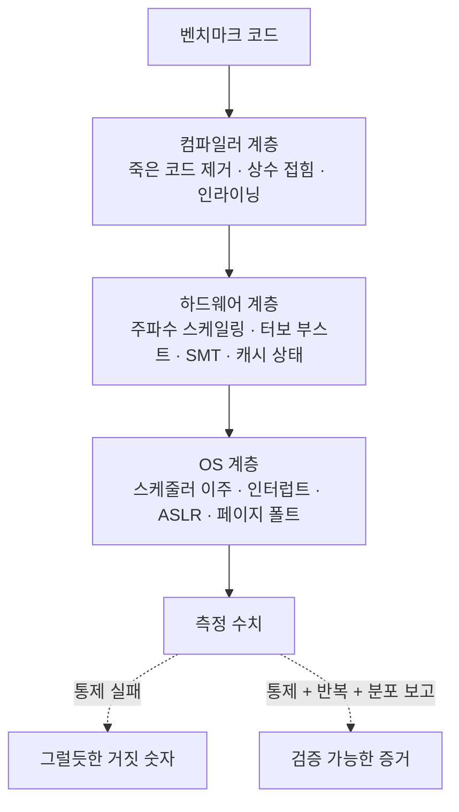

**마이크로벤치마크(microbenchmark) 설계란 함수 하나·자료구조 연산 하나 같은 작은 코드 단위의 비용을, 컴파일러·하드웨어·OS가 만들어내는 왜곡으로부터 격리해 반복 가능하게 측정하는 기술이다.** µs 단위 지연을 다루는 엔지니어에게 마이크로벤치마크는 "이 변경이 정말 빨라졌는가"를 주장할 수 있는 최소 단위의 증거인데, 문제는 잘못 설계된 벤치마크가 아무것도 측정하지 않으면서도 그럴듯한 숫자를 출력한다는 데 있다. 컴파일러는 결과가 쓰이지 않는 루프를 통째로 제거하고, CPU는 부하에 따라 주파수를 바꾸며, OS는 측정 도중 스레드를 다른 코어로 옮긴다. 이 장은 그 세 계층의 왜곡을 하나씩 통제하는 설계 원칙을 다룬다. 숫자를 만드는 법이 아니라, **믿을 수 있는 숫자와 믿으면 안 되는 숫자를 구분하는 법**이 이 장의 목표다.

## 이 장을 읽기 전에

**선행 지식**: 이 장은 [이 트랙의 인트로](/post/profiling-analysis/getting-started-profiling-performance-analysis-fundamentals/)에서 설명한 "측정→가설→변경→검증" 루프를 전제로 한다. C++ 코드가 컴파일러 최적화를 거쳐 기계어가 된다는 사실과, [Tr.02 ch01의 실행 모델·µs 어휘](/post/cpp-optimization/cpp-execution-model-microsecond-vocabulary-fundamentals/) 수준의 배경이면 충분하다. `-O2` 같은 최적화 플래그의 의미는 [Tr.03 ch01 최적화 플래그](/post/compiler-optimization/optimization-flags-o2-o3-ofast/)를 참고한다.

**이 장의 깊이**: 기초 난이도지만 "기초 = 쉬움"이 아니라 "기초 = 이후 모든 측정의 토대"라는 의미다. 죽은 코드 제거·상수 접힘 함정은 어셈블리 확인까지, 노이즈 통제는 Linux 커널 인터페이스 수준까지 내려간다.

**다루지 않는 것**: Google Benchmark 라이브러리의 API·실전 활용은 [다음 장](/post/profiling-analysis/google-benchmark-practical/)이 전담한다. 측정 결과의 통계 처리(신뢰 구간·유의성 검정)는 [10장 통계적 벤치마킹](/post/profiling-analysis/statistical-benchmarking/)에서, 사이클·캐시 미스 단위의 정밀 계측은 [8장 하드웨어 성능 카운터](/post/profiling-analysis/hardware-performance-counters/)에서 다룬다. 이 장은 그 모든 것의 전제인 **측정 대상의 격리와 환경 통제**에 집중한다.

## 당신의 수준에 맞는 경로

| 수준 | 읽을 부분 | 핵심 목표 |
|------|---------|---------|
| **초보자** | "무엇을 측정하는가" ~ "죽은 코드 제거·상수 접힘 함정" | 컴파일러가 벤치마크를 무효화하는 원리를 이해하고 검증 방법 습득 |
| **중급자** | "노이즈 통제" ~ "반복 가능성" | 주파수 고정·격리·워밍업으로 실행 간 변동을 1% 미만으로 통제 |
| **전문가** | "흔한 오개념" ~ "비판적 시각" | 마이크로벤치마크 결과의 유효 범위와 한계를 판단하는 기준 확립 |

---

## 측정 편향 연구의 역사: 숫자가 거짓말하는 방식

벤치마킹이 "공학"이 된 계기는 숫자가 틀릴 수 있음을 정량적으로 보여준 연구들이다. 1988년 설립된 SPEC(Standard Performance Evaluation Corporation)이 매크로벤치마크의 표준화를 이끌었다면, 마이크로 수준의 측정 편향(measurement bias)을 학계에 각인시킨 것은 Mytkowicz, Diwan, Hauswirth, Sweeney의 ASPLOS 2009 논문 ["Producing Wrong Data Without Doing Anything Obviously Wrong!"](https://users.cs.northwestern.edu/~robby/courses/322-2013-spring/mytkowicz-wrong-data.pdf)이다. 이 논문은 오브젝트 파일의 **링크 순서**나 UNIX **환경 변수의 총 크기**(스택 시작 주소를 밀어 정렬을 바꾼다) 같은 무해해 보이는 요인만 바꿔도 SPEC CPU2006 벤치마크 결과가 유의미하게 뒤집힘을 보였고, 이 편향이 "significant and commonplace"하면서도 예측 불가능하다고 결론지었다. 즉, 아무것도 명백히 잘못하지 않아도 잘못된 데이터가 나온다.

실무 쪽에서는 Chandler Carruth의 CppCon 2015 발표 "Tuning C++: Benchmarks, and CPUs, and Compilers! Oh My!"가 컴파일러의 죽은 코드 제거를 막는 `DoNotOptimize`/`ClobberMemory` 계열 관용구를 널리 퍼뜨렸고, 이 관용구는 이후 Google Benchmark 라이브러리의 공식 API로 정착했다. LLVM 프로젝트는 자체 성능 추적을 위해 [Benchmarking tips 문서](https://llvm.org/docs/Benchmarking.html)로 환경 통제 절차를 표준화했다. 이 장에서 다루는 원칙 대부분은 이 두 갈래 — 학계의 측정 편향 연구와 컴파일러 개발 현장의 실전 규율 — 에서 나온 것이다.

## 무엇을 측정하는가: 한 가설 원칙과 격리

마이크로벤치마크 설계의 첫 원칙은 코드가 아니라 질문에서 시작한다. **하나의 벤치마크는 하나의 가설만 검증한다.** "std::map 대신 flat map을 쓰면 조회가 빨라진다"는 가설이라면, 측정 루프 안에는 조회만 있어야 하고 삽입·키 생성·문자열 변환은 루프 밖으로 나가야 한다. 측정 대상이 아닌 코드가 루프에 섞이면 두 가지 문제가 생긴다. 첫째, 관심 없는 비용이 신호를 희석해 실제 차이가 노이즈에 묻힌다. 둘째, 컴파일러가 섞인 코드들을 함께 최적화하면서 실제 프로덕션에서는 일어나지 않을 코드 변형(인라이닝 후 루프 불변식 끌어올리기 등)이 발생한다.

두 번째 원칙은 **측정 오버헤드가 측정 대상보다 작아야 한다**는 것이다. `std::chrono::steady_clock::now()` 호출 자체가 수십 ns 수준이므로(플랫폼에 따라 다름), 10ns짜리 연산을 한 번 실행하고 앞뒤로 시계를 읽으면 측정하는 것은 연산이 아니라 시계다. 그래서 마이크로벤치마크는 대상을 N회 반복한 총 시간을 재고 N으로 나누는 구조를 취하며, N은 총 실행 시간이 타이머 해상도·오버헤드를 압도할 만큼(관례적으로 수백 ms 이상) 커야 한다. 이 반복 구조가 바로 다음 절의 함정 — 컴파일러가 반복을 무의미하게 만드는 — 을 부른다.

측정 수치를 왜곡하는 요인은 세 계층으로 나눠 통제한다. 각 계층의 통제 수단이 이 장의 나머지 구조다.



## 죽은 코드 제거·상수 접힘 함정

컴파일러 계층의 함정부터 본다. 최적화 컴파일러는 "관찰 가능한 동작이 같으면 코드를 마음대로 바꿔도 된다"는 as-if 규칙 아래 동작하는데, 벤치마크 루프는 결과를 어디에도 쓰지 않는 경우가 많아 관찰 가능한 동작이 없다. 그러면 **죽은 코드 제거(dead code elimination)**가 루프 본문을, 때로는 루프 전체를 삭제한다. 입력이 컴파일 시점 상수라면 **상수 접힘(constant folding)**이 계산을 컴파일 타임에 끝내버려, 런타임에는 결과 값을 적재하는 명령만 남는다. 아래는 두 함정을 모두 밟은 벤치마크다.

```cpp
// broken_bench.cpp — 이 벤치마크는 아무것도 측정하지 않는다
#include <chrono>
#include <cmath>
#include <cstdio>

int main() {
  constexpr int kIters = 10'000'000;
  auto t0 = std::chrono::steady_clock::now();
  for (int i = 0; i < kIters; ++i) {
    double r = std::sqrt(144.0);  // 함정 1: 인자가 상수 → 컴파일 타임에 12.0으로 접힘
    (void)r;                      // 함정 2: 결과 미사용 → 루프 전체가 죽은 코드
  }
  auto t1 = std::chrono::steady_clock::now();
  auto ns = std::chrono::duration_cast<std::chrono::nanoseconds>(t1 - t0).count();
  std::printf("total %lld ns, per-iter %.3f ns\n", (long long)ns, (double)ns / kIters);
  return 0;
}
```

`g++ -O2 broken_bench.cpp`로 빌드해 실행하면 반복당 0.000~0.001ns 수준이 출력된다. sqrt가 빠른 게 아니라 루프가 존재하지 않는 것이다. 원인은 두 겹이다. 먼저 `std::sqrt(144.0)`은 인자가 컴파일 시점 상수이므로 GCC/Clang이 컴파일 타임에 12.0으로 계산하고, 남은 것은 "결과를 버리는 빈 루프"인데 부수 효과가 없으므로 루프 자체가 제거된다. 둘 중 하나만 막아도 부족하다 — 상수 접힘을 막아도 결과가 미사용이면 죽은 코드 제거가, 결과를 살려도 입력이 상수면 접힘이 측정을 무효화한다. **입력은 컴파일러가 예측 불가능하게, 출력은 컴파일러가 버릴 수 없게** 만들어야 한다.

올바른 구현은 두 방향의 차단을 모두 넣는다. 입력 차단은 런타임에만 알 수 있는 값(`argc`, 파일에서 읽은 값 등)을 쓰거나 옵티마이저 배리어를 통과시키는 방식이고, 출력 차단은 결과를 인라인 어셈블리의 입력으로 넘겨 "이 값이 어딘가에 쓰인다"고 컴파일러에게 선언하는 방식이다. Google Benchmark의 `benchmark::DoNotOptimize`가 정확히 이 역할인데, 라이브러리 없이도 같은 원리를 몇 줄로 구현할 수 있다.

```cpp
// fixed_bench.cpp — g++ -O2 -std=c++17 fixed_bench.cpp -o fixed_bench
// 환경 예시: x86-64 Linux, GCC 13 (원리는 Clang 동일; MSVC는 아래 주석 참조)
#include <chrono>
#include <cmath>
#include <cstdio>

template <class T>
inline void doNotOptimize(T const& value) {
#if defined(__GNUC__) || defined(__clang__)
  // "g" 제약: value를 레지스터/메모리 어디로든 실체화하도록 강제.
  // "memory" 클로버: 이 지점 전후로 메모리 접근 재배치 금지.
  asm volatile("" : : "g"(value) : "memory");
#else
  // MSVC 근사 대체: volatile 쓰기는 제거될 수 없다. 단, 복사 비용이
  // 반복마다 추가되므로 GCC/Clang 버전과 절대치를 비교하면 안 된다.
  volatile T sink = value;
  (void)sink;
#endif
}

int main(int argc, char**) {
  constexpr int kIters = 10'000'000;
  double x = 144.0 + argc;  // 런타임 입력: 상수 접힘 차단
  auto t0 = std::chrono::steady_clock::now();
  for (int i = 0; i < kIters; ++i) {
    double r = std::sqrt(x);
    doNotOptimize(r);       // 결과 실체화 강제: 죽은 코드 제거 차단
  }
  auto t1 = std::chrono::steady_clock::now();
  auto ns = std::chrono::duration_cast<std::chrono::nanoseconds>(t1 - t0).count();
  std::printf("total %lld ns, per-iter %.3f ns\n", (long long)ns, (double)ns / kIters);
  return 0;
}
```

이제 반복당 수 ns 수준(x86-64에서 `sqrtsd` 지연시간에 근접, 마이크로아키텍처에 따라 다름)이 나온다. 주의할 점은 `doNotOptimize`가 만능 스위치가 아니라는 것이다 — 이 배리어는 값의 실체화만 강제할 뿐, 루프 언롤링이나 벡터화 같은 다른 변형은 여전히 일어나며 그것이 측정 의도와 맞는지는 설계자가 판단해야 한다. `DoNotOptimize`와 `ClobberMemory`의 정확한 의미론은 [Google Benchmark user guide](https://github.com/google/benchmark/blob/main/docs/user_guide.md)의 Preventing Optimization 절에 정의되어 있고, 라이브러리 차원의 활용은 [다음 장](/post/profiling-analysis/google-benchmark-practical/)에서 다룬다.

**검증은 어셈블리 확인이 최종 판정이다.** 타이밍 수치만으로 "0에 가까우면 제거됐다"고 추정할 수도 있지만, 부분 제거(루프는 남고 본문 일부만 삭제)는 수치로 구분되지 않는다. 측정 루프가 의도한 명령을 실제로 포함하는지 다음과 같이 확인한다.

```bash
# 어셈블리 출력에서 측정 대상 명령이 루프 안에 있는지 확인
g++ -O2 -std=c++17 -S -masm=intel fixed_bench.cpp -o - | grep -n "sqrtsd"
# 또는 빌드된 바이너리를 역어셈블
objdump -d --no-show-raw-insn fixed_bench | grep -A3 -B3 "sqrtsd"
```

```text
$ g++ -O2 -S -masm=intel broken_bench.cpp -o - | grep -c "sqrtsd"
0
$ g++ -O2 -S -masm=intel fixed_bench.cpp -o - | grep -c "sqrtsd"
1
```

깨진 버전에는 `sqrtsd` 명령이 아예 없고(0건), 고친 버전에는 루프 안에 존재한다(1건). 이 확인을 벤치마크 작성 루틴에 포함시키면 죽은 코드 함정은 사실상 원천 차단된다. 어셈블리를 체계적으로 읽는 방법은 [Tr.03 ch06 어셈블리 레벨 코드 생성 분석](/post/compiler-optimization/code-generation-analysis-assembly/)이 다룬다.

## 노이즈 통제: 주파수 고정·격리·워밍업

컴파일러 함정을 통과한 벤치마크의 다음 적은 실행할 때마다 숫자가 달라지는 **비결정성**이다. 노이즈의 최대 단일 원인은 CPU 주파수다. 현대 CPU는 부하·온도·전력 예산에 따라 클럭을 동적으로 바꾸는데(DVFS), 터보 부스트가 걸린 첫 실행과 발열로 스로틀링된 다섯 번째 실행은 같은 코드라도 20~30% 차이가 날 수 있다. Linux에서는 [cpufreq 거버너](https://www.kernel.org/doc/html/latest/admin-guide/pm/cpufreq.html)를 `performance`로 고정하고 터보를 끄는 것이 표준 처방이다 — `performance` 거버너는 정책 한도 내 최고 주파수를 상시 요청하므로 램프업 구간이 사라진다.

```bash
# 1) 거버너를 performance로 고정 (모든 코어)
sudo cpupower frequency-set --governor performance

# 2) 터보 부스트 비활성화
echo 1 | sudo tee /sys/devices/system/cpu/intel_pstate/no_turbo   # intel_pstate
echo 0 | sudo tee /sys/devices/system/cpu/cpufreq/boost           # acpi-cpufreq/AMD

# 3) 벤치마크를 특정 코어에 고정하고 FIFO 우선순위 부여
taskset -c 2 chrt -f 80 ./fixed_bench

# 4) (측정 전용 머신에서만) ASLR 비활성화 — 코드/스택 배치 변동 제거
echo 0 | sudo tee /proc/sys/kernel/randomize_va_space
```

각 항목의 근거를 짚어두면: `taskset`은 스케줄러가 측정 도중 스레드를 다른 코어로 옮기며 캐시를 버리는 것(migration)을 막고, `chrt -f`는 일반 프로세스에 선점당하는 것을 줄인다. ASLR은 실행마다 코드·스택 주소를 바꿔 Mytkowicz 논문이 지적한 정렬 편향을 실행 간 변동으로 바꿔놓는데, 끄면 변동은 줄지만 특정 배치 하나에 결과가 고정되는 트레이드오프가 있다(뒤의 비판적 시각 참조). 더 강한 격리가 필요하면 커널 부트 파라미터 `isolcpus`나 cgroup cpuset으로 코어를 아예 스케줄러에서 떼어내고, 해당 코어의 SMT 짝(hyperthread sibling)을 오프라인시켜 실행 자원 공유를 차단한다. [LLVM Benchmarking tips](https://llvm.org/docs/Benchmarking.html)는 이 절차를 모두 적용하면 "With these in place you can expect perf variations of less than 0.1%."라고 안내한다(LLVM Project 공식 문서). Google Benchmark 프로젝트도 같은 취지의 절차를 [reducing_variance.md](https://github.com/google/benchmark/blob/main/docs/reducing_variance.md)로 문서화하고 있다.

통제의 효과는 눈으로 확인할 수 있어야 한다. 같은 바이너리를 통제 전후로 5회씩 실행해 비교하면 이런 그림이 나온다(수치는 예시이며 머신·부하 상태에 따라 다름).

```text
$ for i in $(seq 5); do ./fixed_bench; done        # 통제 전 (데스크톱 환경, ondemand 거버너)
per-iter 2.913 ns / 2.407 ns / 2.921 ns / 2.554 ns / 3.102 ns    → 최대/최소 비 1.29

$ for i in $(seq 5); do taskset -c 2 ./fixed_bench; done   # 주파수 고정 + 코어 고정 후
per-iter 2.501 ns / 2.498 ns / 2.503 ns / 2.499 ns / 2.502 ns    → 최대/최소 비 1.002
```

통제 전에는 실행 간 29% 변동이 있어 10% 개선 같은 것은 검출 자체가 불가능하지만, 통제 후에는 0.2% 변동으로 좁혀져 1% 차이도 논의할 수 있게 된다. **검출하려는 효과 크기보다 실행 간 변동이 작아야 한다** — 이것이 노이즈 통제의 정량적 목표다.

**워밍업(warmup)**은 시간 축의 통제다. 프로세스 시작 직후의 첫 반복들은 정상 상태가 아니다: 코드 페이지가 아직 디스크에서 올라오지 않아 페이지 폴트가 나고, 데이터는 캐시에 없으며(cold cache), 분기 예측기는 학습 전이고, 거버너를 고정하지 않았다면 주파수도 램프업 중이다. 그래서 측정 루프 앞에 동일 코드를 일정 횟수 실행해 정상 상태로 끌어올린 뒤 그 구간을 측정에서 제외한다. Google Benchmark가 반복 횟수를 자동 조정하며 초기 실행을 사실상 워밍업으로 흡수하는 것도 같은 원리다. 단, 워밍업은 양날의 검이다 — 프로덕션에서 해당 코드가 캐시가 식은 상태로 드물게 호출된다면, 워밍업된 벤치마크는 실제보다 낙관적인 숫자를 낸다. 어느 상태를 측정할지는 가설이 정한다.

## 반복 가능성: 미래의 나와 동료가 재현할 수 있게

노이즈 통제가 "지금 이 머신에서 실행 간 변동을 줄이는 것"이라면, 반복 가능성(repeatability)은 "다음 주에, 다른 사람이, 같은 결론에 도달할 수 있는 것"이다. 이를 위한 최소 규율은 세 가지다. 첫째, **입력을 고정하고 기록한다.** 난수 입력이라면 시드를 고정하고, 데이터 크기·분포를 벤치마크 이름이나 로그에 남긴다. 둘째, **환경을 기록한다.** 컴파일러 버전과 플래그, CPU 모델, 거버너 상태, 커널 버전, SMT 활성 여부가 바뀌면 숫자는 비교 불가능해진다. 셋째, **단일 수치가 아니라 분포를 남긴다.** 최소한 반복 횟수·중앙값·변동 폭을 함께 기록해야 나중에 "그 2.5ns가 얼마나 믿을 만한 숫자였는지" 판단할 수 있다. 환경 기록은 스크립트로 자동화하는 편이 안전하다.

```bash
# 벤치마크 결과와 함께 저장할 환경 스냅샷
{
  date -Iseconds
  g++ --version | head -1
  uname -r
  lscpu | grep -E "Model name|MHz"
  cat /sys/devices/system/cpu/cpu0/cpufreq/scaling_governor
  cat /proc/sys/kernel/randomize_va_space
} > bench_env.txt
```

비교 벤치마크(A vs B)에서는 실행 순서도 통제 대상이다. A를 100회 돌리고 B를 100회 돌리면, 그 사이에 발생한 온도 변화·백그라운드 작업이 순서 효과로 끼어든다. A와 B를 교대로(interleave) 실행하거나 실행 순서를 무작위화하면 시간에 따른 드리프트가 양쪽에 고르게 분산된다. Mytkowicz 논문이 권고한 "실험 설정의 다양화(randomization)"가 바로 이것이다 — 통제할 수 없는 편향은 무작위화로 양쪽에 공평하게 뿌리는 것이 차선책이다. 몇 회를 돌려야 충분한지, 두 분포의 차이가 유의한지는 [10장 통계적 벤치마킹](/post/profiling-analysis/statistical-benchmarking/)의 주제다.

## 흔한 오개념 교정

**오개념 1: "반복당 시간이 매우 작게 나오면 코드가 빠른 것이다."** 반복당 0.3ns 같은 숫자는 축하가 아니라 경보다. 현대 CPU의 1사이클이 대략 0.2~0.5ns이므로, 의미 있는 작업이 1사이클 미만으로 측정됐다면 십중팔구 죽은 코드 제거나 상수 접힘으로 루프가 비었거나, 컴파일러가 N회 반복을 닫힌 형태(closed form)로 접은 것이다. 의심스러운 호결과일수록 어셈블리를 먼저 확인한다.

**오개념 2: "여러 번 돌려 평균을 내면 노이즈는 해결된다."** 평균은 대칭 노이즈만 상쇄한다. 벤치마크 노이즈의 상당수는 비대칭이다 — 인터럽트·선점·스로틀링은 시간을 늘리기만 하지 줄이지는 않는다. 그래서 오염된 실행이 섞이면 평균은 위로 끌려가고, 반복을 늘려도 편향은 사라지지 않는다. 통제를 먼저 하고, 요약 통계로는 평균보다 중앙값·최소값이 "코드의 본질적 비용"에 가까운 경우가 많다(무엇을 보고할지는 가설에 따라 다르며, [9장 Tail Latency 분석](/post/profiling-analysis/tail-latency-analysis/)처럼 꼬리가 관심사라면 반대로 분포 전체가 필요하다).

**오개념 3: "마이크로벤치마크에서 2배 빠르면 서비스도 2배 빨라진다."** 마이크로벤치마크는 캐시가 데워지고 분기 예측기가 학습된, 해당 코드만 도는 이상적 환경의 숫자다. 프로덕션에서는 다른 코드가 캐시와 예측기를 오염시키고, 해당 함수가 전체 시간의 3%만 차지한다면 Amdahl의 법칙에 따라 2배 개선도 전체로는 1.5% 개선이다. 마이크로벤치마크는 "이 코드 단위가 더 싸졌다"까지만 증명하며, 전체 효과는 [3장 샘플링 프로파일링](/post/profiling-analysis/sampling-profiling-perf-vtune/)으로 핫패스 비중을 확인해야 말할 수 있다.

## 판단 기준: 언제 마이크로벤치마크를 쓰고, 언제 믿을 것인가

마이크로벤치마크는 도구 선택의 문제이기도 하다. 병목이 어디인지 모르는 단계에서 마이크로벤치마크부터 만드는 것은 순서가 뒤집힌 것이다 — 먼저 프로파일러로 핫패스를 찾고, 그 핫패스의 대안을 비교할 때 마이크로벤치마크를 쓴다.

| 상황 | 마이크로벤치마크 | 다른 도구 |
|------|----------------|----------|
| 자료구조·알고리즘 대안 A/B 비교 | **적합** — 격리 측정이 강점 | — |
| 라이브러리 API 선택(예: 포맷팅 함수) | **적합** — 호출 단위 비용 비교 | — |
| "어디가 느린가"를 모르는 상태 | 부적합 (순서 역전) | [샘플링 프로파일링](/post/profiling-analysis/sampling-profiling-perf-vtune/) |
| 시스템 전체 지연·상호작용 효과 | 부적합 (격리가 오히려 왜곡) | [트레이싱](/post/profiling-analysis/tracing-profiling-perfetto-tracy/)·E2E 측정 |
| 드물게 호출되는 콜드패스 비용 | 조건부 — 워밍업 없이 측정 설계 필요 | 하드웨어 카운터·트레이싱 |

측정 결과를 신뢰하기 전 체크리스트는 다음과 같다. 하나라도 "아니오"면 숫자를 결론에 쓰지 않는다.

- [ ] 어셈블리(또는 `-S` 출력)에서 측정 대상 명령이 루프 안에 존재함을 확인했는가?
- [ ] 입력이 컴파일 시점 상수가 아니며, 결과가 옵티마이저 배리어를 통과하는가?
- [ ] 실행 간 변동(최대/최소 비)이 검출하려는 효과 크기보다 충분히 작은가?
- [ ] 주파수 고정·코어 고정 등 환경 통제 상태를 기록했는가?
- [ ] 비교 대상 A/B를 같은 세션에서 교대 실행했는가?
- [ ] 이 숫자가 유효한 조건(캐시 상태, 입력 분포)을 결론에 명시했는가?

## 비판적 시각: 통제된 환경이라는 거짓말

이 장에서 가르친 통제 기법에는 근본적 긴장이 있다. **통제를 강하게 할수록 재현성은 올라가지만 대표성은 내려간다.** 터보를 끄고 코어를 격리하고 ASLR을 죽인 환경은 프로덕션 서버와 닮은 점이 거의 없다 — 프로덕션에서는 터보가 켜져 있고, 이웃 스레드가 캐시를 다투며, 주소 배치는 배포마다 다르다. 통제된 벤치마크에서 5% 빨랐던 코드가 프로덕션에서 무의미하거나 역전되는 일은 드물지 않다. 통제는 "코드 고유의 비용 차이를 검출하기 위한 실험 조건"이지 "프로덕션 성능의 예측"이 아니라는 한계를 항상 결론에 병기해야 한다.

ASLR 비활성화는 이 긴장의 축소판이다. 끄면 실행 간 변동은 줄지만, Mytkowicz 논문의 관점에서 보면 특정 메모리 배치 하나를 고정해 그 배치의 편향을 결과에 새겨넣는 것이다. 운 좋은(또는 나쁜) 정렬 하나가 "A가 B보다 3% 빠르다"는 결론을 만들 수 있다. 더 견고한 대안은 ASLR을 켠 채 실행 횟수를 늘려 배치 변동을 분포로 흡수하는 것인데, 이는 시간이 더 들고 통계 처리가 필요하다. 어느 쪽이 옳은지는 정답이 없으며, 검출하려는 효과 크기와 쓸 수 있는 측정 시간의 트레이드오프다.

마지막으로, 마이크로벤치마크 문화 자체에 대한 비판도 있다. 격리된 단위에서 측정 가능한 것만 최적화 대상이 되는 "가로등 아래에서 열쇠 찾기" 편향이다. 캐시 오염, 명령어 캐시 압박, 할당자 단편화처럼 상호작용에서만 나타나는 비용은 마이크로벤치마크에 잡히지 않지만 실제 지연의 큰 몫을 차지할 수 있다. 그래서 이 트랙은 마이크로벤치마크(이 장~2장)를 프로파일링(3장~)과 짝지어 배치한다 — 마이크로벤치마크는 가설 검증 도구이지, 성능 이해의 전부가 아니다.

## 마무리

이 장을 제대로 소화했다면 다음을 스스로 확인할 수 있어야 한다.

- [ ] 죽은 코드 제거와 상수 접힘이 벤치마크를 무효화하는 메커니즘을 설명하고, 어셈블리 확인으로 검증할 수 있다.
- [ ] `doNotOptimize` 류 옵티마이저 배리어의 원리(입력 예측 차단·출력 실체화 강제)와 한계를 설명할 수 있다.
- [ ] 주파수 고정·코어 격리·ASLR·워밍업 각각이 어떤 노이즈를 제거하는지 구분하고 Linux에서 적용할 수 있다.
- [ ] "실행 간 변동 < 검출하려는 효과 크기"라는 정량 목표로 통제 수준을 판단할 수 있다.
- [ ] 마이크로벤치마크 결과의 유효 범위(격리 환경, 워밍업 상태)를 결론에 명시하는 습관이 있다.

**다음 장에서는** 이 장의 원칙을 손으로 구현하는 대신 라이브러리에 맡기는 법을 다룬다. [Google Benchmark 실전](/post/profiling-analysis/google-benchmark-practical/)에서 반복 횟수 자동 조정, `DoNotOptimize`/`ClobberMemory`, 파라미터화된 벤치마크와 결과 비교 도구까지 — 이 장에서 원리를 이해한 장치들이 API로 어떻게 제공되는지 확인한다.
