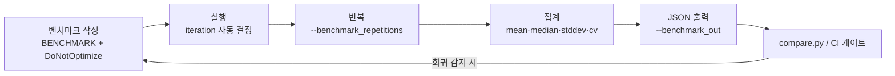

**Google Benchmark 실전**이란 [이전 장](/post/profiling-analysis/microbenchmark-design-principles/)에서 정리한 마이크로벤치마크 설계 원칙 — 한 가설만 검증, 노이즈 통제, 반복 가능성 — 을 실제 라이브러리의 API로 구현하는 기술을 말합니다. 원칙을 아는 것과 컴파일러의 죽은 코드 제거(dead code elimination)를 피해 정확히 측정 대상만 남기는 것은 다른 문제입니다. µs 단위 최적화에서 벤치마크 하나가 잘못 작성되면 그 위에 쌓은 모든 판단이 무너지므로, 이 장에서는 Google Benchmark의 핵심 API — `DoNotOptimize`/`ClobberMemory`, `Args`/`Ranges`, 반복·통계 옵션, 커스텀 카운터 — 를 "왜 그렇게 동작하는가"부터 서술하고, 마지막에 JSON 출력을 CI 회귀 게이트에 연결하는 실전 워크플로우까지 다룹니다.

## 이 장을 읽기 전에

**선행 챕터**: [Microbenchmark 설계 원칙](/post/profiling-analysis/microbenchmark-design-principles/)에서 다룬 "무엇을 측정하고 무엇을 통제할 것인가"라는 설계 관점을 전제로 합니다. 이 트랙 전체의 위치는 [트랙 인트로](/post/profiling-analysis/getting-started-profiling-performance-analysis-fundamentals/)를 참고하세요. C++ 쪽 전제 지식은 [Tr.02 ch01: C++ 실행 모델](/post/cpp-optimization/cpp-execution-model-microsecond-vocabulary-fundamentals/) 수준이면 충분합니다.

**이 장의 깊이**: 난이도 **기초**이지만, `DoNotOptimize`의 정확한 의미론(무엇을 보장하고 무엇을 보장하지 않는가)은 숙련자도 자주 틀리는 부분이라 깊게 다룹니다. **다루지 않는 것**: 반복 결과의 신뢰 구간·유의성 검정 같은 통계 이론은 [10장: 통계적 벤치마킹](/post/profiling-analysis/statistical-benchmarking/)에, 프로덕션 트래픽 기반 성능 비교는 [12장: 성능 A/B 테스트](/post/profiling-analysis/performance-ab-testing/)에 위임합니다. 벤치마크가 아니라 실행 중인 프로그램에서 핫패스를 찾는 방법은 [다음 장(샘플링 프로파일링)](/post/profiling-analysis/sampling-profiling-perf-vtune/)부터 시작합니다.

## 당신의 수준에 맞는 경로

| 수준 | 읽을 부분 | 핵심 목표 |
|------|---------|---------|
| **초보자** | "설치와 첫 벤치마크" ~ "DoNotOptimize와 ClobberMemory" | 벤치마크가 통째로 최적화돼 사라지는 사고를 방지 |
| **중급자** | "Args·Ranges" ~ "커스텀 카운터" | 파라미터화·반복·통계 옵션으로 재현 가능한 수치 생산 |
| **전문가** | "JSON 출력과 CI 연동" ~ "비판적 시각" | 벤치마크를 회귀 게이트로 승격하고 도구의 한계를 인지 |

---

## Google Benchmark의 역사와 배경

Google Benchmark는 구글 내부에서 쓰이던 마이크로벤치마크 프레임워크를 2013년 말 오픈소스로 공개한 프로젝트로, 2016년 v1.0.0을 거쳐 현재까지 LLVM·Abseil·많은 오픈소스 프로젝트의 사실상 표준 마이크로벤치마크 도구로 자리잡았습니다. 이 라이브러리가 대중적으로 알려진 계기 중 하나는 Chandler Carruth의 CppCon 2015 발표 "Tuning C++: Benchmarks, and CPUs, and Compilers! Oh My!"인데, 여기서 소개된 escape(값이 관찰된다고 컴파일러를 설득)·clobber(메모리 전체가 읽히고 쓰인다고 설득) 관용구가 오늘날의 `benchmark::DoNotOptimize`와 `benchmark::ClobberMemory`로 이어졌습니다.

2026년 7월 기준 최신 릴리스는 **v1.9.5**(2026-01)이며, [공식 저장소](https://github.com/google/benchmark)에 따르면 라이브러리 사용은 C++11이면 충분하지만 빌드에는 C++17을 지원하는 컴파일러·표준 라이브러리가 필요합니다. 수동으로 iteration 루프와 `rdtsc`를 감싸던 자작 타이밍 코드와 비교하면, 이 프레임워크의 본질적 가치는 세 가지입니다: (1) 측정 시간이 안정될 때까지 iteration 수를 자동으로 조절하고, (2) 통계 집계(평균·중앙값·표준편차·변동계수)를 내장하며, (3) 콘솔·JSON·CSV 출력 형식을 표준화해 도구 체인(비교 스크립트, CI 액션)이 그 위에 쌓일 수 있게 했다는 점입니다.

## 설치와 첫 벤치마크

프로젝트에 통합하는 가장 재현성 높은 방법은 CMake `FetchContent`로 버전을 고정하는 것입니다. 시스템 패키지 관리자(apt의 `libbenchmark-dev`, vcpkg, Conan)도 가능하지만, 벤치마크 결과를 팀·CI와 비교하려면 라이브러리 버전이 명시적으로 고정되는 편이 안전합니다.

```cmake
include(FetchContent)
set(BENCHMARK_ENABLE_TESTING OFF)   # 라이브러리 자체 테스트 빌드 생략
FetchContent_Declare(
  benchmark
  GIT_REPOSITORY https://github.com/google/benchmark.git
  GIT_TAG        v1.9.5
)
FetchContent_MakeAvailable(benchmark)

add_executable(my_bench bench.cpp)
target_link_libraries(my_bench PRIVATE benchmark::benchmark)
```

여기서 흔한 함정 하나: 벤치마크 실행 파일은 반드시 <strong>Release 구성(`-DCMAKE_BUILD_TYPE=Release`, 즉 `-O2` 이상)</strong>으로 빌드해야 합니다. Debug 빌드의 수치는 최적화된 바이너리와 병목 위치 자체가 달라서 어떤 결론도 지지하지 못하며, 라이브러리를 Debug로 빌드하면 Google Benchmark가 실행 시 경고를 출력합니다.

첫 벤치마크의 구조는 다음과 같습니다. `benchmark::State`를 받는 함수를 정의하고 `for (auto _ : state)` 루프 안에 측정 대상을 넣으면, 프레임워크가 이 루프를 몇 번 돌릴지(iterations)를 자동으로 결정합니다.

```cpp
// bench.cpp — g++ -O2 -std=c++17 bench.cpp -lbenchmark -lpthread (x86-64, GCC 13 기준)
#include <benchmark/benchmark.h>
#include <string>
#include <vector>

static void BM_VectorPushBack(benchmark::State& state) {
  for (auto _ : state) {
    std::vector<int> v;                 // 매 iteration마다 새로 생성 (측정에 포함)
    for (int i = 0; i < 1024; ++i) v.push_back(i);
    benchmark::DoNotOptimize(v.data()); // 결과가 관찰됨을 컴파일러에 알림
  }
}
BENCHMARK(BM_VectorPushBack);

BENCHMARK_MAIN();
```

실행하면 다음과 같은 출력을 얻습니다(수치는 플랫폼·플래그에 따라 다름).

```text
Run on (16 X 4800 MHz CPU s)
CPU Caches:
  L1 Data 48 KiB (x8)
  L1 Instruction 32 KiB (x8)
  L2 Unified 1280 KiB (x8)
  L3 Unified 24576 KiB (x1)
Load Average: 0.52, 0.61, 0.58
------------------------------------------------------------
Benchmark                  Time             CPU   Iterations
------------------------------------------------------------
BM_VectorPushBack        812 ns          810 ns       862069
```

읽는 법: **Time**은 벽시계 시간, **CPU**는 프로세스가 실제 CPU에서 소비한 시간으로, 두 값이 크게 벌어지면 측정 중 대기(I/O, 스케줄링 아웃)가 있었다는 신호입니다. **Iterations**는 프레임워크가 자동 결정한 루프 횟수인데, 기본적으로 벤치마크당 최소 실행 시간(기본 0.5초, `--benchmark_min_time`으로 조정)을 채울 때까지 iteration을 늘립니다. 헤더의 Load Average가 높다면 다른 프로세스가 CPU를 쓰고 있다는 뜻이므로 그 수치는 버리는 편이 낫습니다 — 실행 환경 통제(cpupower·taskset·ASLR)는 [이전 장](/post/profiling-analysis/microbenchmark-design-principles/)과 공식 [Reducing Variance 문서](https://google.github.io/benchmark/reducing_variance.html)를 따르세요.

## DoNotOptimize와 ClobberMemory: 컴파일러와의 계약

마이크로벤치마크의 최대 적은 컴파일러입니다. 측정 대상 코드의 결과가 아무 데도 쓰이지 않으면 옵티마이저는 그 코드를 통째로 제거할 권리가 있고, 실제로 제거합니다. 아래는 그 사고가 나는 전형적인 "깨진 벤치마크"입니다.

```cpp
#include <benchmark/benchmark.h>

static void BM_Broken(benchmark::State& state) {
  for (auto _ : state) {
    int sum = 0;
    for (int i = 0; i < 1000; ++i) sum += i * i;  // 결과 미사용 → 루프 전체 제거됨
  }
}
BENCHMARK(BM_Broken);
BENCHMARK_MAIN();
```

**원인**: `sum`은 관찰 가능한 부작용(observable side effect)이 없으므로, `-O2`에서 내부 루프는 완전히 사라지고 벤치마크는 빈 루프의 시간 — iteration당 1ns 미만 — 을 측정합니다. 상수 접기(constant folding)가 가능한 경우라면 컴파일 타임에 답이 계산되기도 합니다. "1000번 곱셈·덧셈이 0.3ns에 끝났다"는 수치를 보면 축하할 일이 아니라 벤치마크가 깨졌다고 의심해야 합니다.

**올바른 구현**은 결과를 `benchmark::DoNotOptimize`에 통과시키는 것입니다. 이 함수는 [공식 User Guide](https://google.github.io/benchmark/user_guide.html)의 정의에 따르면 표현식의 **결과**를 메모리나 레지스터에 실제로 저장하도록 강제하여, "이 값은 누군가 관찰한다"고 컴파일러를 설득합니다. GCC/Clang에서는 빈 인라인 어셈블리에 값을 입출력 제약으로 묶는 방식으로 구현되어 런타임 비용이 사실상 0이고, 인라인 어셈블리가 없는 MSVC x64에서는 구현 방식이 달라 오버헤드·강도가 다를 수 있습니다(구현 정의).

```cpp
#include <benchmark/benchmark.h>

static void BM_Fixed(benchmark::State& state) {
  for (auto _ : state) {
    int sum = 0;
    for (int i = 0; i < 1000; ++i) sum += i * i;
    benchmark::DoNotOptimize(sum);   // sum이 레지스터/메모리에 실재하도록 강제
  }
}
BENCHMARK(BM_Fixed);
BENCHMARK_MAIN();
```

**검증**: 고친 뒤에는 수치가 그럴듯해졌는지(1000회 정수 곱셈·덧셈이면 수백 ns 안팎)와 함께, `objdump -d ./my_bench | less`나 컴파일러 익스플로러에서 루프 본문이 실제 기계어로 남아 있는지 확인합니다. "측정값이 비정상적으로 작으면 어셈블리를 본다"를 습관으로 만들면 이 부류의 사고 대부분을 잡을 수 있습니다 — 어셈블리 읽기는 [Tr.03 ch06: 코드 생성 분석](/post/compiler-optimization/code-generation-analysis-assembly/)에서 다룹니다.

단, `DoNotOptimize`의 보장 범위를 오해하면 안 됩니다. 공식 문서는 이를 명시적으로 경고합니다.

> "DoNotOptimize(\<expr\>) does not prevent optimizations on \<expr\> in any way. \<expr\> may even be removed entirely when the result is already known." — [Google Benchmark User Guide](https://google.github.io/benchmark/user_guide.html)

즉 이 함수는 **결과의 관찰만 강제할 뿐, 표현식 자체의 계산 과정을 보호하지 않습니다**. 결과가 컴파일 타임에 알려져 있으면(예: 상수 입력의 순수 함수) 계산은 여전히 접혀 사라질 수 있으므로, 입력을 벤치마크 루프 밖에서 만들되 컴파일러가 값을 추적하지 못하게 하거나(예: 루프 진입 전 입력에도 `DoNotOptimize` 적용), 문서 권고대로 결과를 중간 변수에 실체화(materialize)한 뒤 그 변수를 넘기는 패턴을 씁니다.

`ClobberMemory()`는 반대 방향의 도구입니다. 공식 문서에 따르면 보류 중인 모든 쓰기를 전역 메모리로 강제 반영시키는데(GCC/Clang에서 `asm volatile("" ::: "memory")`에 해당하는 컴파일러 배리어), 결과를 포인터·참조로만 들고 있어 `DoNotOptimize`에 넘길 단일 값이 없을 때 — 예를 들어 버퍼를 채우는 코드가 "쓰기가 실제로 일어났는지"를 증명해야 할 때 — 사용합니다. 이것은 컴파일러 최적화 배리어일 뿐 CPU 메모리 배리어(fence 명령)가 아니므로, 멀티스레드 동기화와는 무관하다는 점을 혼동하지 마세요.

## Args·Ranges: 파라미터화와 복잡도 추정

같은 코드라도 입력 크기에 따라 캐시 적중률과 할당 패턴이 달라지므로, 하나의 크기만 측정한 수치는 일반화할 수 없습니다. Google Benchmark는 벤치마크 등록 시 인자를 붙이는 API를 제공합니다: `Arg(n)`은 단일 값, `Args({a, b})`는 다중 인자 한 세트, `Range(lo, hi)`는 기본 8배수 간격(`RangeMultiplier`로 변경)의 시퀀스, `DenseRange(lo, hi, step)`는 등차 시퀀스, `ArgsProduct`는 여러 축의 데카르트 곱입니다. 벤치마크 본문에서는 `state.range(0)`, `state.range(1)`로 값을 읽습니다.

```cpp
#include <benchmark/benchmark.h>
#include <vector>

static void BM_VectorPush(benchmark::State& state) {
  const auto n = static_cast<size_t>(state.range(0));
  for (auto _ : state) {
    std::vector<int> v;
    for (size_t i = 0; i < n; ++i) v.push_back(static_cast<int>(i));
    benchmark::DoNotOptimize(v.data());
  }
  state.SetComplexityN(state.range(0));   // 복잡도 추정용 N 보고
}
BENCHMARK(BM_VectorPush)->Range(1 << 6, 1 << 16)->Complexity(benchmark::oN);
BENCHMARK_MAIN();
```

`Range(64, 65536)`은 64, 512, 4096, 32768, 65536처럼 로그 간격의 크기를 자동 생성해 L1/L2/L3 캐시 경계를 가로지르는 스케일링 곡선을 보여주고, `Complexity(benchmark::oN)`(또는 `oAuto`)는 측정값을 지정한 점근 모델에 회귀시켜 계수와 RMS 오차를 함께 보고합니다. 다만 이 복잡도 추정은 점근 항이 지배하는 큰 N 구간에서만 의미가 있으며, 작은 N에서는 상수항·캐시 효과가 곡선을 왜곡한다는 점 — [Tr.02 ch04: STL 컨테이너 비용](/post/cpp-optimization/stl-container-cost/)에서 다룬 그대로 — 을 감안해서 해석해야 합니다.

## 반복·통계 옵션: iteration과 repetition의 구분

Google Benchmark에는 층위가 다른 두 반복 개념이 있고, 이 둘을 혼동하면 통계 해석 전체가 틀어집니다. **iteration**은 한 번의 측정 실행 내부에서 시간을 안정시키기 위해 프레임워크가 자동으로 돌리는 루프 횟수이고(사용자가 지정할 대상이 아님), **repetition**은 같은 벤치마크 전체를 독립적으로 다시 실행하는 횟수로, 실행 간 변동성(run-to-run variance)을 드러내는 표본을 만듭니다. 하나의 측정값은 "그 실행이 우연히 빨랐는지"를 말해주지 못하므로, 비교 목적의 벤치마크는 반드시 repetition을 여러 번 두어야 합니다.

```bash
# repetition 10회, 개별 실행은 숨기고 집계만 표시, 워밍업 0.5초
./my_bench --benchmark_repetitions=10 \
           --benchmark_report_aggregates_only=true \
           --benchmark_min_warmup_time=0.5
```

repetition이 2회 이상이면 프레임워크가 mean(평균)·median(중앙값)·stddev(표준편차)·cv(변동계수)를 자동 집계합니다. 출력 예시는 다음과 같습니다.

```text
Benchmark                          Time             CPU   Iterations
--------------------------------------------------------------------
BM_VectorPush/4096_mean         3021 ns         3018 ns           10
BM_VectorPush/4096_median       2998 ns         2995 ns           10
BM_VectorPush/4096_stddev         84.2 ns         83.9 ns          10
BM_VectorPush/4096_cv             2.79 %          2.78 %           10
```

실무 해석 기준: <strong>cv(변동계수 = 표준편차/평균)</strong>가 이 환경 수치의 신뢰도를 요약합니다. 경험적으로 cv가 1–2% 이하면 잘 통제된 환경, 5%를 넘으면 환경 노이즈가 커서 그보다 작은 개선 폭은 논할 수 없는 상태입니다. 이때는 수치를 더 모을 게 아니라 실행 환경(주파수 고정, CPU 피닝, 백그라운드 프로세스)을 먼저 고쳐야 합니다. mean과 median이 크게 벌어지면 일부 실행에 이상치(outlier)가 끼었다는 뜻이므로 median을 대표값으로 쓰는 편이 안전합니다 — 신뢰 구간과 유의성 검정까지 포함한 엄밀한 처리는 [10장: 통계적 벤치마킹](/post/profiling-analysis/statistical-benchmarking/)에서 다룹니다.

한 가지 주의: `state.PauseTiming()`/`ResumeTiming()`으로 준비 코드를 측정에서 빼는 API가 있지만, 이 호출 자체의 오버헤드가 ns 단위 측정 대상을 오염시킬 만큼 큽니다. iteration당 본문이 수십 ns 수준인 벤치마크에서는 쓰지 말고, 준비 비용이 문제라면 준비를 루프 밖으로 빼거나 준비 포함/미포함 두 벤치마크의 차를 보는 설계가 낫습니다.

## 커스텀 카운터와 처리량 보고

시간(ns/iteration)만으로는 "이 코드가 메모리 대역폭을 얼마나 쓰는가", "초당 몇 건을 처리하는가" 같은 질문에 답하기 어렵습니다. `state.counters`는 벤치마크가 임의의 지표를 결과에 첨부하는 통로로, `benchmark::Counter::kIsRate` 플래그를 주면 값이 경과 시간으로 나뉘어 "초당 비율"로 보고됩니다. 자주 쓰는 두 지표는 전용 API가 있습니다: `SetItemsProcessed`는 items/s를, `SetBytesProcessed`는 bytes/s(대역폭)를 자동 계산합니다.

```cpp
#include <benchmark/benchmark.h>
#include <cstring>
#include <vector>

static void BM_Memcpy(benchmark::State& state) {
  const auto n = static_cast<size_t>(state.range(0));
  std::vector<char> src(n, 'x'), dst(n);
  for (auto _ : state) {
    std::memcpy(dst.data(), src.data(), n);
    benchmark::ClobberMemory();   // dst 쓰기가 실재함을 강제
  }
  state.SetBytesProcessed(static_cast<int64_t>(state.iterations()) * n);
  state.counters["copies_per_sec"] =
      benchmark::Counter(static_cast<double>(state.iterations()), benchmark::Counter::kIsRate);
}
BENCHMARK(BM_Memcpy)->Range(1 << 10, 1 << 24);
BENCHMARK_MAIN();
```

이렇게 하면 출력에 `bytes_per_second` 열이 붙어, 크기별 곡선에서 대역폭이 꺾이는 지점(캐시 경계)을 시간 수치보다 직관적으로 읽을 수 있습니다. 커스텀 카운터는 JSON 출력에도 그대로 실리므로, 다음 절의 CI 게이트에서 "시간"뿐 아니라 "처리량·할당 횟수" 같은 도메인 지표로도 회귀를 감시할 수 있다는 점이 실전에서 더 중요합니다. 하드웨어 이벤트(캐시 미스, 분기 예측 실패)를 벤치마크에 직접 붙이고 싶다면 그 주제는 [8장: 하드웨어 성능 카운터](/post/profiling-analysis/hardware-performance-counters/)의 영역입니다.

## JSON 출력과 CI 연동

수동으로 돌리는 벤치마크는 시간이 지나면 아무도 안 돌립니다. 벤치마크가 가치를 유지하려면 기계가 읽는 출력 형식으로 저장되고, 변경 전후를 자동 비교하는 파이프라인에 들어가야 합니다. Google Benchmark는 `--benchmark_format=json`(stdout) 또는 `--benchmark_out=파일 --benchmark_out_format=json`으로 전체 결과 — 컨텍스트(CPU·캐시 정보), 벤치마크별 시간, 집계, 커스텀 카운터 — 를 JSON으로 내보냅니다.

```bash
# 기준(baseline) 커밋에서
./my_bench --benchmark_repetitions=10 --benchmark_out=base.json --benchmark_out_format=json
# 변경(contender) 커밋에서
./my_bench --benchmark_repetitions=10 --benchmark_out=contender.json --benchmark_out_format=json
# 저장소 동봉 도구로 비교 (scipy 필요)
python3 tools/compare.py benchmarks base.json contender.json
```

저장소에 동봉된 `tools/compare.py`는 두 JSON을 벤치마크별로 짝지어 시간 차이를 보여주고, repetition이 충분하면 Mann-Whitney U 검정으로 그 차이가 노이즈 범위인지 판정을 붙여 줍니다. "3% 빨라졌다"는 주장에서 이 p-value가 빠지면 노이즈와 구분할 수 없으므로, 비교는 항상 raw 실행이 아니라 repetition 세트 대 세트로 수행하세요.

GitHub Actions 환경이라면 [benchmark-action/github-action-benchmark](https://github.com/benchmark-action/github-action-benchmark)가 `googlecpp` 도구 타입을 직접 지원합니다. JSON 출력을 넘기면 커밋별 추이를 저장하고, 이전 결과 대비 악화가 임계값(`alert-threshold`, 기본 200%)을 넘으면 커밋에 경고 코멘트를 달거나(`comment-on-alert`) 워크플로우를 실패시킬 수 있습니다(`fail-on-alert`). 단, 공유 러너의 CPU는 실행마다 기종·이웃 부하가 달라 cv가 수 %를 넘는 것이 보통이므로, 공유 러너에서는 임계값을 느슨하게(수십 % 수준) 두어 "대형 회귀 감지"용으로만 쓰고, 미세한 회귀 게이트는 전용(self-hosted) 러너에서 운영하는 것이 현실적인 타협입니다.

전체 흐름을 정리하면 다음과 같습니다.



## 흔한 오개념 교정

**오개념 1: "DoNotOptimize를 씌우면 그 코드는 최적화되지 않는다."** 반대로 이해해야 합니다. `DoNotOptimize`는 표현식의 최적화를 막는 것이 아니라 **결과가 관찰된다는 사실만 보장**합니다. 계산 자체는 여전히 상수 접기·강도 감소·벡터화의 대상이며, 결과가 컴파일 타임에 알려지면 계산이 통째로 사라질 수도 있습니다. "실제 워크로드에서 컴파일러가 할 최적화는 허용하되, 결과가 버려져서 코드가 삭제되는 것만 막는다"가 정확한 정신 모델입니다.

**오개념 2: "iteration 수를 내가 정해야 공정한 비교다."** iteration은 프레임워크가 최소 실행 시간을 채우도록 자동 결정하는 내부 메커니즘이고, 벤치마크마다 다른 것이 정상입니다. 비교의 공정성은 iteration 수가 아니라 <strong>iteration당 시간(Time/CPU 열)</strong>과 repetition 통계로 확보됩니다. `Iterations(n)`으로 고정하는 API는 셋업 비용 상각 같은 특수 목적용이지, 공정성 장치가 아닙니다.

**오개념 3: "mean이 낮아졌으면 개선이다."** 단일 실행(또는 repetition 없는 mean)의 차이는 CPU 주파수 상태·캐시 온도·스케줄링 우연으로 쉽게 수 % 흔들립니다. cv가 3%인 환경에서 2% 개선은 판정 불능이며, 이를 근거로 코드를 바꾸면 노이즈에 코드를 맞추는 셈입니다. 최소한 repetition ≥ 10에서 median과 cv를 함께 보고, 경계 사례는 [10장](/post/profiling-analysis/statistical-benchmarking/)의 검정 절차로 넘기세요.

## 판단 기준: 언제 무엇을 쓰는가

| 상황 | 권장 | 이유 |
|------|------|------|
| 결과값이 단일 스칼라/포인터 | `DoNotOptimize(결과)` | 관찰 강제, 비용 사실상 0 (GCC/Clang) |
| 버퍼에 쓰기만 하고 반환값 없음 | 쓰기 후 `ClobberMemory()` | 쓰기가 실재함을 강제 |
| 입력 크기에 따라 거동이 변함 | `Range`/`ArgsProduct` + `Complexity` | 캐시 경계·점근 거동을 곡선으로 확인 |
| 두 구현 비교, 결론을 코드에 반영 | `--benchmark_repetitions=10+` + `compare.py` | U 검정으로 노이즈와 구분 |
| ns 단위 본문에서 준비 비용 제외 | `PauseTiming` 대신 설계 변경 | Pause/Resume 오버헤드가 측정을 오염 |
| PR마다 자동 회귀 감시 | JSON 출력 + `github-action-benchmark` | 공유 러너는 느슨한 임계값으로 |
| 프로덕션 유사 부하의 지연 분포 | 이 도구 아님 | [9장 Tail Latency](/post/profiling-analysis/tail-latency-analysis/)·[12장 A/B 테스트](/post/profiling-analysis/performance-ab-testing/)로 |

## 비판적 시각: 한계와 트레이드오프

Google Benchmark는 "고립된 코드 조각의 상대 비교"에 최적화된 도구이지, 시스템 성능의 진실을 말해주는 도구가 아닙니다. 벤치마크 루프는 같은 코드를 뜨거운 캐시·훈련된 분기 예측기 위에서 수십만 번 반복하므로, 콜드 캐시·명령어 캐시 경합이 지배하는 실제 서비스 경로의 비용과 다른 답을 내는 경우가 많습니다. 특히 µs 지연 시스템에서 중요한 것은 반복 평균이 아니라 최악 경로인데, 이 프레임워크의 집계는 반복 평균 중심이므로 꼬리 지연 논의([9장](/post/profiling-analysis/tail-latency-analysis/))를 대체할 수 없습니다.

`DoNotOptimize`/`ClobberMemory`도 만능이 아닙니다. 구현이 컴파일러별 인라인 어셈블리·내장 함수에 의존하므로 컴파일러·버전에 따라 강도가 다르고, 옵티마이저가 발전할수록 "관찰 강제"의 경계 사례가 새로 생깁니다. 벤치마크 수치가 직관과 어긋나면 프레임워크를 믿고 넘어가지 말고 생성된 어셈블리로 확정하는 습관이 최후의 방어선입니다. 또한 벤치마크 대상 코드가 인라인·상수 전파로 호출부 문맥에 따라 전혀 다르게 컴파일된다는 점([Tr.02 ch03: 추상화 비용](/post/cpp-optimization/abstraction-cost/) 참고)에서, 고립 측정은 본질적으로 "그 문맥에서의" 비용만 말해줍니다.

마지막으로 CI 회귀 게이트는 운영 비용이 있습니다. 임계값을 조이면 노이즈로 인한 거짓 경보가 개발 흐름을 끊고, 풀면 작은 회귀가 누적되어 통과합니다. 전용 러너·주파수 고정·통계 검정으로 거짓 경보율을 낮추는 투자 없이 게이트만 켜면, 팀은 곧 경보를 무시하는 법부터 배웁니다. 게이트 설계의 통계적 근거는 [10장](/post/profiling-analysis/statistical-benchmarking/)에서 이어집니다.

## 마무리: 평가 기준과 다음 장

이 장을 제대로 소화했다면 다음을 할 수 있어야 합니다.

- [ ] `DoNotOptimize`가 보장하는 것(결과 관찰)과 보장하지 않는 것(표현식 보호)을 구분해 설명할 수 있다.
- [ ] 비정상적으로 빠른 벤치마크 수치를 보면 죽은 코드 제거를 의심하고 어셈블리로 검증할 수 있다.
- [ ] iteration과 repetition의 역할 차이를 설명하고, 비교 벤치마크에 repetition ≥ 10과 cv 확인을 기본으로 둘 수 있다.
- [ ] `Range`·`Complexity`·커스텀 카운터로 크기 스케일링과 처리량을 함께 보고하는 벤치마크를 작성할 수 있다.
- [ ] JSON 출력과 `compare.py`(또는 CI 액션)로 변경 전후 비교를 자동화하고, 공유 러너의 한계에 맞춰 임계값을 설계할 수 있다.

**다음 장에서는** 벤치마크의 반대편, 즉 이미 실행 중인 프로그램에서 어디가 느린지를 찾는 도구로 넘어갑니다. perf와 VTune이 인터럽트 기반 샘플링으로 실행 프로파일을 수집하는 원리, 샘플링 주기와 왜곡(skid)의 관계를 다룹니다 → [샘플링 프로파일링: perf·VTune 원리](/post/profiling-analysis/sampling-profiling-perf-vtune/)
