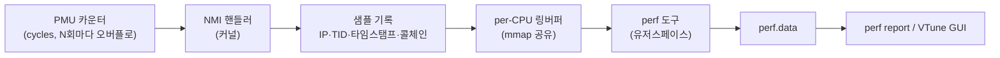

<strong>샘플링 프로파일링(sampling profiling)</strong>이란 실행 중인 프로그램을 주기적으로 중단시켜 "지금 어디를 실행하고 있는가"의 스냅샷(instruction pointer와 콜스택)을 수집하고, 그 표본의 분포로 전체 실행 시간의 분포를 통계적으로 추정하는 기법입니다. [Microbenchmark 설계 원칙](/post/profiling-analysis/microbenchmark-design-principles/)과 [Google Benchmark 실전](/post/profiling-analysis/google-benchmark-practical/)이 "격리한 코드 조각의 비용"을 재는 도구였다면, 샘플링 프로파일러는 반대 방향의 질문 — **실제 프로그램 전체에서 시간이 어디로 사라지는가** — 에 답합니다. µs 단위 최적화에서 이 질문을 건너뛰면, 전체 지연의 2%를 차지하는 함수를 열심히 갈아서 0.5%를 얻는 헛수고를 하게 됩니다. 이 장에서는 Linux `perf`와 Intel VTune Profiler를 소재로 인터럽트 기반 샘플의 생성 경로, 콜스택 언와인딩(call stack unwinding)의 세 가지 방식, 기본 수집·해석 워크플로우, 그리고 샘플링이라는 방법 자체에 내재한 편향과 한계를 다룹니다.

## 이 장을 읽기 전에

**선행 챕터**: [Microbenchmark 설계 원칙](/post/profiling-analysis/microbenchmark-design-principles/)에서 다룬 측정 노이즈 개념과, [Google Benchmark 실전](/post/profiling-analysis/google-benchmark-practical/)의 벤치마크 작성 경험이 있으면 "벤치마크가 답하는 질문"과 "프로파일러가 답하는 질문"의 차이가 선명해집니다. C++ 코드가 어떻게 기계어로 내려가는지 감이 없다면 [Tr.02 C++ 실행 모델·µs 어휘 기초](/post/cpp-optimization/cpp-execution-model-microsecond-vocabulary-fundamentals/)를 먼저 읽는 것을 권합니다.

**전제 지식**: Linux 셸 기본, `g++`/`clang++`로 컴파일 플래그를 지정해 빌드하는 정도면 충분합니다. PMU(Performance Monitoring Unit)나 인터럽트를 몰라도 이 장에서 필요한 만큼 설명합니다.

**이 장의 깊이**: 기초 챕터입니다. 샘플링 프로파일러가 **어떻게 동작하는지**의 원리와 perf·VTune의 **첫 번째 워크플로우**까지를 책임집니다. **다루지 않는 것**: perf의 고급 옵션·`--latency` 프로파일링은 [Linux perf 고급](/post/profiling-analysis/linux-perf-advanced/)에서, VTune의 마이크로아키텍처 분석·XPU Offload Analysis는 [Intel VTune 심화](/post/profiling-analysis/intel-vtune-deep-dive/)에서, 결과를 Flame Graph로 시각화하는 방법은 [Flame Graph 분석](/post/profiling-analysis/flame-graph-analysis/)에서, 샘플링의 재료가 되는 하드웨어 카운터의 의미는 [하드웨어 성능 카운터](/post/profiling-analysis/hardware-performance-counters/)에서 다룹니다.

## 당신의 수준에 맞는 경로

| 수준 | 읽을 부분 | 핵심 목표 |
|------|---------|---------|
| **초보자** | "샘플링 프로파일러의 핵심 원리" ~ "perf record/report 기본 워크플로우" | 샘플이 만들어지는 경로를 이해하고 첫 프로파일을 수집·해석 |
| **중급자** | "콜스택 언와인딩" ~ "Intel VTune 입문" | fp/DWARF/LBR 선택 기준과 perf·VTune 사용 구분 |
| **전문가** | "샘플링 편향과 한계" ~ "비판적 시각" | 샘플링 결과를 믿어도 되는 조건과 믿으면 안 되는 상황 판별 |

---

## 역사: prof에서 perf_events까지

샘플링 프로파일링은 새 기술이 아닙니다. 1970년대 Unix의 `prof`는 타이머 인터럽트마다 프로그램 카운터를 기록해 함수별 시간을 추정했고, 1982년 Susan Graham·Peter Kessler·Marshall McKusick이 발표한 `gprof`는 여기에 호출 그래프(call graph)를 결합해 "누가 이 함수를 불렀는가"까지 보여주는 프로파일러의 원형을 만들었습니다. 다만 `gprof`는 컴파일 시 계측 코드를 삽입하는 방식이라 재빌드가 필요했고 측정 자체가 실행을 왜곡했습니다.

전환점은 2009년입니다. Linux 커널 2.6.31에 Ingo Molnar·Peter Zijlstra·Paul Mackerras 등이 개발한 "Performance Counters for Linux" 서브시스템이 들어갔고, 2.6.32에서 perf events로 개명되면서 오늘날의 `perf` 도구가 됐습니다. 핵심 기여는 아키텍처마다 제각각이던 하드웨어 성능 카운터 접근을 `perf_event_open(2)`라는 단일 시스템 콜 인터페이스로 통일하고, 재빌드 없이 실행 중인 어떤 프로세스든 샘플링할 수 있게 만든 것입니다. 상용 진영에서는 Intel이 오랫동안 VTune을 발전시켜 왔으며(VTune Amplifier라는 이름을 거쳐 2020년부터 VTune Profiler로 개칭), 현재는 무료로 배포되고 oneAPI 툴킷에도 포함됩니다. 이 장 작성 시점 기준 최신 릴리스는 2026.1(2026-05)입니다.

## 샘플링 프로파일러의 핵심 원리

샘플링의 본질은 **통계적 추정**입니다. 초당 수십–수천 번, 실행 중인 프로그램을 아주 짧게 중단시키고 그 순간의 instruction pointer(IP)를 기록합니다. 함수 `f`가 전체 CPU 시간의 40%를 쓴다면, 충분히 많은 샘플을 모았을 때 약 40%의 샘플에서 IP가 `f`의 코드 범위 안에 있을 것입니다. 개별 샘플은 아무것도 증명하지 못하지만, 수천 개의 샘플이 모이면 시간 분포의 꽤 정확한 근사가 됩니다 — 여론조사가 유권자 전수를 조사하지 않고도 판세를 추정하는 것과 같은 원리입니다.

이 접근의 반대편에 **계측(instrumentation)** 방식이 있습니다. 함수 진입·탈출마다 후킹 코드를 실행해 정확한 호출 횟수와 경계 시각을 기록하는 방식으로, 정보는 완전하지만 후킹 비용이 짧은 함수의 실행 시간을 수 배로 부풀리는 관찰자 효과(observer effect)를 피할 수 없습니다. 모든 명령을 가상 CPU에서 재생하는 시뮬레이션 방식([Valgrind·Callgrind](/post/profiling-analysis/valgrind-callgrind-cache-simulation/))은 정보가 가장 풍부한 대신 10–100배 느립니다. 샘플링은 이 스펙트럼에서 "오버헤드를 주파수로 직접 제어할 수 있는" 유일한 지점에 있고, 그래서 프로덕션에 가까운 환경에서 핫패스를 찾는 표준 도구가 됐습니다. 이벤트의 인과 순서까지 필요할 때는 [트레이싱 프로파일링](/post/profiling-analysis/tracing-profiling-perfetto-tracy/)으로 넘어갑니다.

### 인터럽트 기반 샘플의 생성 경로

"주기적으로 중단시킨다"의 실제 메커니즘은 두 갈래입니다. 가장 단순한 것은 OS 타이머로 인터럽트를 거는 **타이머 기반** 샘플링이고, `perf`의 기본 동작은 더 정교한 **이벤트 기반** 샘플링입니다. CPU의 PMU에는 cycles·instructions 같은 이벤트를 세는 하드웨어 카운터가 있는데, 커널이 이 카운터를 "N번 세면 오버플로하도록" 프로그래밍해 두면 N 사이클마다 카운터가 넘치면서 인터럽트(x86에서는 NMI, Non-Maskable Interrupt)가 발생합니다. 인터럽트 핸들러는 그 순간의 IP·PID/TID·타임스탬프·콜체인을 per-CPU 링버퍼에 기록하고, 유저스페이스의 `perf` 도구가 이 버퍼를 `mmap`으로 읽어 `perf.data` 파일에 저장합니다.



주파수 모드(`-F 99` 같은 지정)에서는 커널이 최근 이벤트 발생 속도를 보고 오버플로 주기 N을 동적으로 조정해 초당 샘플 수를 목표값 근처로 유지합니다. 오버헤드는 대략 "샘플당 고정 비용 × 주파수"이므로, 주파수를 낮추면 프로덕션에서도 감당 가능한 수준(1% 미만)으로 떨어집니다 — 이 성질이 [지속적 프로파일링](/post/profiling-analysis/continuous-profiling-production/)을 가능하게 하는 토대입니다. 커널은 샘플링이 CPU 시간을 과도하게 잠식하지 않도록 `kernel.perf_event_max_sample_rate` sysctl로 상한을 강제하며, 초과 시 자동으로 주파수를 낮춥니다(throttling).

### 콜스택 언와인딩: fp·DWARF·LBR

IP만 기록하면 "지금 `memcpy` 안에 있다"까지는 알아도 **누가 `memcpy`를 불렀는지**는 모릅니다. 핫스팟의 대부분은 문맥(호출 경로)이 있어야 고칠 수 있으므로, 샘플마다 콜스택을 함께 캡처해야 하고 이 과정을 언와인딩(unwinding)이라 부릅니다. `perf record --call-graph`가 지원하는 세 방식은 각각 뚜렷한 트레이드오프를 갖습니다.

**프레임 포인터(fp)** 방식은 각 함수가 프롤로그에서 RBP 레지스터에 이전 프레임 주소를 저장해 두는 관례에 의존해, 인터럽트 핸들러가 RBP 체인을 따라가며 반환 주소를 수집합니다. 빠르고 커널 안에서 즉시 완결되지만, 컴파일러가 `-fomit-frame-pointer`(GCC·Clang의 `-O1` 이상 기본값)로 RBP를 범용 레지스터로 전용하면 체인이 끊깁니다. [perf-record man 페이지](https://man7.org/linux/man-pages/man1/perf-record.1.html)도 프레임 포인터 없이 빌드된 바이너리에서 fp 방식을 쓰면 엉터리 콜그래프가 나온다고 경고합니다. 그래서 프로파일링을 진지하게 하는 조직은 `-fno-omit-frame-pointer`를 빌드 표준으로 삼으며, Fedora 38(2023)과 Ubuntu 24.04 LTS는 배포판 패키지 전체를 프레임 포인터 포함으로 빌드하는 쪽으로 전환했습니다.

**DWARF** 방식은 샘플 시점의 스택 메모리 일부(기본 8KB)와 레지스터를 그대로 복사해 두고, 나중에 유저스페이스에서 DWARF CFI(Call Frame Information) 디버그 정보로 스택을 재구성합니다. 프레임 포인터 없이 빌드된 바이너리에서도 정확한 스택을 얻지만, 샘플마다 8KB를 쓰므로 `perf.data`가 급격히 커지고 후처리 시간도 깁니다. **LBR(Last Branch Record)** 방식은 Intel CPU(Haswell 이후)의 분기 기록 하드웨어를 콜스택 캡처에 전용하는 것으로 오버헤드가 가장 낮지만, 하드웨어 엔트리 수(세대에 따라 16–32개)만큼의 깊이 제한이 있고 유저스페이스 체인만 잡힙니다.

| 방식 | 원리 | 장점 | 한계 |
|------|------|------|------|
| `fp` | RBP 체인 추적 | 빠름, 커널 내 완결, 기본값 | `-fomit-frame-pointer` 빌드에서 스택 붕괴 |
| `dwarf` | 스택 스냅샷 + CFI 사후 언와인딩 | 재빌드 불필요, 정확 | 샘플당 ~8KB, 데이터·후처리 비용 큼, 깊은 스택 절단 |
| `lbr` | 하드웨어 분기 기록 | 최저 오버헤드 | Intel 한정, 깊이 제한, 유저 체인만 |

## perf record/report 기본 워크플로우

원리를 확인했으니 실제로 샘플을 수집해 봅니다. `perf`는 커널과 함께 배포되는 도구라서 배포판의 커널 버전에 맞는 패키지를 설치하며, 비루트 사용자의 샘플링 허용 범위는 `kernel.perf_event_paranoid` sysctl이 통제합니다(기본값 2는 유저스페이스 측정만 허용하는 보수적 설정이고, 커널 심볼까지 보려면 1 이하가 필요합니다).

```bash
# Ubuntu/Debian: perf는 linux-tools 패키지로 배포됨
sudo apt install linux-tools-common linux-tools-$(uname -r)

# 커널 측 샘플·심볼 접근 허용 수준 완화 (개발 장비 기준)
sudo sysctl kernel.perf_event_paranoid=1
```

프로파일링 대상으로 아래의 작은 프로그램을 사용합니다. 같은 체크섬을 "비트를 하나씩 순회하는 느린 구현"과 "popcount 내장 함수를 쓰는 빠른 구현"으로 계산하므로, 프로파일에서 두 함수의 비중 차이가 선명하게 드러날 것입니다.

```cpp
// demo.cpp — 샘플링 프로파일링 실습용 (GCC/Clang, x86-64 Linux)
#include <cstdint>
#include <cstdio>
#include <vector>

uint64_t checksum_slow(const std::vector<uint64_t>& v) {
  uint64_t sum = 0;
  for (uint64_t x : v)
    for (int i = 0; i < 64; ++i) sum += (x >> i) & 1u;  // 비트 단위 순회: 의도적 핫스팟
  return sum;
}

uint64_t checksum_fast(const std::vector<uint64_t>& v) {
  uint64_t sum = 0;
  for (uint64_t x : v) sum += static_cast<uint64_t>(__builtin_popcountll(x));
  return sum;
}

int main() {
  std::vector<uint64_t> data(1u << 20);
  for (size_t i = 0; i < data.size(); ++i) data[i] = i * 0x9E3779B97F4A7C15ull;
  uint64_t total = 0;
  for (int iter = 0; iter < 200; ++iter) {
    total += checksum_slow(data);
    total += checksum_fast(data);
  }
  std::printf("%llu\n", static_cast<unsigned long long>(total));
}
```

`__builtin_popcountll`은 GCC·Clang 내장 함수이므로 MSVC에서는 다른 내장이 필요합니다. 빌드할 때 세 가지 플래그가 중요합니다: 실제 배포와 같은 최적화 수준(`-O2`), 심볼 이름을 살리는 디버그 정보(`-g`), 그리고 fp 언와인딩을 위한 `-fno-omit-frame-pointer`입니다. 디버그 빌드(`-O0`)를 프로파일링하면 최적화 빌드에서는 존재하지 않는 병목을 쫓게 되므로 반드시 피합니다.

```bash
g++ -O2 -g -fno-omit-frame-pointer -o demo demo.cpp

# 99Hz로 콜스택(-g, 기본 fp 방식)과 함께 샘플 수집
perf record -F 99 -g ./demo

# 수집 결과를 터미널에 요약
perf report --stdio
```

`-F 99`처럼 딱 떨어지지 않는 주파수를 쓰는 관례는 Brendan Gregg의 [perf 가이드](https://www.brendangregg.com/perf.html)가 설명하듯, 100Hz 같은 값이 시스템의 다른 주기적 활동과 락스텝(lockstep)으로 맞물려 특정 코드만 반복 표집하는 왜곡을 피하기 위한 것입니다. 이벤트를 지정하지 않으면 `perf record`는 cycles 이벤트를 사용하며, 도구 기본 주파수(통상 수천 Hz 수준, 버전·설정에 따라 다름)로 샘플링합니다. `perf report --stdio`의 출력은 대략 다음과 같습니다.

```text
# Samples: 3K of event 'cycles'
# Event count (approx.): 48632117204
#
# Children      Self  Command  Shared Object   Symbol
# ........  ........  .......  ..............  ..............................
    99.02%     0.00%  demo     demo            [.] main
    94.51%    94.48%  demo     demo            [.] checksum_slow
     4.13%     4.11%  demo     demo            [.] checksum_fast
     0.42%     0.42%  demo     libc.so.6       [.] __vfprintf_internal
```

읽는 법의 핵심은 **Self와 Children의 구분**입니다. Self는 "IP가 그 함수 자신의 코드에 있었던 샘플 비율", Children은 "그 함수 또는 그 함수가 부른 모든 함수에 있었던 샘플 비율"입니다. `main`의 Children이 99%인데 Self가 0%라는 것은 시간이 `main` 자신이 아니라 호출한 함수들에서 소비됐다는 뜻이고, 실제 최적화 대상은 Self가 큰 `checksum_slow`입니다. 위 수치는 예시이며 CPU·컴파일러·부하 상태에 따라 달라지지만, "느린 구현이 빠른 구현의 20배 안팎"이라는 구조는 재현됩니다. 여기서 `perf annotate`로 내려가면 함수 내부 명령 단위 분포까지 볼 수 있는데, 어셈블리 대조 방법은 [Tr.03 어셈블리 레벨 코드 생성 분석](/post/compiler-optimization/code-generation-analysis-assembly/)이 다루고, 콜스택 전체를 한눈에 보는 시각화는 [Flame Graph 분석](/post/profiling-analysis/flame-graph-analysis/)으로 이어집니다. 수집한 `perf.data`는 분석용으로만 쓰이는 게 아니라 [AutoFDO](/post/compiler-optimization/autofdo-workflow-sampling-based/)처럼 컴파일러 최적화의 입력으로 재사용할 수도 있습니다.

## Intel VTune 입문

`perf`가 커널에 내장된 범용 인프라라면, [Intel VTune Profiler](https://www.intel.com/content/www/us/en/docs/vtune-profiler/user-guide/2026-1/overview.html)는 그 위(정확히는 자체 드라이버 또는 perf 인프라 위)에 GUI·가이드형 분석·마이크로아키텍처 해석을 얹은 상용 품질의 도구입니다. 현재 무료로 배포되며 standalone 설치와 oneAPI 툴킷 포함 설치를 모두 지원하고, Windows·Linux를 모두 지원합니다. 입문 단계에서 쓰는 분석 타입은 **Hotspots**이며, 여기에 두 가지 수집 모드가 있다는 점이 이 장의 원리와 직결됩니다.

**User-Mode Sampling**은 OS 타이머 기반으로 기본 10ms 간격 샘플링을 하는 모드로, 드라이버나 특별한 권한 없이 어디서든(가상 머신 포함) 동작하는 대신 오버헤드가 상대적으로 큽니다. **Hardware Event-Based Sampling**은 앞에서 본 PMU 오버플로 인터럽트 방식 그대로이며, 훨씬 촘촘한 간격(기본 수 ms 이하)에도 오버헤드가 낮지만 샘플링 드라이버 또는 perf 인프라가 필요합니다. 같은 Hotspots 버튼 뒤에 이 장 전반부에서 배운 두 메커니즘이 나란히 들어 있는 셈입니다.

```bash
# CLI 수집: Hotspots 분석 (결과는 r001 디렉토리에 저장)
vtune -collect hotspots -result-dir r001 -- ./demo

# 터미널 요약 출력; 상세 탐색은 GUI(vtune-gui r001)에서
vtune -report summary -result-dir r001
```

요약 리포트에는 다음과 같은 Top Hotspots 목록이 나옵니다(예시 출력이며 수치는 환경에 따라 다릅니다).

```text
Top Hotspots
Function         Module   CPU Time
---------------  -------  --------
checksum_slow    demo      18.470s
checksum_fast    demo       0.862s
__vfprintf_internal  libc.so.6  0.010s
Effective CPU Utilization: 12.4% (out of logical cores)
```

GUI에서는 같은 데이터를 Bottom-up(피호출자 기준 집계)·Caller/Callee(호출 관계 탐색)·소스/어셈블리 뷰로 오가며 볼 수 있고, 스레드별 타임라인이 함께 표시되어 멀티스레드 프로그램에서 "어느 스레드의 어느 구간"인지 추적하기 좋습니다. 도구 선택의 감각은 이렇습니다: 원격 서버·컨테이너·스크립트 자동화 중심이면 `perf`, 로컬에서 GUI 탐색·스레드 타임라인·마이크로아키텍처 지표 해석까지 원하면 VTune이 편합니다. VTune의 본령인 Microarchitecture Exploration과 XPU Offload Analysis는 [Intel VTune 심화](/post/profiling-analysis/intel-vtune-deep-dive/)에서 다루고, AMD CPU라면 [AMD μProf 활용](/post/profiling-analysis/amd-uprof-profiling/)을, Windows 네이티브 스택은 [Windows ETW 성능 분석](/post/profiling-analysis/windows-etw-performance-analysis/)을 참고하세요.

## 샘플링 편향과 한계

샘플링 결과를 올바르게 읽으려면 이 방법이 **무엇을 못 보는지**를 알아야 합니다. 첫째, **락스텝 편향**: 샘플링 주기가 프로그램이나 시스템의 주기적 활동과 정수비로 맞물리면 특정 코드만 과대·과소 표집됩니다. 99Hz·997Hz 같은 소수(prime)에 가까운 주파수를 쓰는 이유입니다. 둘째, **스키드(skid)**: PMU 오버플로부터 인터럽트 처리까지 수 사이클–수십 사이클의 지연이 있어, 기록된 IP가 실제 이벤트 발생 지점보다 뒤로 밀릴 수 있습니다. 함수 단위 집계에서는 무시할 만하지만 명령 단위로 내려가면 "엉뚱한 명령이 뜨거워 보이는" 현상이 생기며, 이를 보정하는 정밀 샘플링(Intel PEBS, AMD IBS)은 [하드웨어 성능 카운터](/post/profiling-analysis/hardware-performance-counters/)에서 다룹니다.

셋째이자 가장 중요한 것은 **off-CPU 맹점**입니다. cycles 이벤트는 CPU 위에서 도는 동안에만 증가하므로, 락 대기·디스크 I/O·페이지 폴트·스케줄러 대기로 **잠들어 있는 시간은 샘플에 전혀 나타나지 않습니다**. "프로파일은 깨끗한데 지연은 큰" 프로그램의 전형적 원인이며, 이 영역은 [트레이싱 프로파일링](/post/profiling-analysis/tracing-profiling-perfetto-tracy/)과 [Tail Latency 분석](/post/profiling-analysis/tail-latency-analysis/)의 몫입니다. 넷째, **귀속(attribution) 왜곡**: `-O2`에서 인라인된 함수의 샘플은 호출자에게 귀속되고(인라인 판단 기준은 [Tr.02 인라이닝 유도 기법](/post/cpp-optimization/inlining-techniques/) 참조), 디버그 정보가 없는 서드파티 라이브러리는 16진수 주소로만 표시됩니다. 마지막으로 **표본 수 부족**: 수십 ms짜리 실행에서 99Hz로는 샘플이 몇 개 안 나오므로, 실행을 반복시키거나 주파수를 올려 최소 수백–수천 샘플을 확보해야 하며, 몇 % 차이를 논하려면 [통계적 벤치마킹](/post/profiling-analysis/statistical-benchmarking/)의 기준이 필요합니다.

## 흔한 오개념 교정

**오개념 1: "샘플 비율이 높은 함수 = 많이 호출된 함수"**. 샘플 비율은 호출 횟수가 아니라 **그 코드에서 소비된 이벤트(시간)의 비율**입니다. 한 번 호출되어 10초 도는 함수와 백만 번 호출되어 합계 10초인 함수는 같은 비율로 나타납니다. 호출 횟수가 필요하면 계측·트레이싱 도구나 [Valgrind·Callgrind](/post/profiling-analysis/valgrind-callgrind-cache-simulation/)의 정확한 카운트를 써야 합니다.

**오개념 2: "프로파일에 안 보이면 그 코드는 빠르다"**. cycles 샘플링은 on-CPU 시간만 봅니다. 뮤텍스 대기로 요청당 5ms를 날리는 코드는 CPU 프로파일에서 완전히 투명합니다. "빠르다"가 아니라 "CPU를 안 쓴다"로 읽어야 하며, 지연(latency) 관점의 병목은 wall-clock 기준 분석([Linux perf 고급](/post/profiling-analysis/linux-perf-advanced/)의 `perf --latency` 포함)과 트레이싱으로 확인합니다.

**오개념 3: "샘플링은 어차피 부정확하니 정밀한 계측이 항상 낫다"**. 계측은 짧은 함수일수록 후킹 비용이 지배해 측정 대상 자체를 왜곡합니다. 반면 낮은 주파수의 샘플링은 실행을 거의 건드리지 않으면서, 충분한 표본이 모이면 핫스팟 식별 목적에는 통계적으로 충분한 정확도를 냅니다. "부정확"이 아니라 "통계적"이며, 정확도는 표본 수로 통제되는 양입니다.

## 판단 기준: 언제 어떤 도구를 꺼낼 것인가

이 트랙의 도구들은 경쟁 관계가 아니라 질문에 따라 갈라지는 분업 관계입니다. 아래 표를 기본 라우팅으로 삼되, 관례상 순서는 "샘플링으로 넓게 → 후보를 좁혀 벤치마크·트레이싱으로 깊게"입니다.

| 질문 | 도구 | 이 트랙의 챕터 |
|------|------|--------------|
| 전체 프로그램에서 시간이 어디에 쓰이는가 | 샘플링 (perf, VTune) | 이 장 |
| 이 코드 조각 A와 B 중 무엇이 빠른가 | 마이크로벤치마크 | [Google Benchmark 실전](/post/profiling-analysis/google-benchmark-practical/) |
| 이벤트의 순서·구간·인과가 궁금하다 | 트레이싱 | [Perfetto·Tracy](/post/profiling-analysis/tracing-profiling-perfetto-tracy/) |
| 왜 이 코드가 느린가 (캐시·분기 수준) | 하드웨어 카운터·시뮬레이션 | [HW 카운터](/post/profiling-analysis/hardware-performance-counters/) · [Callgrind](/post/profiling-analysis/valgrind-callgrind-cache-simulation/) |
| 느린 요청 일부만 왜 느린가 | 꼬리 지연 분석 | [Tail Latency](/post/profiling-analysis/tail-latency-analysis/) |

수집 전 체크리스트: (1) `-O2 -g -fno-omit-frame-pointer`로 빌드했는가 — 디버그 빌드 프로파일은 무효. (2) 워크로드가 실제 사용 패턴을 대표하는가 — 벤치마크 입력으로 프로파일하면 벤치마크의 핫스팟을 최적화하게 된다. (3) 샘플이 충분한가(최소 수백, 가능하면 수천). (4) Self/Children을 구분해 읽었는가. (5) off-CPU 가능성을 배제했는가 — CPU 사용률이 낮은데 느리다면 이 장의 도구가 아니라 트레이싱 차례.

## 비판적 시각: 한계와 트레이드오프

**프레임 포인터 비용 논쟁**은 아직 끝나지 않았습니다. RBP를 프레임 포인터로 예약하면 범용 레지스터가 하나 줄고 함수마다 프롤로그 명령이 추가되는데, 평균 비용은 현대 x86-64에서 대체로 1% 안팎으로 보고되지만 레지스터 압박이 큰 코드나 짧은 함수가 많은 워크로드에서는 그 이상일 수 있습니다(워크로드·컴파일러에 따라 다름). Fedora·Ubuntu가 "상시 프로파일링 가능성이 그 비용보다 가치 있다"는 쪽에 섰다는 사실이 논쟁의 현재 위치를 보여 주지만, µs를 다투는 코드라면 자기 워크로드에서 직접 측정해 결정할 문제입니다. DWARF 언와인딩은 이 비용을 피하는 대신 샘플당 8KB의 스택 복사와 무거운 후처리를 지불하며, 8KB를 넘는 깊은 스택은 잘립니다.

방법 자체의 한계도 명확합니다. 샘플링은 본질적으로 **평균의 도구**여서, 10,000번 중 1번 발생하는 p99.99 스파이크는 샘플에 거의 잡히지 않습니다 — 꼬리 지연 사냥에는 [Tail Latency 분석](/post/profiling-analysis/tail-latency-analysis/)과 [분산 트레이싱](/post/profiling-analysis/distributed-tracing-microsecond-overhead/) 계열 기법이 필요합니다. 운영 환경에서는 권한 문제도 현실적 제약입니다: `perf_event_paranoid` 기본값과 컨테이너 보안 정책(seccomp, capabilities)이 샘플링을 막는 경우가 많아, 프로덕션 상시 수집은 [지속적 프로파일링](/post/profiling-analysis/continuous-profiling-production/)에서 다루는 별도의 운영 설계가 필요합니다. 도구 관점에서는 VTune의 해석 모델이 Intel 마이크로아키텍처 중심이라는 점(AMD·ARM에서는 기능 제약)과, `perf`의 출력 해석이 초심자에게 불친절하다는 점을 알고 시작하는 편이 좋습니다 — 후자는 [프로파일러 출력 해석 실전](/post/profiling-analysis/profiler-output-interpretation-practice/)에서 패턴으로 정리합니다.

## 마무리

이 장의 목표 달성 여부를 다음 기준으로 확인하세요.

- [ ] PMU 카운터 오버플로 → NMI → 링버퍼 → `perf.data`로 이어지는 샘플 생성 경로를 그릴 수 있다.
- [ ] fp·DWARF·LBR 언와인딩의 트레이드오프를 설명하고 자기 빌드에 맞는 방식을 고를 수 있다.
- [ ] `-O2 -g -fno-omit-frame-pointer` 빌드에 `perf record -F 99 -g`·`perf report`를 실행하고 Self/Children을 구분해 읽을 수 있다.
- [ ] VTune Hotspots의 두 수집 모드(User-Mode Sampling vs Hardware Event-Based Sampling) 차이를 설명할 수 있다.
- [ ] off-CPU 맹점·락스텝 편향·표본 수 부족 중 최소 두 가지를 실제 상황 예로 설명할 수 있다.

**이전 장**: [Google Benchmark 실전](/post/profiling-analysis/google-benchmark-practical/)

**다음 장에서는** 샘플링이 보지 못하는 세계 — 이벤트의 순서, 구간의 길이, 스레드 간 인과 — 를 기록하는 트레이싱 프로파일링을 다룹니다. Perfetto와 Tracy로 "언제 무엇이 얼마나 걸렸는지"의 타임라인을 얻는 방법과, 샘플링·트레이싱을 조합하는 기준을 정리합니다.

→ [트레이싱 프로파일링: Perfetto·Tracy](/post/profiling-analysis/tracing-profiling-perfetto-tracy/)
