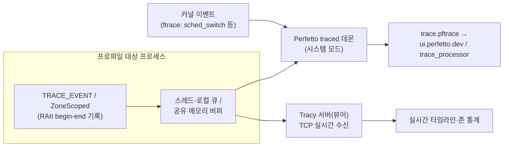

**트레이싱 프로파일링(tracing profiling)은 코드에 심어 둔 계측(instrumentation) 지점이 발생시키는 모든 이벤트를 타임스탬프와 함께 기록해, "무슨 일이 언제, 정확히 얼마나 걸렸는가"를 타임라인으로 재구성하는 기법입니다.** [이전 장](/post/profiling-analysis/sampling-profiling-perf-vtune/)에서 다룬 샘플링이 "시간이 통계적으로 어디에 쓰였는가"라는 분포를 주는 반면, 트레이싱은 개별 실행 하나하나의 시작·끝 시각을 남깁니다. µs 단위 지연을 다루는 엔지니어에게 이 차이는 결정적입니다. 1만 번 중 3번만 400µs로 튀는 요청은 99Hz 샘플링 프로파일에서는 사실상 보이지 않지만, 트레이스에는 그 3번이 각각 언제 시작해 어떤 구간에서 시간이 새어 나갔는지가 그대로 찍혀 있기 때문입니다. 이 장에서는 계측 트레이싱의 내부 동작과 오버헤드 구조를 먼저 이해한 뒤, 시스템 전역 타임라인을 주는 **Perfetto**와 실시간 프레임 프로파일러 **Tracy**를 실습하고, 샘플링과 트레이싱을 언제 어떻게 조합할지 판단 기준을 세웁니다.

## 이 장을 읽기 전에

**선행 챕터**: [샘플링 프로파일링: perf·VTune 원리](/post/profiling-analysis/sampling-profiling-perf-vtune/)를 먼저 읽는 것을 권장합니다. 이 장은 샘플링의 통계적 성격(주기적 인터럽트, 확률적 귀속)을 이해했다는 전제 위에서 트레이싱과의 차이를 논합니다. 트랙 전체 지도는 [트랙 인트로](/post/profiling-analysis/getting-started-profiling-performance-analysis-fundamentals/)를 참고하세요.

**전제 지식**: C++ RAII(스코프 종료 시 소멸자 호출), 스레드와 컨텍스트 스위치의 개념, "핫패스"가 무엇인지 정도면 충분합니다. 커널 트레이스 소스(ftrace)의 세부는 몰라도 됩니다.

**이 장의 깊이**: 중급. 두 도구의 기본 사용법을 넘어서 이벤트 기록 경로의 내부 구조(스레드-로컬 큐, 타임스탬프 소스, 직렬화)와 관찰자 효과(observer effect)까지 다룹니다. **다루지 않는 것**: 타임라인·집계 결과를 병목 후보로 해석하는 패턴은 [Flame Graph 분석](/post/profiling-analysis/flame-graph-analysis/)과 [프로파일러 출력 해석 실전](/post/profiling-analysis/profiler-output-interpretation-practice/)에, ftrace·perf 이벤트 소스의 세부는 [Linux perf 고급](/post/profiling-analysis/linux-perf-advanced/)에, 커널 동적 계측은 [BPF 기반 동적 프로파일링](/post/profiling-analysis/bpf-based-profiling-bpftrace-bcc/)에, 서비스 경계를 넘는 스팬 전파는 [분산 트레이싱 오버헤드와 µs 탐지](/post/profiling-analysis/distributed-tracing-microsecond-overhead/)에 위임합니다.

## 당신의 수준에 맞는 경로

| 수준 | 읽을 부분 | 핵심 목표 |
|------|---------|---------|
| **초보자** | "계측 트레이싱의 동작 원리" ~ "Perfetto: 시스템 전역 타임라인" | 스팬(span) 모델과 오버헤드가 어디서 생기는지 이해 |
| **중급자** | "Perfetto" ~ "Tracy" 실습 전체 | 두 도구로 자기 코드의 타임라인을 기록하고 읽기 |
| **전문가** | "계측 오버헤드를 직접 측정하기" ~ "비판적 시각" | µs 스케일 관찰자 효과 정량화, 프로덕션 상시 계측 판단 |

## 역사: systrace에서 Perfetto·Tracy까지

계측 트레이싱의 계보는 커널과 브라우저, 게임이라는 세 갈래에서 발전해 왔습니다. 커널 쪽에서는 Steven Rostedt가 만든 **ftrace**가 2008년 Linux 2.6.27에 병합되면서 스케줄러 이벤트(`sched_switch` 등)를 저비용으로 기록하는 기반이 되었고, 사용자 공간 쪽에서는 Chrome이 2010년대 초 `about:tracing`(trace_event 매크로)으로, Android가 2012년 Jelly Bean의 **systrace**로 "프로세스·스레드별 타임라인을 눈으로 본다"는 워크플로우를 대중화했습니다. Google은 이 두 흐름을 통합·재설계해 2017년 **Perfetto**를 오픈소스로 공개했고, Android 9(2018)부터 플랫폼 표준 트레이싱 인프라로 채택해 systrace와 chrome://tracing의 백엔드를 대체해 왔습니다.

게임 업계 갈래에서는 Bartosz Taudul이 2017년 **Tracy**를 공개했습니다. 게임은 16.6ms(60fps) 프레임 예산 안에서 수백 개 시스템이 도는 구조라, "프레임 단위로 존(zone)을 실시간 스트리밍해 보여주는" 프로파일러 수요가 강했습니다. Tracy는 나노초 해상도 타임스탬프와 원격 실시간 뷰어라는 조합으로 이 니치를 채웠고, 게임을 넘어 저지연 시스템 전반으로 사용층이 넓어졌습니다. 2025년의 0.12 릴리스는 샘플링·계측 데이터의 Flame Graph 집계와 CPU 다이(die) 토폴로지 시각화를 추가했으며, 이 글 작성 시점(2026-07) 기준 최신 안정 릴리스는 v0.13.1입니다(2026년 상반기 릴리스, [GitHub 저장소](https://github.com/wolfpld/tracy) 기준).

## 계측 트레이싱의 동작 원리

계측 트레이싱의 데이터 모델은 **스팬(span)** 혹은 <strong>존(zone)</strong>입니다. 코드의 한 구간에 매크로를 심으면, 진입 시각과 이탈 시각이 짝을 이룬 이벤트가 기록되고, 같은 스레드에서 중첩된 스팬들은 스택 구조를 이룹니다. C++에서는 RAII가 이 짝맞춤을 자연스럽게 처리합니다. 매크로가 스코프 진입 시 begin 이벤트를 쓰는 객체를 만들고, 스코프를 벗어날 때 소멸자가 end 이벤트를 쓰는 방식입니다. Perfetto의 `TRACE_EVENT`와 Tracy의 `ZoneScoped`가 모두 이 패턴입니다.

이벤트 하나를 기록하는 비용은 대략 세 부분으로 나뉩니다. 첫째, **타임스탬프 읽기**. x86-64에서는 `rdtsc` 계열 명령(수십 사이클 수준, 마이크로아키텍처에 따라 다름) 또는 `clock_gettime(CLOCK_MONOTONIC)`(vDSO 경유)을 사용합니다. 둘째, **이벤트 직렬화와 버퍼 쓰기**. 잘 만든 트레이서는 전역 락을 잡지 않고 스레드-로컬 버퍼나 공유 메모리 링 버퍼에 쓰며, 문자열은 매번 복사하지 않고 인터닝(interning)합니다. Perfetto SDK는 protobuf 기반 바이너리 포맷을 공유 메모리 버퍼에 직접 쓰고, Tracy는 스레드별 락프리 큐에 넣은 뒤 별도 스레드가 TCP로 뷰어에 스트리밍합니다. 셋째, **후처리·전송**. 이 부분은 핫패스 밖의 백그라운드 스레드나 별도 프로세스가 담당하므로, 핫패스가 지불하는 비용은 첫 두 항목입니다.

여기서 샘플링과의 근본적 비용 구조 차이가 나옵니다. 샘플링의 오버헤드는 **시간에 비례**하고(초당 샘플 수 × 샘플당 비용) 이벤트 빈도와 무관한 반면, 계측 트레이싱의 오버헤드는 **이벤트 발생 횟수에 비례**합니다. 초당 수백만 번 불리는 함수에 존을 붙이면 프로그램이 눈에 띄게 느려지지만, 초당 수천 번 수준의 요청 처리 경계에 붙인 존은 사실상 공짜에 가깝습니다. 따라서 계측 지점의 단위는 "요청·프레임·스테이지" 같은 의미 있는 작업 경계로 잡고, 루프 안쪽의 미세 구간은 샘플링(또는 [하드웨어 성능 카운터](/post/profiling-analysis/hardware-performance-counters/))에 맡기는 것이 기본 전략입니다.



두 도구의 아키텍처 차이가 곧 용도 차이입니다. Perfetto는 커널 이벤트와 앱 이벤트를 **하나의 타임라인에 융합**해 파일로 남기는 시스템 트레이서이고, Tracy는 앱(과 GPU) 이벤트를 **실시간으로 뷰어에 스트리밍**하는 개발 루프용 프로파일러입니다.

## Perfetto: 시스템 전역 타임라인

Perfetto의 가치는 "내 코드의 스팬"과 "OS가 그 시간에 실제로 한 일"을 같은 축 위에 놓는 데 있습니다. 처리 함수가 300µs 걸렸다는 사실만으로는 원인을 못 가립니다. 같은 타임라인에 `sched_switch` 이벤트가 겹쳐 있으면, 그 300µs 중 220µs가 다른 프로세스에 CPU를 뺏긴 시간(off-CPU)이었는지, 순수 연산이었는지 즉시 구분됩니다.

동작 모드는 두 가지입니다. **in-process 모드**는 트레이싱 서비스까지 앱 프로세스 안에서 돌리는 방식으로, 데몬 없이 Linux·Windows·macOS·Android에서 특권 없이 동작하지만 앱 이벤트만 기록됩니다. **시스템 모드**는 외부 `traced` 데몬에 UNIX 소켓 IPC로 연결해, `traced_probes`가 수집하는 ftrace 커널 이벤트와 앱 이벤트를 융합한 트레이스를 만듭니다([Tracing SDK 공식 문서](https://perfetto.dev/docs/instrumentation/tracing-sdk) 기준). µs 지연 분석이 목적이라면 스케줄링 이벤트가 함께 보이는 시스템 모드가 본명입니다.

계측은 SDK의 `TRACE_EVENT` 매크로로 합니다. 카테고리를 컴파일 타임에 정의해 두면, 비활성 카테고리의 매크로는 원자적 플래그 검사 한 번으로 끝나 오버헤드가 최소화됩니다. 아래는 단일 소스 파일로 구성한 최소 예제입니다(공식 릴리스의 amalgamated `perfetto.h`/`perfetto.cc`를 같은 디렉토리에 두고 빌드).

```cpp
// perfetto_demo.cc — in-process 모드 최소 골격
#include "perfetto.h"

PERFETTO_DEFINE_CATEGORIES(
    perfetto::Category("order").SetDescription("주문 처리 핫패스"));
PERFETTO_TRACK_EVENT_STATIC_STORAGE();

void ProcessOrder(int id) {
  TRACE_EVENT("order", "ProcessOrder", "order_id", id);  // RAII 스팬
  // ... 파싱 → 검증 → 매칭 로직 ...
}

int main() {
  perfetto::TracingInitArgs args;
  args.backends = perfetto::kInProcessBackend;  // 데몬 없이 자체 기록
  perfetto::Tracing::Initialize(args);
  perfetto::TrackEvent::Register();
  // 세션 구성(TraceConfig)·시작·파일 저장은 SDK examples/ 참조
  for (int i = 0; i < 1000; ++i) ProcessOrder(i);
}
```

`TRACE_EVENT`는 스코프 종료 시 자동으로 end 이벤트를 기록하며, 인자로 넘긴 `"order_id", id`는 디버그 어노테이션으로 트레이스에 함께 저장됩니다([Track events 공식 문서](https://perfetto.dev/docs/instrumentation/track-events)). 주의할 점은 이벤트 이름에 동적 문자열을 쓰려면 `perfetto::DynamicString`으로 명시해야 한다는 것입니다. 기본이 컴파일 타임 상수 가정이어서, 무심코 `std::string().c_str()`을 넘기는 실수를 타입 수준에서 막아 줍니다.

시스템 모드 캡처는 단일 바이너리 `tracebox`로 간단히 시작할 수 있습니다. 다음은 Linux에서 스케줄러 이벤트를 함께 10초간 기록하는 예입니다.

```bash
# Perfetto 릴리스에서 tracebox 다운로드 후 (Linux x86-64)
./tracebox -o trace.pftrace -t 10s sched/sched_switch sched/sched_wakeup
# 결과 파일을 https://ui.perfetto.dev 에 드래그해 타임라인 탐색
```

기록된 트레이스는 UI로 눈으로 훑는 것 외에, `trace_processor`로 SQL 질의를 걸어 집계할 수 있습니다. 예를 들어 스팬 이름별 건수·평균·최대 지속시간을 뽑으면 다음과 같은 형태의 결과를 얻습니다.

```text
name              cnt      avg_dur_us   max_dur_us
ProcessOrder      12042        18.4         412.7
ParseRequest      12042         3.1          22.9
ValidateOrder     12042         2.7         301.5
```

이 출력에서 읽어야 할 것은 평균이 아니라 **평균과 최대의 간극**입니다. `ValidateOrder`는 평균 2.7µs로 무해해 보이지만 최대 301.5µs로 100배 넘게 튑니다. 트레이스이므로 그 최대치가 발생한 정확한 시각으로 점프해, 같은 순간의 `sched_switch`·다른 스레드 활동과 대조할 수 있습니다. 이런 꼬리 사건의 통계적 해석은 [Tail Latency 분석](/post/profiling-analysis/tail-latency-analysis/)에서 이어집니다.

## Tracy: 실시간 프레임 프로파일러

Tracy는 "빌드 → 실행 → 뷰어로 바로 관찰"이라는 짧은 피드백 루프에 최적화된 도구입니다. 계측된 앱이 TCP로 뷰어(서버)에 이벤트를 실시간 스트리밍하므로, 트레이스 파일을 만들고 열어 보는 왕복 없이 코드를 고치면서 존 통계가 변하는 것을 즉시 확인할 수 있습니다. 공식 README는 "실시간, 나노초 해상도의 원격 텔레메트리 하이브리드 프레임·샘플링 프로파일러"로 소개하며, C/C++/Lua/Python/Fortran 직접 지원과 OpenGL·Vulkan·Direct3D 11/12·Metal·OpenCL·CUDA·WebGPU 등 주요 GPU API의 존 계측을 제공합니다.

계측 어휘는 세 가지가 핵심입니다. `ZoneScoped`(현재 스코프를 존으로 기록, 함수명 자동 캡처), `ZoneScopedN("이름")`(이름 지정), `FrameMark`(프레임 경계 표시)입니다. 프레임 개념은 게임 렌더 루프만이 아니라 "이벤트 루프 1회전", "배치 1건 처리" 같은 반복 단위에도 그대로 적용되어, 저지연 서버의 이벤트 루프 지터(jitter)를 프레임 히스토그램으로 보는 용도로 유용합니다.

```cpp
// tracy_demo.cpp — 존·프레임 계측 최소 예제 (C++17)
#include <tracy/Tracy.hpp>
#include <numeric>
#include <vector>

double Accumulate(const std::vector<double>& v) {
  ZoneScoped;  // 이 함수 전체를 존으로 기록
  return std::accumulate(v.begin(), v.end(), 0.0);
}

int main() {
  std::vector<double> data(1 << 20, 1.0);
  double sink = 0;
  for (int frame = 0; frame < 600; ++frame) {
    ZoneScopedN("LoopIteration");
    sink += Accumulate(data);
    FrameMark;  // 반복(프레임) 경계 — 뷰어의 프레임 히스토그램 축
  }
  return sink > 0 ? 0 : 1;
}
```

빌드 시 주의점이 둘 있습니다. 계측은 `TRACY_ENABLE` 매크로가 정의된 빌드에서만 활성화되며(미정의 시 매크로가 전부 no-op으로 사라짐), 클라이언트 소스 `TracyClient.cpp`를 함께 링크해야 합니다.

```bash
# Tracy 저장소의 public/ 디렉토리를 include 경로에 추가 (Linux, GCC 13 기준)
g++ -O2 -std=c++17 -DTRACY_ENABLE \
    -Itracy/public tracy_demo.cpp tracy/public/TracyClient.cpp \
    -o tracy_demo -lpthread -ldl
./tracy_demo &          # 앱 실행 (기본 포트 8086에서 뷰어 접속 대기)
# 별도 창에서 tracy-profiler 실행 → Connect → 실시간 타임라인 관찰
```

기본 설정에서 Tracy 클라이언트는 시작부터 이벤트를 메모리에 쌓으며 뷰어 접속을 기다립니다. 장시간 도는 서버라면 `TRACY_ON_DEMAND`를 함께 정의해 뷰어가 붙어 있는 동안만 기록하도록 해야 메모리 누적을 피할 수 있습니다. 프로덕션 유사 환경에서는 계측 포트(기본 8086)가 인증 없는 평문 TCP라는 점도 잊지 말아야 합니다. 방화벽 안쪽 개발망에서만 여는 것이 안전합니다.

Tracy가 "하이브리드" 프로파일러인 이유는 계측 존 위에 콜스택 샘플링을 겹쳐 주기 때문입니다. 지원 플랫폼에서 관리자 권한으로 실행하면 존 내부에서 실제로 어떤 함수들이 시간을 썼는지 샘플링 통계로 보여주고, 컨텍스트 스위치와 스레드 wakeup 사유까지 타임라인에 얹어 줍니다. 존 경계는 계측으로 정확하게, 존 내부는 샘플링으로 무계측 조망 — 이 장 주제인 "상호보완"이 도구 하나 안에 구현된 셈입니다.

## 계측 오버헤드를 직접 측정하기

계측을 얼마나 촘촘히 심을지 결정하려면 자기 플랫폼에서 존 하나의 비용을 실측해야 합니다. 문서나 커뮤니티에 도는 "존당 수십 ns" 류의 수치는 CPU 세대·타임스탬프 소스·버퍼 상태에 따라 달라지므로 참고치일 뿐입니다. 아래는 [Google Benchmark 실전](/post/profiling-analysis/google-benchmark-practical/)에서 다룬 방법으로 Tracy 존 비용을 격리 측정하는 스켈레톤입니다.

```cpp
// zone_overhead_bench.cpp — 존 기록 비용 격리 측정
// 빌드: g++ -O2 -std=c++17 -DTRACY_ENABLE -Itracy/public \
//        zone_overhead_bench.cpp tracy/public/TracyClient.cpp \
//        -lbenchmark -lpthread -ldl
// 환경 예: Linux x86-64, GCC 13, -O2 (수치는 플랫폼·플래그에 따라 다름)
#include <benchmark/benchmark.h>
#include <tracy/Tracy.hpp>

static void BM_Baseline(benchmark::State& state) {
  for (auto _ : state) {
    benchmark::DoNotOptimize(&state);
  }
}
BENCHMARK(BM_Baseline);

static void BM_ZoneCost(benchmark::State& state) {
  for (auto _ : state) {
    ZoneScopedN("ZoneCost");
    benchmark::DoNotOptimize(&state);
  }
}
BENCHMARK(BM_ZoneCost);

BENCHMARK_MAIN();
```

`BM_ZoneCost - BM_Baseline` 차이가 존 하나의 순수 기록 비용 근사치입니다. 같은 골격에서 `ZoneScopedN`을 Perfetto `TRACE_EVENT`로 바꾸면(카테고리 활성/비활성 두 상태 모두) 도구 간·상태 간 비교표를 만들 수 있습니다. 두 가지를 조심하세요. 첫째, 뷰어 미접속·버퍼 포화 등 백그라운드 상태에 따라 수치가 달라지므로 측정 조건을 함께 기록해야 합니다. 둘째, 이 수치는 "직렬 반복" 비용이며, 실제 멀티스레드 환경에서는 버퍼 경합·캐시 효과가 더해질 수 있습니다.

측정한 존 비용을 계측 대상 구간의 길이와 비교하는 것이 판단의 핵심입니다. 존 비용이 c ns이고 구간이 t ns라면 왜곡률은 대략 c/t입니다. c가 50ns일 때 200ns짜리 함수에 존을 붙이면 25%가 계측 비용이라 측정치 자체가 오염되지만, 50µs짜리 요청 처리 경계라면 0.1% 미만으로 무시할 만합니다. µs 이하 구간의 정밀 측정은 계측 트레이싱이 아니라 [마이크로벤치마크](/post/profiling-analysis/microbenchmark-design-principles/)와 하드웨어 카운터의 영역입니다.

## 흔한 오개념 교정

**오개념 1: "계측 트레이싱은 오버헤드가 커서 샘플링보다 항상 나쁘다."** 오버헤드의 절대량이 아니라 **비례 대상**이 다를 뿐입니다. 트레이싱 비용은 이벤트 횟수에 비례하므로, 초당 수천 건 수준의 작업 경계 계측은 전체 실행 시간의 0.01% 수준에 머물 수 있습니다. 반대로 샘플링은 아무리 빈도를 올려도 발생 확률이 낮은 짧은 사건을 놓칩니다. "드물지만 치명적인 지연"이 문제라면 모든 발생을 기록하는 트레이싱이 유일한 답이고, "전체 시간 분포"가 궁금하면 샘플링이 쌉니다.

**오개념 2: "트레이스에 찍힌 시간이 계측 전의 실제 시간이다."** 계측은 관찰 대상을 바꿉니다(관찰자 효과). 존의 begin/end 기록 자체가 시간을 소비할 뿐 아니라, 매크로가 삽입한 코드가 인라이닝·레지스터 할당 같은 컴파일러 최적화를 바꿔 함수의 코드 생성 자체가 달라질 수 있습니다. 짧은 구간일수록 왜곡률이 커지므로, µs 미만 구간의 트레이스 수치는 "상대 비교·발생 시점 확인"용으로만 쓰고 절대값은 무계측 벤치마크로 재검증해야 합니다.

**오개념 3: "Perfetto와 Tracy는 경쟁 도구라 하나만 고르면 된다."** 두 도구는 답하는 질문이 다릅니다. Perfetto는 "OS 전체 맥락에서 내 스팬에 무슨 일이 있었나"(스케줄링, 다른 프로세스와의 간섭)를 사후 분석하는 시스템 트레이서이고, Tracy는 "내 코드의 존·프레임이 지금 어떻게 변하고 있나"를 실시간으로 보는 개발 루프 도구입니다. 개발 중 반복 튜닝은 Tracy로, 스테이징·프로덕션 유사 환경의 간섭 분석은 Perfetto로 쓰는 조합이 실무 표준에 가깝습니다.

## 판단 기준: 샘플링·Perfetto·Tracy 선택

계측 트레이싱을 도입할지, 어느 도구로 할지는 아래 기준으로 정리할 수 있습니다.

| 상황·질문 | 권장 도구 | 이유 |
|------|------|------|
| "전체적으로 어디가 느린지 모른다" (첫 탐색) | 샘플링([이전 장](/post/profiling-analysis/sampling-profiling-perf-vtune/)) | 무계측·코드 수정 불필요, 전체 분포 조망 |
| "특정 요청만 가끔 느리다" (꼬리 사건) | 트레이싱 (Perfetto/Tracy) | 모든 발생을 기록, 느린 개별 사례로 점프 가능 |
| "느린 구간이 on-CPU인지 off-CPU(스케줄링·블로킹)인지" | Perfetto 시스템 모드 | ftrace 스케줄러 이벤트와 앱 스팬 융합 |
| "코드 수정→재실행→확인 루프를 빠르게 돌리고 싶다" | Tracy | 실시간 스트리밍, 프레임·존 통계 즉시 갱신 |
| "반복 단위(프레임·루프)의 지터를 보고 싶다" | Tracy (`FrameMark`) | 프레임 히스토그램·이상 프레임 탐색 UI |
| "트레이스를 SQL로 집계·자동화하고 싶다" | Perfetto (`trace_processor`) | 질의 기반 후처리, CI 연계 용이 |
| 초당 수십만 회 이상 불리는 미세 구간 | 계측 금지 → 샘플링·카운터 | 이벤트 비례 오버헤드로 측정 오염 |
| 서비스 경계를 넘는 요청 추적 | 분산 트레이싱([17장](/post/profiling-analysis/distributed-tracing-microsecond-overhead/)) | 프로세스 로컬 도구의 범위 밖 |

계측 지점 설계의 체크리스트는 간단합니다. (1) 존은 의미 있는 작업 경계(요청·스테이지·프레임)에만 둔다. (2) 존 비용 대비 구간 길이 비율(c/t)이 1%를 넘는 지점은 재고한다. (3) 릴리스 빌드에서 계측을 켤지( `TRACY_ENABLE`, Perfetto 카테고리 정책) 명시적으로 결정하고 빌드 옵션으로 문서화한다. (4) 상시 계측을 남길 거라면 [지속적 프로파일링](/post/profiling-analysis/continuous-profiling-production/)의 수집·보존 전략과 함께 설계한다.

## 비판적 시각: 계측 트레이싱의 한계

계측 트레이싱의 가장 큰 비용은 런타임 오버헤드가 아니라 **유지보수**입니다. 계측 지점은 코드와 함께 진화해야 하는 자산이라, 리팩토링에서 존이 누락·오배치되면 트레이스가 조용히 거짓말을 시작합니다. 샘플링은 코드가 어떻게 바뀌든 심볼만 있으면 동작하지만, 계측은 "무엇을 기록할지"를 사람이 계속 결정해야 합니다. 팀 차원의 계측 규약이 없으면 존 이름이 중구난방이 되어 집계가 불가능해지는데, 이 표준화 문제는 [프로파일링 워크플로우 가이드](/post/profiling-analysis/profiling-workflow-team-guide/)에서 다룹니다.

데이터량도 실질적 제약입니다. 시스템 모드 Perfetto로 스케줄러 이벤트까지 켜면 분당 수백 MB의 트레이스가 쌓일 수 있어, 링 버퍼 크기·기록 시간·이벤트 선별을 설계하지 않으면 "정작 문제 순간이 버퍼에서 밀려난" 트레이스를 얻게 됩니다. 타임스탬프 신뢰성 문제도 있습니다. 스레드 간·CPU 코어 간 TSC 동기화, GPU와 CPU의 클럭 도메인 차이 때문에 µs 이하 스케일에서 서로 다른 트랙의 이벤트 순서를 비교할 때는 오차 범위를 염두에 둬야 하며, 이는 도구가 아니라 하드웨어의 한계입니다.

마지막으로, 두 도구 모두 "타임라인을 보여줄" 뿐 "병목을 지목해 주지" 않습니다. 수만 개 스팬이 깔린 타임라인에서 의미 있는 패턴을 찾는 것은 여전히 해석 기술의 문제이고, 시각적 요약 없이 원시 타임라인만 응시하는 것은 비효율적입니다. 집계 시각화가 필요한 이유이며, 그것이 바로 다음 장의 주제입니다.

## 마무리

이 장을 마쳤다면 다음을 스스로 확인해 보세요.

- [ ] 샘플링과 계측 트레이싱의 오버헤드가 각각 무엇에 비례하는지 설명하고, 주어진 문제(전체 분포 vs 드문 꼬리 사건)에 맞는 쪽을 고를 수 있다.
- [ ] 스팬/존 모델과 RAII 계측 매크로의 동작(타임스탬프 → 스레드-로컬 버퍼 → 후처리)을 그림으로 그릴 수 있다.
- [ ] Perfetto의 in-process 모드와 시스템 모드의 차이를 알고, off-CPU 원인 분석에 왜 시스템 모드가 필요한지 설명할 수 있다.
- [ ] Tracy로 존·프레임을 계측해 실시간 뷰어에서 관찰하고, `TRACY_ON_DEMAND`·계측 포트 노출 같은 운영상 주의점을 말할 수 있다.
- [ ] 존 비용을 벤치마크로 실측해 c/t 비율로 계측 지점의 적절성을 판단할 수 있다.

**다음 장에서는** 샘플링·트레이싱이 쏟아내는 방대한 데이터를 한 장의 그림으로 압축하는 [Flame Graph 분석](/post/profiling-analysis/flame-graph-analysis/)을 다룹니다. Tracy 0.12부터 내장된 Flame Graph 뷰와 Perfetto의 집계 화면을 읽는 눈은 결국 같은 원리 위에 있으므로, 이 장에서 기록한 트레이스를 그대로 다음 장의 해석 재료로 쓸 수 있습니다.

**참고 자료**

- [Perfetto Tracing SDK 공식 문서](https://perfetto.dev/docs/instrumentation/tracing-sdk) — in-process/시스템 모드, traced 데몬 아키텍처
- [Perfetto Track Events 공식 문서](https://perfetto.dev/docs/instrumentation/track-events) — TRACE_EVENT 매크로, 카테고리 정의, DynamicString 규약
- [Tracy GitHub 저장소](https://github.com/wolfpld/tracy) — 소스·릴리스·사용자 매뉴얼(PDF)
