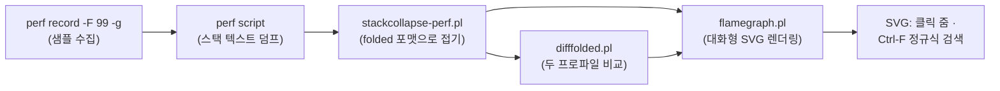

**Flame Graph 분석**이란 프로파일러가 수집한 수만~수백만 개의 콜스택 샘플을 하나의 계층형 시각화로 병합해, "CPU 시간(또는 대기 시간)이 어떤 코드 경로에 쓰였는가"를 한눈에 파악하는 기법입니다. [샘플링 프로파일링](/post/profiling-analysis/sampling-profiling-perf-vtune/)이 만들어내는 원시 출력은 본질적으로 텍스트의 벽입니다 — `perf report`의 수백 줄짜리 트리를 스크롤하며 병목을 찾는 일은 느리고, 계층 구조 속에서 "어느 경로가 전체의 몇 %인지"를 머릿속으로 합산해야 합니다. Flame Graph는 이 합산을 시각화가 대신 수행합니다. 프레임의 **폭이 곧 비중**이고, 동일한 스택 경로는 하나의 사각형으로 **병합**되므로, µs 단위 지연을 쫓는 엔지니어가 "가장 넓은 고원(plateau)을 찾는다"는 단 하나의 규칙으로 병목 후보를 수 초 안에 좁힐 수 있습니다.

## 이 장을 읽기 전에

**선행 챕터**: [샘플링 프로파일링: perf·VTune 원리](/post/profiling-analysis/sampling-profiling-perf-vtune/)에서 다룬 "주기적 인터럽트로 콜스택을 수집한다"는 샘플링 모델과, [트레이싱 프로파일링: Perfetto·Tracy](/post/profiling-analysis/tracing-profiling-perfetto-tracy/)의 "모든 이벤트를 시간순으로 기록한다"는 트레이싱 모델의 차이를 전제로 합니다. `perf record -g`로 콜스택 포함 샘플을 수집할 수 있으면 충분합니다.

**이 장의 깊이**: 중급. Flame Graph를 "읽는 법"(폭·병합·색의 의미)부터 시작해, on-CPU/off-CPU/differential 세 변형의 생성·해석과 병목 추적 실전 워크플로우까지 다룹니다. **다루지 않는 것**: `perf`의 이벤트 선택·`--call-graph` 모드별 심화는 [Linux perf 고급](/post/profiling-analysis/linux-perf-advanced/), off-CPU 스택을 수집하는 BPF 도구의 내부는 [BPF 기반 동적 프로파일링](/post/profiling-analysis/bpf-based-profiling-bpftrace-bcc/), 프로파일러 리포트를 병목 가설로 연결하는 일반 해석 패턴은 [프로파일러 출력 해석 실전](/post/profiling-analysis/profiler-output-interpretation-practice/), 프로덕션 상시 수집은 [지속적 프로파일링](/post/profiling-analysis/continuous-profiling-production/)에 위임합니다.

## 당신의 수준에 맞는 경로

| 수준 | 읽을 부분 | 핵심 목표 |
|------|---------|---------|
| **초보자** | "탄생 배경" ~ "읽는 법: 폭·병합·색" | x축=시간이 아님을 이해하고 넓은 고원을 찾을 수 있다 |
| **중급자** | "도구 체인" ~ "off-CPU Flame Graph" | perf → folded → SVG 파이프라인을 직접 돌리고 대기 시간까지 본다 |
| **전문가** | "differential Flame Graph" ~ "비판적 시각" | 변경 전후 비교와 깨진 스택 진단까지 수행한다 |

---

## 탄생 배경: 2011년, 텍스트의 벽 앞에서

Flame Graph는 2011년 12월 Brendan Gregg가 Joyent에서 MySQL 성능 문제를 조사하다 만들었습니다. 당시 프로파일러 출력은 콜스택 텍스트 덤프의 나열이었고, 어떤 경로가 지배적인지 파악하려면 수천 줄을 눈으로 합산해야 했습니다. Gregg는 Neelakanth Nadgir·Roch Bourbonnais·Jan Boerhout의 시간순 스택 시각화 시도에서 출발했지만, 시간축을 유지하는 대신 **샘플을 알파벳순으로 재정렬해 동일 경로를 병합**하는 쪽이 가독성을 극대화한다는 것을 발견했습니다. CPU가 "뜨거운(hot)" 이유를 설명하려고 따뜻한 색을 썼고, 그 모양이 불꽃을 닮아 Flame Graph라는 이름이 붙었습니다. 이 기법은 이후 ACM Queue 14권 2호와 Communications of the ACM 2016년 6월호에 "The Flame Graph"라는 논문으로 정리되었고, 현재는 perf·VTune·Go pprof·JVM 프로파일러·브라우저 개발자 도구까지 사실상 모든 프로파일링 생태계의 표준 시각화가 되었습니다.

이 역사에서 기억할 핵심은 하나입니다. Flame Graph는 **시간축을 버리는 대가로 병합을 얻은** 시각화라는 점입니다. 이 트레이드오프가 이 장 전체를 관통합니다 — 읽는 법도, 강점도, 한계도 전부 여기서 나옵니다.

## 읽는 법: 폭 = 비중, 스택 병합, x축 ≠ 시간

Flame Graph의 각 사각형(프레임)은 콜스택의 한 함수입니다. y축은 스택 깊이로, 기본 렌더링에서는 맨 아래가 루트(예: `main` 또는 프로세스명)이고 위로 갈수록 피호출자(callee)입니다. 어떤 프레임의 폭은 **그 함수가 스택에 존재했던 샘플 수의 합**, 즉 자기 자신과 모든 자식의 시간을 포함한 포괄(inclusive) 비중입니다. 여기서 가장 중요한 규칙이 나옵니다. **맨 위가 평평하게 드러난 넓은 구간(고원)이 CPU를 직접 소모한 코드**입니다. 위에 자식 프레임이 없다는 것은 샘플 시점에 그 함수 자체가 실행 중이었다는 뜻이기 때문입니다. 반대로 폭은 넓지만 위가 자식들로 가득 덮인 프레임은 자기 시간(self time)이 거의 없는 중간 관리자일 뿐입니다.

x축은 흔히 오해하는 것과 달리 시간의 흐름이 아닙니다. 원저자의 설명을 그대로 옮기면 다음과 같습니다.

> "The x-axis shows the stack profile population, sorted alphabetically (it is not the passage of time)." — Brendan Gregg, [Flame Graphs](https://www.brendangregg.com/flamegraphs.html) (brendangregg.com)

알파벳 정렬은 미학이 아니라 병합을 위한 장치입니다. 동일한 부모 아래 동일한 이름의 프레임이 인접하게 배치되므로 하나의 넓은 사각형으로 합쳐지고, 함수가 서로 다른 1,000개 경로에서 호출되었더라도 부모 경로별로 정확히 묶입니다. 색은 기본 팔레트(hot)에서는 의미 없이 따뜻한 계열을 무작위 배정하지만, `--color=java` 같은 팔레트는 사용자/커널/JIT 코드를 색으로 구분하고, 뒤에서 볼 differential 모드에서는 색 자체가 데이터가 됩니다.

## 도구 체인: 수집 → 접기(fold) → 렌더링

Brendan Gregg의 [FlameGraph 저장소](https://github.com/brendangregg/FlameGraph)가 제공하는 파이프라인은 세 단계로 고정되어 있습니다. (1) 프로파일러로 콜스택 샘플을 수집하고, (2) `stackcollapse-*` 계열 스크립트로 "한 스택 = 세미콜론으로 이은 한 줄 + 샘플 수"라는 **folded 포맷**으로 접고, (3) `flamegraph.pl`로 대화형 SVG를 렌더링합니다. 중간 산물인 folded 파일이 이 설계의 백미입니다 — 평범한 텍스트이므로 `grep`으로 특정 스레드·경로만 걸러 렌더링하거나, 여러 프로파일을 보관·비교하는 것이 자연스럽습니다.



연습 대상이 있어야 하니, 병목이 의도적으로 심어진 작은 C++ 프로그램을 하나 만들겠습니다. `checksum_rows`가 CPU의 대부분을 먹고 `update_index`는 가볍게 설계되어 있어, Flame Graph에서 넓은 고원 하나와 좁은 기둥 하나가 나란히 보여야 정상입니다.

```cpp
// demo.cpp — 빌드: g++ -O2 -g -fno-omit-frame-pointer demo.cpp -o demo
#include <cstdint>
#include <cstdio>
#include <vector>

static uint64_t checksum_rows(const std::vector<uint64_t>& rows) {
  uint64_t h = 1469598103934665603ULL;            // FNV-1a 기반 인위적 핫루프
  for (uint64_t v : rows) {
    h ^= v;
    h *= 1099511628211ULL;
  }
  return h;
}

static uint64_t update_index(std::vector<uint64_t>& rows, uint64_t seed) {
  rows[seed % rows.size()] = seed;                // 가벼운 경로
  return seed * 2862933555777941757ULL + 3037000493ULL;
}

int main() {
  std::vector<uint64_t> rows(1 << 16, 42);
  uint64_t seed = 7, sink = 0;
  for (int i = 0; i < 200000; ++i) {
    seed = update_index(rows, seed);
    sink ^= checksum_rows(rows);                  // 의도된 병목
  }
  std::printf("%llu\n", static_cast<unsigned long long>(sink));
  return 0;
}
```

`-g`는 심볼을, `-fno-omit-frame-pointer`는 프레임 포인터 기반 스택 워킹을 보장합니다 — 이 플래그 없이 `-O2`로 빌드하면 스택이 끊겨 Flame Graph 바닥에 `[unknown]` 프레임이 즐비하게 됩니다(자세한 대안은 비판적 시각 절에서 다룹니다). 이제 수집부터 렌더링까지 한 번에 돌립니다.

```bash
git clone https://github.com/brendangregg/FlameGraph   # 도구 체인 준비
./demo &                                               # 대상 실행
perf record -F 99 -g -p $! -- sleep 10                 # 99Hz로 10초 샘플링
perf script | ./FlameGraph/stackcollapse-perf.pl > out.folded
./FlameGraph/flamegraph.pl out.folded > cpu.svg        # 브라우저로 열기
```

샘플링 주파수 99Hz는 100Hz 타이머 같은 주기적 활동과의 공진(lockstep)을 피하려는 관례입니다. 중간 산물 `out.folded`를 열어 보면 folded 포맷의 정체가 바로 드러납니다.

```text
demo;main;checksum_rows 912
demo;main;update_index 11
demo;main 3
```

각 줄이 "루트→리프로 이어진 하나의 스택 경로"이고 끝의 숫자가 그 경로가 관측된 샘플 수입니다. 이 예시에서는 총 926개 샘플 중 912개(98.5%)가 `main;checksum_rows` 경로에 있으므로, SVG를 열기 전에 이미 병목이 확정됩니다 — `checksum_rows`가 전체 폭의 98%를 차지하는 고원으로 그려질 것입니다. 실전 프로파일은 수천 줄이라 이런 암산이 불가능하고, 그때 SVG의 클릭 줌(해당 프레임을 100% 폭으로 확대)과 Ctrl-F 정규식 검색(일치 프레임을 보라색으로 강조하고 합계 비중을 표시)이 병목 후보를 좁히는 기본 조작이 됩니다. 참고로 Linux 5.8부터는 perf 자체에 d3-flame-graph 기반 HTML을 만드는 `perf script report flamegraph` 스크립트가 포함되었지만(배포판에 따라 perf 스크립트 패키지 별도 설치 필요), folded 파일을 남기는 고전 파이프라인이 필터링·비교·보관에 여전히 유리합니다.

## on-CPU만으로는 절반: off-CPU Flame Graph

지금까지의 Flame Graph는 **on-CPU**, 즉 CPU에서 실행 중이던 스택만 봅니다. 그러나 지연의 나머지 절반은 CPU 밖에 있습니다 — 락 대기, 디스크·네트워크 I/O, 페이지 폴트, 스케줄러 큐 대기. 타이머 기반 샘플링은 실행 중인 스레드만 인터럽트하므로 블로킹된 스레드는 아예 관측되지 않고, "CPU 프로파일은 깨끗한데 p99 지연이 크다"는 전형적 미스터리가 여기서 생깁니다. **off-CPU 분석**은 커널 스케줄러의 컨텍스트 스위치 지점을 계측해 "스레드가 CPU를 내려놓은 시각·복귀한 시각·그 순간의 스택"을 기록하고, 폭이 샘플 수가 아니라 **총 블로킹 시간(µs)**인 Flame Graph를 만듭니다. Gregg의 [Off-CPU Analysis](https://www.brendangregg.com/offcpuanalysis.html) 문서가 방법론의 원전입니다.

수집은 BCC의 `offcputime`이 표준 경로이며, `-f` 옵션이 folded 포맷을 바로 출력하므로 렌더링 단계는 동일합니다. 도구 내부(eBPF 프로그램이 `finish_task_switch`류 지점에 붙는 방식)는 [BPF 기반 동적 프로파일링](/post/profiling-analysis/bpf-based-profiling-bpftrace-bcc/)에서 다루고, 여기서는 사용과 해석에 집중합니다.

```bash
# 총 블로킹 시간(µs)을 folded로 수집해 파란 계열로 렌더링
sudo offcputime-bpfcc -df -p $(pgrep -x demo) 30 > offcpu.folded
./FlameGraph/flamegraph.pl --color=io --countname=us \
  --title "Off-CPU Time Flame Graph" offcpu.folded > offcpu.svg
```

해석할 때는 세 가지 함정을 알아야 합니다. 첫째, **오버헤드**: 컨텍스트 스위치는 초당 수십만 번 발생할 수 있어 계측 비용이 상당하며, 스위치 빈도가 높은 환경일수록 처리량 저하 폭이 커집니다(정확한 수치는 커널 버전·측정 도구·워크로드에 따라 다릅니다). µs에 민감한 프로덕션이라면 짧게, 필터를 좁혀 수집합니다. 둘째, **비자발적 스위치**: CPU가 포화되면 타임 슬라이스 만료로 밀려난 스택이 섞여 들어와 "블로킹 이유 없이 실행 도중 끊긴" 혼란스러운 프레임이 나타납니다. 셋째, **깨우기 체인(wakeup chain)**: off-CPU 스택은 "어디서 기다렸는지"를 보여줄 뿐 "왜 오래 기다렸는지"는 락을 쥐고 있던 **다른 스레드**의 스택에 있습니다. 예컨대 `futex_wait`에서 10ms를 보냈다는 프레임은 범인이 아니라 피해자이며, 범인 추적에는 wakeup 스택을 잇는 추가 분석이 필요합니다.

## 변경 전후를 비교: differential Flame Graph

최적화 작업의 마지막 질문은 늘 "바꾸고 나서 프로파일이 어떻게 달라졌는가"입니다. SVG 두 장을 눈으로 번갈아 보는 비교는 폭이 몇 % 변한 프레임을 놓치기 쉽습니다. **differential(red/blue) Flame Graph**는 두 folded 프로파일을 `difffolded.pl`로 병합해, 레이아웃(폭·모양)은 **두 번째(변경 후) 프로파일**로 그리되 각 프레임을 증감에 따라 칠합니다 — **빨강 = 변경 후 증가, 파랑 = 감소**, 채도가 변화량의 크기입니다. Gregg의 [원 발표 글(2014)](https://www.brendangregg.com/blog/2014-11-09/differential-flame-graphs.html)에 설계 의도와 한계가 정리되어 있습니다.

두 프로파일은 같은 워크로드·같은 수집 시간으로 맞추는 것이 원칙이고, 부하가 달랐다면 `-n` 옵션으로 첫 프로파일을 정규화합니다. 렌더링은 여느 때처럼 파이프 한 줄입니다.

```bash
./FlameGraph/difffolded.pl -n before.folded after.folded \
  | ./FlameGraph/flamegraph.pl --title "Diff: before → after" > diff.svg
# 변경 후 '사라진' 경로까지 보려면 순서를 뒤집어 negate 렌더링을 추가
./FlameGraph/difffolded.pl -n after.folded before.folded \
  | ./FlameGraph/flamegraph.pl --negate --title "Diff (negated)" > diff_neg.svg
```

두 번째 명령이 필요한 이유는 구조적 맹점 때문입니다. 레이아웃이 변경 후 프로파일 기준이므로, 최적화로 **완전히 사라진 코드 경로는 폭이 0이 되어 파랗게 칠할 사각형 자체가 없습니다**. 순서를 뒤집고 `--negate`로 색 의미를 반전한 두 번째 그림에서만 "제거된 경로"가 파란 프레임으로 나타납니다. 실무에서는 diff.svg(무엇이 늘었나)와 diff_neg.svg(무엇이 없어졌나)를 항상 쌍으로 생성하는 것을 권합니다. 벤치마크 수치의 통계적 유의성 판단은 [통계적 벤치마킹](/post/profiling-analysis/statistical-benchmarking/), 이 비교를 실험 설계로 격상하는 방법은 [성능 A/B 테스트 방법론](/post/profiling-analysis/performance-ab-testing/)이 담당합니다.

## 흔한 오개념 교정

**오개념 1: "x축은 시간 순서다."** 아닙니다. x축은 알파벳순으로 정렬된 스택 모집단이며, 왼쪽 프레임이 오른쪽 프레임보다 먼저 실행되었다는 정보는 어디에도 없습니다. 시간 순서가 필요하면 병합을 포기한 flame chart(`flamegraph.pl --flamechart`, 브라우저 개발자 도구의 기본 뷰)나 [Perfetto·Tracy 같은 트레이싱 도구](/post/profiling-analysis/tracing-profiling-perfetto-tracy/)를 써야 합니다. "초반 워밍업 구간과 정상 상태가 하나의 그래프에 뭉개져 있다"는 것도 같은 이유의 부작용입니다.

**오개념 2: "폭이 넓은 함수가 느린 함수다."** 폭은 포괄(inclusive) 비중입니다. `main`은 항상 거의 100% 폭이지만 최적화 대상이 아닙니다. 최적화 대상은 **위가 드러난 넓은 고원**(self time이 큰 프레임)이거나, 고원을 불필요하게 여러 번 호출하는 조상 프레임입니다. 넓은 중간 프레임을 보면 "이 함수를 고치자"가 아니라 "이 경로 아래 어떤 고원이 있고, 호출 횟수를 줄일 수 있는가"를 물어야 합니다.

**오개념 3: "Flame Graph에 안 보이면 병목이 아니다."** on-CPU Flame Graph는 CPU에서 돈 시간만 봅니다. 락 경합·I/O 대기는 off-CPU 그래프에, 드물지만 치명적인 지연 스파이크는 평균 중심 샘플링에 묻혀 [꼬리 지연 분석](/post/profiling-analysis/tail-latency-analysis/)의 영역에 있습니다. 또한 99Hz 샘플링에서 폭 0.1%는 샘플 수가 한 자릿수일 수 있어 통계적으로 무의미합니다 — 좁은 프레임의 유무로 결론을 내리면 안 됩니다.

## 판단 기준: 언제 어떤 그래프를 그릴 것인가

| 상황 | 선택 | 이유 |
|------|------|------|
| "CPU를 어디에 쓰는지 모른다" (첫 진단) | on-CPU Flame Graph | 가장 싸고 빠른 전체 조망; 고원 탐색 |
| CPU 프로파일은 깨끗한데 지연이 크다 | off-CPU Flame Graph | 블로킹(락·I/O·스케줄링)은 on-CPU에 안 보임 |
| 커밋·플래그 변경 전후 회귀 확인 | differential (+negated 쌍) | 눈 비교로는 수 % 변화를 놓침 |
| 특정 구간의 이벤트 순서·인과가 필요 | flame chart / 트레이싱([이전 장](/post/profiling-analysis/tracing-profiling-perfetto-tracy/)) | Flame Graph는 시간축이 없음 |
| 특정 함수의 호출자 분포가 궁금 | `--reverse` (merged callers) | 리프 기준으로 뒤집어 병합 |
| µs 민감 프로덕션에서 off-CPU 수집 | 짧은 구간·PID 필터 필수 | 스케줄러 계측 오버헤드(수 % 처리량) |

체크리스트로 요약하면: 렌더링 전에 folded 파일을 `grep`으로 대상 프로세스·스레드만 남겼는가, 샘플 총수가 결론을 내리기에 충분한가(최소 수천 샘플), 고원의 심볼이 `[unknown]`이라면 심볼·스택 워킹 문제를 먼저 해결했는가, 그리고 개선 주장은 differential 쌍과 수치로 뒷받침했는가.

## 비판적 시각: 병합의 대가와 깨진 스택

Flame Graph의 모든 강점은 병합에서 오고, 모든 한계도 병합에서 옵니다. 시간축이 사라지므로 위상(phase)이 다른 구간이 섞이고, 주기적 스파이크·시작 비용·꼬리 지연 같은 시간 국소적 현상은 원리적으로 표현할 수 없습니다. 또한 샘플링 기반인 이상 통계적 근사일 뿐이어서, 짧고 드문 함수는 과소 표집되고 인라이닝된 함수는 아예 프레임으로 존재하지 않습니다(컴파일러가 접은 코드는 호출자의 고원에 흡수됩니다 — 인라이닝 판단은 [인라이닝 유도 기법](/post/cpp-optimization/inlining-techniques/) 참고).

실무에서 가장 자주 부딪히는 문제는 **깨진 스택(broken stacks)**입니다. `-O2`가 기본으로 프레임 포인터를 생략(-fomit-frame-pointer)하면 perf의 기본 스택 워킹이 중간에 끊겨, 바닥이 `[unknown]`이거나 비정상적으로 얕은 기둥이 난립합니다. 해법은 세 갈래이며 각각 트레이드오프가 있습니다: (1) `-fno-omit-frame-pointer` 재빌드 — 가장 신뢰성 높지만 레지스터 하나를 상시 소모하며(성능 영향은 워크로드 의존, 통상 수 % 미만), 서드파티 라이브러리까지 다시 빌드해야 완전해집니다. 최근 배포판(Fedora 38+, Ubuntu 24.04 LTS 등)이 패키지 전체를 프레임 포인터 포함으로 빌드하는 쪽으로 전환한 배경입니다. (2) `--call-graph dwarf` — 재빌드 없이 DWARF 언와인딩을 쓰지만 샘플마다 스택 메모리 덩어리를 복사하므로 데이터량·후처리 비용이 크고 깊은 스택은 잘립니다. (3) `--call-graph lbr` — 하드웨어 LBR을 이용해 오버헤드가 낮지만 지원 CPU와 기록 깊이(최근 Intel 기준 32엔트리)에 제약이 있습니다. 이 선택의 상세와 커널 심볼·JIT 심볼(perf map) 문제는 [Linux perf 고급](/post/profiling-analysis/linux-perf-advanced/)에서 이어집니다.

differential 모드에도 구조적 논점이 있습니다. 레이아웃이 한쪽 프로파일에 종속되므로 negated 쌍 없이는 절반만 보는 셈이고, 빨강/파랑 인코딩은 적록 색각 이상 사용자에게 불리하며, 두 수집 사이의 부하 차이를 `-n` 정규화가 완전히 보정하지 못하면 색이 노이즈를 증폭합니다. 마지막으로, Flame Graph는 어디까지나 **후보를 좁히는 도구**입니다. "이 고원이 병목"이라는 결론은 [마이크로벤치마크](/post/profiling-analysis/microbenchmark-design-principles/)로 격리 측정하고 변경 후 differential로 검증해야 완결됩니다 — 그래프 한 장을 근거로 코드를 바꾸는 것은 이 트랙이 경계하는 "우연한 이득"으로 되돌아가는 길입니다.

## 마무리

이 장을 마친 뒤 다음을 스스로 확인해 보세요.

- [ ] x축이 시간이 아니라 알파벳순 병합 결과임을 설명하고, "넓은 고원 = self time"으로 병목 후보를 지목할 수 있다.
- [ ] `perf record -g` → `stackcollapse-perf.pl` → `flamegraph.pl` 파이프라인을 직접 실행하고 folded 포맷을 읽을 수 있다.
- [ ] on-CPU에 안 보이는 지연을 의심할 때 off-CPU Flame Graph를 선택하고, 오버헤드·비자발적 스위치·wakeup 체인 함정을 피할 수 있다.
- [ ] 변경 전후를 differential + negated 쌍으로 비교하고 색의 의미(빨강=증가, 파랑=감소)를 해석할 수 있다.
- [ ] `[unknown]` 프레임을 보면 프레임 포인터/DWARF/LBR 중 어떤 스택 워킹 전략을 쓸지 판단할 수 있다.

**다음 장에서는** 벤더 프로파일러의 정점인 [Intel VTune 심화](/post/profiling-analysis/intel-vtune-deep-dive/)를 다룹니다. Flame Graph가 "어떤 코드 경로인가"를 답했다면, VTune의 마이크로아키텍처 분석은 "그 경로가 왜 느린가(캐시 미스인가, 포트 포화인가, 분기 예측 실패인가)"까지 내려갑니다.
