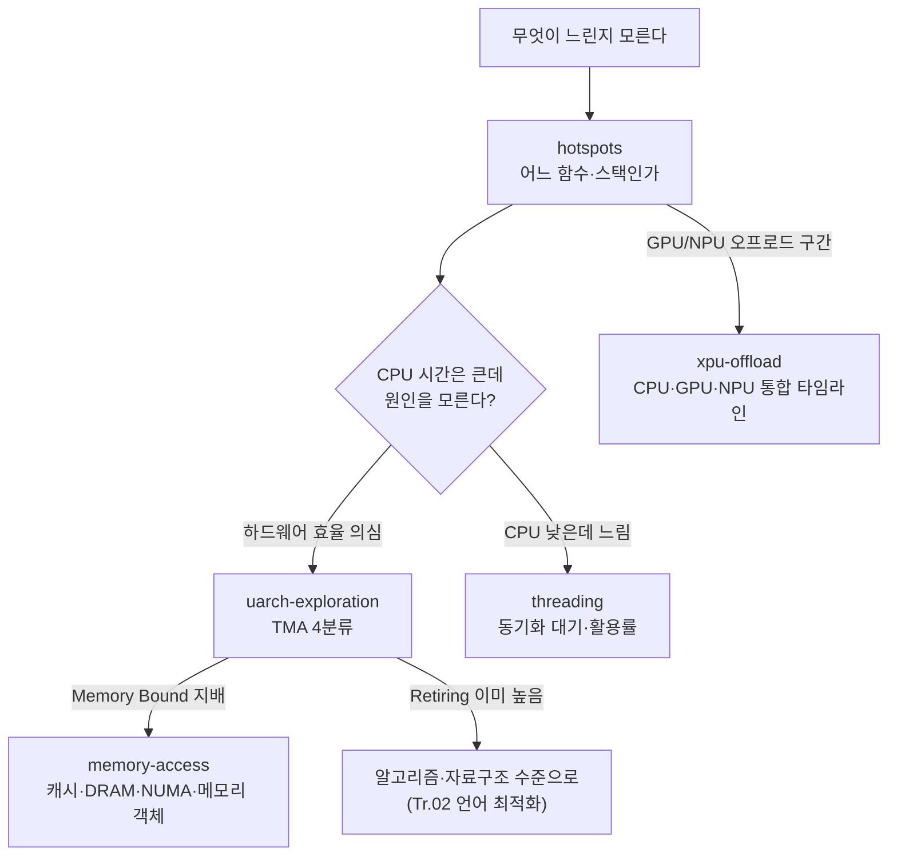

**Intel VTune Profiler 심화 활용**이란 "어느 함수가 느린가"를 넘어 "그 함수가 왜 느린가 — 파이프라인의 어느 단계에서, 어떤 하드웨어 자원이 부족해서, 어떤 스레드가 무엇을 기다려서"까지 답하도록 VTune의 분석 유형(analysis type)을 목적에 맞게 조합하는 기술입니다. µs 단위 지연을 다루는 엔지니어에게 hotspots 목록은 출발점일 뿐입니다. 같은 "CPU 시간 40%"라도 원인이 분기 예측 실패(bad speculation)인지 DRAM 대역폭 포화인지에 따라 처방이 완전히 달라지고, 그 구분은 하드웨어 이벤트를 체계적으로 해석하는 분석 유형 없이는 불가능합니다. 이 장은 VTune의 수집 엔진 내부 동작을 먼저 이해한 뒤, 4대 분석 유형(hotspots, microarchitecture exploration, memory access, threading)의 해석법과 2026.1에서 정식화된 통합 XPU Offload Analysis(CPU/GPU/NPU 통합 분석)까지 다룹니다.

## 이 장을 읽기 전에

이 장은 [샘플링 프로파일링: perf·VTune 원리](/post/profiling-analysis/sampling-profiling-perf-vtune/)에서 다룬 샘플링의 통계적 원리(샘플 수와 신뢰도, 인터럽트 기반 수집)와 [Flame Graph 분석](/post/profiling-analysis/flame-graph-analysis/)의 호출 스택 시각화 독법을 전제로 합니다. PMU(Performance Monitoring Unit)가 무엇인지, 샘플링 프로파일러가 왜 "정확한 횟수"가 아니라 "통계적 분포"를 주는지 감이 있으면 충분합니다.

**이 장의 깊이**: 심화 난이도입니다. VTune의 두 수집 엔진(user-mode sampling과 hardware event-based sampling)의 차이, TMA(Top-down Microarchitecture Analysis) 4분류 해석, memory access 분석의 캐시·DRAM·NUMA 지표, threading 분석의 대기 시간 해석까지 내려갑니다. **다루지 않는 것**: 개별 하드웨어 카운터의 의미론은 [하드웨어 성능 카운터](/post/profiling-analysis/hardware-performance-counters/)에, perf 기반의 동일 분석은 [Linux perf 고급](/post/profiling-analysis/linux-perf-advanced/)에, AMD CPU에서의 대응 도구는 [AMD μProf 활용](/post/profiling-analysis/amd-uprof-profiling/)에, Windows 시스템 전역 추적은 [Windows ETW 성능 분석](/post/profiling-analysis/windows-etw-performance-analysis/)에 위임합니다. 힙 할당 추적은 [메모리 프로파일링: 힙 분석](/post/profiling-analysis/memory-profiling-heap-analysis/)의 주제입니다.

## 당신의 수준에 맞는 경로

| 수준 | 읽을 부분 | 핵심 목표 |
|------|---------|---------|
| **중급자** | "수집 엔진의 내부" ~ "hotspots 분석" | 두 수집 모드의 차이와 hotspots 결과를 올바르게 읽기 |
| **심화 학습자** | "microarchitecture exploration" ~ "threading 분석" | TMA 4분류로 병목의 하드웨어적 원인을 지목하기 |
| **전문가** | "XPU Offload Analysis" ~ "비판적 시각" | 이기종(CPU/GPU/NPU) 워크로드 분석과 도구 한계 판단 |

---

## VTune의 역사: 1997년 Pentium 카운터에서 XPU까지

VTune의 계보는 하드웨어 성능 카운터의 역사와 나란히 갑니다. Intel은 1990년대 중반 Pentium 계열에 PMU(Performance Monitoring Unit)를 도입했고, 이 카운터를 개발자가 쓸 수 있게 만든 도구가 1997년 등장한 VTune입니다. 이후 Intel VTune Performance Analyzer로 이름을 바꿔 하드웨어 이벤트 기반 분석을 정착시켰고, 멀티코어 시대에 맞춰 2010년대 초 VTune Amplifier XE로 재편되었습니다. 2019년 말 현재 이름인 **VTune Profiler**가 되었으며, 2020년 말 oneAPI 툴킷 출시와 함께 무료로 전환되어 지금은 [독립 설치본 또는 oneAPI 구성요소](https://www.intel.com/content/www/us/en/developer/tools/oneapi/vtune-profiler.html)로 누구나 내려받을 수 있습니다.

해석 방법론 쪽의 분기점은 2014년입니다. Intel의 Ahmad Yasin이 ISPASS 2014에서 발표한 논문 "A Top-Down Method for Performance Analysis and Counters Architecture"가 **TMA(Top-down Microarchitecture Analysis)** 방법론을 정식화했고, VTune의 microarchitecture exploration 분석 유형은 이 방법론의 구현체입니다. 수백 개의 개별 카운터를 외우는 대신 파이프라인 슬롯을 4개 범주로 나눠 위에서 아래로 좁혀 가는 이 접근은 이후 perf(`perf stat --topdown`), AMD uProf 등 업계 전반의 표준 해석 틀이 되었습니다.

가장 최근의 전환은 이기종 통합입니다. 2026년 4월의 2026.0 릴리스가 Wildcat Lake 플랫폼과 Python 3.13/3.14 지원을 더했고, 2026년 5월의 **2026.1 릴리스가 CPU·GPU·NPU를 단일 분석으로 묶는 통합 XPU Offload Analysis 뷰를 도입**했습니다. 2026년 6월의 2026.2는 NPU 프로파일링 시 전력 트레이스(power trace) 수집을 추가했습니다(출처: [VTune Profiler Release Notes](https://www.intel.com/content/www/us/en/developer/articles/release-notes/vtune-profiler/current.html), 2026-06 갱신).

## 수집 엔진의 내부: user-mode sampling vs hardware event-based sampling

VTune의 모든 분석 유형은 두 가지 수집 엔진 중 하나(또는 조합) 위에서 동작하므로, 어떤 분석이 어떤 엔진을 쓰는지 알아야 오버헤드와 정밀도를 예측할 수 있습니다. **User-mode sampling**은 OS 타이머로 대상 프로세스를 주기적으로 인터럽트해 스택을 걷는 방식입니다. 커널 드라이버가 필요 없고 가상 머신에서도 동작하지만, 샘플링 주기가 ms 단위로 굵고 하드웨어 이벤트를 볼 수 없습니다. <strong>Hardware event-based sampling(EBS)</strong>은 PMU 카운터가 지정 횟수만큼 이벤트(사이클, 캐시 미스 등)를 세면 PMI(Performance Monitoring Interrupt)를 발생시켜 그 시점의 명령 주소와 스택을 기록하는 방식으로, [샘플링 프로파일링 장](/post/profiling-analysis/sampling-profiling-perf-vtune/)에서 본 perf의 수집 원리와 동일한 계열입니다.

EBS는 전통적으로 VTune 전용 커널 드라이버(SEP 드라이버)를 로드해 수행했지만, 드라이버를 설치할 수 없는 환경에서는 Linux perf 서브시스템을 백엔드로 쓰는 **driverless 모드**로도 동작합니다. 2026.0 기준 시스템 요구사항은 EBS에 Intel Xeon v3(Haswell) 또는 Core 4세대 이상을 요구하고, 스택 수집을 포함한 driverless EBS는 Linux 커널 4.18–6.11 범위를 지원 대상으로 명시합니다(출처: 위 릴리스 노트). 이 커널 범위 제약은 최신 커널을 빠르게 따라가는 환경에서 실제로 부딪히는 지점이므로, 배포 전 릴리스 노트의 지원 매트릭스를 확인하는 습관이 필요합니다.

두 엔진의 실무적 구분은 이렇게 요약됩니다. 함수 수준 핫스팟과 대기 분석이 목적이고 환경 제약(VM, 권한)이 있으면 user-mode sampling으로 충분하고, 마이크로아키텍처 원인 분석·µs 수준의 짧은 구간 분석·캐시/메모리 이벤트가 필요하면 EBS가 필수입니다. microarchitecture exploration과 memory access는 EBS 전용이며, hotspots와 threading은 두 모드를 모두 지원합니다.

## 실습 대상: 메모리 바운드 예제

이후 절의 명령과 출력 해석을 따라 할 수 있도록, 의도적으로 캐시에 적대적인(열 우선 순회) 예제를 대상 프로그램으로 씁니다. 스택 수집을 위해 `-g`와 프레임 포인터 유지가 필요하다는 점은 perf와 동일합니다.

```cpp
// bench_target.cpp
// 빌드: g++ -O2 -g -fno-omit-frame-pointer bench_target.cpp -o bench_target
#include <cstdint>
#include <cstdio>
#include <vector>

constexpr int N = 4096;

int main() {
  std::vector<int32_t> m(static_cast<size_t>(N) * N, 1);
  int64_t sum = 0;
  for (int rep = 0; rep < 20; ++rep) {
    for (int col = 0; col < N; ++col)      // 열 우선: 인접 접근이 16KiB 간격
      for (int row = 0; row < N; ++row)
        sum += m[static_cast<size_t>(row) * N + col];
  }
  std::printf("%lld\n", static_cast<long long>(sum));
  return 0;
}
```

이 코드는 64MiB 행렬을 열 우선으로 읽어 사실상 모든 접근을 캐시 미스로 만듭니다. `-O2`에서 컴파일러가 루프를 교환(loop interchange)해 버리면 병목이 사라질 수 있으므로, 결과가 예상과 다르면 [어셈블리 레벨 코드 생성 분석](/post/compiler-optimization/code-generation-analysis-assembly/)의 방법으로 생성 코드를 먼저 확인해야 합니다.

## hotspots 분석: 출발점이지만 종착점이 아니다

hotspots는 "CPU 시간이 어디에 쓰이는가"를 함수·호출 스택 단위로 보여 주는 기본 분석입니다. 핵심은 `sampling-mode` 노브(knob)입니다. `sw`(user-mode sampling)는 드라이버 없이 어디서나 돌지만 주기가 굵고, `hw`(EBS)는 기본 1ms 간격(조정 가능)으로 더 짧은 실행도 잡아냅니다. µs 단위 구간을 보는 이 시리즈의 맥락에서는 hw 모드가 기본값이라고 생각하는 편이 안전합니다.

```bash
# 하드웨어 샘플링 + 스택 수집으로 hotspots 수집
vtune -collect hotspots -knob sampling-mode=hw \
      -knob enable-stack-collection=true -- ./bench_target

# 결과 요약과 상위 함수 리포트 (r000hs는 생성된 결과 디렉토리)
vtune -report summary -r r000hs
vtune -report hotspots -r r000hs -group-by function -format csv
```

리포트에서 주의할 점은 두 가지입니다. 첫째, VTune의 기본 표시는 **self time**(그 함수 자체에서 소비된 시간) 기준이므로, 짧은 leaf 함수 수백 개로 시간이 분산된 워크로드에서는 상위 함수 목록만 보면 병목이 없어 보이는 착시가 생깁니다 — 이때는 caller/callee 트리나 [Flame Graph 뷰](/post/profiling-analysis/flame-graph-analysis/)로 집계 방향을 바꿔야 합니다. 둘째, hotspots는 "시간이 쓰인 곳"만 말할 뿐 "왜 오래 걸리는지"는 말하지 않습니다. CPU 시간이 큰 함수가 사실은 메모리 대기에 발이 묶여 있는지는 다음 절의 분석 유형이 답합니다.

## microarchitecture exploration: TMA로 "왜 느린가"를 4분류하다

microarchitecture exploration(CLI 이름 `uarch-exploration`)은 TMA 방법론으로 파이프라인 슬롯(pipeline slot)의 소비처를 분해합니다. 이론은 이렇습니다. 매 사이클 코어의 프런트엔드는 슬롯 수(최신 코어에서 4–6개)만큼 µop을 백엔드로 보낼 기회를 가지며, 각 슬롯은 넷 중 하나로 귀결됩니다 — 유효한 작업으로 은퇴(**Retiring**), 분기 예측 실패로 폐기(**Bad Speculation**), 프런트엔드가 µop을 공급하지 못함(**Front-End Bound**), 백엔드가 받을 수 없음(**Back-End Bound**). 이 4분류는 다시 계층적으로 세분되어, 예를 들어 Back-End Bound는 Memory Bound(캐시·DRAM 대기)와 Core Bound(실행 포트·나눗셈기 포화)로 갈라집니다. 상위 계층에서 지배적인 범주만 따라 내려가면 수백 개 카운터를 다 볼 필요가 없다는 것이 TMA의 요지입니다(방법론 상세: [VTune Cookbook의 TMA 문서](https://www.intel.com/content/www/us/en/docs/vtune-profiler/cookbook/2025-4/top-down-microarchitecture-analysis-method.html)).

```bash
# TMA 계층 전체를 수집 (EBS 필수: Intel PMU + 드라이버 또는 driverless perf 백엔드)
vtune -collect uarch-exploration -- ./bench_target
vtune -report summary -r r000ue
```

위 예제 프로그램을 수집하면 요약은 대체로 다음 형태가 됩니다(수치는 예시이며 CPU 세대·메모리 구성·컴파일 플래그에 따라 다릅니다).

```text
Elapsed Time: 8.3s
    Clockticks:              31,500,000,000
    Instructions Retired:     9,800,000,000
    CPI Rate:                          3.21
Retiring:                             12.4%  of Pipeline Slots
Front-End Bound:                       4.1%
Bad Speculation:                       2.2%
Back-End Bound:                       81.3%
    Memory Bound:                     72.6%
        DRAM Bound:                   61.0%
    Core Bound:                        8.7%
```

읽는 순서는 위에서 아래입니다. Retiring이 12%뿐이므로 파이프라인 기회의 88%가 낭비되고 있고, 낭비의 지배 범주는 Back-End Bound(81%), 그 안에서도 DRAM Bound(61%)입니다. 즉 이 프로그램의 처방은 분기 최적화도 인라이닝도 아니라 **메모리 접근 패턴 개선**이며, 다음 단계는 memory access 분석으로 "어느 자료구조가" DRAM 접근을 만드는지 좁히는 것입니다. 반대로 Retiring이 이미 70–80%라면 마이크로아키텍처 수준에서는 더 짜낼 것이 적으니 알고리즘·자료구조 수준([Tr.02](/post/cpp-optimization/getting-started-cpp-language-performance-tuning/))으로 올라가야 합니다. 한 가지 주의: TMA 수치는 다중화(multiplexing)된 카운터 추정치이므로 실행 시간이 너무 짧으면(수백 ms 미만) 신뢰도가 급락합니다 — 짧은 구간은 반복 실행으로 늘리거나 [마이크로벤치마크](/post/profiling-analysis/microbenchmark-design-principles/)로 격리하세요.

## memory access 분석: 어느 데이터가 어느 계층에서 미스나는가

TMA가 "Memory Bound"라고 판정하면 memory access 분석(CLI 이름 `memory-access`)이 다음 단계입니다. 이 분석은 캐시 계층별 미스, DRAM 대역폭 사용률, NUMA 원격 접근을 시간축으로 보여 주고, `analyze-mem-objects` 노브를 켜면 미스를 <strong>소스 코드의 할당 지점(메모리 객체)</strong>에 귀속시킵니다. "L3 미스가 많다"에서 "이 `std::vector`가 L3 미스의 70%를 만든다"로 해상도가 올라가는 것이 핵심 가치입니다.

```bash
vtune -collect memory-access -knob analyze-mem-objects=true \
      -knob mem-object-size-min-thres=1024 -- ./bench_target
vtune -report summary -r r000macc
```

해석 시 두 지표를 짝지어 봐야 합니다. **대역폭 사용률이 플랫폼 한계에 붙어 있으면**(요약의 Bandwidth Utilization Histogram이 High 구간에 몰림) 문제는 접근량 자체이므로 자료구조 축소·압축·블로킹(blocking)이 처방이고, **대역폭은 여유로운데 Memory Bound가 높으면** 문제는 지연(latency) — 즉 포인터 추적처럼 의존적인 접근 패턴이므로 프리페치 친화적 배치가 처방입니다. NUMA 시스템에서는 Remote Accesses 비율을 먼저 확인하세요. 원격 소켓 접근은 로컬보다 지연이 수십 ns 단위로 추가되므로(플랫폼에 따라 다름), 스레드·메모리 바인딩 문제가 캐시 문제로 위장하는 경우가 많습니다.

## threading 분석: CPU가 아니라 대기를 본다

threading 분석은 관점을 뒤집습니다. 앞의 분석들이 "CPU가 일하는 시간"을 보는 반면, threading은 **스레드가 일하지 못하는 시간** — 동기화 객체 대기, 컨텍스트 스위치, 코어 활용률 부족 — 을 봅니다. 락 경합으로 인한 지연은 CPU 시간에 잡히지 않으므로 hotspots에서는 보이지 않고, 오히려 "CPU 사용률이 낮은데 응답이 느린" 형태로 나타납니다.

```bash
# 동기화 대기 분석: 어떤 락/조건변수에서 얼마나 기다렸는지 + 대기 스택
vtune -collect threading -knob sampling-and-waits=hw -- ./app_multithreaded
vtune -report summary -r r000tr
```

리포트의 Wait Time by Utilization은 대기 시간을 "그동안 코어가 놀았는가"로 색칠해 주는데, 여기서 흔한 해석 실수가 갈립니다. 대기 시간이 크더라도 그동안 다른 스레드가 코어를 채웠다면(Effective Utilization이 높음) 처리량 관점에서는 문제가 아닐 수 있습니다. 반대로 µs 지연 관점에서는 **핫패스 위의 대기 한 번**이 곧 tail latency이므로, 총 대기 시간이 아니라 임계 경로에 놓인 동기화 객체를 찾아야 합니다 — 이 구분법은 [Tail Latency 분석](/post/profiling-analysis/tail-latency-analysis/)에서 이어집니다. 또한 스핀락은 대기가 CPU 시간으로 나타나므로 threading이 아니라 hotspots에 잡힌다는 점도 기억하세요.

## 분석 유형 선택 흐름

네 분석 유형과 XPU Offload의 관계를 진단 흐름으로 정리하면 다음과 같습니다. 각 단계는 "이전 단계의 출력이 다음 단계의 입력 가설이 된다"는 점에서 [측정→가설→검증 루프](/post/profiling-analysis/profiling-workflow-team-guide/)의 도구별 구체화입니다.



## XPU Offload Analysis: CPU·GPU·NPU를 한 타임라인에서

2026.1의 대표 기능인 **XPU Offload Analysis**는 기존에 따로 있던 GPU Offload Analysis와 NPU Exploration을 하나로 합친 통합 분석입니다. 릴리스 노트는 이렇게 명시합니다.

> "The XPU Offload Analysis replaces the GPU Offload Analysis and NPU Exploration, which are no longer supported." — Intel VTune Profiler Release Notes, 2026.1 (2026), [원문](https://www.intel.com/content/www/us/en/developer/articles/release-notes/vtune-profiler/current.html)

여기서 XPU는 CPU 디바이스 코어·GPU·NPU를 통칭하는 Intel의 용어입니다. 통합의 실질적 의미는 타임라인입니다. OpenVINO로 모델 일부를 NPU에, 전처리를 GPU에 올린 워크로드에서 예전에는 디바이스별로 별도 결과를 수집해 눈으로 맞춰야 했던 것을, 이제 호스트 측 API 호출(SYCL·Level Zero·OpenCL)과 각 디바이스의 실행 구간을 한 화면에서 정렬해 **오프로드 경계에서 새는 시간**(전송 대기, 커널 launch 간격, 디바이스 유휴)을 직접 볼 수 있습니다. 2026.2부터는 NPU 프로파일링 시 전력 트레이스도 함께 수집되어 성능과 전력을 같은 축에서 봅니다.

```bash
# 통합 XPU 분석: 기본 설정은 최소 수집(NPU 비활성, CPU는 ITT 데이터, GPU는 런타임 트레이싱)
vtune -collect xpu-offload -- ./app_openvino

# 노브로 범위 확장 예시 (노브 이름은 GUI의 Command Line 버튼으로 확인 권장)
vtune -collect xpu-offload -knob profile-npu=true -- ./app_openvino
```

수집 구성에서 알아 둘 기본값과 비용이 있습니다. [사용자 가이드](https://www.intel.com/content/www/us/en/docs/vtune-profiler/user-guide/2026-1/xpu-offload-analysis.html)에 따르면 기본 설정은 의도적으로 최소화되어 NPU는 끄고 CPU 쪽은 ITT(Instrumentation and Tracing Technology) API 데이터만, GPU는 컴퓨트 런타임 트레이싱만 수집합니다. 컴퓨트 API 트레이싱(특히 스택 포함)은 CPU 성능에 영향을 줄 수 있다고 명시되어 있고, NPU 하드웨어 지표는 시간 기반(기본 1ms 간격) 또는 쿼리 기반 모드를 선택합니다. OpenVINO·oneDNN·oneCCL이 ITT 마크업을 내장하고 있어 별도 계측 없이 태스크 경계가 잡히며, 2026.1부터는 ITT 도메인 허용 목록(top domain)을 GUI/CLI에서 직접 골라 수집량을 줄일 수 있습니다. 한 가지 유의점: 사용자 가이드 2026.1 문서는 이 분석을 여전히 프리뷰(preview) 기능으로 표기하므로, 결과 포맷의 하위 호환은 보장되지 않습니다 — CI 회귀 게이트 같은 자동화에 프리뷰 분석의 출력 포맷을 직접 묶는 것은 피하는 편이 안전합니다.

µs 지연 관점에서 XPU 분석의 존재 이유는 분명합니다. 이기종 오프로드에서 지연의 대부분은 커널 실행 시간이 아니라 **경계 비용** — 호스트→디바이스 전송, 커맨드 큐 대기, 완료 폴링 — 에서 나오는 경우가 많고, 이 비용은 디바이스 단독 프로파일러로는 보이지 않습니다. 분산 시스템에서 같은 문제를 다루는 [분산 트레이싱 오버헤드](/post/profiling-analysis/distributed-tracing-microsecond-overhead/) 장과 구조적으로 동일한 문제의식입니다.

## 흔한 오개념 교정

**"VTune은 유료 도구다"** — 과거 VTune Amplifier 시절의 기억입니다. 2020년 말 oneAPI 전환 이후 VTune Profiler는 무료이며, 등록 없이 독립 설치본을 받을 수 있습니다. 유료였던 것은 우선 지원(Priority Support)이지 도구 자체가 아닙니다.

**"hotspots 상위 함수가 곧 최적화 대상이다"** — 두 겹으로 틀릴 수 있습니다. 첫째, self time 기준 상위 함수는 호출 구조에 따라 진짜 원인(비싼 호출을 반복하는 상위 함수)을 가립니다. 둘째, CPU 시간이 크다는 것과 그 시간을 줄일 수 있다는 것은 별개이며, TMA에서 Retiring이 이미 높은 함수는 마이크로아키텍처 수준에서 줄일 여지가 작습니다. hotspots는 "어디를 조사할지"의 답이지 "무엇을 고칠지"의 답이 아닙니다.

**"EBS는 VTune 커널 드라이버를 반드시 설치해야 한다"** — driverless 모드가 있습니다. 드라이버 설치가 막힌 환경(보안 정책, 컨테이너)에서도 Linux perf 서브시스템을 백엔드로 EBS 분석이 동작합니다. 단, 커널 버전 지원 범위(2026.0 기준 스택 수집은 4.18–6.11)와 `perf_event_paranoid` 설정 같은 perf 쪽 제약을 그대로 물려받으므로, 이 경계 조건은 [Linux perf 고급](/post/profiling-analysis/linux-perf-advanced/)에서 다루는 내용과 함께 봐야 합니다.

## 판단 기준: 언제 VTune, 언제 다른 도구

| 상황 | 권장 | 이유 |
|------|------|------|
| Intel CPU에서 마이크로아키텍처 원인 분석 | VTune uarch-exploration | TMA 계층·이벤트 매핑이 세대별로 관리됨 |
| 메모리 미스를 자료구조에 귀속 | VTune memory-access | 메모리 객체 귀속은 perf로 재현하기 번거로움 |
| Intel GPU/NPU 오프로드 경계 분석 | VTune xpu-offload | 호스트·디바이스 통합 타임라인은 대체재가 없음 |
| AMD CPU | [AMD μProf](/post/profiling-analysis/amd-uprof-profiling/) | VTune EBS는 Intel PMU 전제, 비Intel 분석 정확성 미보장 |
| 스크립트화된 CI 수집·커스텀 이벤트 | [perf](/post/profiling-analysis/linux-perf-advanced/) | 텍스트 출력·조합 자유도·커널 통합에서 우위 |
| 시스템 전역 스케줄링·인터럽트 추적 | perf sched / [ETW](/post/profiling-analysis/windows-etw-performance-analysis/) / [트레이싱 도구](/post/profiling-analysis/tracing-profiling-perfetto-tracy/) | 샘플링이 아니라 이벤트 완전 기록이 필요한 영역 |

체크리스트로 요약하면, VTune을 여는 것이 맞는 순간은 (1) 대상이 Intel 하드웨어이고 (2) "왜 느린가"의 하드웨어적 분해가 필요하며 (3) GUI 기반 상관 분석(타임라인·그리드·소스 뷰)이 해석 속도를 높일 때입니다. 반대로 수집을 자동화·경량화해야 하거나 비Intel 플랫폼이면 처음부터 perf·uProf 계열로 가는 편이 낫습니다.

## 비판적 시각: 한계와 트레이드오프

**플랫폼 종속이 본질적 한계입니다.** VTune의 깊이는 Intel PMU·GPU·NPU에 대한 벤더 지식에서 나오고, 같은 이유로 비Intel 하드웨어에서는 가치가 급감합니다. 릴리스 노트 스스로 비Intel 명령이 포함된 프로그램의 분석 정확성을 보장하지 않는다고 명시합니다. 이기종 클러스터(Intel+AMD+ARM)를 운영하는 조직이라면 VTune 결과를 조직 표준 지표로 삼기 어렵고, 도구별 지표의 교차 검증 비용이 생깁니다.

**커널·플랫폼 추적 지연이 실무 마찰을 만듭니다.** driverless EBS의 지원 커널 상한(6.11)처럼, VTune의 지원 매트릭스는 최신 환경보다 한두 발 늦게 따라옵니다. 롤링 릴리스 배포판이나 새 CPU 세대 초기에는 수집이 되더라도 이벤트 매핑이 불완전할 수 있어, 릴리스 노트 확인이 사실상 필수 절차입니다.

**프리뷰 기능 의존의 위험.** XPU Offload처럼 전략적으로 중요한 기능이 프리뷰 상태로 출시되는 관행은, 최신 기능을 워크플로우에 깊이 묶을수록 포맷 변경·기능 철회 리스크를 안게 됨을 뜻합니다. 탐색적 분석에는 적극 활용하되, 자동화 파이프라인에는 정식(stable) 분석 유형만 넣는 이원화가 현실적입니다.

**관측 오버헤드는 공짜가 아닙니다.** EBS 자체는 저오버헤드(대체로 수 % 수준, 워크로드·샘플링 간격에 따라 다름)지만, 스택 수집·API 트레이싱·메모리 객체 귀속을 켤수록 오버헤드가 누적되고 µs 스케일에서는 측정이 대상을 왜곡하는 지점이 옵니다. "가장 무거운 설정으로 한 번"보다 "가벼운 설정으로 좁히고 무거운 설정은 좁힌 구간에만"이 원칙이며, 프로덕션 상시 수집은 이 장의 도구가 아니라 [지속적 프로파일링](/post/profiling-analysis/continuous-profiling-production/)의 영역입니다.

## 마무리: 이 장의 평가 기준

- [ ] user-mode sampling과 hardware EBS의 수집 원리 차이를 설명하고, 주어진 환경(VM·권한·커널)에서 어느 모드가 가능한지 판단할 수 있다.
- [ ] TMA 4분류(Retiring, Bad Speculation, Front-End Bound, Back-End Bound)의 의미를 파이프라인 슬롯 개념으로 설명하고, 요약 수치에서 다음 분석 단계를 고를 수 있다.
- [ ] memory access 분석에서 대역폭 병목과 지연 병목을 구분하고, 미스를 메모리 객체(자료구조)에 귀속시킬 수 있다.
- [ ] threading 분석의 대기 시간을 처리량 관점과 tail latency 관점에서 다르게 해석할 수 있다.
- [ ] XPU Offload Analysis가 무엇을 통합했고(GPU Offload + NPU Exploration), 오프로드 경계 비용을 어떻게 드러내는지 설명할 수 있다.
- [ ] VTune 대신 perf·uProf·ETW를 선택해야 하는 상황을 판단할 수 있다.

**다음 장에서는** VTune이 driverless 모드의 백엔드로 쓰는 바로 그 인프라, Linux perf를 고급 수준에서 다룹니다. Linux 6.15의 `perf --latency`(wall-clock 지연 기준 프로파일링)를 포함해, CLI 중심으로 수집을 스크립트화하고 커스텀 이벤트를 조합하는 법을 봅니다. → [Linux perf 고급](/post/profiling-analysis/linux-perf-advanced/)
