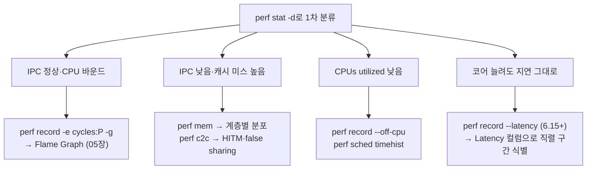

**Linux perf 고급 활용**이란 `perf record`/`perf report`의 기본 샘플링을 넘어, perf가 제공하는 서브커맨드 생태계 — `stat`의 파생 지표, 이벤트 선택과 정밀 샘플링, `sched`·`mem`·`c2c`의 특화 분석, off-CPU 프로파일링, 그리고 Linux 6.15의 `--latency` 모드 — 를 증상에 맞게 골라 쓰는 능력을 말합니다. µs 단위 지연을 다루는 엔지니어에게 perf는 단일 도구가 아니라 **질문별로 다른 서브커맨드를 꺼내 쓰는 도구 상자**입니다. "CPU를 많이 쓴다"는 `record -e cycles`가, "CPU는 놀고 있는데 느리다"는 off-CPU 분석이, "코어를 늘려도 안 빨라진다"는 `c2c`나 `--latency`가 답하는 질문이며, 이 장의 목표는 그 매핑을 몸에 붙이는 것입니다.

## 이 장을 읽기 전에

이 장은 [샘플링 프로파일링: perf·VTune 원리](/post/profiling-analysis/sampling-profiling-perf-vtune/)에서 다룬 샘플링의 기본 원리(주기적 인터럽트, 콜스택 수집, 통계적 근사)를 전제로 합니다. `perf record -g` → `perf report`의 기본 흐름과 [Flame Graph 분석](/post/profiling-analysis/flame-graph-analysis/)의 시각화 문법을 알고 있으면 이 장의 출력 예시를 훨씬 빠르게 소화할 수 있습니다.

**이 장의 깊이**: 심화. perf 서브커맨드의 동작 원리와 출력 해석까지 내려가되, 개별 하드웨어 이벤트(PMU 카운터의 마이크로아키텍처 의미)는 [하드웨어 성능 카운터](/post/profiling-analysis/hardware-performance-counters/)에, BPF로 직접 커널을 계측하는 방법은 [BPF 기반 동적 프로파일링](/post/profiling-analysis/bpf-based-profiling-bpftrace-bcc/)에 위임합니다. 프로파일 결과를 병목 가설로 연결하는 일반 해석 패턴은 [프로파일러 출력 해석 실전](/post/profiling-analysis/profiler-output-interpretation-practice/)에서 다룹니다.

## 당신의 수준에 맞는 경로

| 수준 | 읽을 부분 | 핵심 목표 |
|------|---------|---------|
| **중급자** | "perf stat -d" ~ "이벤트 선택과 정밀 샘플링" | 카운터 요약으로 병목 유형을 분류하고, skid 없는 샘플을 얻는 법 익히기 |
| **심화 학습자** | "perf sched" ~ "off-CPU 분석" | 스케줄링 지연·false sharing·대기 시간을 서브커맨드로 격리 추적 |
| **전문가** | "perf --latency" ~ "비판적 시각" | wall-clock 기준 프로파일링을 워크플로우에 편입하고 도구 한계 판단 |

## 역사와 배경: 카운터 리더에서 도구 상자로

perf는 2009년 Linux 2.6.31에 "Performance Counters for Linux(PCL)"라는 이름으로 처음 병합되었고, Ingo Molnar와 Thomas Gleixner가 초기 설계를 주도했습니다. 커널 트리 안(`tools/perf`)에서 커널과 함께 버전업되는 독특한 구조 덕분에, 새 커널 기능(tracepoint, BPF, 새 PMU)이 나오면 perf가 가장 먼저 사용자 공간 인터페이스를 얻습니다. 처음에는 하드웨어 카운터를 읽는 도구였지만, 이후 tracepoint 기반의 `perf sched`(스케줄러 분석), 메모리 접근 샘플링 기반의 `perf mem`, 그리고 2016년 Red Hat의 Joe Mario와 Don Zickus가 주도한 `perf c2c`(캐시라인 경합 분석)가 더해지며 특화 분석 도구 모음으로 성장했습니다.

가장 최근의 큰 도약은 2025년입니다. Google의 Dmitry Vyukov가 제안한 latency/parallelism 프로파일링 패치 시리즈가 Linux 6.15(2025년 5월 릴리스)에 병합되면서, perf는 처음으로 **CPU 시간이 아니라 wall-clock 시간 기준의 프로파일**을 제공하게 되었습니다([LWN: perf report latency and parallelism profiling](https://lwn.net/Articles/1008100/)). 멀티스레드 프로그램에서 "CPU를 많이 쓰는 코드"와 "지연을 만드는 코드"는 다른 존재라는 문제의식이 20년 만에 도구에 반영된 것입니다. 이 장의 마지막 절에서 자세히 다룹니다.

## perf stat -d: 카운터 요약으로 병목 유형 분류하기

프로파일링을 콜스택 샘플링부터 시작하는 것은 흔한 습관이지만, 더 싼 첫 단계가 있습니다. `perf stat`은 프로그램 전체 실행 동안 하드웨어 카운터를 집계해 **병목이 어느 계층에 있는지**를 수십 초 만에 알려줍니다. `-d`(detailed) 플래그는 기본 카운터(cycles, instructions, branches)에 L1 데이터 캐시와 LLC(Last Level Cache) 이벤트를 추가하고, `-d -d`는 TLB와 L1 명령어 캐시를, `-d -d -d`는 프리페치 이벤트까지 추가합니다.

```bash
perf stat -d ./app          # L1-dcache, LLC 이벤트 추가
perf stat -d -d -d ./app    # dTLB, iTLB, L1-icache, prefetch까지
```

출력에서 주목할 것은 오른쪽 컬럼의 파생 지표(shadow metric)입니다. perf가 카운터 값의 비율을 미리 계산해 주는데, 이 몇 줄이 병목 유형 분류의 출발점입니다.

```text
 Performance counter stats for './app':

          8,204.31 msec task-clock                #    3.92 CPUs utilized
             4,132      context-switches          #  503.639 /sec
    31,542,118,904      cycles                    #    3.845 GHz
    52,918,442,003      instructions              #    1.68  insn per cycle
     9,845,220,341      branches                  #    1.200 G/sec
        41,205,881      branch-misses             #    0.42% of all branches
    17,204,556,120      L1-dcache-loads           #    2.097 G/sec
       804,112,338      L1-dcache-load-misses     #    4.67% of all L1-dcache accesses
       121,004,556      LLC-loads                 #   14.749 M/sec
        38,220,415      LLC-load-misses           #   31.58% of all LL-cache accesses

       2.093481374 seconds time elapsed
```

해석 순서는 이렇습니다. 첫째, **IPC(insn per cycle)**. 최신 x86-64 코어는 이론상 4~6 IPC까지 가능하므로, 1.68이면 나쁘지 않지만 0.5 이하라면 CPU가 무언가를 기다리고 있다는 뜻입니다(메모리, 분기 예측 실패, 의존 체인). 둘째, **CPUs utilized**. 스레드를 8개 띄웠는데 3.92면 절반은 대기 중이므로 off-CPU 분석 대상입니다. 셋째, **캐시 미스율**. L1 미스 4.67%는 흔한 수준이지만 LLC 미스율 31.58%는 그 미스들이 DRAM까지 내려간다는 뜻이므로, 이 프로그램은 메모리 바운드 후보입니다. 이 분류에 따라 다음에 꺼낼 서브커맨드가 달라집니다 — IPC가 낮고 캐시 미스가 높으면 `perf mem`/`perf c2c`, 활용률이 낮으면 `perf sched`/off-CPU, 순수 연산 바운드면 `perf record`로 핫스팟을 좁힙니다.

한 가지 주의할 점은 <strong>카운터 멀티플렉싱(multiplexing)</strong>입니다. PMU의 물리 카운터 수(보통 코어당 4~8개)보다 많은 이벤트를 요청하면 perf는 카운터를 시분할하고 결과를 외삽하는데, 이때 출력 끝에 `(74.83%)`처럼 실측 비율이 표기됩니다. 이 숫자는 추정치이므로, 정밀 비교가 필요하면 이벤트 수를 물리 카운터 이하로 줄여 여러 번 실행하는 편이 낫습니다.

## 이벤트 선택과 정밀 샘플링: perf record -e

`perf record`의 기본 이벤트는 `cycles`지만, `-e`로 어떤 이벤트든 샘플링 트리거로 쓸 수 있습니다. 사용할 수 있는 이벤트 목록은 `perf list`로 확인하며, 이벤트 이름 뒤에 콜론으로 수식어(modifier)를 붙여 측정 범위와 정밀도를 제어합니다([perf-record(1) man page](https://man7.org/linux/man-pages/man1/perf-record.1.html)).

```bash
perf record -e cycles:u -g ./app            # 사용자 공간만 (u), 콜그래프 포함
perf record -e cache-misses:k -a sleep 10   # 커널 공간만 (k), 시스템 전체 10초
perf record -e cycles:P -g ./app            # 최대 정밀도 샘플 (PEBS/IBS)
perf record -e branch-misses -c 10007 ./app # 10007회 발생마다 1샘플 (주기 지정)
```

여기서 µs 엔지니어에게 가장 중요한 수식어는 정밀도(`p`, `pp`, `ppp`, `P`)입니다. 일반 샘플링 인터럽트는 이벤트 발생 지점과 기록된 명령어 주소(IP) 사이에 수~수십 명령어의 **skid**(밀림)가 있어서, "이 줄이 느리다"는 판단을 엉뚱한 코드에 내리게 만듭니다. Intel의 PEBS나 AMD의 IBS 같은 하드웨어 지원을 쓰는 `:P`(최대 가용 정밀도)를 붙이면 IP가 실제 이벤트 지점에 훨씬 가깝게 기록됩니다. 명령어 단위로 비용을 귀속시키는 분석([어셈블리 레벨 코드 생성 분석](/post/compiler-optimization/code-generation-analysis-assembly/)과 결합할 때 특히)에서는 `:P`를 기본값으로 삼을 만합니다.

콜그래프 수집 방식도 선택입니다. `--call-graph fp`(프레임 포인터)는 오버헤드가 가장 낮지만 `-fno-omit-frame-pointer`로 빌드된 바이너리가 필요하고, `--call-graph dwarf`는 스택 일부를 복사해 사후에 풀기 때문에 어떤 바이너리든 되지만 데이터량과 오버헤드가 크며, `--call-graph lbr`은 Intel LBR 하드웨어를 써서 싸고 정확하지만 깊이가 제한(보통 32 엔트리)됩니다. 저지연 서비스라면 프로덕션 바이너리를 프레임 포인터 포함으로 빌드해 두고 `fp`를 쓰는 것이 관측 오버헤드 관점에서 유리합니다.

## perf sched: 스케줄링 지연을 µs 단위로 추적

지연 예산이 µs 단위인 시스템에서는 커널 스케줄러가 만드는 지연 — 깨어난 스레드가 실제로 CPU를 잡기까지의 대기 — 이 그 자체로 병목이 됩니다. `perf sched`는 스케줄러 tracepoint(sched_switch, sched_wakeup 등)를 기록해 이 지연을 이벤트 단위로 보여줍니다. 샘플링이 아니라 **전수 기록**이므로 짧은 구간에만 쓰는 것이 좋습니다.

```bash
perf sched record -- ./app        # 스케줄러 이벤트 전수 기록
perf sched latency                # 태스크별 지연 요약 (최대 지연 포함)
perf sched timehist               # 이벤트 단위 타임라인
```

`perf sched timehist`의 출력은 스레드가 "왜 그 시점에 안 돌고 있었는지"를 컬럼 셋으로 분해합니다.

```text
           time    cpu  task name                  wait time  sch delay   run time
                        [tid/pid]                     (msec)     (msec)     (msec)
   2937.812107 [0003]  worker-1[8241/8237]            0.000      0.041      3.181
   2937.816218 [0005]  worker-2[8242/8237]           12.402      1.238      0.874
```

`sch delay`는 wakeup 이후 실제 실행까지의 스케줄링 지연으로, 이 값이 지연 예산을 잠식하면 CPU 격리(isolcpus)나 우선순위 조정 같은 처방으로 이어집니다. worker-2의 1.238ms 스케줄링 지연은 µs 시스템에서는 재앙 수준이므로, 해당 코어에서 경쟁하는 태스크가 무엇인지 `timehist`의 같은 CPU 행들을 따라가며 찾습니다. `wait time`은 자발적 대기(블로킹)를 포함하므로, 이 값이 크면 off-CPU 분석으로 넘어가 원인을 스택으로 확인합니다.

## perf mem과 perf c2c: 메모리 접근과 false sharing

`perf stat -d`가 "메모리 바운드"라는 분류를 내렸다면, 다음 질문은 "어느 데이터, 어느 코드가?"입니다. `perf mem`은 로드/스토어를 샘플링하면서 각 접근의 <strong>주소, 데이터 소스(L1/L2/LLC/DRAM/원격 노드), 레이턴시(사이클)</strong>를 함께 기록합니다. `perf mem report --sort=mem`으로 데이터 소스별 분포를 보면 접근이 어느 캐시 계층에서 해소되는지 한눈에 들어오고, NUMA 시스템에서 원격 노드 접근 비중이 높다면 메모리 배치 문제로 좁혀집니다.

`perf c2c`(cache-to-cache)는 그중에서도 가장 악명 높은 패턴인 **캐시라인 경합**을 전문으로 잡는 도구입니다. 핵심 신호는 HITM — 다른 코어의 캐시에 Modified 상태로 있는 라인을 읽어오는 이벤트 — 이며, 같은 캐시라인의 서로 다른 오프셋에 여러 스레드가 쓰기 접근하는 패턴이 보이면 false sharing입니다([perf-c2c(1) man page](https://man7.org/linux/man-pages/man1/perf-c2c.1.html)). 정확성이 아니라 성능을 조용히 깎아 먹는 버그이므로, "깨진 코드 → 원인 확인 → 수정 → 검증"의 순서로 재현해 보겠습니다.

먼저 깨진 코드입니다. 두 스레드가 서로 다른 카운터를 증가시키므로 논리적 공유는 전혀 없지만, 두 atomic이 같은 64바이트 캐시라인에 앉아 있습니다.

```cpp
// false_sharing.cpp — 빌드: g++ -O2 -std=c++17 -pthread false_sharing.cpp -o fs
// 검증 환경 예: x86-64 Linux 6.x, GCC 13 (수치는 플랫폼·플래그에 따라 다름)
#include <atomic>
#include <cstdint>
#include <thread>

struct Counters {                        // 깨진 버전: a와 b가 같은 캐시라인
  std::atomic<std::uint64_t> a{0};
  std::atomic<std::uint64_t> b{0};
};

int main() {
  Counters c;
  auto work = [](std::atomic<std::uint64_t>& x) {
    for (int i = 0; i < 100'000'000; ++i)
      x.fetch_add(1, std::memory_order_relaxed);
  };
  std::thread t1(work, std::ref(c.a));
  std::thread t2(work, std::ref(c.b));
  t1.join();
  t2.join();
  return static_cast<int>(c.a.load() + c.b.load() != 200'000'000);
}
```

이 프로그램은 정확히 동작하고, 단일 스레드 프로파일에서는 `fetch_add`가 핫스팟으로 보일 뿐 원인이 드러나지 않습니다. 원인을 확인하려면 `perf c2c`로 캐시라인 수준의 경합을 기록합니다.

```bash
perf c2c record -- ./fs
perf c2c report --stats          # 전체 HITM 통계
perf c2c report -NN              # 캐시라인별 상세 (오프셋·스레드·심볼)
```

리포트의 Shared Data Cache Line Table에서 특정 캐시라인 하나에 HITM이 집중되고, 상세 뷰에서 같은 라인의 오프셋 0x0과 0x8에 서로 다른 스레드의 스토어가 찍혀 있으면 false sharing 확진입니다.

```text
=================================================
            Shared Data Cache Line Table
=================================================
# Index           Address  Node  PA cnt   Hitm    Total  LclHitm  RmtHitm
# .....  ................  ....  ......  ......   ......  .......  .......
      0    0x7ffc12345600     0    3841  92.1%     1204     1204        0
```

수정은 두 멤버를 서로 다른 캐시라인으로 분리하는 것입니다. C++17의 `alignas(64)`(이식성을 원하면 `std::hardware_destructive_interference_size`)를 각 멤버에 붙이면 됩니다.

```cpp
struct CountersFixed {                   // 수정 버전: 라인 분리
  alignas(64) std::atomic<std::uint64_t> a{0};
  alignas(64) std::atomic<std::uint64_t> b{0};
};
```

검증은 두 단계입니다. `perf c2c report`에서 해당 라인의 HITM이 사라졌는지 확인하고, `perf stat -d ./fs`로 전후의 실행 시간과 LLC 미스를 비교합니다. 이런 워크로드에서 수정 전후 배율은 흔히 2~5배 차이가 나지만, 코어 토폴로지(같은 소켓/다른 소켓)와 CPU 세대에 따라 크게 달라지므로 반드시 자기 환경에서 재측정해야 합니다. 또한 `alignas(64)`는 구조체 크기를 키우므로, 배열로 대량 보관하는 타입에는 캐시 풋프린트 증가라는 반대급부가 있음을 기억해야 합니다.

## off-CPU 분석: CPU가 놀 때의 시간을 스택으로 귀속시키기

샘플링 프로파일러는 CPU 위에서 도는 코드만 봅니다. 락 대기, 디스크 I/O, 페이지 폴트, 네트워크 대기처럼 **스레드가 CPU 밖에서 보내는 시간**은 사이클 샘플에 잡히지 않으므로, "프로파일은 깨끗한데 응답은 느린" 상황의 대부분이 여기서 나옵니다. off-CPU 분석은 이 시간을 측정하고 블로킹 시점의 스택으로 귀속시키는 방법론입니다(Brendan Gregg, [Off-CPU Analysis](https://www.brendangregg.com/offcpuanalysis.html)). 스레드가 잠들어 있는 동안 애플리케이션 스택은 변하지 않으므로, 스케줄러의 컨텍스트 스위치 지점에서 스택과 대기 시간을 기록하면 "어디서 얼마나 기다렸는지"가 정확히 나옵니다.

perf에서는 2022년 무렵 추가된 `--off-cpu` 옵션이 이 작업을 BPF 프로그램으로 수행합니다. 스케줄링 정보를 커널 안에서 수집해 `offcpu-time`이라는 소프트웨어 이벤트 샘플로 저장하므로, 과거처럼 `sched_switch` 이벤트를 전수 덤프해 사후 처리하는 방식보다 오버헤드가 훨씬 낮습니다.

```bash
# BPF 스켈레톤 포함으로 빌드된 perf + root 권한 필요
perf record --off-cpu -g -- ./app
perf report                      # offcpu-time 이벤트를 선택해 대기 스택 확인
```

리포트에서 on-CPU 샘플(cycles)과 off-CPU 샘플(offcpu-time)을 나란히 보면 스레드 시간의 전체 그림이 나옵니다. 뮤텍스 대기가 상위에 있으면 락 경합, `futex` 아래 커널 스택이 두텁다면 조건 변수 대기, 파일 시스템 경로가 보이면 I/O가 원인입니다. 더 정교한 필터링(특정 대기 시간 이상만, 특정 태스크만)이 필요하거나 상시 프로파일링에 붙이려면 bpftrace/BCC 기반 접근이 유연하며, 이는 [BPF 기반 동적 프로파일링](/post/profiling-analysis/bpf-based-profiling-bpftrace-bcc/)에서 다룹니다. off-CPU 시간이 꼬리 지연으로 나타나는 패턴의 통계적 분석은 [Tail Latency(꼬리 지연) 분석](/post/profiling-analysis/tail-latency-analysis/)과 이어집니다.

## perf --latency: wall-clock 기준 프로파일링 (Linux 6.15)

멀티스레드 프로그램에서 기존 perf 프로파일의 맹점은 이것입니다. 16개 스레드가 병렬로 도는 해시 계산이 CPU 시간의 70%를 차지하고 단일 스레드 병합 단계가 3%를 차지한다면, 프로파일은 해시를 최적화하라고 말합니다. 그러나 **경과 시간(wall-clock)** 관점에서는 병렬 구간의 1 CPU초는 1/16초의 지연만 만들고, 직렬 구간의 1 CPU초는 온전히 1초의 지연을 만듭니다. 처리량(throughput)을 줄이는 코드와 지연(latency)을 늘리는 코드는 다른 코드입니다.

Linux 6.15에 병합된 latency 프로파일링은 이 문제를 우아하게 풉니다. `perf record --latency`는 샘플과 함께 컨텍스트 스위치를 기록하고, `perf report`는 각 시점의 **병렬도(parallelism)** — 그 순간 CPU에서 실제로 돌던 스레드 수 — 를 재구성해 각 샘플의 가중치를 병렬도로 나눕니다. 병렬도 16에서 찍힌 샘플은 1/16의 지연 기여로, 병렬도 1에서 찍힌 샘플은 온전한 지연 기여로 계산되므로, 결과는 wall-clock 시간을 샘플링한 것과 동등해집니다.

> "Enable data collection for latency profiling. Use perf report --latency for latency-centric profile." — [perf-record(1) man page](https://man7.org/linux/man-pages/man1/perf-record.1.html)의 `--latency` 옵션 설명

```bash
perf record --latency -g -- ./app
perf report --latency            # Latency 컬럼 기준 정렬
```

리포트에는 기존 `Overhead`(CPU 시간 비중) 옆에 `Latency`(wall-clock 지연 비중) 컬럼이 추가되어, 두 관점의 괴리를 바로 볼 수 있습니다.

```text
# Overhead  Latency  Command  Shared Object   Symbol
    73.12%   27.54%  app      app             [.] parallel_hash
     3.05%   48.11%  app      app             [.] serial_merge
```

이 예시가 전형적인 반전입니다. CPU 시간으로는 `parallel_hash`가 지배적이지만, 지연 기여로는 3%짜리 `serial_merge`가 절반을 차지합니다. µs 단위 응답 시간을 줄이는 것이 목표라면 최적화 대상은 후자이며, 이는 Amdahl의 법칙이 프로파일러 출력에 직접 반영된 형태라고 볼 수 있습니다. 현재 한계도 분명합니다. 이 기능은 프로세스 단위 프로파일링에만 적용되고 시스템 전체(`-a`) 모드는 지원하지 않으며, off-CPU 대기 자체는 여전히 별도 분석이 필요합니다 — `--latency`는 "돌고 있던 코드의 지연 기여"를 재배분할 뿐, 아무도 돌지 않던 시간의 원인은 off-CPU 분석이 답합니다.

## 흔한 오개념 교정

**"CPU 프로파일에 안 보이면 병목이 아니다."** 틀렸습니다. 사이클 샘플링은 on-CPU 시간만 봅니다. 락 대기·I/O·스케줄링 지연은 CPU 프로파일에 아예 나타나지 않으므로, `perf stat`의 CPUs utilized가 스레드 수보다 현저히 낮거나 응답 시간과 CPU 시간이 안 맞으면 off-CPU 분석과 `perf sched`를 꺼내야 합니다. 반대 방향의 함정도 있습니다 — CPU 시간 비중이 큰 코드가 wall-clock 지연의 주범이 아닐 수 있다는 것이 `--latency`가 존재하는 이유입니다.

**"샘플이 찍힌 명령어가 비용을 낸 명령어다."** 근사일 뿐입니다. 일반 샘플링 인터럽트에는 skid가 있어 IP가 실제 이벤트 지점보다 뒤로 밀리며, 아웃오브오더 실행에서는 "이 명령어의 비용"이라는 개념 자체가 흐릿합니다. 라인·명령어 단위 귀속이 필요하면 `:P` 수식어로 PEBS/IBS 정밀 샘플링을 쓰고, 그래도 인접 몇 명령어의 오차는 남는다고 가정해야 합니다.

**"perf stat이 출력한 숫자는 전부 실측값이다."** 멀티플렉싱이 켜지면 아닙니다. 물리 카운터보다 많은 이벤트를 요청하면 각 이벤트는 실행 시간의 일부만 측정되고 나머지는 선형 외삽되며, 괄호 안 백분율(예: `(74.83%)`)이 그 신호입니다. 짧은 실행이나 위상이 뚜렷한 워크로드에서는 외삽 오차가 커지므로, 회귀 판정 같은 정밀 비교에는 이벤트 그룹을 나눠 각각 100% 측정으로 돌리는 것이 원칙입니다.

## 판단 기준: 어떤 서브커맨드를 언제 쓰나

증상에서 서브커맨드로 가는 매핑을 정리하면 다음과 같습니다. 첫 진단은 언제나 가장 싼 `perf stat -d`로 시작하고, 분류 결과에 따라 내려갑니다.



| 상황 | 도구 | 피해야 할 것 |
|------|------|-------------|
| 병목 계층을 모르는 첫 진단 | `perf stat -d` (필요시 `-d -d -d`) | 곧바로 record부터 시작해 편향된 가설 고정 |
| 라인·명령어 단위 핫스팟 귀속 | `perf record -e cycles:P` + `perf annotate` | skid 있는 기본 샘플로 특정 줄 단죄 |
| 깨어난 스레드가 늦게 도는 문제 | `perf sched timehist`의 sch delay | 장시간 `perf sched record` (데이터 폭발) |
| 멀티스레드 확장 실패·미스 급증 | `perf c2c record/report` | 소스 코드 육안 검사만으로 false sharing 추정 |
| CPU는 놀고 응답은 느림 | `perf record --off-cpu -g` | cycles 프로파일 재실행 반복 |
| CPU%와 체감 지연의 괴리 | `perf record --latency` (커널 6.15+) | Overhead 컬럼만 보고 병렬 구간 최적화 |

## 비판적 시각: perf의 한계와 트레이드오프

perf는 강력하지만 공짜가 아닙니다. 첫째, **관측 오버헤드**가 모드별로 크게 다릅니다. 낮은 빈도의 cycles 샘플링은 1% 미만이지만, `--call-graph dwarf`는 샘플마다 스택 수 KB를 복사하고, `perf sched record`는 전수 기록이라 컨텍스트 스위치가 잦은 시스템에서 초당 수십 MB를 쏟아냅니다. µs 시스템에서는 측정 자체가 지연 스파이크를 만들 수 있으므로, 프로덕션 상시 측정은 낮은 빈도·짧은 구간·[지속적 프로파일링](/post/profiling-analysis/continuous-profiling-production/)의 설계를 따라야 합니다.

둘째, **환경 제약**입니다. `/proc/sys/kernel/perf_event_paranoid` 값에 따라 비특권 사용자의 측정 범위가 제한되고, 컨테이너·가상머신에서는 하이퍼바이저가 PMU를 노출하지 않으면 하드웨어 이벤트 자체가 없어서 `cpu-clock` 소프트웨어 이벤트로 후퇴하게 됩니다. 클라우드 인스턴스에서 `perf stat`이 `<not supported>`를 뱉는다면 이것이 원인입니다. 셋째, **아키텍처 편차**가 있습니다. `perf c2c`와 정밀 샘플링의 품질은 하드웨어 기능(Intel PEBS, AMD IBS, Arm SPE)에 의존하므로 플랫폼마다 얻을 수 있는 정보의 해상도가 다르고, AMD 시스템의 심층 분석은 [AMD μProf 활용](/post/profiling-analysis/amd-uprof-profiling/)처럼 벤더 도구가 더 나은 영역이 있습니다. 마지막으로 `--latency`는 아직 젊은 기능입니다 — 시스템 전체 모드 미지원, 프로세스 단위 한정이라는 제약은 서비스 전체를 보는 워크플로우에서는 갭이며, perf가 보여주는 것은 언제나 "무엇이 느린가"까지이고 "왜 그 코드가 그렇게 컴파일되었나"는 [최적화 플래그](/post/compiler-optimization/optimization-flags-o2-o3-ofast/) 이하 컴파일러 트랙의 몫입니다.

## 마무리: 평가 기준과 다음 장

이 장을 소화했는지는 다음 기준으로 확인합니다.

- [ ] `perf stat -d` 출력의 IPC·CPUs utilized·캐시 미스율에서 병목 유형(CPU/메모리/대기)을 분류하고 다음 서브커맨드를 지목할 수 있다.
- [ ] 이벤트 수식어(`:u`/`:k`/`:P`)와 콜그래프 방식(fp/dwarf/lbr)을 오버헤드·정밀도 트레이드오프로 설명하고 선택할 수 있다.
- [ ] `perf sched timehist`의 sch delay와 wait time을 구분해 스케줄링 지연과 자발적 대기를 분리 진단할 수 있다.
- [ ] `perf c2c`의 HITM 신호로 false sharing을 확진하고, `alignas` 수정 후 전후 비교로 검증할 수 있다.
- [ ] on-CPU 프로파일, off-CPU 분석, `--latency` 프로파일이 각각 답하는 질문의 차이를 설명할 수 있다.

**다음 장에서는** 이 장에서 이름만 부른 카운터들 — cycles, 캐시 미스, 분기 예측 실패, top-down 분석의 파이프라인 슬롯 — 의 마이크로아키텍처 의미를 파고듭니다. `perf stat`의 파생 지표가 왜 그렇게 계산되는지, 어떤 이벤트 조합이 어떤 병목 가설을 지지하는지를 하드웨어 관점에서 정리합니다. → [하드웨어 성능 카운터](/post/profiling-analysis/hardware-performance-counters/)
